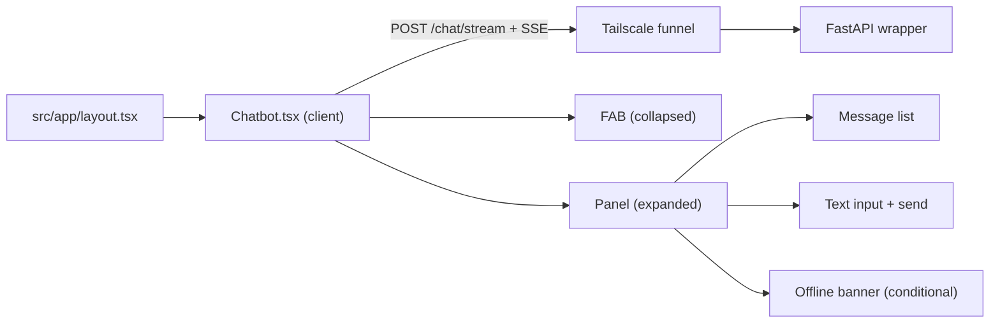
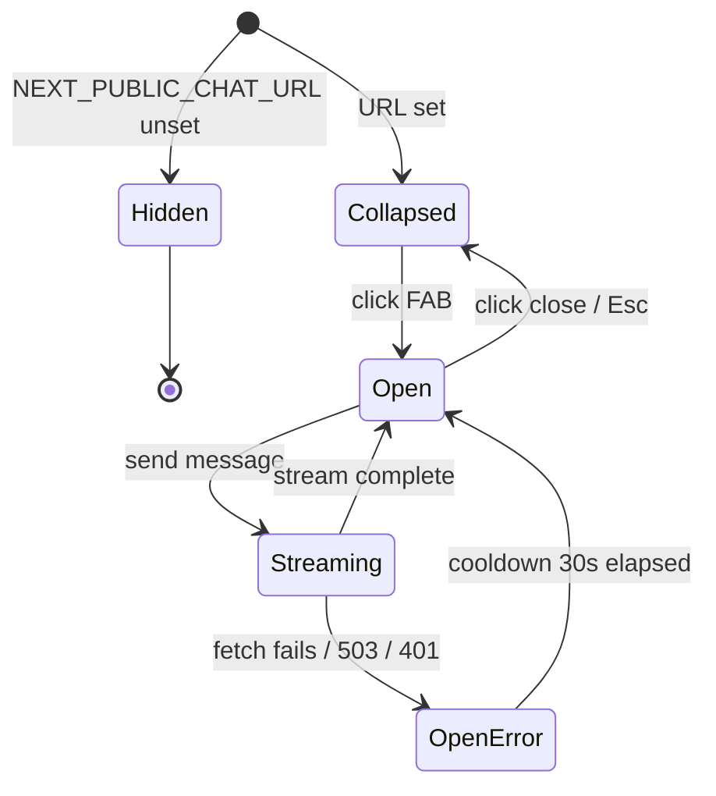

# Portfolio Chatbot UI — Design

**Complexity: MEDIUM**

## Overview

A single client component that renders a floating chat button and an expandable chat panel on the portfolio site. It talks to the local FastAPI wrapper over SSE, renders streaming deltas into a live-updating assistant message, and degrades gracefully when the wrapper is offline or unshipped.

## High level



## State machine



## Files

```
src/components/
├── Chatbot.tsx                  # main client component
├── Chatbot.module.scss          # FAB + panel styles
└── chatbot/
    ├── useChatStream.ts         # fetch + ReadableStream SSE parser
    ├── messages.ts              # Message type + helpers
    └── types.ts                 # shared interfaces
src/app/layout.tsx               # mount <Chatbot />
src/components/index.ts          # export Chatbot
src/resources/icons.ts           # add chat icon
.env.example                     # NEXT_PUBLIC_CHAT_URL, NEXT_PUBLIC_CHAT_TOKEN
```

## Component structure

```tsx
export const Chatbot = () => {
  const url = process.env.NEXT_PUBLIC_CHAT_URL;
  if (!url) return null;

  const [open, setOpen] = useState(false);
  const [messages, setMessages] = useState<Message[]>([]);
  const [input, setInput] = useState("");
  const { send, isStreaming, error, cooldownUntil } = useChatStream({ url, token, onDelta, onDone, onError });

  return open ? <Panel /> : <FAB onClick={() => setOpen(true)} />;
};
```

## Streaming protocol (client side)

The wrapper emits SSE frames like:
```
data: {"delta": "chars"}

data: {"done": true, "finish_reason": "stop", "usage": {...}}
```

Because we need to POST a body with headers (shared token), `EventSource` won't work — we use `fetch` + `response.body.getReader()` and parse SSE frames manually. The reader yields arbitrary chunks; we buffer and scan for `data: {...}\n\n` boundaries.

```ts
const reader = response.body!.getReader();
const decoder = new TextDecoder();
let buffer = "";
while (true) {
  const { value, done } = await reader.read();
  if (done) break;
  buffer += decoder.decode(value, { stream: true });
  // parse `data: ...\n\n` frames out of buffer
}
```

## Abort handling

`AbortController` is held in the hook. Closing the panel or reloading calls `controller.abort()` and the fetch is cancelled cleanly. The wrapper's SSE generator sees client disconnect and exits.

## Styling

- FAB: fixed `bottom: var(--static-space-24)`; `right: var(--static-space-24)`; respects `env(safe-area-inset-bottom)`.
- Panel: fixed, anchored bottom-right; `width: 360px`; `height: 520px`; `border-radius: var(--radius-l)`; `background: var(--page-background)`; border via `var(--neutral-alpha-weak)`.
- On mobile (`max-width: breakpoints.$s`): panel goes to `position: fixed; inset: 0` for full-screen.
- Typography via Once UI `Heading` and `Text` components.
- No hex colors — all via Once UI CSS variables.

## Accessibility

| Behavior | Implementation |
|---|---|
| Announce open dialog | `<section role="dialog" aria-modal="true" aria-labelledby="chat-title">` |
| Focus trap | Focus the textarea on open; on Tab wrap-around within panel |
| Esc to close | Keydown listener at panel level |
| Assistant replies announced | `<div role="log" aria-live="polite">` around message list |
| Readable FAB | `aria-label="Open chat assistant"` |

## Error and offline UX

- `useChatStream` sets `error` state to a canned message on any failure (network, 503, 401).
- A `cooldownUntil` timestamp is set to `Date.now() + 30_000` on error.
- The send button is disabled while `Date.now() < cooldownUntil`.
- Banner message:
  - Network/503: "The chat service is offline right now. Try again later."
  - 401: "Chat is not available right now."

## Summary

One gated client component, one Sass module, one custom hook, one types module, plus three single-line touchups in existing files. The design keeps the wrapper URL server-private to the build — visitors only know the public Tailscale funnel URL — and falls back to rendering nothing when the backend isn't shipped.
