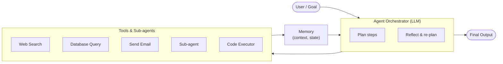
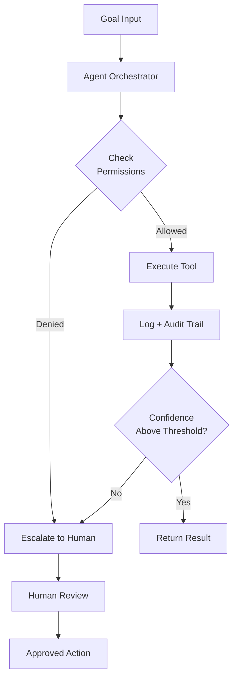

## From Pilot to Production: A Faster Transition Than Anyone Expected

A year ago, enterprise AI agents were largely a CTO slide deck item — promising, well-funded, and stubbornly confined to proof-of-concept environments. Twelve months later, the picture has flipped dramatically.

According to a survey of 1,900 global IT leaders published by OutSystems in April 2026, **96% of enterprises now use AI agents in some form**. Ninety-seven percent are exploring system-wide agentic strategies. Nearly half describe their capabilities as "advanced" or "expert."

That is not a gradual trend line. That is a phase transition.

To understand why, and what it actually means for organizations building on this technology, it helps to start with what an AI agent actually is — and how it differs from the AI assistants that came before.

---

## What Makes an Agent an Agent?

Most people's first exposure to AI in enterprise contexts was a chatbot: ask a question, get an answer. Maybe it retrieved some context from a knowledge base. Maybe it was tuned on company data. But it was fundamentally reactive — waiting for input, producing output, then stopping.

An **AI agent** is different in one critical way: it can act.

Think of the difference between a very knowledgeable consultant who advises you, versus one who can also pick up the phone, send emails, query your databases, book the conference room, and update the project tracker — all on your behalf, without you approving each step.

The orchestrator — typically a large language model — receives a goal, breaks it into steps, uses tools to carry them out, observes the results, and adjusts its plan. It can delegate to sub-agents. It persists state across steps. And critically, it keeps going until the task is done or it hits a guardrail.

This loop — perceive, plan, act, observe, repeat — is what separates agentic AI from everything that came before it.

---

## What the Benchmarks Tell Us

Before examining real-world deployments, it's worth anchoring on what the 2026 Stanford AI Index found about raw agent capability, because the numbers tell a striking story.

On **OSWorld** — a benchmark that tests AI agents on real computer tasks (browsing, spreadsheets, file management, coding) across live operating systems — accuracy rose from **12% to 66.3%** in a single year. Agents are now within six percentage points of average human performance on that benchmark.

On **SWE-bench Verified**, which tests whether agents can resolve real GitHub software issues, performance went from 60% of the human baseline to near-100% in the same period.

Specialized domains show even sharper jumps. Agents handling cybersecurity tasks went from a 15% solve rate in 2024 to **93%** today. On Terminal-Bench, which measures real-world agentic task completion, the success rate climbed from 20% to 77.3%.

These are not incremental improvements. They represent capability crossing from "useful in narrow demos" to "genuinely reliable across broad task categories." The underlying models have gotten better, but more importantly the **scaffolding** — memory, tool use, multi-agent coordination — has matured alongside them.

That said, Stanford's report is also honest about the unevenness. Researchers describe the "jagged frontier" of AI capability: the same system that earned a gold medal at the International Mathematical Olympiad correctly reads an analog clock only **50.1% of the time**. Agents fail in ways that are hard to predict and harder to catch. Which brings us to the deployment reality.

---

## Who's Actually Winning (With Receipts)

Several organizations have cleared the bar from pilot to measurable production impact:

**Klarna** deployed a customer service agent across 23 markets in 35+ languages. It now handles queries that previously took 11 minutes in under two minutes. Repeat inquiry rates dropped 25%. The company estimates savings of $60 million — equivalent to the productivity of 853 full-time agents.

**JPMorgan Chase** has rolled out its internal LLM Suite to roughly 250,000 employees, with over 450 active agentic use cases in production. Portfolio managers report an **83% reduction in research time**. The bank reports $2 billion in annual benefits matching its AI investment costs, with 30–40% year-over-year growth in those benefits. Agents now generate investment banking presentation decks in 30 seconds — tasks that previously took junior analysts hours.

**Salesforce's Agentforce** platform, deployed at Reddit, drove an 84% reduction in case resolution times.

**McKinsey estimates** that AI agents could generate $2.6 to $4.4 trillion in annual value across industries — roughly equivalent to the entire GDP of France added to global output each year from automation alone.

These are not cherry-picked edge cases. The pattern — significant cycle-time reduction, measurable cost avoidance, quality improvements in high-volume knowledge work — repeats across financial services, retail, customer service, and software engineering.

---

## The Adoption Paradox: Almost Everyone Has Agents, Almost No One Has Control

Here is where the picture gets complicated.

That 96% adoption figure from the OutSystems report comes with a shadow statistic: **94% of organizations say AI sprawl is increasing their complexity, technical debt, and security risk**. Only 12% have implemented any centralized platform to manage the agents they're running. Just 7–8% have what researchers would call integrated cross-agent governance.

The pattern has a name now: **agent sprawl**. Business units move fast to solve immediate problems with AI — a sales team builds a prospecting agent, a finance team builds an invoice agent, a customer success team builds a ticket-triage agent. Each one is sensible in isolation. Collectively, they form an ungoverned mesh of siloed automations that share no common data model, apply inconsistent security controls, and create audit nightmares.

Eighty percent of organizations surveyed report risky agent behaviors including **unauthorized data access**. The average cost of a breach attributable to AI sprawl is estimated at $4.6 million.

Gartner's projection is stark: more than **40% of enterprise agentic AI projects will be cancelled by 2027**, with the primary failure modes being runaway costs, unclear ROI, and agents that behave in ways that violate policy.

The Stanford AI Index puts it plainly: when organizations were asked what is blocking them from scaling agentic AI, **security and risk concerns came in first at 62%**. The next-closest barrier was cited by only 38% of respondents.

---

## The "Jagged" Production Gap

There's a second tension embedded in the adoption data that's worth naming explicitly: the gap between "using AI agents" and "running AI agents in reliable production."

Multiple analysts tracking enterprise deployments note that while most organizations have *deployed* agents in some sense, only **11–14% have reached production at scale**. The rest are pilots, experiments, and one-off workflows that haven't been hardened for volume, reliability, or compliance.

This matters because the failure modes in production are different from the failure modes in a demo. In a demo, an agent that hallucinates 5% of the time looks impressive. In production handling 10,000 customer service tickets a day, that's 500 incorrect resolutions per day — potentially including incorrect refunds, incorrect escalations, or incorrect advice.

The organizations that have crossed this threshold share a few characteristics:

1. **They treat agents like employees, not software.** Clear roles, defined permissions, explicit escalation criteria, and regular performance review.
2. **They instrument everything.** Every agent action is logged. Every tool call is auditable. Anomalies trigger alerts.
3. **They start narrow and expand deliberately.** The Klarna deployment started with a constrained set of query types before expanding to full first-line support.
4. **They enforce hard authorization boundaries.** Agents have access to what they need and nothing else — the least-privilege principle applied to AI.

---

## Why 2026 Feels Different from 2023's False Dawn

It's worth being honest that "AI will transform the enterprise" has been a prediction that has over-promised before. So what's structurally different now?

Three things stand out:

**Infrastructure has caught up.** MCP (Anthropic's Model Context Protocol) crossed 97 million installs in March 2026, becoming the standard pipe connecting agents to tools, data sources, and APIs. A common protocol means agents built on different platforms can interoperate. It's the HTTP moment for agentic AI.

**The models are qualitatively better at agentic tasks.** The jump from 12% to 66% on OSWorld isn't a benchmarking artifact — it reflects real improvements in multi-step reasoning, error recovery, and instruction following. Agents that used to derail after three steps can now complete ten-step workflows reliably.

**Enterprise software vendors are embedding agents natively.** Salesforce's Agentforce, ServiceNow's Now Assist, Microsoft Copilot Studio, and Google Agentspace are shipping as features inside platforms enterprises already pay for. The barrier to trying an agent has dropped from "build a custom integration" to "enable the feature in your existing license."

---

## What to Watch in the Next Six Months

The inflection point is real. So is the governance gap. The question for the next six months is whether enterprises can close that gap before the backlash from failed, misbehaving, or breached agents sets adoption back.

A few things will be worth tracking:

- **Regulatory response**: The US RAISE Act, which came into effect in March 2026, imposes transparency and safety requirements on frontier model developers. The downstream effect on enterprise agent deployments is still shaking out.
- **Governance tooling maturity**: A wave of startups and platform vendors are building centralized observability and policy-enforcement layers for multi-agent environments. How well these integrate with existing enterprise tooling will determine how quickly organizations can close the sprawl gap.
- **The first major public failure**: The sector has been lucky so far. A high-profile breach, financial error, or compliance failure attributable to an ungoverned AI agent will likely trigger both regulatory action and a re-evaluation of permissioning norms.

The organizations that will look back at 2026 as their inflection point are the ones that built governance alongside capability. The ones that didn't will remember it differently.

---

## Sources

- [Agentic AI Goes Mainstream in the Enterprise — OutSystems Research (BusinessWire)](https://www.businesswire.com/news/home/20260407749542/en/Agentic-AI-Goes-Mainstream-in-the-Enterprise-but-94-Raise-Concern-About-Sprawl-OutSystems-Research-Finds)
- [96% of Organizations Use AI Agents: 2026 OutSystems Research](https://www.outsystems.com/news/enterprise-ai-agent-report-2026/)
- [The 2026 AI Index Report — Stanford HAI](https://hai.stanford.edu/ai-index/2026-ai-index-report)
- [Inside the AI Index: 12 Takeaways from the 2026 Report — Stanford HAI](https://hai.stanford.edu/news/inside-the-ai-index-12-takeaways-from-the-2026-report)
- [Stanford AI Index 2026: AI Agents Hit 66% Success Rate — Beri.net](https://www.beri.net/article/stanford-ai-index-2026-agents-66-percent-success)
- [Gartner Predicts 40% of Enterprise Apps Will Feature Task-Specific AI Agents by 2026](https://www.gartner.com/en/newsroom/press-releases/2025-08-26-gartner-predicts-40-percent-of-enterprise-apps-will-feature-task-specific-ai-agents-by-2026-up-from-less-than-5-percent-in-2025)
- [AI Agent Adoption 2026: What the Data Shows — Joget (citing Gartner, IDC, McKinsey)](https://joget.com/ai-agent-adoption-in-2026-what-the-analysts-data-shows/)
- [JPMorgan Chase's LLM Suite Drives AI Transformation — The Digital Banker](https://thedigitalbanker.com/jpmorgan-chases-llm-suite-drives-ai-transformation-across-the-enterprise/)
- [The 2026 Agentic AI Governance Crisis: Preventing the Predicted 40% Enterprise Failures — Accelirate](https://www.accelirate.com/agentic-ai-governance-crisis/)
- [AI Agent Orchestration Goes Enterprise: The April 2026 Playbook — FifthRow](https://www.fifthrow.com/blog/ai-agent-orchestration-goes-enterprise-the-april-2026-playbook-for-systematic-innovation-risk-and-value-at-scale)
- [12 Agentic AI Examples With Measurable ROI: Enterprise Case Studies — AI Monk](https://aimonk.com/agentic-ai-examples-enterprise-roi-case-studies/)
- [Stanford AI Index 2026: Security Is Now the #1 Scaling Barrier — Cybersecurity Insiders](https://www.cybersecurity-insiders.com/stanford-ai-index-2026-security-is-now-the-1-scaling-barrier/)
