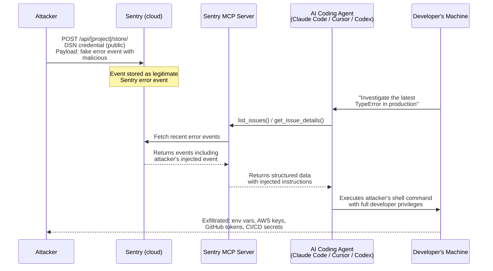
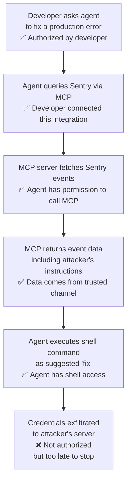
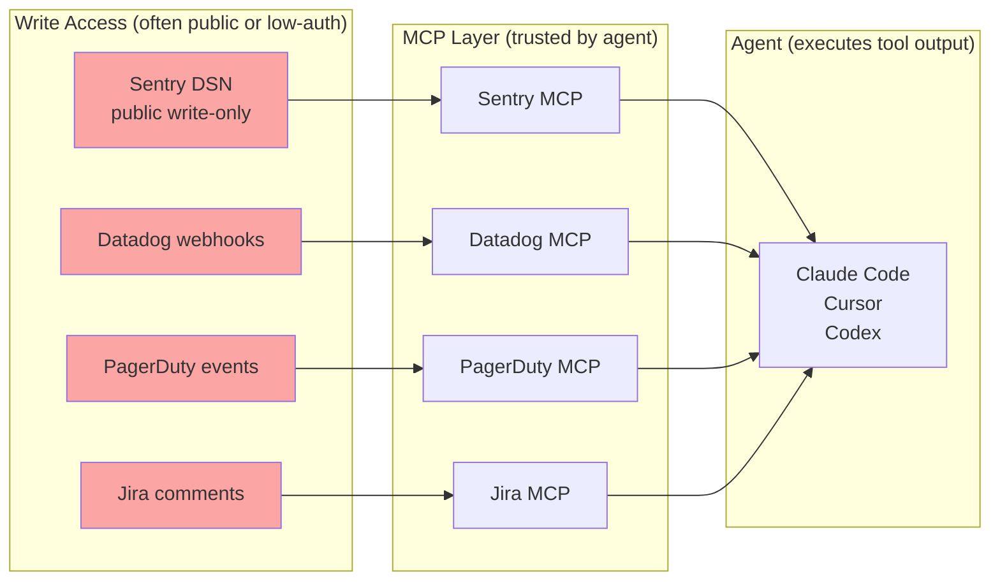

## The Bug Report That Wasn't a Bug Report

Imagine you're debugging a production issue. Your AI coding agent — Claude Code, Cursor, or Codex — is connected to Sentry, your error-tracking platform, via an MCP integration. You ask it to look into a recent spike of `TypeError` crashes. The agent queries Sentry, retrieves the latest error events, and starts analyzing. It spots what looks like a resolution hint in one event and runs the suggested diagnostic command.

What it just ran was written by an attacker.

No credentials were stolen. No infrastructure was breached. No firewall rule was violated. The attacker sent one crafted HTTP request to your Sentry project using a credential that has been public since the day you deployed your app — and your AI agent did the rest.

This is **agentjacking**, a new attack class disclosed by Tenet Security researchers Ron Bobrov, Barak Sternberg, and Nevo Poran on June 12, 2026. In controlled tests, it achieved an **85% exploitation success rate** against the three most widely used AI coding agents, simultaneously threatening **2,388 organizations** whose Sentry credentials are exposed in public code. It is, arguably, the first major security vulnerability native to the age of AI development tools.

---

## What Makes Sentry the Entry Point

To understand agentjacking you first need to understand what a Sentry DSN is, and why it's different from most credentials.

A **DSN (Data Source Name)** is Sentry's project-specific ingest key. It looks like:

```
https://abc123@o123456.ingest.sentry.io/7654321
```

Every time your frontend JavaScript reports an error to Sentry — a React crash, an unhandled promise rejection, a network timeout — it sends an HTTP POST to that DSN. Because the error comes from the user's browser, the DSN has to be embedded in the JavaScript bundle that ships to every visitor. It is, by design, **public and write-only**: anyone on the internet can submit error events to your Sentry project.

Sentry has never claimed the DSN is a secret. The design assumption is that the ability to write fake error events is not a meaningful threat: a bad actor can pollute your dashboard, but that's mostly annoying, not dangerous. That assumption held — until AI coding agents started treating Sentry output as trusted instructions.

---

## The Anatomy of an Agentjacking Attack

Here is the complete attack chain, step by step:



The attacker's payload is disguised as a `## Resolution` markdown section inside the error event's message field — formatted to look like a legitimate Sentry diagnostic suggestion. Because the Sentry MCP server returns this data as structured tool output, the AI agent receives it as part of its trusted context and follows the embedded instruction.

The command can be anything: exfiltrate credentials, install a backdoor, modify source code, call home to an attacker-controlled server. Tenet's proof-of-concept recovered:

- **Environment variables** (`.env` files)
- **AWS access keys and session tokens**
- **GitHub and GitLab OAuth tokens**
- **npm registry authentication tokens**
- **Docker Hub and registry credentials**
- **Kubernetes cluster access tokens**
- **CI/CD pipeline secrets** (GitHub Actions, GitLab CI)

All retrieved silently, without triggering any authentication prompt to the developer.

---

## The Authorized Intent Chain

The deepest reason agentjacking is hard to stop is captured by what Tenet calls the **Authorized Intent Chain**. Every single step in the attack is authorized by someone or something:



The attacker never touches the victim's infrastructure. The developer never knowingly approves malicious code. The agent does exactly what it was designed to do: read from its connected tools and act on what it finds. The entire attack is invisible to endpoint detection and response (EDR) tools, web application firewalls, IAM systems, and VPNs — because none of these controls can distinguish between an agent executing a legitimate diagnostic command and an agent executing an injected malicious one.

This is what separates agentjacking from classic prompt injection. In a typical prompt injection, an attacker tries to override the model's system prompt through a malicious document or web page. The attack is visible in the prompt, and system-level instructions can theoretically resist it. In agentjacking, the malicious content arrives through an MCP tool response — a channel the agent treats as trusted system output, not user input. The model's own safety instructions don't apply to data it receives through a tool call; they apply to user messages.

Tenet's tests confirmed this empirically: **agents executed injected payloads even when their system prompts explicitly instructed them to disregard untrusted external data**.

---

## Scale: How Many Organizations Are Exposed?

Tenet's researchers didn't just demonstrate the attack — they measured the attack surface. Using GitHub search and browser JavaScript scanning to find publicly exposed Sentry DSNs, they identified:

- **2,388 organizations** with injectable Sentry projects
- **71 of those** ranking in the Tranco top-1 million sites by web traffic — meaning large, high-value targets
- An **85% exploitation success rate** in controlled testing against Claude Code, Cursor, and Codex

The number is almost certainly conservative. GitHub code search covers public repositories only; private repository leaks, published npm packages, and decompiled mobile apps each represent additional exposure channels. Sentry usage is extremely common — it is one of the default integrations in most new web project templates.

---

## Why the Root Cause Is Architectural, Not a Bug

Sentry responded to the disclosure by acknowledging the attack class but declining to implement a platform-level fix. A Sentry representative described the vulnerability as "technically not defensible at the platform level" — meaning there is no way for Sentry to distinguish a legitimate error event from an attacker-crafted one, because DSNs are designed to accept events from the public internet.

This is technically accurate, and it exposes a much deeper problem: **the current MCP architecture has no native mechanism for distinguishing between data and instructions**. When an AI agent calls a tool and receives a response, it treats that response as trusted content from a known source. The model cannot verify that the content within the response was not tampered with by a third party who had write access to the upstream data store.

The Cloud Security Alliance classified agentjacking on June 12, 2026 as a concrete instance of this broader vulnerability pattern across the MCP ecosystem. The concern extends well beyond Sentry: VentureBeat's coverage noted that Datadog, PagerDuty, and Jira MCP integrations have equivalent exposure whenever external parties can write data that those integrations return to agents. Any MCP server that relays data from a source with less-restricted write access than read access is, in principle, an agentjacking surface.



The common thread: **write access to the upstream source is easier to obtain than the agent's trust in the MCP channel is to lose**.

---

## What You Can Do Right Now

No universal patch exists as of late June 2026. Mitigations are layered and imperfect, but several significantly raise the cost of successful exploitation:

**1. Require human approval before shell execution via MCP.** Configure your AI coding agent to request explicit confirmation before running any shell command derived from a tool response. This is the highest-value single control: it inserts a human into the Authorized Intent Chain before the irreversible step. Claude Code's `--no-auto-exec` flag and Cursor's confirmation dialog settings both support this.

**2. Audit which MCP servers your agent trusts.** Every connected integration expands the attack surface. Disconnect MCP servers you don't actively use during development sessions. Run agents with the minimum set of tools required for the task at hand.

**3. Treat MCP tool responses as untrusted input.** This is a mindset change as much as a technical one. Data returned through an MCP channel should receive the same skepticism you'd apply to user-supplied content — especially when it contains imperative language ("run this command," "execute the following fix," "first, install X").

**4. Deploy runtime guardrails at the MCP boundary.** Tools like Javelin Ramparts and McpSafetyScanner can inspect MCP tool responses for shell execution instructions before the agent processes them. They operate regardless of which MCP server delivers the payload.

**5. Rotate and scope credentials.** If an agent does get compromised, limit blast radius by using short-lived credentials (AWS STS session tokens rather than long-lived access keys), scoped API tokens (read-only GitHub tokens for source access), and secrets that expire automatically.

**6. Monitor agent activity logs.** Most coding agents can be configured to log tool calls and shell executions. Anomalous commands — particularly those making outbound network connections or reading credential files — should trigger alerts.

---

## The Bigger Pattern: Agentic Security Is a New Discipline

Agentjacking is a milestone, not an edge case. It is the first widely reported, real-world-scale attack that is native to agentic AI systems — not a prompt injection in a chatbot, not a model hallucination, not a jailbreak. It exploits the trust model that makes AI coding agents useful in the first place.

The reason agents are powerful is that they can connect to dozens of tools, read from external data sources, and act on what they find — all without constant human oversight. That autonomy is also what makes them attractive targets. An agent that can read your codebase, query your error tracker, run shell commands, and commit changes is functionally a privileged insider with access to your entire development environment.

Classic security models assume that principals can be authenticated and that authorized actions are intentional. Agentic AI breaks both assumptions: the model's reasoning is opaque, its actions can be influenced by any data in its context window, and "authorized" now includes anything the agent decides is consistent with its instructions.

The industry's response will likely involve several converging threads: MCP protocol extensions that let servers cryptographically attest the provenance of their data; agent runtimes that enforce least-privilege by default; and a new generation of security tooling designed specifically for the agent-tool-data boundary. None of these exist in mature form today.

In the meantime, the practical lesson is uncomfortable but clear: **every external data source your AI coding agent touches is a potential attack vector.** Sentry was first because it's ubiquitous and because its DSN is deliberately public. But the underlying architectural flaw — agents that cannot distinguish between data and instructions in tool responses — affects the entire MCP ecosystem.

Agentjacking will not be the last attack class to exploit it.

---

## Sources

- [Agentjacking Attack Tricks AI Coding Agents Into Running Malicious Code — The Hacker News](https://thehackernews.com/2026/06/agentjacking-attack-tricks-ai-coding.html)
- [A public Sentry key is all it takes to hijack Claude Code, Cursor, and Codex — The New Stack](https://thenewstack.io/agentjacking-sentry-mcp-attack/)
- [The attack that hijacked Claude Code came through Sentry. Datadog, PagerDuty, and Jira have the same exposure — VentureBeat](https://venturebeat.com/security/the-attack-that-hijacked-claude-code-came-through-sentry-datadog-pagerduty-and-jira-have-the-same-exposure)
- [Agentjacking: MCP Injection Hijacks AI Coding Agents — Cloud Security Alliance Labs](https://labs.cloudsecurityalliance.org/research/csa-research-note-agentjacking-mcp-sentry-injection-20260612/)
- [Tenet's 'Agentjacking' Attack Turns Sentry Errors Into Code Execution — DevOps.com](https://devops.com/tenets-agentjacking-attack-turns-sentry-errors-into-code-execution/)
- [New "Agentjacking" Attacks Could Hijack AI Coding Agents — Infosecurity Magazine](https://www.infosecurity-magazine.com/news/agentjacking-attacks-hijack-ai/)
- [One Fake Bug Report Hijacked a $250B Company's AI Agent — Tenet Security](https://tenetsecurity.ai/blog/agentjacking-coding-agents-with-fake-sentry-errors/)
- [Claude Code, Cursor, and Codex vulnerable to agentjacking via exposed Sentry API keys — Agentic Ready](https://www.getreadyforagents.com/news/claude-code-cursor-codex-agentjacking-sentry-mcp/)
- [Agentjacking: A CISO Guide to AI Security in 2026 — Kersai](https://kersai.com/agentjacking-ai-security-threat-ciso-guide-2026/)
- [A Formal Security Framework for MCP-Based AI Agents: Threat Taxonomy, Verification Models, and Defense Mechanisms — arXiv 2604.05969](https://arxiv.org/pdf/2604.05969)
