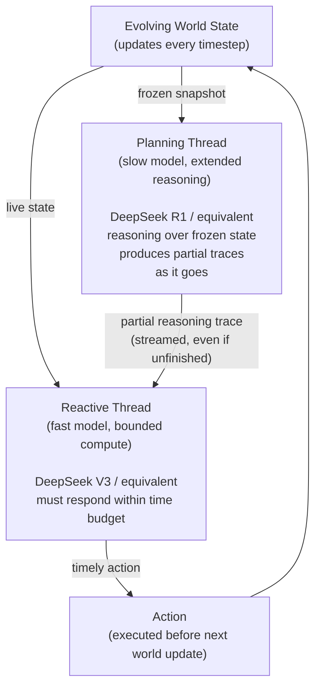

## There Is a Clock Ticking While the AI Thinks

Imagine asking a chess expert a question mid-game. They need a few minutes to reason through a complex sequence — but the game keeps moving. By the time they finish thinking, the board has changed and their carefully computed plan is worthless.

This is not a hypothetical problem for AI. It is the daily reality of any agent interacting with a dynamic environment: a robot in a warehouse, a trading bot watching a fast-moving market, a web browsing agent navigating pages that load and change, a game-playing agent watching opponents make moves. The world does not pause while the AI reasons.

The dominant approach to improving AI reasoning over the past few years — chain-of-thought, extended thinking, "o-series" style models — has made LLMs dramatically better at *quality* of reasoning. But these improvements come at the cost of *speed*. A model that thinks for sixty seconds before acting is useless when the window for action is two seconds.

A team from Tsinghua University, Shanghai Jiao Tong University, Georgia Tech, and Stanford identified this gap, formalized it as a research problem, built a benchmark to measure it, and proposed a surprisingly human-inspired solution. Their work, **"Real-Time Reasoning Agents in Evolving Environments"**, was accepted at **ICLR 2026**.

---

## The Two Paradigms That Both Fail

Before AgileThinker, the field had essentially two modes for deploying language models as agents:

**Reactive agents** are fast. They receive the current state of the world, run a quick inference pass, and output an action within a tight time budget. Think of this as reflexive behavior — there is not much deliberation happening, but the response is immediate. These agents work well when the world changes slowly or when simple pattern-matching is enough. Under real time pressure, their performance degrades because the reasoning is shallow.

**Planning agents** are deep. They receive the current state and spend as much compute as needed to reason through a full strategy. This produces high-quality decisions — but the world has often changed significantly by the time they act. In a fast-moving environment, a planning agent's brilliant strategy is frequently executing against a situation that no longer exists.

The researchers tested both paradigms on a new benchmark and found that neither could sustain both correctness and timeliness as time pressure and task complexity increased. The finding sounds obvious in hindsight, but it had never been rigorously measured before.

---

## The Real-Time Reasoning Gym

To study this problem, the team built **Real-Time Reasoning Gym (RTR-Gym)** — an evaluation framework that forces language agents to operate under strict time constraints while the environment keeps evolving.

RTR-Gym draws inspiration from three classic games, each chosen to isolate a different capability under time pressure:

| Game | Core challenge | Why it's hard in real time |
|---|---|---|
| **Freeway** | Navigate across a busy road | Hazards appear suddenly; delay means collision |
| **Snake** | Grow by collecting food, avoid walls | Opportunities are fleeting; overthinking misses them |
| **Overcooked** | Coordinate with a partner agent to fill orders | Requires reading another agent's state and intent while acting |

Each game runs with controllable **cognitive load** (how complex the game state is) and controllable **time pressure** (measured in LLM decoding token budgets or wall-clock seconds). Dialing these knobs up makes the benchmark progressively harder and exposes failure modes that flat benchmarks miss entirely.

The gym is open-source and available at [github.com/SALT-NLP/RealtimeGym](https://github.com/SALT-NLP/RealtimeGym).

---

## AgileThinker: Two Threads, One Decision

The solution the researchers propose is architecturally simple but cognitively clever: **run both paradigms at the same time in parallel threads, and let the fast thread read the slow thread's in-progress work**.

Here is how the two threads interact at each timestep:

**Planning thread:** Takes a frozen snapshot of the world state (so it does not have to track a moving target) and begins extended reasoning — the same kind of deep chain-of-thought that makes o-series models powerful. It does not need to finish before the next action is needed. Its job is to keep thinking and make its partial traces available.

**Reactive thread:** Receives the live, current state of the world. Before deciding what to do, it checks whether the planning thread has produced any reasoning so far — even incomplete traces. It incorporates those partial insights, then outputs an action within its strict time budget.

The key insight is that **a half-finished plan is more useful than no plan at all**. When the reactive thread sees that the planning thread has reasoned "the hazard on the left is likely to move right based on its trajectory," that single insight can meaningfully improve the reactive agent's immediate decision — even though the plan is not complete.

This architecture is directly inspired by Daniel Kahneman's dual-process theory of human cognition. In his framework:
- **System 1** is fast, automatic, intuitive — the reactive thread
- **System 2** is slow, deliberate, analytical — the planning thread

What humans do naturally — letting a background analytical process quietly inform our quick gut-level decisions — AgileThinker implements explicitly as two concurrent language model threads.

---

## What the Numbers Show

The researchers ran experiments using **DeepSeek V3** for the reactive thread and **DeepSeek R1** for the planning thread. (Commercial model APIs were not suitable because accessing partial reasoning traces requires visibility into the model's generation process, which most hosted APIs do not expose.)

Across all three RTR-Gym environments, AgileThinker consistently outperformed both single-paradigm baselines, with the advantage growing as time pressure increased and as cognitive load rose.

| Environment | Reactive only | Planning only | AgileThinker |
|---|---|---|---|
| Freeway | Degrades under pressure | Too slow to react | 0.62 → 0.94 across budgets |
| Snake | Misses short opportunity windows | Misses them too | 0.42 → 0.83 across budgets |
| Overcooked | Struggles with partner coordination | Correct but delayed | 0.71 → 0.94 across budgets |

The pattern is striking: single-paradigm agents show a performance cliff as conditions worsen, while AgileThinker degrades more gracefully and maintains higher absolute scores at the hardest settings.

---

## Why This Gap Has Been Invisible Until Now

The dominant benchmarks for LLM agents — SWE-bench, ARC, MMLU, reasoning evals — are all **static**. The world state is frozen. The model can think for as long as it wants and then give its answer. Nothing changes between when the question was asked and when the answer is given.

This is a reasonable simplification for many real-world tasks. Writing code, answering questions, drafting documents — these do not have a ticking clock. But as AI agents move into more interactive, physical, and time-sensitive domains, the assumption breaks down hard.

A web browsing agent hitting an auction site that changes every ten seconds, a delivery robot navigating a space where humans keep walking into new positions, a financial agent watching a price that moves continuously — all of these require agents to act under the same kind of pressure RTR-Gym measures.

The paper essentially says: we have been benchmarking AI agents in still-frame photography and then wondering why they struggle with video.

---

## The Practical Takeaway for Builders

AgileThinker is a research paper first, not a polished SDK. But the architecture it describes is implementable today if you have access to a model that exposes streaming partial reasoning traces.

The key design question it surfaces is: **what is the right way to route work between fast and slow paths in an AI agent?** This is a question that has analogues throughout software systems — caches and main memory, preemptive and cooperative multitasking, DRAM and L1 cache. Computing has repeatedly found that hybrid approaches outperform pure-one-or-the-other strategies when access patterns are mixed.

For anyone building agents that operate in dynamic environments, the takeaway is concrete: do not treat the planning and reactive components as alternatives to choose between. Treat them as complementary subsystems that should run concurrently and share information continuously.

The code and benchmark are open-source. If you are building something that needs to operate under time pressure, RTR-Gym gives you a structured way to measure how well your agent handles it — before you deploy it somewhere where the world does not wait.

---

## Sources

- [Real-Time Reasoning Agents in Evolving Environments — arXiv:2511.04898](https://arxiv.org/abs/2511.04898)
- [RealtimeGym Project Website — Stanford SALT Lab](https://realtimegym.saltlab.stanford.edu/)
- [SALT-NLP/RealtimeGym — GitHub](https://github.com/SALT-NLP/RealtimeGym)
- [Paper page on HuggingFace — arXiv:2511.04898](https://huggingface.co/papers/2511.04898)
- [REAL-TIME REASONING AGENTS — OpenReview (ICLR 2026)](https://openreview.net/forum?id=n1AvXiU2lu)
- [10 AI Research Breakthroughs That Matter for Builders (June 2026) — BuildThisNow](https://www.buildthisnow.com/blog/guide/mechanics/ai-research-june-2026)
- [Thinking Fast and Flowing Slow: Real-Time Reasoning for Autonomous Agents — Cognaptus](https://cognaptus.com/blog/2025-11-10-thinking-fast-and-flowing-slow-realtime-reasoning-for-autonomous-agents/)
- [Stanford AI Lab Papers and Talks at ICLR 2026 — SAIL Blog](https://ai.stanford.edu/blog/iclr-2026/)
