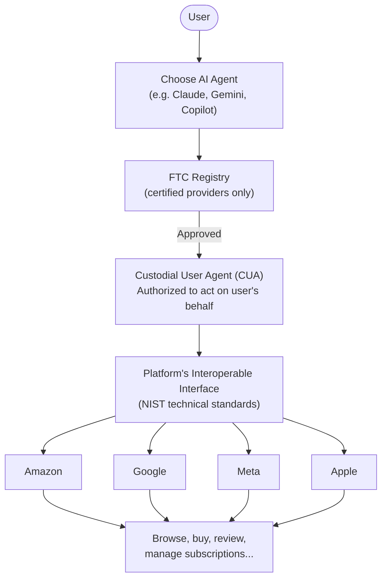
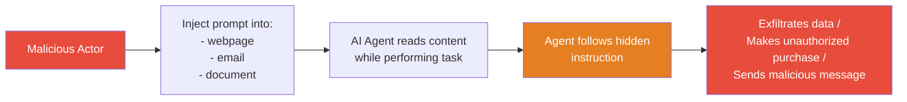

## The Problem Nobody Noticed Until It Was Too Late

Think about the last time you booked a trip, made a purchase, or sorted through a pile of emails. Increasingly, an AI agent did some of that work for you — or will soon. These agents don't just suggest; they act. They click buttons, fill out forms, send messages, and complete purchases, all on your behalf and often without you watching each step.

That shift from AI-as-advisor to AI-as-actor has happened fast. According to the 2026 Stanford AI Index, **96% of enterprises now run AI agents in some form**, and consumer-facing agents have started showing up everywhere — in shopping apps, email clients, banking portals, and smart speakers.

But here's the thing nobody quite worked out before the agents arrived: **who controls your agent?**

If you use Amazon, your agent is Alexa. If you're on Google, your agent is Gemini. If you're in Apple's ecosystem, your agent is Siri-next-generation. And those agents, by design, work best when you stay inside their platforms. They're tuned to help their parent companies. They don't, by default, let you bring a different, possibly better, agent to the party.

Senator Mark Warner (D-VA) thinks that's a problem — and he wants the law to fix it.

---

## What the AI AGENT Act Actually Says

On June 29, 2026, Warner released a **discussion draft** of the *Artificial Intelligence Access, Gatekeeper Exchange, and Nondiscriminatory Transfer Act* — mercifully shortened to the **AI AGENT Act**. It is the first major piece of proposed federal legislation aimed squarely at the power dynamics of agentic AI.

The core idea is captured in a phrase that has already become shorthand in policy circles: **"bring your own agent."** The bill would give users of large online platforms the legal right to use an AI agent of their choosing, not just the one the platform wants them to use.

More specifically, the bill would require any **online platform with at least 50 million U.S. customers or subscribers** to maintain an open, interoperable interface — a kind of technical gateway — through which a user's chosen AI agent can operate. The agent must be able to do whatever a human user can do on that platform, on the same functional terms, without being penalized or throttled.

The bill introduces a new legal concept: the **Custodial User Agent (CUA)** — an AI system explicitly authorized by a human user to act as their digital representative. A CUA is legally distinct from a platform's own built-in agent. It's your agent, not theirs, with explicit authorization scope you define and can revoke.

---

## The Three Pillars of the Bill

### 1. Open Access: Platforms Must Let Your Agent In

Covered platforms — which would include Amazon, Google, Meta, and Apple under the 50-million-user threshold — must provide interoperable interfaces that let certified third-party AI agents function. The agent must be able to act "on the same terms as a user." No technical obstacles, no throttled API access, no preferential treatment for the platform's own agent.

Think of it like mandating that a bank must accept payments from any certified payment processor, not just its own. Or like how USB-C standardization forced device manufacturers to use a common port. The goal is to prevent platforms from using control of the interface to lock users into their preferred AI.

### 2. A Certified Registry: The FTC as AI Bouncer

Not just any agent gets in. The **Federal Trade Commission** would establish and maintain a **public registry of approved CUA providers**. Certification requires meeting baseline standards for:

- **Privacy** — the agent must not collect or retain user data beyond what the user authorized
- **Data security** — the agent must protect sensitive information that passes through it
- **User loyalty** — the agent must act in the user's interest, not against it
- **Identity binding** — each agent must be cryptographically linked to its human operator's identity, so there's an auditable record of who authorized what

Platforms can legally block uncertified agents. The registry becomes the enforcement chokepoint: get certified or you're locked out.

### 3. Platform Accountability: Duty of Care for Built-In Agents

The bill doesn't only regulate third-party agents. Platforms' own agents would owe users a **duty of care** — a legal obligation not to act against the user's interests. If Alexa books you a more expensive flight because Amazon has a referral arrangement, or if a platform's agent steers you toward products the platform profits from, that would potentially constitute a violation.

This part of the bill is harder to enforce but conceptually important: it signals that agents — even the ones platforms build for themselves — are fiduciaries of a kind, not just features.

---

## Why Now? The Regulatory Clock Is Ticking

The timing isn't accidental. Several forces converged in mid-2026 to make this the right moment for agentic AI legislation.

**Agents are spending real money.** The shift from "agents answer questions" to "agents make purchases" happened faster than regulators expected. Agentic commerce — AI agents autonomously completing transactions — crossed from niche to mainstream in early 2026. When an AI agent makes a $500 purchase on your behalf without you reviewing the checkout, the stakes of a misaligned or manipulated agent become very concrete.

**Security failures are accumulating.** Prompt injection attacks — where malicious content in a website or document tricks an agent into doing something unauthorized — rose 340% year-over-year in 2026. The most notorious example was the **EchoLeak exploit** against Microsoft Copilot, where infected emails could silently instruct the agent to exfiltrate sensitive data without the user's knowledge. When agents act autonomously, their attack surface extends to everything they touch.

**Platform lock-in is accelerating.** As agents become the primary interface between users and the internet — handling shopping, scheduling, research, and communication — whoever controls the agent controls the user relationship. Big platforms have strong incentives to make their agents indispensable and to make it hard to switch. The AI AGENT Act is, in part, a competition-policy intervention dressed in consumer-protection language.

**The EU is moving.** Article 50 of the EU AI Act — which mandates transparency obligations for AI systems interacting with users — formally took effect on August 2, 2026. Warner's team has cited EU regulatory momentum as one driver for federal action; the argument is that NIST and FTC setting US standards now shapes global defaults.

---

## The "Bring Your Own Agent" Model in Practice

The bill's practical vision becomes clearest when you imagine how it would work:

You open Amazon. You have a Claude agent you use to manage purchases. Under the AI AGENT Act, Amazon would have to offer an interoperable interface through which your Claude CUA can browse, search, add to cart, and complete purchases — exactly as you can — without Amazon's Alexa being forced into the workflow.

Your Claude CUA is registered with the FTC. Its certification means it has privacy commitments it must honor, security standards it must meet, and a legal obligation to act in your interest. Amazon can verify the certification and must allow access; it cannot deliberately slow the interface or offer fewer features to your agent than to its own.

For the average consumer, this would function similarly to how mobile number portability works for phones: you keep your agent when you switch platforms, rather than having a different AI assistant on every website you visit.

---

## The Hard Questions the Bill Raises

The AI AGENT Act is a discussion draft, not a law. Warner's office released it specifically to solicit feedback, and that feedback has been arriving from multiple directions.

**Is this really consumer protection — or tech competition policy?**

Legal analysts at Davis Wright Tremaine noted that the bill's structure looks more like **digital interoperability regulation** (think: forcing Google to open its search index to competitors) than traditional consumer protection. The FTC registry is an unusual construction; the agency more typically enforces existing laws than builds certification infrastructure. Critics worry the bill is solving a competition problem under a consumer-protection framing that may not have the right tools for the job.

**What about the security paradox?**

The bill's security provisions are real, but critics point out a fundamental tension: requiring platforms to open interoperable interfaces to external agents could itself create new attack surfaces. A standardized interface that every certified agent can access is also a standardized interface that a compromised or malicious certified agent can abuse. NIST will need to design protocols that are genuinely secure and not just compliant-looking.

**Does the bill assume one future and miss another?**

Analysts at Opus Research asked a pointed question: the AI AGENT Act assumes a world where users have their own persistent AI agents they bring to platforms. But the market may also be moving toward agent-to-agent workflows (A2A protocols), multi-agent orchestration, and enterprise-managed agents, none of which the bill addresses cleanly. If the agent landscape evolves faster than the regulatory framework, the law could be obsolete before it's enacted.

**The FTC registry is unprecedented and potentially slow.**

Building a federal certification registry for AI products requires significant institutional capacity. The FTC doesn't currently have the staff, expertise, or budget for this — and standing up a functioning registry takes years. The bill's timeline and implementation mechanism are under scrutiny.

---

## Industry Is Already Organizing

The legislation has catalyzed a new political entity: the **Agentic Futures Initiative**, a recently formed lobby group that believes policymakers need to better understand agentic technology before regulating it. The group supports interoperability and security standards in principle but wants to shape how they're implemented.

Meanwhile, Google has its own angle: the company launched the **Agent2Agent (A2A)** open protocol in 2026 with backing from over 50 technology partners including Atlassian, Box, Salesforce, and SAP. A2A defines a voluntary standard for how agents from different providers communicate. From Google's perspective, voluntary open standards are preferable to mandated regulatory frameworks — but the fact that industry is moving toward open agent protocols at all validates Warner's underlying diagnosis that the ecosystem needs interoperability.

The broader regulatory context matters too. This is not a one-off bill but part of Warner's **"Framework for America's AI Future"** — a multi-bill legislative agenda covering data center transparency, workforce protections, national security implications of AI, and chatbot disclosure requirements (the separate GUARD Act targets AI chatbots used with children). The AI AGENT Act is one column in an emerging architecture.

---

## What Happens Next

As of August 2026, the AI AGENT Act remains a discussion draft. There is no formal Senate vote scheduled, no companion bill in the House, and no timeline for enactment. The discussion draft process is deliberate: Warner's team is gathering expert feedback before the bill is formally introduced.

A few things will determine how this plays out:

- **FTC capacity and appetite.** The FTC under its current leadership has been active on tech-platform issues. Whether it will embrace a new certification-registry mandate or push back on the institutional ask is unclear.
- **Platform industry lobbying.** Amazon, Google, Meta, and Apple have every incentive to shape the technical standards so that "interoperability" in practice is narrowly scoped. Watch the NIST standard-setting process closely — that's where the real fight will happen.
- **Whether agents become central to 2026 politics.** Consumer AI agents handling purchases, healthcare decisions, and financial planning raise profound questions about liability, manipulation, and democratic participation. If a major scandal involving an agent acting against a user's interest goes viral, the political pressure for legislation will accelerate.
- **Global alignment.** If the EU AI Act's Article 50 implementation establishes de facto global norms for AI transparency and interaction, US regulators will face pressure to harmonize — or diverge deliberately.

The AI AGENT Act is early and imperfect. But it's asking the right question: as AI agents become the primary way many people navigate the digital world, do users have the right to choose who represents them — or does that choice belong to whoever owns the platform?

That question is not going away. The answer will define the shape of the next decade of computing.

---

## Sources

- [Warner Unveils Discussion Draft of the AI AGENT Act — Senator Warner's Official Press Release](https://www.warner.senate.gov/newsroom/press-releases/warner-unveils-discussion-draft-of-legislation-to-create-innovative-market-for-secure-artificial-intelligence-agents/)
- [AI AGENT Act Section-by-Section Analysis (PDF) — Warner Senate Office](https://www.warner.senate.gov/wp-content/uploads/2026/06/DRAFT.AI_AGENT_Act_sxs.v2.pdf)
- [Warner Bill Would Create Federally Vetted List for Secure, Trustworthy AI Agents — CyberScoop](https://cyberscoop.com/ai-agent-act-senate-draft-bill-mark-warner/)
- [Senate Bill Would Let Consumers Bring Their Own AI Agents to Amazon and Google — PYMNTS](https://www.pymnts.com/news/artificial-intelligence/2026/senate-bill-would-let-consumers-bring-their-own-ai-agents-amazon-google/)
- [The Federal AI AGENT Act: Consumer Protection in AI Clothing? — Davis Wright Tremaine](https://www.dwt.com/blogs/artificial-intelligence-law-advisor/2026/07/ai-agent-act-consumer-ai-regulation)
- [Senator Warner's Discussion Draft on Securing AI Agents: Top Points — DLA Piper](https://www.dlapiper.com/en-lu/insights/publications/2026/07/senator-warner-discussion-draft-on-securing-ai-agents-top-points)
- [How the Senate's AI AGENT Act Could Reshape Enterprise AI Governance — CIO](https://www.cio.com/article/4191009/how-the-senates-ai-agent-act-could-reshape-enterprise-ai-governance.html)
- [Senator Warner Makes a First Foray into Agentic AI Regulation — TechPolicy.Press](https://www.techpolicy.press/senator-warner-makes-a-first-foray-into-agentic-ai-regulation/)
- [The AI AGENT Act Assumes One Future for AI Agents. What If We Get Another? — Opus Research](https://opusresearch.net/2026/07/08/the-ai-agent-act-assumes-one-future-for-ai-agents-what-if-we-get-another/)
- [US Senator's Draft Legislation Targets Privacy, Safety of AI Agents — Biometric Update](https://www.biometricupdate.com/202607/us-senators-draft-legislation-targets-privacy-safety-of-ai-agents)
- [Prompt Injection Still Drives Most Agentic AI Security Failures in Production — Help Net Security](https://www.helpnetsecurity.com/2026/06/11/owasp-prompt-injection-ai-security-failures/)
- [Sen. Mark Warner's Draft AI AGENT Act Would Make Amazon, Google, Meta, and Apple Open Their Platforms to Outside AI Agents — Shopifreaks](https://www.shopifreaks.com/sen-mark-warners-draft-ai-agent-act-would-make-amazon-google-meta-and-apple-open-their-platforms-to-outside-ai-agents/)
- [Exclusive: Inside Sen. Mark Warner's AI Plan — Axios](https://www.axios.com/2026/07/21/mark-warner-ai-plan)
- [Warner Rolls Out Comprehensive AI Legislative Agenda — Senator Warner's Office](https://www.warner.senate.gov/newsroom/press-releases/warner-rolls-out-comprehensive-ai-legislative-agenda-focused-on-responsible-innovation-workers-and-national-security/)
- [AI Agents Are Getting a Lobby Group in DC — Yahoo News / Agentic Futures Initiative](https://www.yahoo.com/news/articles/ai-agents-getting-lobby-group-175036465.html)
