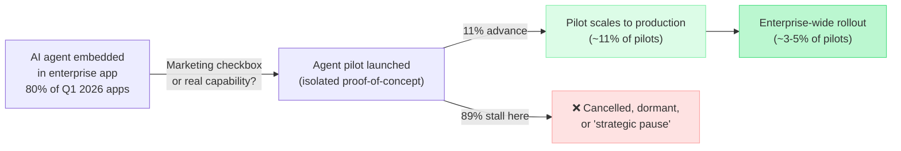
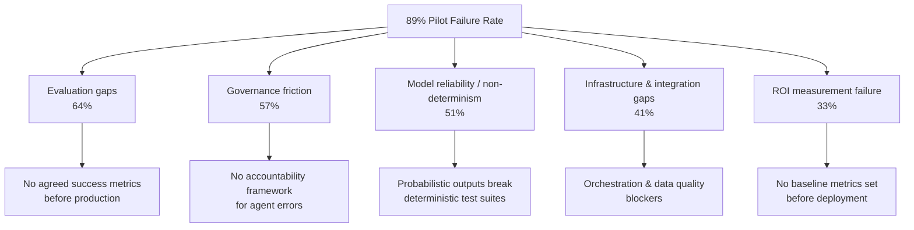
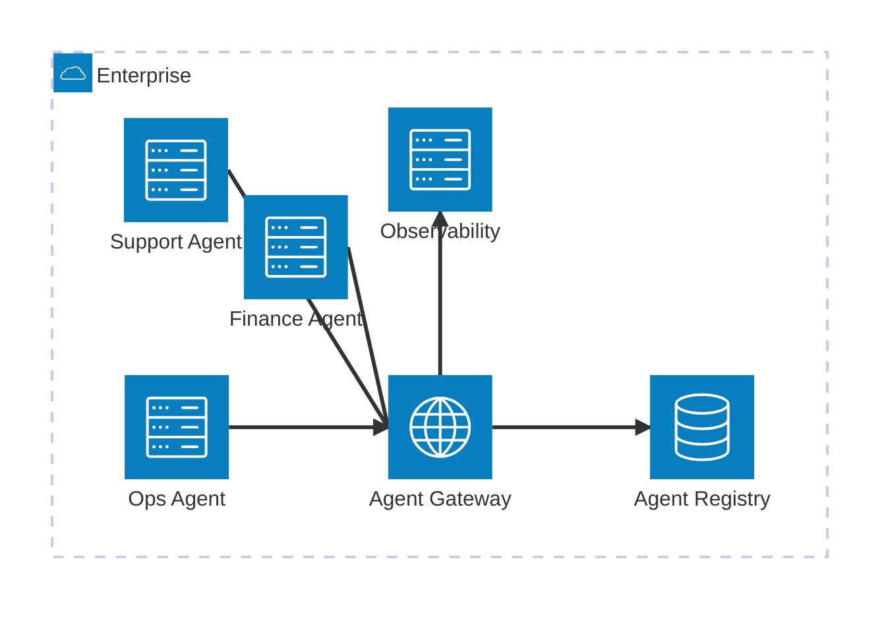

## Two Numbers That Don't Add Up

Two statistics are making the rounds in enterprise technology circles this July, and together they tell a story that almost sounds like a contradiction.

The first: according to Gartner, **80% of enterprise applications** shipped or updated in the first quarter of 2026 embed at least one AI agent. That number was 33% in 2024 — meaning adoption has more than doubled in under two years.

The second: **89% of AI agent pilots never reach production**.

Read those again. An overwhelming majority of enterprise software now ships with agents baked in. And an overwhelming majority of agent projects stall before delivering durable value. How can both things be true at the same time?

The answer tells you most of what you need to know about where enterprise AI actually stands in mid-2026.

---

## What "AI Agent" Even Means Here

Before diving into the numbers, it's worth pausing on the definition, because "AI agent" is used loosely enough to mean almost anything.

At one end of the spectrum, a feature that auto-drafts an email reply in your CRM gets marketed as an "AI agent." At the other end, you have fully autonomous systems that ingest a business goal, break it into sub-tasks, call APIs, write code, and execute multi-day workflows with minimal human input.

Both show up in the Gartner 80% figure. The pilot failure data is weighted toward the latter — the kind of agents that actually automate meaningful work and therefore require real integration, real testing, and real governance.

Think of the difference this way: a calculator app with a "suggest calculation" button is not the same category of thing as an autonomous expense-auditing agent that reads receipts, reconciles ledgers, flags anomalies, and updates the ERP. Both contain AI. Only one of them can go wrong in expensive ways.

---

## The April 2026 Platform Moment

The industry reached a structural turning point in late April 2026. Within the span of a single week, three major platforms simultaneously released enterprise agent infrastructure:

- **Google** rebranded Vertex AI as the **Gemini Enterprise Agent Platform**, introducing Agent-to-Agent (A2A) orchestration, cryptographic agent identities, an Agent Gateway for access control, and OpenTelemetry-compliant observability tooling.
- **OpenAI** launched **ChatGPT Workspace Agents** for enterprise subscribers.
- **Salesforce** expanded **Agentforce** and deepened its Google Cloud integration.

The result was what analysts called the end of "pilot paralysis" — the era where enterprises wanted agents but couldn't get enterprise-grade reliability or governance from the available platforms. Now the tooling exists. What IBM's Think 2026 survey found is that large enterprises expect to run a fleet of over **1,600 AI agents** on average by year-end.

But the same survey found that **70% of organizations cannot adequately govern the agents they already have**.

---

## Inside the 89%: Why Pilots Fail

Forrester and Anaconda surveyed enterprise technology leaders earlier this year and found that the top three reasons agent pilots stall are:

1. **Evaluation gaps** — cited by 64% of leaders. There is no agreed-upon way to measure whether the agent is doing its job well before moving it to production. Regression test suites that work for deterministic code don't translate to probabilistic AI outputs. If you can't measure it, you can't certify it.

2. **Governance friction** — cited by 57%. Questions like "who is accountable when the agent makes a wrong decision?" and "what actions can it take without human approval?" don't have answers. Without answers, no legal or compliance team will sign off on a production deployment.

3. **Model reliability concerns** — cited by 51%. This is the flip side of non-determinism: agents produce different outputs for the same input on different runs. The concern isn't just accuracy — it's *predictability*. An agent that's right 95% of the time but unpredictably wrong in edge cases creates risk that is hard to quantify and harder to manage.

Notice what isn't on this list: the model being bad, the task being impossible, or the infrastructure being unavailable. **The failure is organizational, not technical.** The models are capable. The cloud platforms are mature. What's missing is the internal structure to operate autonomous AI safely at scale.

---

## The Industry Breakdown: Who Is Actually Winning

Not every sector is struggling equally. McKinsey's 2026 data shows that **banking and insurance lead enterprise agent production deployment at 47%**, while healthcare sits at 18% and government at 14%.

The pattern is not surprising. Financial services firms have spent decades building the compliance frameworks, audit logging, and human-oversight workflows that happen to be exactly what robust agent governance requires. When you already have change-management processes for deploying software that touches money, layering agents on top is an extension of existing practice — not a new capability to build from scratch.

Healthcare lags partly because of HIPAA and patient-safety regulation, which is appropriate: the stakes for an error are higher. Government lags because procurement cycles are long and risk tolerance is low.

Retail and telecommunications are emerging as unexpected leaders. Telecommunications reaches **48% production deployment** — higher than banking — largely because agent use cases in telecoms (billing dispute resolution, churn prediction, network-fault triage) map cleanly onto narrow, well-defined workflows where the cost of an error is containable and measurable.

---

## The Governance Gap Is the Real Story

Only **one in five companies** has what analysts describe as a "mature governance model" for autonomous agents. Seven in ten executives say the governance they have in place is not fit for purpose.

IBM's data at Think 2026 sharpened this: only **18% of organizations maintain a current, complete inventory of the agents running inside their walls**. If you don't know what agents exist, you can't govern them, audit them, or shut them down when something goes wrong.

This is Agent Sprawl — a 2026 term for the same phenomenon that gave us shadow IT in the 2010s, except faster and harder to contain. A developer can spin up an agent workflow in an afternoon. Doing it with proper identity management, audit logging, and rollback procedures takes considerably longer.

Google's Gemini Enterprise Agent Platform addresses this directly with its **Agent Registry** (a single inventory of all deployed agents), **Agent Identity** (cryptographic IDs and authorization policies per agent), and **Agent Gateway** (an air traffic control layer that proxies and monitors all agent traffic). Whether organizations actually configure these controls, or treat them as optional extras, is the open question.

---

## What the 11% Do Differently

Gartner's finding that 89% of pilots fail is paired with a less-cited statistic: **the 11% that reach production deliver 171% ROI**. The gap between success and failure is large, but it isn't random.

Research across multiple 2026 surveys consistently identifies one distinguishing trait: organizations that successfully deploy agents **define governance and evaluation frameworks before deploying, not after**.

Specifically, the practices that separate the 11%:

- **They define success metrics before launch.** Not "the agent should handle support tickets faster" but "the agent must resolve 80% of Tier-1 tickets without escalation, with a false-positive rate under 3% measured weekly."

- **They appoint an "agentic ops" lead.** A dedicated owner — not a committee — who is accountable for the agent's behavior, its audit trail, and its rollback procedure. Gartner notes that **56% of enterprises now have this role** (up from 11% in 2024), and it is the most strongly correlated organizational factor with successful production deployment.

- **They start narrow.** The first production agent handles one well-defined workflow where the blast radius of an error is small and measurable. Broad mandates ("deploy agents across all customer service") come after the evaluation infrastructure exists, not before.

- **They treat agents like new employees, not new software.** Software releases don't make mistakes in novel situations. Agents do. The organizations succeeding in 2026 have figured out that the right mental model for agent deployment looks more like onboarding a new hire — with a probationary period, supervised access, escalation paths, and performance reviews — than a software release process.

---

## The 2027 Cancellation Wave Is Coming

Gartner is projecting that **more than 40% of agentic AI projects will be cancelled before the end of 2027**. The primary drivers: escalating infrastructure costs, unclear ROI, and inadequate risk controls.

The warning is worth taking seriously. The pattern being described is familiar from previous technology waves: broad early adoption driven by competitive pressure and FOMO, followed by a correction as reality catches up with the hype. Cloud computing went through it. Big data went through it. The difference with AI agents is the potential downside — not just wasted investment, but agents that made consequential mistakes nobody was set up to catch.

McKinsey's own 2026 estimate is that AI-powered agents could generate **$2.9 trillion in annual economic value** by 2030 in the U.S. alone. That number is real. So is the governance gap that separates most organizations from capturing it.

---

## What This Means Right Now

The AI agent tipping point is not a moment of universal success. It is a bifurcation: organizations that build the governance infrastructure are moving into durable production deployment and starting to see the economic value analysts have been projecting. Organizations that skipped the governance step are accumulating technical debt in the form of undocumented, ungoverned agents — and will be cancelling those projects when the invoices become impossible to justify.

If your organization is running agent pilots right now, the single most important question is not "what should the agent do?" It is: "Do we know how to measure when it's working, who is accountable when it isn't, and how we'll shut it down safely if we need to?"

If those questions don't have concrete answers, the pilot hasn't started yet. The agent code has — but the actual project hasn't.

---

## Sources

- [Welcome to Google Cloud Next '26 — Google Cloud Blog](https://cloud.google.com/blog/topics/google-cloud-next/welcome-to-google-cloud-next26)
- [1,600 AI Agents Per Enterprise: The Governance Gap — Beam AI](https://beam.ai/agentic-insights/ibm-says-enterprises-will-run-1600-ai-agents-by-year-end-70-cant-govern-the-ones-they-have)
- [89% of AI Agent Pilots Never Scale: Gartner's 2026 Data — The D\*AI\*LY Brief](https://www.beri.net/article/ai-agent-adoption-enterprise-2026-gartner-idc)
- [Enterprise AI Moves from Pilot to Production in 2026 — MarketScale](https://www.marketscale.com/industries/software-and-technology/enterprise-ai-moves-from-pilot-to-production-in-2026-but-gaps-in-governance-and-talent-persist)
- [AI Agent Adoption 2026: What the Data Shows — Joget (Gartner, IDC)](https://joget.com/ai-agent-adoption-in-2026-what-the-analysts-data-shows/)
- [Why 40% of Agentic AI Projects May Be Canceled by 2027 — Forbes](https://www.forbes.com/sites/robertszczerba/2026/07/07/why-40-of-agentic-ai-projects-may-be-canceled-by-2027/)
- [State of AI Trust in 2026: Shifting to the Agentic Era — McKinsey](https://www.mckinsey.com/capabilities/tech-and-ai/our-insights/tech-forward/state-of-ai-trust-in-2026-shifting-to-the-agentic-era)
- [Agentic AI's Enterprise Tipping Point: How April 2026 Redefined Adoption — FifthRow](https://www.fifthrow.com/blog/agentic-ai-s-enterprise-tipping-point-how-april-2026-redefined-systematic-innovation-and-production-scale-adoption)
- [Technology Radar July 2026: AI Agents Enter Production — Hector Pincheira](https://www.hectorpincheira.com/en/news/technological-radar-july-2026-ai-agents-go-into-production-and-governance-doesnt-keep-up/)
- [Roughly 10% of Enterprise Functions Use AI Agents, McKinsey Finds — Forbes](https://www.forbes.com/sites/josipamajic/2026/03/22/10-of-enterprise-functions-use-ai-agents-mckinsey-finds/)
