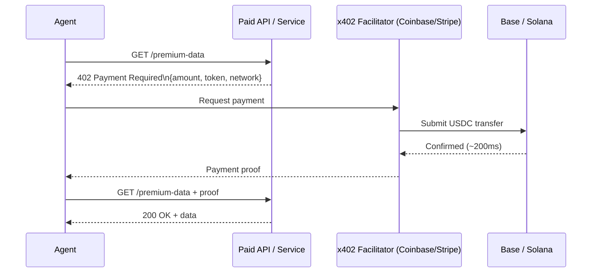

## From Assistant to Actor

For most of the past three years, the dominant mental model for AI agents was the **assistant**: a very capable helper that could draft, research, summarize, and suggest — but that ultimately handed control back to a human before anything consequential happened.

That model is quietly being retired.

In the span of roughly two weeks in May 2026, three major announcements changed what it means for an agent to "take action":

1. **Cloudflare and Stripe** launched an open protocol letting agents provision cloud accounts, register domains, and deploy code — with no human touching a dashboard.
2. **Amazon Web Services** unveiled Amazon Bedrock AgentCore Payments, letting agents pay for APIs and digital services using USDC stablecoins via Coinbase's x402 protocol.
3. **Circle** launched Agent Wallets and Nanopayments — programmable financial infrastructure designed from the ground up for software that spends money on its own.

Individually, each is a notable product launch. Together, they represent something bigger: the first wave of purpose-built financial and infrastructure plumbing for what people are starting to call the **agentic economy**.

---

## The Cloudflare/Stripe Protocol: Agents That Ship Code

The announcement that got the most attention came on April 30, 2026, when Cloudflare published a blog post titled "Agents can now create Cloudflare accounts, buy domains, and deploy."

The post describes a new open protocol, co-designed with Stripe, that handles the full path from "user tells agent to build and launch something" to "app is live in production" — including the parts that previously required a human to visit a dashboard and copy tokens around.

The protocol has three components:

```mermaid
flowchart LR
    A["User Request:\n'Build and deploy an app'"] --> B["Agent: Discovery"]
    B -->|"GET /catalog → JSON list of services"| C["Service Catalog\n(Cloudflare, Vercel, Supabase, etc.)"]
    C --> D["Agent: Authorization"]
    D -->|"Stripe identity attestation\n+ OAuth flow"| E["Cloud Provider\nAccount Created / Authenticated"]
    E --> F["Agent: Payment"]
    F -->|"Stripe tokenization\n$100/month cap"| G["Stripe Projects\n(Open Beta)"]
    G --> H["Agent Builds & Deploys"]
    H --> I["App Live in Production 🚀"]
```

**Discovery** works by querying a REST API that returns a JSON catalog of available services — the agent reads the catalog and chooses what to provision without requiring the user to know what exists or which APIs are available.

**Authorization** uses Stripe as the identity provider. If the user's Stripe email matches an existing Cloudflare account, a standard OAuth flow connects them. If no account exists, Cloudflare automatically provisions one. Credentials are encrypted and returned to the agent — the user never needs to manage API tokens manually.

**Payment** uses Stripe's tokenization layer, so the agent never touches raw credit card numbers. Stripe sets a default spending cap of **$100 per month per provider**, which users can raise and add budget alerts to as needed.

Four actions still require explicit human input: initial Stripe authentication, accepting terms of service, setting up billing, and approving final merges. Everything else — account creation, API token generation, DNS configuration, SSL certificates, and deployment — the agent handles end-to-end.

The protocol is designed to be open. Initial service partners beyond Cloudflare include Vercel, Supabase, Clerk, PostHog, Sentry, PlanetScale, Inngest, AgentMail, Hugging Face, and Twilio — and any platform with signed-in users can act as the "Orchestrator," playing the same role Stripe does.

---

## AWS + Coinbase + Stripe: Agents With Crypto Wallets

One week later, on May 7, 2026, Amazon Web Services announced **Amazon Bedrock AgentCore Payments** — a system that lets agents pay for APIs, data feeds, and paywalled content using USDC stablecoins, with no human in the loop.

The technical foundation is a protocol called **x402**, built by Coinbase. The name is a direct reference to HTTP status code 402: "Payment Required" — a code that has existed in the HTTP specification since 1991 but was never formally implemented. Coinbase's protocol revives it as a machine-native payment layer.

Here's how the flow works:

When an agent encounters a paid resource and receives an HTTP 402 response, AgentCore handles the full x402 protocol negotiation — wallet authentication, stablecoin payment, and proof delivery — without interrupting the agent's reasoning loop.

Settlement takes roughly **200 milliseconds** using USDC on Ethereum's Base layer-2 network or Solana. By May 2026, the x402 protocol had already processed over **169 million machine-native payments** across 590,000 buyers and 100,000 sellers, with roughly $600 million in annualized volume and zero protocol fees.

Developers choose a Coinbase or Stripe wallet, fund it with stablecoins or fiat, and agents can begin spending autonomously. The first use cases focus on API access and data purchases; the roadmap includes hotel bookings, travel reservations, and merchant payments — the long tail of agentic commerce.

---

## Circle's Agent Stack: Financial Infrastructure for the Agentic Economy

On May 11, 2026, Circle — the company that issues USDC — launched what it calls the **Circle Agent Stack**: a suite of products designed explicitly for agents as economic actors.

The suite has four components:

| Component | What it does |
|---|---|
| **Agent Wallets** | Programmable USDC wallets with human-defined spending policies (time limits, allowlists, blocklists) enforced at the wallet layer |
| **Nanopayments** | Gas-free USDC transfers as small as **$0.000001** at machine speed and scale, designed for sub-cent machine-to-machine flows |
| **Agent Marketplace** | A structured directory for agents to discover, evaluate, and integrate agentic services — shifting from human-scale subscriptions to usage-based, programmable commerce |
| **Circle CLI** | Developer tooling to tie it all together |

The spending policy enforcement is worth pausing on. With Agent Wallets, a user sets rules at the wallet level — "this agent can spend up to $50/week, only to these addresses, only for these categories" — and those constraints are enforced before any transaction executes. This is a different model from trying to trust the agent itself to stay within bounds.

---

## Why This Matters: The Shift from Agents That Plan to Agents That Transact

To understand the significance of this wave of infrastructure, it helps to think about what was missing before.

An AI agent could already write code, analyze data, draft emails, and make decisions. What it couldn't do easily was **provision the services it needed, pay for the resources it consumed, or deploy the artifacts it produced** — without a human acting as a bridge at each step.

Think of it like hiring a contractor who can design and build a house, but who can't sign contracts, buy materials, or pull permits — you have to do each of those things yourself before work can continue. The agentic economy infrastructure announced this month is the equivalent of giving that contractor a business account, a payment card, and a licensed agent status.

The macro numbers back up the trajectory. BCG estimates the agentic AI opportunity at **$200 billion in net new demand** for tech services. The IMF published a formal note in April 2026 on how agentic AI will reshape payments. The global agentic AI market is growing at CAGRs above 40% and is projected to reach $139–199 billion by 2034.

---

## The Safety Question: Who's Watching the Wallet?

The obvious concern is what happens when an agent goes wrong — and the answer matters a lot more when agents have financial autonomy.

All three announcements addressed this directly, with spending caps and policy enforcement as the primary mechanism:

- Cloudflare/Stripe: **$100/month default cap per provider**, plus the four human checkpoints that remain mandatory
- AWS AgentCore: wallet-level funding controls — agents can only spend what's been loaded
- Circle Agent Wallets: **policy enforcement at the wallet layer** with time bounds, allowlists, and blocklists enforced before execution

The architecture emerging across all three systems is the same: **human-in-the-setup, agent-in-the-loop, guardrails at the infrastructure layer**. The agent gets autonomy within a well-defined budget and permission envelope; humans set those envelopes and review significant decisions.

That said, the security community is watching closely. Researchers have already begun exploring prompt injection scenarios where a malicious service returns a crafted 402 response to trick an agent into authorizing payments to an attacker. The spending cap model helps limit blast radius, but the attack surface is real and the protocols are new.

---

## What Comes Next

The infrastructure is early, but the direction is clear. The next twelve months will likely see:

- **More service providers** joining the Stripe Projects and x402 ecosystems — the open protocol designs are specifically meant to expand the network effect
- **Agent-to-agent payments** where one autonomous system compensates another for compute, data, or specialized capabilities
- **Regulatory attention** on autonomous agent spending — the same dynamics that prompted the EU's AI Act simplifications will likely reach the payments layer
- **Enterprise-grade policy tools** that sit above the wallet layer and apply organization-wide controls across a fleet of agents

The analogy to watch is the web API economy of the early 2010s, when services like Stripe, Twilio, and SendGrid transformed what a small team could build by turning complex infrastructure into simple API calls. The agentic economy is doing the same thing again — but this time, the "developer" placing the API calls may not be human.

---

## Sources

- [Agents can now create Cloudflare accounts, buy domains, and deploy — Cloudflare Blog](https://blog.cloudflare.com/agents-stripe-projects/)
- [Cloudflare and Stripe Let AI Agents Create Accounts, Buy Domains, and Deploy to Production — InfoQ](https://www.infoq.com/news/2026/05/cloudflare-stripe-agent-commerce/)
- [Stripe and Cloudflare Launch Open Protocol for AI Agent Self-Service Deployment — KuCoin](https://www.kucoin.com/news/flash/stripe-and-cloudflare-launch-open-protocol-for-ai-agent-self-service-deployment)
- [Agents that transact: Amazon Bedrock AgentCore Payments (Preview) — AWS What's New](https://aws.amazon.com/about-aws/whats-new/2026/04/amazon-bedrock-agentcore-payments-preview/)
- [Agents that transact: Introducing Amazon Bedrock AgentCore Payments built with Coinbase and Stripe — AWS Machine Learning Blog](https://aws.amazon.com/blogs/machine-learning/agents-that-transact-introducing-amazon-bedrock-agentcore-payments-built-with-coinbase-and-stripe/)
- [Amazon Teams With Coinbase and Stripe to Let AI Agents Pay With Stablecoins — Decrypt](https://decrypt.co/367125/amazon-coinbase-stripe-ai-agents-pay-stablecoins)
- [Introducing x402: a new standard for internet-native payments — Coinbase Developer Platform](https://www.coinbase.com/developer-platform/discover/launches/x402)
- [Circle Launches AI Infrastructure to Power the Agentic Economy — BusinessWire](https://www.businesswire.com/news/home/20260511078086/en/Circle-Launches-AI-Infrastructure-to-Power-the-Agentic-Economy)
- [Circle Agent Stack: Financial Infrastructure for the Agentic Economy — Circle Blog](https://www.circle.com/blog/introducing-circle-agent-stack-financial-infrastructure-for-the-agentic-economy)
- [Are we ready to give AI agents the keys to the cloud? Cloudflare thinks so — InfoWorld](https://www.infoworld.com/article/4165857/are-we-ready-to-give-ai-agents-the-keys-to-the-cloud-cloudflare-thinks-so.html)
- [The $200 Billion Agentic AI Opportunity for Tech Service Providers — BCG](https://www.bcg.com/publications/2026/the-200-billion-dollar-ai-opportunity-in-tech-services)
- [How Agentic AI Will Reshape Payments — IMF Notes Volume 2026 Issue 004](https://www.elibrary.imf.org/view/journals/068/2026/004/article-A001-en.xml)
