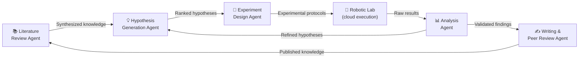
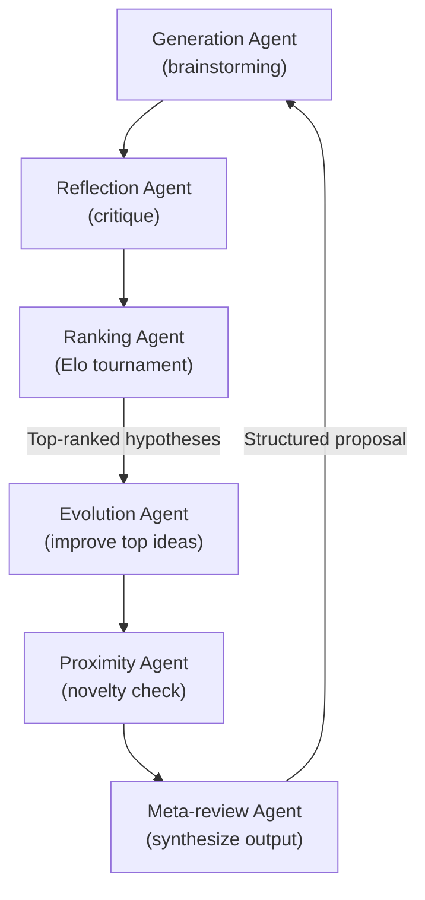

## Science Has Always Had a Bottleneck

The bottleneck in science has never been a shortage of curiosity. It has been bandwidth.

A researcher can read perhaps 200 papers a year. They can run perhaps 50 careful experiments in a year. They can hold maybe a dozen live hypotheses in their heads at once. A career's worth of work might produce a handful of genuinely novel findings.

In the past six months, a new kind of AI has arrived that operates at a different scale entirely. Not a tool you prompt and get a paragraph from, but a **system that reads thousands of papers overnight**, generates ranked lists of testable hypotheses by morning, designs batches of hundreds of experiments to test them, and dispatches those batches to robotic labs before the researcher has had their first coffee.

We are, quietly and rapidly, entering the era of the AI co-scientist.

---

## Four Stages, Zero Bottlenecks

The appeal of AI in research is usually framed as acceleration: do the same things faster. But the systems arriving in 2026 are doing something more disruptive. They are collapsing the four-stage scientific pipeline into a closed loop that runs autonomously.

The traditional pipeline looks like this:

1. **Literature review** — weeks to months to understand the state of a field
2. **Hypothesis generation** — days to weeks to formulate testable ideas
3. **Experimentation** — months to years of lab work
4. **Analysis and publication** — months more to write, submit, and revise

Multi-agent AI systems are attacking all four stages simultaneously. Different agents handle each phase, pass their outputs to the next, and loop back when results are ambiguous. The result is a research cycle that runs in days instead of years.

The feedback arrow from analysis back to hypothesis generation is key. It is what turns a linear pipeline into a self-improving loop — a flywheel that accelerates with every experiment run.

---

## Google's AI Co-Scientist: A Tournament of Ideas

The clearest implementation of the co-scientist concept came from Google Research in early 2025, and the system has been expanding its reach ever since. Google's **AI co-scientist** is built on Gemini 2.0 and uses a coalition of six specialized agents, each playing a distinct role in the research process.

The **Generation Agent** is the brainstormer. It reads the literature, identifies open questions, and proposes testable hypotheses. The **Reflection Agent** plays devil's advocate: for every idea the Generator produces, the Reflector looks for weaknesses, contradictions with known results, and practical obstacles.

What makes the architecture elegant is how competing ideas get ranked. Rather than a single evaluator grading proposals from a list, the **Ranking Agent** runs an **Elo tournament** — the same system used to rank chess players — pitting hypotheses against each other in head-to-head comparisons. Promising ideas accumulate rating points; weak ones get filtered out naturally. This is science as intellectual competition, automated.

The **Evolution Agent** then acts like a research mentor: taking the top-ranked ideas and trying to improve them — combining concepts from different fields, relaxing assumptions, or pushing an idea further than the original generator dared. A **Proximity Agent** checks for overlap with existing literature to ensure novelty. A **Meta-review Agent** synthesizes the full output into a structured research proposal.

The real-world results have been striking. At **Imperial College London**, a team studying antimicrobial resistance found that the AI co-scientist independently generated the same breakthrough hypothesis their human team had taken **years** to develop — and arrived at it in a matter of days. At **Stanford**, it identified drug candidates for liver fibrosis that subsequently showed anti-fibrotic activity in human hepatic organoids.

In late 2025, Google opened the system to all 17 US National Laboratories via an accelerated access program. The hypothesis compression effect alone — reducing early hypothesis generation from weeks to days — has already reshaped how some research groups approach problem selection.

---

## The AI Scientist: Papers That Pass Peer Review

If Google's co-scientist accelerates the front end of research, Sakana AI's **AI Scientist** handles the back end: writing the paper.

In March 2026, a paper produced entirely by the AI Scientist — with no human editing — was **published in Nature**, the most prestigious scientific journal in the world. The paper described novel findings in machine learning research and had been generated end-to-end: the system identified a research direction, coded the experiments, ran them, analyzed the results, produced figures, and wrote the manuscript in LaTeX — including a self-conducted peer review.

Earlier versions of the system had already passed workshop acceptance thresholds at major machine learning conferences, earning an average score of 6.33 at the ICLR ICBINB workshop — above the human acceptance mean. The Nature publication in March 2026 raised the bar significantly.

What makes the result theoretically interesting, beyond the technological achievement, is the **scaling law** the team documented: as the underlying foundation model improves, the quality of AI-generated research improves proportionally. If that relationship holds, better base models will produce better science — automatically, as a side effect of general capability gains.

---

## SPARK: Autonomous Cancer Research at Scale

In May 2026, **Nature Medicine** published a system called SPARK — System of Pathology Agents for Research and Knowledge — developed to autonomously conduct biomedical research on cancer.

The challenge SPARK addresses is one of the hardest in medicine: understanding **why** two tumors that look identical under a microscope behave completely differently in patients. Given only a digitized tissue slide and a research objective expressed in plain language, SPARK will formulate biological hypotheses, translate those hypotheses into analytical algorithms, run the analysis, and report findings — without any programmer writing new code between steps.

Think of it as a pathology "brain" made of interconnected agents: one that generates hypotheses about which cellular features matter, one that writes the code to measure those features, one that runs the measurements across a patient cohort, and one that evaluates whether the hypothesis was supported. The entire loop operates in natural language as its interface.

The system was validated across **more than 5,400 patients** spanning **18 independent cancer cohorts**. It identified prognostic and predictive biomarkers — features that predict how a patient will respond to treatment — that met clinical validity standards. Clinicians can interact with SPARK through a conversational interface without needing to know how to program or train models.

All methods and results were released openly to encourage the research community to build on the system.

---

## 36,000 Experiments in Six Months

Perhaps the most visceral demonstration of autonomous AI science in 2026 is what happened when OpenAI connected GPT-5 to Ginkgo Bioworks' robotic cloud laboratory in Boston.

Ginkgo's lab operates on reconfigurable automation hardware that allows experiments to be programmed and executed remotely, at scale. Over six months, GPT-5 ran in a closed loop: it designed batches of protein synthesis experiments in 384-well plate format, the robots executed them, the results came back, and GPT-5 analyzed the data and designed the next batch. It ran **36,000 cell-free protein synthesis experiments** with minimal human intervention.

The target was lowering the cost of producing **superfolder green fluorescent protein (sfGFP)**, a standard benchmark in biotech. GPT-5 found reaction compositions that human researchers had not previously tested — cutting production costs by **40%** and reagent costs by **57%** compared to state-of-the-art prior methods.

What caught researchers' attention was a detail buried in the analysis: some of the reaction compositions GPT-5 identified had independently anticipated findings from **recently published research it had not been given access to**. It had arrived at the same conclusions through experimentation alone.

That's not a parlor trick. It means the system is engaging in genuine empirical reasoning — forming predictions, running tests, and updating beliefs in the way that scientists do, not merely pattern-matching to memorized answers.

---

## 12 Hours vs. 42 Years

In April 2026, OpenAI researcher Ernest Ryu solved a mathematical puzzle that had been open since **1984** — a problem in optimization algorithm convergence — in approximately **12 hours**, working collaboratively with ChatGPT as a thinking partner.

Traditional approaches to the problem had been attempted for four decades. Ryu provided the mathematical intuition and the judgment that the approach was worth pursuing. The AI compressed the search through the solution space: rapidly generating candidate proof steps, flagging logical inconsistencies, and suggesting directions Ryu might not have reached on his own.

The result is a clean illustration of where the leverage in AI co-science currently lies: **human judgment on what matters, machine throughput on how to get there**.

---

## What Changes — and What Doesn't

The usual fear with automation is replacement. The researchers who have worked most closely with these systems describe something different: multipliers, not substitutes.

The hypothesis that took a decade to formulate still needed a decade's worth of human understanding to recognize as worth formulating. SPARK's clinical relevance still requires pathologists to contextualize what the biomarkers mean for treatment decisions. The AI Scientist's paper still had to survive human peer review.

What AI co-scientists eliminate is the **costly middle ground** of science: the weeks spent reading papers to confirm a field you already understand, the months running pilot experiments to establish baseline results you half-expected, the year spent writing up a methodology section that mostly describes logistics.

The concern that deserves attention is **the effect on peer review**. Systems that can produce hundreds of plausible-sounding research papers at low cost risk flooding scientific journals with noise. Several leading journals have already begun developing AI-specific review protocols. The question of how to preserve quality control in a world where paper generation costs drop toward zero is unsolved.

But the trajectory is clear. The question is no longer whether AI will have a role in conducting science. It is **how to design the human-AI partnership** so that the parts machines do poorly — judgment, creativity, ethics, interpretation — remain firmly in human hands, while the parts they do well scale without bound.

---

## Sources

- [Accelerating scientific breakthroughs with an AI co-scientist — Google Research Blog](https://research.google/blog/accelerating-scientific-breakthroughs-with-an-ai-co-scientist/)
- [Towards an AI co-scientist — arXiv:2502.18864](https://arxiv.org/abs/2502.18864)
- [The AI Scientist: Towards Fully Automated AI Research, Now Published in Nature — Sakana AI](https://sakana.ai/ai-scientist-nature/)
- [An agentic framework for autonomous scientific discovery in cancer pathology (SPARK) — Nature Medicine](https://www.nature.com/articles/s41591-026-04357-y)
- [GPT-5 lowers the cost of cell-free protein synthesis — OpenAI](https://openai.com/index/gpt-5-lowers-protein-synthesis-cost/)
- [OpenAI's GPT-5 autonomously ran 36,000 protein synthesis experiments in Ginkgo Bioworks' cloud lab — R&D World](https://www.rdworldonline.com/openais-gpt-5-autonomously-ran-36000-protein-synthesis-experiments-in-ginkgo-bioworks-cloud-lab/)
- [Google's AI Co-Scientist Is Changing the Face of Scientific Research — IEEE Spectrum](https://spectrum.ieee.org/ai-co-scientist)
- [42-Year Puzzle Solved in 12 Hours: AI Moves Closer to AGI — 36Kr](https://eu.36kr.com/en/p/3787151983664384)
- [AI can design and run thousands of lab experiments without human hands — Phys.org](https://phys.org/news/2026-04-ai-thousands-lab-human-humanity.html)
- [Agentic AI for Scientific Discovery: A Survey of Progress, Challenges, and Future Directions — arXiv:2503.08979](https://arxiv.org/abs/2503.08979)
