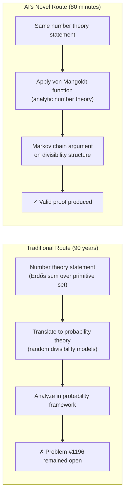
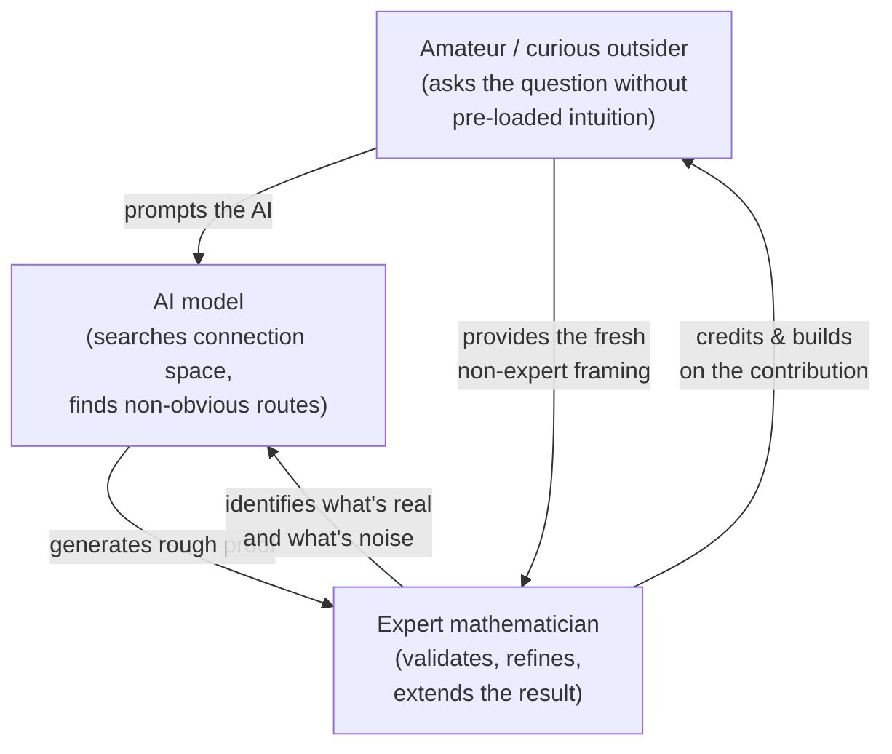

## An Idle Monday Afternoon That Changed Mathematics

Liam Price is 23 years old. He has no advanced mathematics degree and no academic affiliation. On a quiet Monday in April 2026, he did what he sometimes does for fun: he opened the Erdős Problems website — a catalogue of unsolved conjectures by the legendary Hungarian mathematician Paul Erdős — picked one at random, and typed it into GPT-5.4 Pro.

The problem was #1196. It had been open since 1968. More than half a century of professional mathematicians — including some of the best number theorists on the planet — had taken a crack at it and come up empty.

Eighty minutes later, the AI produced a proof.

Not a sketch. Not a heuristic. A complete, verifiable argument using a mathematical technique that no human expert had thought to apply in nearly 90 years of accumulated effort on this class of problems. Jared Duker Lichtman, an Oxford mathematician and one of the world's leading experts on primitive sets, called it "the first AI result at the level of Erdős's Book" — the theoretical collection of perfect proofs that Erdős imagined a divine mathematician might keep.

---

## What Is a Primitive Set?

To understand what was proved, you need a short detour into number theory — but it's more intuitive than it sounds.

A **primitive set** is a set of whole numbers greater than 1 where no member divides any other. Think of it as a "no-divisibility club": you can be in it only if none of your fellow members is a factor of you, and you're not a factor of any of them.

The set of prime numbers is one example. Since primes have no factors besides 1 and themselves, no prime divides another, so they form a valid primitive set. The set {6, 10, 15} is another — none of these divides either of the other two.

In 1935, Erdős proved something elegant: if you take any primitive set and sum up the values 1/(n log n) for each member n, you always get a finite result. There's a universal ceiling no matter which primitive set you choose, no matter how many members it has.

Then Erdős got greedy. He conjectured that among all possible primitive sets, the **set of all primes** gives the largest possible such sum — it is, in a precise sense, the "densest" primitive set you can build.

That stronger conjecture — the global maximum being attained by the primes — was finally proved in 2022 by Lichtman. It took four years of sustained effort.

But Erdős had asked something even sharper, all the way back in 1968. Problem #1196 concerns what happens at the "large number" end of the spectrum: if every element of your primitive set is bigger than some threshold x, does the sum stay bounded by 1 + O(1/log x)? In plain terms: as your set is forced to contain only very large numbers, does the Erdős sum shrink toward 1?

It's an asymptotic statement — a precise description of what happens "in the limit" — and it had resisted six decades of expert attention.

---

## Why It Was Hard: The 90-Year Mental Rut

Understanding what makes this surprising requires knowing not just *that* it was unsolved, but *why*.

Every mathematician who worked on primitive set problems since 1935 took approximately the same opening move: they translated the number-theoretic statement into a problem in **probability theory**. This is a powerful and natural technique — Erdős himself worked this way — and it led to all the significant progress up to and including Lichtman's 2022 proof.

The probabilistic framing is so natural for mathematical cognition that for 90 years, essentially no one seriously explored an alternative route. It wasn't that people tried other approaches and failed. It's that the probabilistic door was so comfortable that no one knocked on any other.

GPT-5.4 Pro didn't know which door was comfortable.

The AI built its proof using the **von Mangoldt function** — an object from analytic number theory, not probability theory. The von Mangoldt function encodes the fundamental theorem of arithmetic: the fact that every integer factors uniquely into primes. It assigns the value log p to any prime power p^k, and zero to everything else. Its key identity is that if you sum von Mangoldt weights over all divisors of n, you get exactly log n — a statement equivalent to unique prime factorization.

No one working on primitive sets had seriously tried connecting von Mangoldt to this problem. The AI — reasoning without 90 years of accumulated intuition pointing it toward probability — found that connection in 80 minutes.

---

## The Expert Reaction: Shock, Then Extension

Within hours of Price posting the GPT output to the Erdős Problems discussion forum, some of the world's top number theorists were reading it.

Lichtman — who had spent four years of his doctorate proving the 2022 result and whose Oxford page explicitly names primitive sets as a research focus — was direct about the raw proof: "The output of ChatGPT's proof was actually quite poor." But when an expert sifted through it, the core idea was correct and unprecedented.

Fields Medalist Terence Tao, one of the most decorated mathematicians alive and someone who has written extensively about using AI in his own research, weighed in within 24 hours. He called the result "a meaningful contribution to the anatomy of integers that goes well beyond the solution of this particular Erdős problem" — then did something that underscores just how significant the mathematical idea was: he took Price's AI-generated proof and extended it into the seed of a new theory, including a permutation analogue of Problem #1196.

In parallel, a formal verification campaign launched in Lean — an automated proof assistant that checks mathematical arguments at the level of symbolic logic. Every step must be machine-verified; any gap causes the proof to be rejected. The proof passed.

Erdős Problems now marks #1196 as **PROVED**, credited to "GPT-5.4 Pro, prompted by Liam Price."

---

## Not the First Time — But the Most Dramatic

This wasn't the first case of AI assisting a significant mathematical breakthrough in recent months.

In October 2025, Ernest Ryu — then a mathematics professor at UCLA — published a paper on arXiv titled "Point Convergence of Nesterov's Accelerated Gradient Method: An AI-Assisted Proof" ([arXiv:2510.23513](https://arxiv.org/abs/2510.23513)), co-authored with PhD student Uijeong Jang. Their result closed a different 40-year-old open problem: whether the famous Nesterov Accelerated Gradient method — a foundational optimization algorithm introduced in 1983 and used in essentially every modern machine learning pipeline — always converges to a single point rather than oscillating indefinitely.

Ryu had spent more than 40 hours on the problem without AI assistance. With ChatGPT, he found the key idea in roughly 12 hours across three evenings. About 80% of what the model generated was wrong. But several ideas were genuinely novel, and Ryu's expertise let him recognize and develop them.

The pattern is the same in both cases: the AI is not a mathematician. It's a pattern-completion engine with an astonishing breadth of exposure to mathematical literature. Where it excels is in surfacing non-obvious connections between areas — connections that human experts, channeled by years of training into established frameworks, are less likely to reach for.

---

## A New Research Paradigm: The Triangle

What emerged from the Erdős #1196 episode is a picture of a new kind of collaborative research process — one that doesn't fit neatly into either "AI replaces mathematicians" or "AI is just a calculator."

Liam Price provided the openness to try: he entered a 60-year-old problem "as I do sometimes, giving them to the AI and seeing what it can come up with." The AI provided the search across mathematical space without institutional priors. Kevin Barreto recognized the importance and posted it to the forum. Lichtman and Tao provided the rigor, the verification, and the extension.

No single actor in that chain would have produced the result alone. An amateur without AI wouldn't have found the proof. AI without an expert would have produced unverifiable noise. An expert with only traditional tools might have spent years finding the same idea, or never.

"Vibe maths" — Price's own description of his iterative, intuition-driven prompting style — is a joke, but it points at something real: the ability to explore mathematical terrain without knowing which doors are "supposed" to be tried first is not a weakness. It's the AI's distinctive value.

---

## What This Means Going Forward

Terence Tao has been explicit about the shift. Writing in March 2026, he said that AI models are now "ready for primetime" in mathematics and theoretical physics because they "save more time than they waste." He emphasized that reliable verification — using tools like Lean — is essential precisely *because* AI increases the volume of proposed proofs faster than human review can handle.

The Erdős #1196 case suggests several things worth watching:

**Democratization of research.** The price of a GPT-5.4 Pro subscription is roughly $20–200 per month. The price of four years of doctoral training in number theory is… significantly more. We may be entering a period where novel mathematical ideas can come from structurally unexpected places.

**Different failure modes.** The AI's proof was reportedly "quite poor" in raw form. Experts remain essential — not as generators, but as quality filters and extension mechanisms. The danger is that without expert review, valid-sounding but incorrect proofs proliferate. Lean-based formal verification becomes more important, not less.

**Non-obvious connections.** The most striking part of the Erdős #1196 proof is that the correct route (von Mangoldt) was not unknown to mathematicians — it simply wasn't tried on this problem. AI may be particularly good at suggesting cross-domain connections that human pattern-formation makes unlikely. That's a different kind of contribution from "solving problems directly," and possibly a more durable one.

**The credit question.** The Erdős Problems site credits GPT-5.4 Pro. That's both honest and strange — a software model receiving formal credit for a mathematical result is unprecedented. What happens when AI contributions become routine? The attribution norms of mathematics haven't caught up.

---

What happened on April 13, 2026 was not a machine transcending human intelligence. It was something more interesting: a combination of curiosity, fresh framing, computational breadth, expert taste, and formal verification tools producing a result that none of them could have produced alone. Mathematics has always been a collaborative enterprise — it just added a new kind of collaborator.

---

## Sources

- [Amateur armed with ChatGPT 'vibe maths' a 60-year-old problem — Scientific American](https://www.scientificamerican.com/article/amateur-armed-with-chatgpt-vibe-maths-a-60-year-old-problem/)
- [23-Year-Old Amateur Solves 60-Year-Old Math Problem with ChatGPT, Terence Tao Says Previous Researchers Went Astray from the Start — 36Kr](https://eu.36kr.com/en/p/3784815604817154)
- [GPT-5.4 Pro solves Erdős problem using a method mathematicians overlooked for 90 years — Abit.ee](https://abit.ee/en/artificial-intelligence/gpt-54-erdos-mathematics-ai-terence-tao-proof-number-theory-en)
- [GPT-5.4 Pro Solves Long-Standing Erdős Problem #1196 in 80 Minutes — Fenado AI](https://fenado.ai/articles/gpt-54-pro-solves-long-standing-erdos-problem-1196-in-80-minutes)
- [The proof that forced mathematics to take AI seriously — Webiano Digital](https://webiano.digital/the-proof-that-forced-mathematics-to-take-ai-seriously/)
- [Erdős Problem #1196 — Discussion thread (erdosproblems.com)](https://www.erdosproblems.com/forum/thread/1196)
- [AI Solved A Mathematical Problem That Had Stumped The World's Best Minds For Decades — Yahoo News](https://www.yahoo.com/news/articles/ai-solved-mathematical-problem-had-101519748.html)
- [Point Convergence of Nesterov's Accelerated Gradient Method: An AI-Assisted Proof — arXiv:2510.23513](https://arxiv.org/abs/2510.23513)
- [How GPT-5 helped mathematician Ernest Ryu solve a 40-year-old open problem — OpenAI](https://openai.com/index/gpt-5-mathematical-discovery/)
- [Terence Tao: AI is ready for primetime in math and theoretical physics — OpenAI Academy](https://academy.openai.com/public/blogs/terence-tao-ai-is-ready-for-primetime-in-math-and-theoretical-physics-2026-03-06)
- [AI uncovers solutions to Erdős problems, moving closer to transforming math — Scientific American](https://www.scientificamerican.com/article/ai-uncovers-solutions-to-erdos-problems-moving-closer-to-transforming-math/)
- [Thomas Bloom on Erdős Problem #1196 — X (Twitter)](https://x.com/thomasfbloom/status/2044319103310021078)
