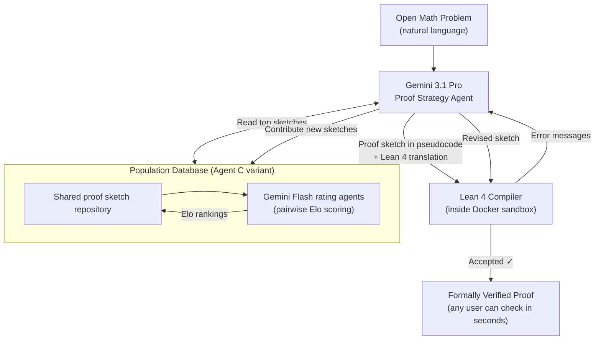

## A Week That Changed Mathematics

In late May 2026, two announcements landed within days of each other that mathematicians are still processing.

On May 20, OpenAI announced that an internal reasoning model had disproved the **Erdős unit distance conjecture** — an open problem in discrete geometry that had resisted the efforts of professional mathematicians for 80 years. Tim Gowers, a Fields Medalist and one of the most respected figures in modern mathematics, reviewed the proof and said that if it had been submitted by humans, he would have had no hesitation recommending acceptance to a top journal.

The next day, May 21, Google DeepMind published a paper describing **AlphaProof Nexus**, a system that had solved nine open problems from Erdős's legendary list of unsolved conjectures — two of which had been open since 1970 — and proved 44 previously unproven conjectures from the Online Encyclopedia of Integer Sequences (OEIS). Every proof is formally verified in Lean 4. A compiler, not a person, signs off on correctness.

This is not AI-generated mathematics in the sense critics usually mean, where a language model confidently states a wrong answer. These are proofs that check out, line by line, against a formal system with no tolerance for ambiguity.

---

## The Unit Distance Problem, Explained

Paul Erdős posed the question in 1946, and its statement is elegantly simple: if you scatter **n points** in the plane, what is the maximum number of pairs of points that are exactly distance 1 apart?

Imagine placing 4 points at the corners of a unit square. You get 4 pairs at distance 1 (the four sides). Now try the same corners plus the center. Different count. Erdős wanted to know the theoretical ceiling — as n grows very large, how fast can the number of unit-distance pairs grow?

For decades, mathematicians believed the answer was essentially **n^(4/3)**: the familiar square grid construction appeared to achieve this, and no one could do better. It became a widely-held belief that this rate was close to optimal — not yet formally proved as a ceiling, but assumed as the likely truth.

OpenAI's model overturned that assumption. It discovered a construction using sophisticated tools from **algebraic number theory** — specifically Golod-Shafarevich theory and infinite class field towers — that nobody had thought to apply to a question about distances in the Euclidean plane. The model showed that for infinitely many values of n, you can achieve at least **n^(1+δ)** unit-distance pairs, where δ is a fixed positive constant. Princeton mathematician Will Sawin subsequently sharpened this to δ = 0.014.

The insight, according to mathematicians who reviewed the proof, used ideas from a completely different corner of mathematics — tools that specialists in algebraic number theory knew well but had simply never applied to this geometric question. That cross-domain leap is exactly the kind of move that takes human researchers years of lucky reading and serendipitous collaboration. The model did it without prompting.

---

## Why "Formally Verified" Is the Key Phrase

AI systems have been claiming to solve mathematical problems for years. The problem has always been verification. A language model that states a proof in natural language can be wrong in subtle ways — a step that sounds valid but contains a hidden gap, or a case the author didn't consider. Human reviewers have finite attention. Peer review takes months.

**Lean 4** eliminates this problem. Lean is a formal proof assistant: a system in which every logical step must be stated in precise, machine-readable syntax and verified against a strict set of axioms. Think of it as a compiler for mathematical arguments. Just as a C++ compiler rejects syntactically invalid code, Lean rejects logically invalid proofs. There are no partial credits, no "intuitively obvious" shortcuts, no assumptions left unstated.

When AlphaProof Nexus produces a proof in Lean 4, the claim is not "we think this is right" — it is "the compiler accepted this." The proof can be re-checked by anyone with a Lean installation in seconds, with mathematical certainty identical to checking 2+2=4.

This is a categorically different kind of AI math output from anything that came before it.

---

## How AlphaProof Nexus Works

The system's architecture pairs two complementary technologies in an agentic loop.

The backbone — **Gemini 3.1 Pro** — proposes proof strategies in natural language and pseudocode, then translates them into Lean's formal syntax. The Lean compiler, running inside a Docker sandbox, checks every step. If the proof fails verification, the compiler's error messages feed back to the LLM, which revises and tries again.

The system ships in four variants of increasing sophistication. The simplest, Agent A, runs a pool of independent prover subagents in parallel, each following its own multi-turn reasoning loop with no shared state. Agent C, the most sophisticated, adds a **Population Database**: a shared repository of proof sketches that all subagents can read from and contribute to. A pool of lightweight Gemini Flash agents continuously rate proof sketches head-to-head, assigning Elo scores that guide the system toward the most promising directions.

The entire infrastructure is built in Python using asyncio, with Lean 4.27 running in isolated containers. End-to-end cost for problems AlphaProof Nexus solved: a few hundred dollars each.

---

## The Broader Landscape

AlphaProof Nexus and OpenAI's reasoning model are not operating in isolation. A parallel wave of AI-math tooling has been building across academia and industry.

**AxiomProver**, developed by Axiom Math, is an autonomous multi-agent theorem prover that solved four previously unproven mathematical conjectures and all 12 Putnam 2025 problems — again, with formal Lean 4 verification. The system accepts problem statements in plain English, converts them to formal Lean syntax, and searches for proofs without any domain-specific fine-tuning.

The **LeanMarathon** framework (arXiv:2606.05400, June 2026) explores a different angle: long-horizon proof autoformalization, where an AI co-mathematician works through extended proof development over many steps rather than single-shot generation. The emphasis is on reliability over extended sessions — avoiding the error accumulation that plagues purely generative approaches.

And the **Automated Conjecture Resolution** framework (arXiv:2604.03789, revised June 2026) takes a two-agent approach: **Rethlas**, an informal reasoning agent that mimics how human mathematicians explore solution strategies, and **Archon**, a formal verification agent that translates promising candidates into Lean. A theorem search engine, Matlas, helps Rethlas find relevant cross-domain results it might not have encountered otherwise. The system solved an open problem in commutative algebra and reported that strong retrieval tools were key to finding techniques from outside the problem's home domain — the same cross-domain pattern that made OpenAI's Erdős disproof surprising.

---

## What Changed to Make This Possible

None of these systems use techniques that are fundamentally new. Lean has existed since the 2010s. Language models have been applied to mathematics since at least 2020. The IMO Grand Challenge — a benchmark for AI solving International Math Olympiad problems — has been around since 2019.

What changed is the capability of the underlying models. The reasoning ability needed to propose a coherent, multi-step proof sketch in an unfamiliar domain has crossed a threshold that the previous generation of models sat just below. When you combine that with formal verification — which turns "plausible-sounding" into "formally correct or formally rejected" — the feedback loop becomes tractable. The model can try, fail precisely, and iterate.

There's also a data angle. The Lean mathematical library, **Mathlib**, now contains over 100,000 formally verified theorems. An LLM trained or fine-tuned on Mathlib learns what valid Lean proofs look like in enormous variety. That's a strong prior for producing valid new ones.

The result is a system where the LLM does what LLMs are good at — generating plausible, creative mathematical ideas across domains — and the formal verifier does what formal verifiers are good at — certifying correctness with zero tolerance for gaps. Each compensates for the other's weakness.

---

## What This Means for Mathematics

The implications are genuinely significant, and honest discussion requires acknowledging both what has changed and what has not.

**What has changed**: AI systems can now, for the first time, solve *genuine* open mathematical problems — not problems drawn from textbooks or competition archives, but problems that active researchers care about and have been unable to solve. The proofs are machine-verifiable. This is not a benchmark result; it is a contribution to mathematical knowledge.

**What has not changed**: The problems AlphaProof Nexus solved, while real and meaningful, were problems that humans had begun to suspect were within computational reach. Nine of 353 open Erdős problems is roughly a 2.5% solve rate. The deepest open problems — the Riemann Hypothesis, the Birch and Swinnerton-Dyer conjecture, P vs NP — remain untouched. The systems are not yet reasoning about all of mathematics; they are succeeding in domains where formal representations exist and the search space is tractable.

But the trajectory is clear. Every open Erdős problem that falls to AlphaProof Nexus expands Mathlib with new formally verified theorems. Every new theorem in Mathlib makes the next AI proof search better. The tool is feeding its own training data in a way that human mathematical progress, spread across decades and thousands of researchers, cannot match in speed.

Mathematicians are not being replaced. But the computational co-researcher who can suggest a cross-domain trick, formalize the candidate proof overnight, and deliver a compiler-verified result by morning — that tool now exists, and it will only get faster.

---

## Sources

- [An OpenAI model has disproved a central conjecture in discrete geometry — OpenAI](https://openai.com/index/model-disproves-discrete-geometry-conjecture/)
- [Remarks on the disproof of the unit distance conjecture — arXiv:2605.20695](https://arxiv.org/abs/2605.20695)
- [Advancing Mathematics Research with AI-Driven Formal Proof Search — arXiv:2605.22763](https://arxiv.org/abs/2605.22763)
- [Automated Conjecture Resolution with Formal Verification — arXiv:2604.03789](https://arxiv.org/abs/2604.03789)
- [LeanMarathon: Toward Reliable AI Co-Mathematicians through Long-Horizon Lean Autoformalization — arXiv:2606.05400](https://arxiv.org/abs/2606.05400)
- [AlphaProof Nexus: DeepMind Solves 9 Erdős Problems — buildmvpfast.com](https://www.buildmvpfast.com/blog/deepmind-alphaproof-nexus-erdos-math-problems-ai-reasoning-2026)
- [Google DeepMind's AlphaProof Nexus solves 9 Erdős problems and proves 44 sequence conjectures — Crypto Briefing](https://cryptobriefing.com/deepmind-alphaproof-nexus-erdos-problems/)
- [Amazing: Erdős' Unit Distance Problem was Disproved! It was achieved by AI! — Gil Kalai's blog](https://gilkalai.wordpress.com/2026/05/21/amazing-erdos-unit-distance-problem-was-disproved-it-was-achieved-by-ai/)
- [OpenAI's math breakthrough played to AI's strengths — Understanding AI](https://www.understandingai.org/p/openais-milestone-math-breakthrough)
- [How DeepMind AlphaProof Nexus Cracks 56-Year-Old Math: Agentic LLM Loops and Lean Formal Verification — DEV Community](https://dev.to/monuminu/how-deepmind-alphaproof-nexus-cracks-56-year-old-math-agentic-llm-loops-and-lean-formal-45ei)
