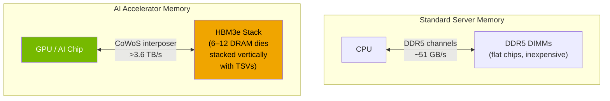
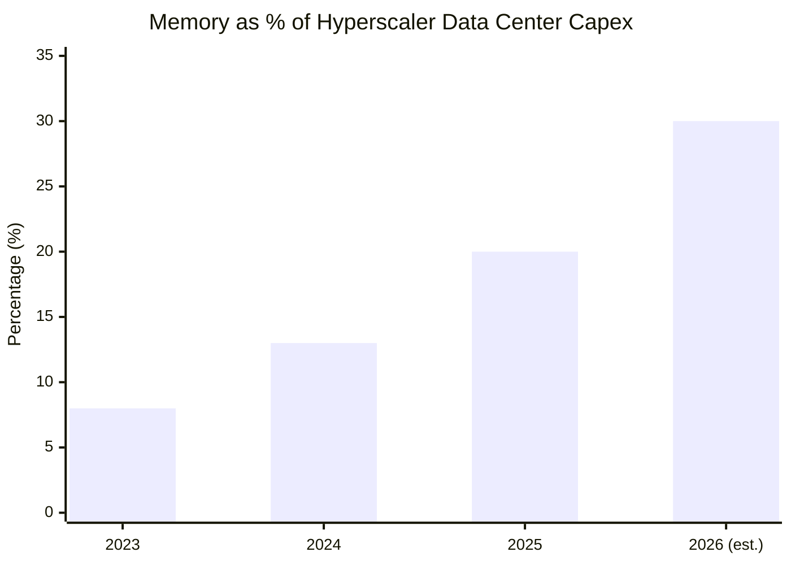
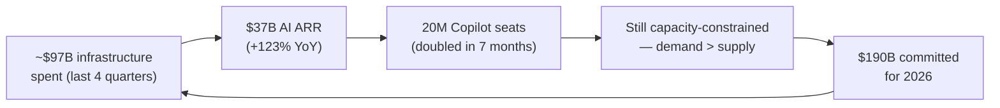

## The Number That Stopped Analysts Cold

On April 29, 2026, Microsoft reported quarterly earnings and quietly dropped a figure that no analyst had expected: the company planned to spend **$190 billion on capital expenditures** for calendar year 2026.

The consensus forecast was $152 billion. Microsoft came in 23% above it.

To put the scale in perspective: $190 billion is roughly the GDP of Greece, or slightly more than the entire annual revenue of JPMorgan Chase. And Microsoft is not alone. When the Q1 2026 earnings season wrapped up, the combined capex commitments of just four companies — Microsoft, Google, Amazon, and Meta — had reached **$725 billion for 2026**. That's up 77% from 2025's record $410 billion, and analysts are already projecting that the industry could cross **$1 trillion in 2027**.

Something has changed. This post explains what.

---

## What Is All That Money Actually Buying?

The obvious answer is GPUs. Training and serving large language models requires massive parallel compute, and Nvidia's newer GB200 and GB300 Blackwell-generation chips dominate the supply chain. But GPU procurement only tells part of the story.

Microsoft's CFO Amy Hood was unusually specific on the earnings call: **$25 billion of the company's 2026 capex increase is attributable to rising prices for memory chips and other hardware components** — including DRAM, NAND flash, wafers, and substrates.

Memory. Not just GPUs.

And that is where things get interesting.

---

## The Memory Wall: Why AI Is Breaking the Chip Market

To understand what is happening, it helps to understand the difference between two kinds of computer memory.

**Standard DRAM** (like the DDR5 sticks in a desktop PC) is cheap, abundant, and ships by the truckload. It stores data the CPU needs for ordinary computation.

**High-Bandwidth Memory (HBM)** is a completely different product. Instead of flat chips connected by wires on a motherboard, HBM stacks DRAM dies vertically — six to twelve layers high — and connects them through thousands of tiny through-silicon vias (TSVs). The result is a memory package that can transfer data to a GPU at **terabytes per second**, roughly 10–30× faster than DDR5 at equivalent power. It is then mounted directly alongside the GPU on a shared silicon interposer using a technique called chip-on-wafer-on-substrate (CoWoS).

Every AI accelerator that matters — Nvidia's H100, the GB200, Google's TPU v5, AMD's MI300X — uses HBM. A single H100 GPU carries 80 GB of HBM3. A GB200 NVL72 rack, the unit Microsoft is now deploying at scale, contains 13.5 TB of HBM3e spread across 72 GPUs.

The catch: HBM is enormously expensive to manufacture. Each HBM stack requires **three times the wafer capacity** of an equivalent DDR5 chip, because the dies are thinner and the stacking process is complex. Samsung, SK Hynix, and Micron — the three companies controlling more than 95% of global DRAM production — can only produce so much HBM per year. Their wafer capacity is finite: making more HBM means making less DDR5.

In 2026, **HBM production will consume 23% of total DRAM wafer output**, up from 19% in 2025. Data centers will absorb **70% of all high-end memory chips** produced this year. The inevitable result is a supply crunch that touches everything.

---

## The Numbers Behind the Squeeze

The DRAM price shock of 2026 is unlike anything the industry has seen since the 2016–2018 memory supercycle. TrendForce reported DRAM contract prices rising roughly **95% quarter-over-quarter in Q1 2026**, with HBM3e originally commanding a premium four to five times the price of server DDR5.

Memory has gone from roughly 8% of a typical hyperscaler data center build-out cost to **30% in 2026** — roughly a fourfold increase in its cost share in just three years.

Despite the record investment, Microsoft still expects to remain **capacity-constrained on GPUs, CPUs, and storage** through at least the end of 2026. Demand is outrunning even a massively expanded supply chain.

---

## What $190 Billion Is Building: The Fairwater Blueprint

The abstract numbers become concrete at a site in Mount Pleasant, Wisconsin, where Microsoft has been constructing what it now calls the world's most powerful AI data center: **Fairwater**.

The facility spans 315 acres and 1.2 million square feet. Its defining feature is a single, contiguous cluster of hundreds of thousands of **Nvidia GB200 and GB300 GPUs**, connected by enough fiber optic cable to wrap the planet four times over. Microsoft claims the cluster delivers ten times the performance of the fastest supercomputer that existed before it — and it came online ahead of schedule in April 2026.

The company has committed a total of **$7.3 billion to Wisconsin** — initially $3.3 billion for the first facility, then an additional $4 billion for a second campus of similar scale. Power comes partly from a new 250 MW solar project Microsoft is funding in Portage County. Cooling for hundreds of thousands of high-power AI chips uses a closed-loop liquid system that consumes roughly the same amount of water as a single restaurant per year — a significant engineering feat at this density.

Fairwater is not a single building. It is the physical shape of what frontier AI infrastructure looks like in 2026: a purpose-built compute fabric larger than a small university campus, wired directly to the grid, built specifically to train and serve the next generation of AI models.

---

## Is the Spending Justified? The Revenue Argument

The obvious question: does spending $190 billion actually generate enough return to make sense?

Microsoft's answer, based on Q3 2026 results, is yes — and accelerating.

- **Azure grew 40% year-over-year**, with AI services accounting for roughly one-third of that growth.
- The AI business crossed **$37 billion in annual revenue run rate**, up 123% from the same period the prior year.
- **Microsoft 365 Copilot** surpassed 20 million paid enterprise seats — more than doubling in seven months. Weekly engagement per user now matches Outlook. Accenture alone signed a **740,000-seat deal**, the largest in history.

The rough math: Microsoft has spent about $97 billion over the last four quarters to secure $37 billion of annualized AI revenue. That is not a one-year payback — but infrastructure investments rarely are.

The analogy most analysts reach for is the early 2000s fiber optic buildout: it looked massively overbuilt at the time, and hundreds of companies went bankrupt laying cable nobody would use for a decade. But the capacity became the foundation for every streaming service, cloud provider, and mobile network that followed. The question is whether AI is closer to that build-to-last dynamic, or to the more speculative side of that same era.

The bull case: AI cloud revenue is still in its steepest growth phase, and any company that trails on infrastructure now will find itself unable to serve demand 18–24 months later. The bear case: adoption could plateau, leaving hyperscalers with stranded assets and balance sheets under stress. So far, the revenue trajectory at Microsoft, Google, and Amazon supports the bull case.

---

## Second-Order Effects: Who Else This Touches

The infrastructure supercycle has ripple effects that extend well beyond quarterly earnings calls.

**For developers and startups**, HBM scarcity means GPU capacity is tighter than headline figures suggest. Frontier inference costs remain higher than they would be in a relaxed supply environment, because the hardware needed to run the most capable models is the same hardware in shortest supply.

**For enterprises**, the Copilot milestone demonstrates that large-scale AI deployment works — but the cost structures are real. A 20M-seat Copilot rollout at $30 per user per month generates roughly $600 million in monthly recurring revenue from that product line alone, which helps explain both why Microsoft is spending and why other software companies are racing to build similar AI layers into their own products.

**For the chip industry**, the memory supercycle is creating a structural reorientation. Samsung, SK Hynix, and Micron are all investing heavily in HBM3e and the upcoming HBM4 generation, and the boom in advanced packaging is pulling in TSMC, ASE, and Amkor as critical suppliers. Supply constraints are expected to ease only gradually, beginning in late 2027 as new capacity comes online.

**For AI access and competition**, the concentration of frontier compute in a handful of hyperscalers raises real questions about whether well-resourced alternatives — open-weight models, national compute programs, regional clouds — can remain competitive when a single company's annual memory bill for AI alone is $25 billion.

---

## The Takeaway

The $725 billion that Big Tech is collectively committing to AI infrastructure in 2026 is not irrational exuberance. It is a bet on a specific thesis: that AI services are becoming as essential to enterprise workflows as email, cloud storage, and relational databases — and that the window for owning the infrastructure layer before the market matures is narrow.

Whether that thesis is correct will take years to verify. But what is already visible is that AI has broken the memory market, rewired chip industry economics, and turned data center construction into the defining capital allocation decision of the decade.

A single memory type — HBM — that barely existed in volume five years ago now dictates the build plans of the largest companies on earth. The servers being built inside facilities like Fairwater today are the compute bedrock every AI application will run on for the next ten years.

That is what $190 billion looks like when it is pointed at one idea.

---

## Sources

- [Microsoft calls for $190 billion in 2026 capital spending on soaring memory prices — CNBC](https://www.cnbc.com/2026/04/29/microsoft-msft-q3-earnings-report-2026.html)
- [Skyrocketing component prices push Big Tech capex to record $725 billion — Tom's Hardware](https://www.tomshardware.com/tech-industry/big-tech/microsoft-attributed-25-billion-of-its-record-ai-budget-to-memory-chip-costs)
- [Microsoft lifts 2026 CapEx by $25B to cover price rises — The Register](https://www.theregister.com/2026/04/30/microsoft_q3_2026/)
- [AI boom: Big Tech capital expenditures now seen topping $1 trillion in 2027 — CNBC](https://www.cnbc.com/2026/04/30/ai-boom-big-tech-capital-expenditures-now-seen-topping-1-trillion-in-2027-.html)
- [Microsoft AI revenue surpasses $37B annual run rate, Azure +40% — Microsoft on X](https://x.com/Microsoft/status/2049580903995994498)
- [Microsoft Fairwater AI Datacenter Goes Live Early, Unleashing Hundreds of Thousands of NVIDIA Blackwell GPUs — WCCFTech](https://wccftech.com/microsoft-fairwater-ai-datacenter-live-early-100s-1000s-of-nvidia-blackwell-gpus/amp/)
- [Microsoft increases Wisconsin data center investment to $7.3bn — Data Center Dynamics](https://www.datacenterdynamics.com/en/news/microsoft-increases-wisconsin-data-center-investment-to-73bn-says-fairwater-site-will-be-worlds-most-powerful-data-center/)
- [Memory Chip Shortage 2026: HBM Takes 23% of DRAM Wafers — Tech Insider](https://tech-insider.org/memory-chip-shortage-2026-ai-consumer-electronics/)
- [HBM is eating your RAM — Tom's Hardware](https://www.tomshardware.com/pc-components/ram/hbm-is-eating-your-ram)
- [Microsoft Copilot Reaches 20 Million Paid Seats as Enterprise Adoption Expands — Analytics Insight](https://www.analyticsinsight.net/news/microsoft-copilot-reaches-20-million-paid-seats-as-enterprise-adoption-expands)
