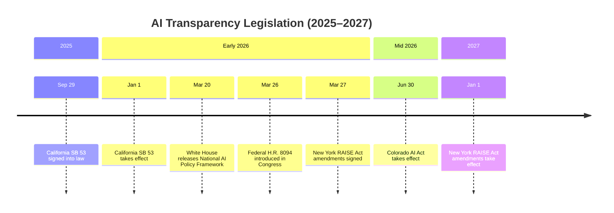
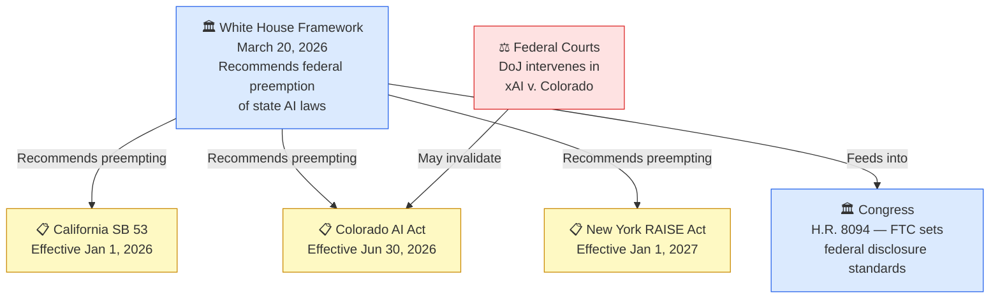

## The Black Box Problem

For years, the most powerful AI systems on the planet operated in near-complete secrecy. Companies released benchmarks and product announcements but rarely revealed the underlying details: what data trained their models, how safety testing was conducted, which risks were discovered — and which were not. Users, regulators, and industries affected by automated decisions were left guessing.

That era is ending.

In the first weeks of 2026, a wave of legislation — state and federal — landed with unusual speed. California's AI transparency law went into effect on January 1. New York's governor signed a similar measure on March 27. A bipartisan bill landed in Congress on March 26. And five days before that, the White House released a legislative framework asking Congress to preempt all of them with a single national standard. All of this within the span of about ten days.

To understand why it matters — and what it means for the companies building and deploying AI — it helps to understand just how bad the transparency problem has actually gotten.

---

## How Opaque Has AI Become?

Researchers at Stanford's Center for Research on Foundation Models have tracked AI transparency since 2023 with an annual index that scores major developers across 100 indicators covering training data, design decisions, safety evaluations, capabilities, and environmental impact.

Their December 2025 report found something striking: **the mean transparency score across the industry fell 17 points year-over-year**, to just 41 out of 100. Companies that used to be relatively open became significantly more closed. Meta's score dropped 29 points. OpenAI's dropped 14. Mistral's dropped 37.

On environmental impact, the picture is bleaker: **10 major AI companies disclose none of the relevant information** about energy usage, carbon emissions, or water consumption.

The outlier is IBM's Granite family, which topped the index with a score of 95 — 10 points higher than any previous leader. But IBM is an exception that highlights the rule. Most of the industry can't answer basic questions about its own models.

This widening opacity is what lawmakers say drove the legislative push.

---

## Four Laws, One Problem

### California: SB 53 (The Transparency in Frontier AI Act)

California was first. Governor Newsom signed SB 53 on September 29, 2025; it took effect January 1, 2026. The law imposes three major obligations on companies building frontier models:

1. **Frontier AI Framework** — publish a detailed document before launching any new model, describing the technical and organizational measures in place to manage catastrophic risks. Review and update annually.
2. **Transparency Report** — publish at launch for each new or materially modified frontier model, disclosing training data sources, intended uses, supported languages, and risk assessments for serious harms.
3. **Critical Safety Incident Reporting** — notify California's Office of Emergency Services within 15 days of discovering a safety incident. If there is imminent risk of death or serious physical injury, notify law enforcement within 24 hours.

SB 53 defines a "frontier model" as one trained using more than 10²⁶ floating-point operations. "Large frontier developers" must have annual revenues over $500 million. In practice, this targets roughly five to eight companies: OpenAI, Anthropic, Google DeepMind, Meta, and Microsoft. Penalties reach $1 million per violation.

Uniquely, SB 53 includes **whistleblower protections** for employees who report safety concerns to regulators — a first in AI-specific legislation.

### Colorado: The Consumer-Facing Approach

Colorado's SB 24-205 takes a different angle. Rather than targeting the companies building frontier models, it targets **any organization deploying a high-risk AI system** in consumer decisions — employment, housing, credit, insurance, education, or healthcare — affecting Colorado residents.

If an organization uses such a system, it must:
- Establish a risk management policy aligned with NIST's AI Risk Management Framework
- Conduct bias testing and document discrimination risks before and during deployment
- Disclose to consumers that they are interacting with an AI system
- Notify the Colorado Attorney General within 90 days of discovering potential algorithmic discrimination

Originally set for February 2026, the law was delayed to **June 30, 2026** after significant industry opposition. In April 2026, the Department of Justice intervened in a lawsuit filed by xAI challenging the law — an early signal of the federal government's interest in shaping (or blocking) state-level AI regulation.

### New York: The RAISE Act

A week after the federal bill arrived in Congress, New York Governor Hochul signed amendments to the Responsible AI Safety and Education (RAISE) Act, effective January 1, 2027. Like California, it targets large frontier developers above the 10²⁶ FLOPs threshold with $500M+ in annual revenue.

New York adds a few provisions not present in California: a new oversight office within the Department of Financial Services will assess large frontier developers annually; **incident reporting windows are shorter** (72 hours vs. 15 days); and civil penalties for repeat violations reach **$3 million**.

### The Federal Play: H.R. 8094

The federal AI Foundation Model Transparency Act, introduced March 26, 2026 by Reps. Don Beyer (D-VA), Mike Lawler (R-NY), and Sara Jacobs (D-CA), takes a structurally different approach. Rather than writing disclosure rules directly into statute, it directs the **Federal Trade Commission** — in consultation with NIST, the Department of Commerce, and the White House Office of Science and Technology Policy — to set those standards.

The bill applies to models that exceed any one of three thresholds:
- More than **10 million monthly active users**
- More than **10 million downloads**
- Trained using more than **10²⁶ computing operations**

Covered developers would need to disclose:
- A detailed summary of training data: sources, collection methods, size, and data governance
- What the model is designed to do, and its known limitations
- Results of internal and third-party performance evaluations
- Specific safeguards applied in high-risk areas: healthcare, national security, and financial decisions
- Whether user data is collected during inference

Crucially, the bill relies on the FTC's existing enforcement authority rather than creating new penalties. That makes it lighter-touch than the state laws — and potentially more palatable to an industry nervous about litigation — while still establishing a national disclosure floor.

---

## The Central Tension: Federal Preemption

Here is where things get complicated.

Five days before the federal FMTA landed in Congress, the White House released its **National Policy Framework for Artificial Intelligence** — a set of legislative recommendations covering seven policy areas. Among them: a call for Congress to preempt state AI laws that "impose undue burdens," replacing them with a single minimally burdensome national standard.

The argument is straightforward: a patchwork of fifty different state AI regulations creates compliance nightmares for domestic AI companies and hands competitive advantage to foreign labs, particularly China's, which face no equivalent constraints. A uniform federal floor, the White House argues, protects both innovation and consumers.

States see it differently. California and New York passed their laws precisely because the federal government wasn't moving fast enough. The companies most likely to be affected by frontier model laws are headquartered in states with the most political will to regulate them. Yielding to federal preemption means giving up that first-mover leverage.

The Colorado litigation is the proxy battle. If federal courts invalidate the Colorado law — either on constitutional grounds or via preemption arguments — it reshapes the entire landscape. If the law survives, other states are likely to follow.

---

## What This Means in Practice

If you are building or deploying AI at scale, the emerging compliance landscape requires new operational habits.

**For frontier model developers**, the questions are now concrete:
- Can you reconstruct the full lineage of your training data — sources, licensing, filtering, PII scrubbing?
- Is there a documented process for pre-release red-teaming and risk assessment?
- Does your legal team know how to file a safety incident report in 72 hours?
- Do your model cards specifically address healthcare and financial use cases?

**For AI deployers** in consumer-facing decisions, Colorado's model matters even without building frontier systems. The moment an algorithm materially influences a hiring decision or a loan application, disclosure and bias testing obligations apply.

**For open-source contributors**, the picture is murkier. Most of these laws focus on large commercial developers, and open-weight releases from community contributors likely fall outside current scope. But regulators have started asking what happens when open weights are fine-tuned for high-risk use cases that the original developers never intended.

The Stanford Transparency Index suggests the industry isn't ready. An average score of 41 means most developers cannot answer basic questions about their own models. IBM, AI21 Labs, and Writer have demonstrated that high transparency is achievable — it requires investment in data documentation, evaluation rigor, and internal disclosure processes, not just legal compliance.

---

The next 12 months will determine whether this patchwork of state laws consolidates into a coherent federal standard, fragments further, or gets cleared away by preemption. What is already clear is the direction of travel: AI companies that once operated as black boxes are being asked, for the first time at scale, to show their work.

---

## Sources

- [H.R.8094 — AI Foundation Model Transparency Act of 2026 (Congress.gov)](https://www.congress.gov/bill/119th-congress/house-bill/8094)
- [H.R. 8094 Bill Text (GovInfo)](https://www.govinfo.gov/app/details/BILLS-119hr8094ih)
- [President Trump Unveils National AI Legislative Framework (White House)](https://www.whitehouse.gov/releases/2026/03/president-donald-j-trump-unveils-national-ai-legislative-framework/)
- [National Policy Framework for Artificial Intelligence PDF (White House)](https://www.whitehouse.gov/wp-content/uploads/2026/03/03.20.26-National-Policy-Framework-for-Artificial-Intelligence-Legislative-Recommendations.pdf)
- [NY Overhauls Frontier AI Transparency Law — April 2026 (Davis Wright Tremaine)](https://www.dwt.com/blogs/artificial-intelligence-law-advisor/2026/04/ny-overhauls-frontier-ai-transparency-law)
- [New York Finalizes RAISE Act for Frontier AI Models (Wiley Law)](https://www.wiley.law/alert-New-York-Finalizes-RAISE-Act-for-Frontier-AI-Models-Law-Takes-Effect-January-1-2027)
- [Colorado AI Act Status 2026 — June 30 Compliance Deadline (AI Laws by State)](https://www.ailawsbystate.com/blog/colorado-ai-act-compliance-guide-2026)
- [Federal Government Intervenes in Case Seeking to Invalidate Colorado AI Law](https://www.governmentcontractorcomplianceupdate.com/2026/04/28/federal-government-intervenes-in-case-seeking-to-invalidate-colorado-ai-law/)
- [Governor Newsom Signs SB 53 (California Governor's Office)](https://www.gov.ca.gov/2025/09/29/governor-newsom-signs-sb-53-advancing-californias-world-leading-artificial-intelligence-industry/)
- [The 2025 Foundation Model Transparency Index (Stanford CRFM / arXiv)](https://arxiv.org/abs/2512.10169)
- [Transparency in AI is on the Decline (Stanford HAI)](https://hai.stanford.edu/news/transparency-in-ai-is-on-the-decline)
- [2026 Transparency Report on Foundation Model Impacts (Partnership on AI)](https://partnershiponai.org/resource/2026-transparency-report-on-foundation-model-impacts/)
- [AI Quarterly April 2026 — AI Law, Policy & Practice (Alston & Bird)](https://www.alston.com/en/insights/publications/2026/04/ai-quarterly-april-2026/)
