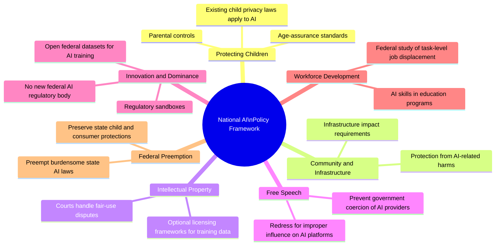
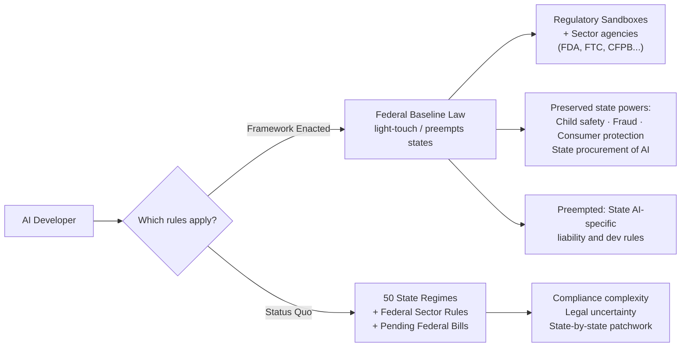

## A Four-Page Document with Billion-Dollar Consequences

On March 20, 2026, the Trump White House released its **National Policy Framework for Artificial Intelligence** — a set of legislative recommendations telling Congress how to handle the fastest-moving technology sector on Earth. The document is just four pages long. Its implications could shape American AI regulation for a decade.

The framework doesn't create new law. Think of it as the administration's instruction manual to Congress: here are the seven areas where federal legislation matters, here is what that legislation should and shouldn't do, and here is how to handle the messy question of state-level AI rules that have been proliferating in the absence of federal action.

What's in those four pages? A strong preference for innovation over precaution, a bet that courts (not Congress) should sort out AI copyright disputes, a commitment to protecting children online, and — most controversially — a push to strip states of the power to regulate AI development.

---

## Seven Pillars, One Philosophy

The framework organizes its recommendations across seven policy areas. Individually, each makes intuitive sense. Collectively, they reveal a consistent philosophy: keep federal oversight targeted and narrow, defer to markets and existing institutions wherever possible, and let American AI companies move fast.

The framework is explicit about what it **does not want**: a new centralized federal AI regulatory agency. Instead, it asks Congress to rely on existing sector-specific regulators — the FDA for medical AI, the CFPB for financial AI, the FTC for consumer-facing AI — and to let industry-led standards fill in the gaps.

That's a deliberate choice with real consequences. There will be no AI equivalent of the SEC or the FCC with a cross-industry mandate. The regulatory structure stays fragmented by domain. Whether that's appropriately targeted or dangerously patchwork depends on who you ask.

---

## The Central Battle: State Preemption

If the framework has a spine, it's the preemption question — and it's the piece that will determine how much of this blueprint actually becomes law.

As of early 2026, the United States has no comprehensive federal AI law, but it does have a growing stack of state-level AI regulations. California, Colorado, Utah, and Texas have all enacted or proposed legislation touching algorithmic discrimination, automated decision-making, transparency disclosures, and AI liability. In the absence of federal action, states moved.

The White House wants Congress to cap that.

The framework calls for federal legislation that preempts state AI laws imposing "undue burdens" on developers. States would retain their traditional police powers — protecting children, prosecuting fraud, safeguarding consumers — but couldn't regulate **AI model development** or hold AI developers liable for what third parties do with their models.

The tech industry strongly supports preemption. Trade groups like NetChoice have praised the "light-touch regulatory environment." The industry argument is straightforward: a startup cannot afford fifty different compliance regimes, and regulatory inconsistency shifts AI development offshore.

Critics aren't buying it. On the same day the framework was released, Democratic House members introduced the **GUARDRAILS Act** — Guaranteeing and Upholding Americans' Right to Decide Responsible AI Laws and Standards. The bill would repeal the December 2025 executive order that the framework builds on, and block any federal moratorium on state AI legislation.

The National Governors Association has raised parallel concerns. From a state's perspective, the White House is asking them to surrender hard-won regulatory tools — laws that took years to pass and are already in effect — in exchange for a federal baseline that does not yet exist.

The political math is difficult. Broad federal preemption of state laws is a rare accomplishment even in simpler policy domains. In AI, where many lawmakers are still learning how the technology works, getting a filibuster-proof Senate majority for something this sweeping is a genuine challenge.

---

## Copyright: Leaving the Courts in Charge

The framework's stance on AI and copyright is deliberately hands-off — and will shape trillion-dollar markets regardless.

The Trump administration's position: training AI on copyrighted material does not violate copyright law. The framework recommends that Congress *not* legislate on the specific question of fair use, leaving those determinations to courts case by case. Multiple major lawsuits from publishers, authors, musicians, and visual artists against AI companies remain in progress as of May 2026.

What the framework does recommend is a **voluntary collective licensing framework**: a system where creators and publishers could collectively negotiate compensation from AI developers for training data, without mandating participation. It's modeled loosely on how music royalties work via ASCAP and BMI — rights holders pool together, AI companies negotiate aggregate rates, and no one is forced to participate.

This is notable for what it isn't: it doesn't require AI companies to pay for training data, doesn't establish opt-out rights, and doesn't mandate disclosure of what data was used to train a model. For creators' advocacy groups, that's the core disappointment. For AI developers, it's the core relief.

---

## Child Safety: The One Bipartisan Island

Buried beneath the preemption controversy is a policy area with genuine cross-party support: protecting children online.

The framework asks Congress to require AI platforms to implement parental controls, deploy privacy-protective age verification, and confirm that existing child privacy laws — particularly COPPA, the Children's Online Privacy Protection Act — explicitly apply to AI systems. It calls for hard prohibitions on AI-generated child sexual abuse material.

In a legislative environment where bipartisanship is increasingly scarce, child safety online has historically been an exception. Bills targeting minors' online safety have attracted support across party lines even when their scope is contested. The AI framework's child protection pillar is widely expected to advance faster than any other recommendation.

---

## Innovation First: Sandboxes, Federal Datasets, No New Regulator

The innovation section is where the administration's ambitions are most concrete.

Congress is asked to establish **regulatory sandboxes** — controlled environments where companies can build and test AI applications without triggering full regulatory compliance immediately. The model is similar to the UK's AI sandbox mechanisms and fintech sandbox programs that have let novel products launch before regulators have finalized the rulebook.

The framework also calls for making federal datasets available to industry and academia in **AI-ready formats**. This matters because some of the most valuable potential training data sits inside government agencies — health records, satellite imagery, climate datasets, scientific research — and access has historically been fragmented, bureaucratically slow, and technically unusable without significant preprocessing.

What the framework explicitly doesn't recommend: any new federal AI regulatory authority. No cross-industry AI agency. Coordination happens through existing bodies and industry-led standards organizations rather than a new bureaucratic structure with its own rulemaking power.

---

## Workforce: The Quietest Pillar

The workforce section is the framework's most cautious. It acknowledges that AI will reshape employment — something the administration's economic messaging has navigated carefully — but keeps its recommendations measured.

Congress should incorporate AI skills training into existing education and apprenticeship programs. It should expand federal research into how AI affects employment at the **task level** — not just which jobs exist or disappear, but which specific skills and duties are being automated within a given role. And it should strengthen AI-related programs at land-grant universities, which reach a broader and more geographically distributed population than elite research institutions.

What the framework does not recommend: adjustment assistance, retraining funds tied to AI displacement, or any expansion of the social safety net in response to automation. That's a deliberate political choice as much as a policy position.

---

## Why This Moment Matters: The EU Comparison

The US framework doesn't exist in a vacuum. The **EU AI Act** — a comprehensive, risk-tiered regulatory regime — is phasing in across 2026, with high-risk system provisions expected to take effect in August. American companies selling into European markets will face binding compliance obligations regardless of what Washington does domestically.

This creates an interesting divergence. The EU approach is prescriptive: classify AI systems by risk level, apply mandatory requirements, enforce with fines up to 3% of global revenue. The US approach under the Trump framework is permissive: innovate freely, rely on existing agencies, let courts settle the hard questions.

For multinational companies, the practical outcome is likely a dual-compliance reality: meet EU rules for European operations, and navigate whatever domestic US regime eventually emerges. For purely domestic startups, the US framework is a green light to build without a new federal regulatory sword hanging over the process.

For citizens and civil society organizations, the divergence raises a harder question: which approach better protects people as AI systems become more powerful and more embedded in consequential decisions?

---

## What Happens Next

The framework is a legislative wish list, not a law. Congress must turn it into bills, negotiate the details, and vote. None of that is guaranteed — or fast. Several dynamics will shape what actually passes:

**The preemption battle will dominate.** States that have enacted AI laws won't surrender them without something concrete in exchange. The specifics of what that exchange looks like — how protective the federal floor actually is — will determine whether the US gets genuine regulatory uniformity or a political compromise that satisfies no one.

**Court decisions will change the calculus.** The copyright lawsuits moving through federal courts will produce settled facts that Congress currently lacks. The framework's "leave it to the courts" stance on fair use may look very different after a major ruling goes against an AI company.

**The EU timeline creates pressure.** August 2026 is not far away. As EU compliance becomes a real operational requirement for American companies, the domestic debate shifts: how much does a US-specific framework matter if you're already building for EU compliance anyway?

For businesses building on AI, the practical takeaway is clear: the regulatory environment is in active flux. The Trump framework establishes a direction — innovation-forward, preemption-heavy, courts-over-Congress on copyright — but the distance between a White House document and enacted law is measured in years, not months. Watch the preemption fight. Watch the copyright courts. And watch what states do in the meantime.

The four-page blueprint from March 20, 2026 is a starting gun, not a finish line.

---

## Sources

- [National Policy Framework for Artificial Intelligence — White House (PDF)](https://www.whitehouse.gov/wp-content/uploads/2026/03/03.20.26-National-Policy-Framework-for-Artificial-Intelligence-Legislative-Recommendations.pdf)
- [President Donald J. Trump Unveils National AI Legislative Framework — White House](https://www.whitehouse.gov/releases/2026/03/president-donald-j-trump-unveils-national-ai-legislative-framework/)
- [White House AI Framework Pushes for Broad Preemption of State Laws — Governing](https://www.governing.com/policy/white-house-ai-framework-pushes-for-broad-preemption-of-state-laws)
- [White House AI Framework Proposes Industry-Friendly Legislation — Lawfare](https://www.lawfaremedia.org/article/white-house-ai-framework-proposes-industry-friendly-legislation)
- [Senate Republicans Press National AI Framework to Preempt States — Biometric Update](https://www.biometricupdate.com/202603/senate-republicans-press-national-ai-framework-to-preempt-states)
- [The White House's AI Legislative Framework and the Unsettled Future of State AI Laws — Alvarez & Marsal](https://www.alvarezandmarsal.com/thought-leadership/the-white-house-s-ai-legislative-framework-and-the-unsettled-future-of-state-ai-laws)
- [White House Releases National AI Legislative Framework — Mintz](https://www.mintz.com/insights-center/viewpoints/54731/2026-03-31-white-house-releases-national-ai-legislative-framework)
- [In Summary: White House National Legislative Policy Framework for AI — National Governors Association](https://www.nga.org/updates/in-summary-the-white-house-national-legislative-policy-framework-for-artificial-intelligence/)
- [White House AI Regulatory Blueprint: What It Means for Companies — Cooley LLP](https://www.cooley.com/news/insight/2026/2026-03-25-white-house-releases-ai-regulatory-blueprint-what-the-national-policy-framework-means-for-companies)
- [White House National AI Policy Framework Calls for Preempting State Laws — Crowell & Moring](https://www.crowell.com/en/insights/client-alerts/white-house-national-ai-policy-framework-calls-for-preempting-state-laws-protecting-children)
- [Decoding the 2026 White House AI Blueprint — Reed Smith](https://www.reedsmith.com/our-insights/blogs/viewpoints/102mnyd/decoding-the-2026-white-house-ai-blueprint-u-s-ai-policy-starts-to-take-shape/)
