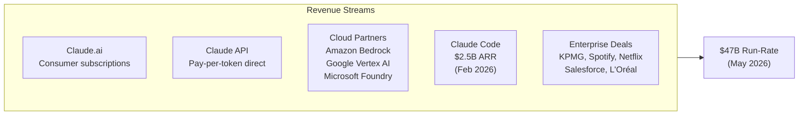
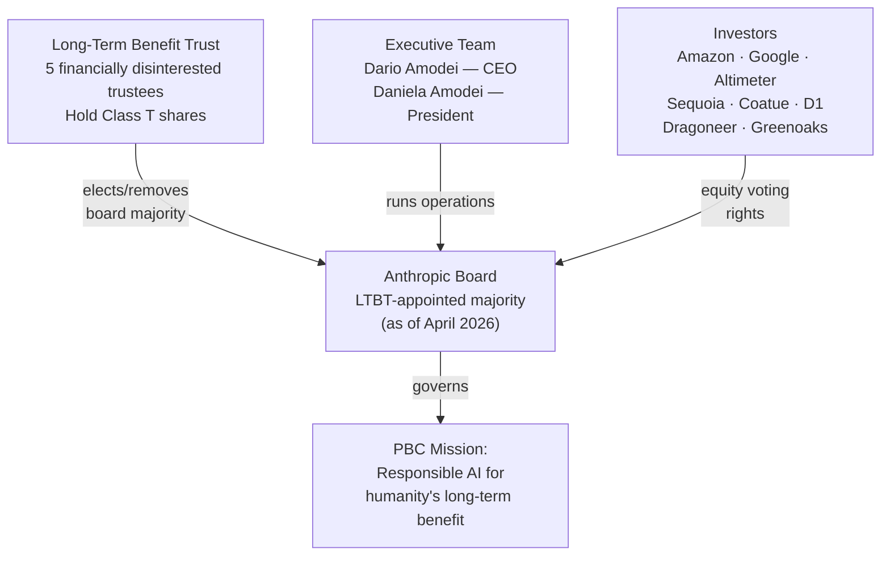
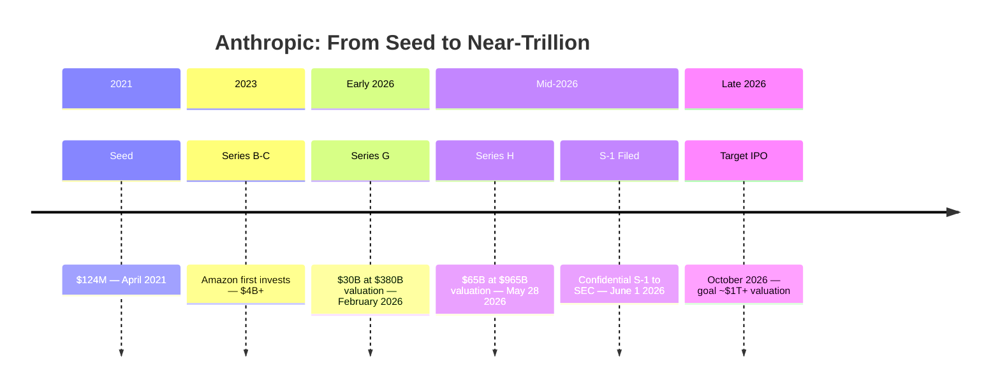

## The Walk-Out That Started It All

In early 2021, a quiet exodus began at OpenAI. Dario Amodei, then VP of Research, and his sister Daniela Amodei, VP of Safety & Policy, grew increasingly concerned about the direction the company was taking. They believed that scaling AI models without a parallel investment in safety and alignment wasn't just risky — it was the defining challenge of the coming decade. They were not alone: seven co-founders left with them.

In April 2021, they incorporated Anthropic, PBC — a Public Benefit Corporation based in Delaware — and raised $124 million in a seed round. Their founding thesis was simple but radical: if a frontier AI lab was coming regardless, it was better to have one run by people genuinely trying to make AI go well.

Five years later, that lab is worth nearly a trillion dollars. And it just filed to go public.

---

## The Numbers: $965 Billion at $965 Billion*

On May 28, 2026, Anthropic closed its Series H: **$65 billion** at a **$965 billion post-money valuation**. The asterisk is self-explanatory — that valuation eclipsed OpenAI ($852 billion), which had itself just raised $122 billion in March. Anthropic jumped from third to first among private AI companies in a single funding round.

Four days later, on June 1, 2026, Anthropic **confidentially submitted a draft S-1** to the U.S. Securities and Exchange Commission — the first frontier AI lab to formally begin the public listing process.

The financial metrics underpinning the valuation are striking:

- **Revenue run-rate**: $47 billion in May 2026, up from roughly $9 billion at end of 2025 — approximately a 5× increase in five months.
- **Q2 2026 projected revenue**: $10.9 billion, with an expected **operating profit of ~$559 million** — the company's first operating profit.
- **Inference margins**: roughly **70%** as of mid-2026, up from 38% a year earlier.
- **Enterprise customers**: 300,000+ businesses, with 1,000+ spending more than $1 million annually — a count that roughly doubled in under two months.

The target listing is October 2026. Goldman Sachs, Morgan Stanley, and JPMorgan are leading the offering, and law firm Wilson Sonsini — which guided Google's 2004 IPO — is handling public-market readiness.

---

## What Actually Drove $47 Billion in Revenue

Anthropic's revenue story is really two stories running at different speeds.

**The API and enterprise tier** is the foundation. Over 300,000 businesses pay per token to run Claude through Anthropic's API or through cloud partners: Amazon Bedrock and Google Cloud Vertex AI. Enterprise adoption grew 128% year-over-year while OpenAI slipped 8% in the same segment. Deals like KPMG — which gave all 276,000 of its employees access to Claude — demonstrate the scale of these agreements.

**Claude Code** is the accelerant. Anthropic's agentic coding assistant went generally available in May 2025. By November 2025 it hit $1 billion in annualized recurring revenue. By February 2026 it reached $2.5 billion. Enterprise use (teams, not individual developers) accounts for over half of that number. Spotify reports shipping over 650 AI-generated code changes per month and a 90% reduction in engineering time for covered tasks.

There is a third, more self-referential data point: as of May 2026, **more than 80% of the code merged into Anthropic's own production codebase was authored by Claude**. The company that builds the tool is also its own most aggressive internal user.

---

## A Company Built Differently: PBC and the Long-Term Benefit Trust

Most tech companies are C-corps optimized for shareholder returns. Anthropic is a **Public Benefit Corporation**, a Delaware structure that legally requires the company to balance shareholder interests against its stated public benefit — in Anthropic's case: *"the responsible development and maintenance of advanced AI for the long-term benefit of humanity."*

But the more unusual element is the **Long-Term Benefit Trust (LTBT)**.

The LTBT is an independent body of five financially disinterested trustees — people who hold no financial stake in Anthropic's success. They hold a special class of shares (Class T Common Stock) that grants them the authority to **elect and remove members of Anthropic's board**. The trust was designed to start with minority board influence and ramp to majority control over time and upon certain fundraising milestones.

In April 2026, that milestone was reached: **LTBT-appointed directors now constitute a majority of Anthropic's board** for the first time. Meaning that a group of people with no financial incentive to push for profit above all else now control the company's board — even as private investors hold billions of dollars in equity.

The question IPO lawyers are now quietly wrestling with: **how does this governance survive public markets?** Standard public-company structures give shareholders significant voting rights. Anthropic will need to negotiate a capital structure that keeps the LTBT's protective role intact while allowing it to raise money from retail and institutional investors. Dual-class share structures (like those used by Google and Meta) are the likely mechanism, but the LTBT layer adds complexity that has never been tested at the scale of a trillion-dollar listing.

---

## The Funding Trail: From $124 Million to $65 Billion

The speed of Anthropic's capital accumulation is hard to fully comprehend without laying it out:

Amazon and Google account for the bulk of strategic capital. Amazon has invested over $4 billion across multiple rounds; Google holds roughly **14% of Anthropic in straight equity**, hard-capped contractually at 15%. Both are simultaneously cloud infrastructure partners — Anthropic's compute runs primarily on AWS and GCP — which creates an unusual dynamic where the two largest investors are also the company's primary infrastructure vendors.

By April 2026, total committed capital to Anthropic from Amazon and Google alone reached an estimated **$76 billion**. That figure makes Anthropic the most well-capitalized AI startup in history, independent of the public markets.

---

## What the IPO Will Actually Reveal

When Anthropic's S-1 goes public, it will answer questions that private valuations simply cannot. There are three numbers investors will scrutinize above all others.

**1. Gross margin.** Revenue run-rate of $47 billion sounds extraordinary, but the real test is what's left after paying for the compute to generate it. Inference costs — GPU time rented from cloud providers — are expensive and volatile. Anthropic currently projects ~70% inference margins, which are strong for a software business. But the *direction* of that margin matters as much as the level. If model improvements are compressing per-token cost faster than revenue growth, that's a powerful flywheel. If infrastructure costs are rising faster than pricing power, the story inverts.

**2. Revenue recognition.** There's a looming accounting question: when Amazon and Google sign large compute-for-equity deals, how much of Anthropic's stated revenue represents cash paid for AI services versus the non-cash fair value of cloud credits? How Anthropic recognizes those credits could meaningfully change headline revenue numbers.

**3. Customer concentration.** 1,000 customers spending $1M+ is impressive, but if the top ten accounts represent an outsized portion of revenue, the company's growth quality looks different than the enterprise breadth figures suggest.

None of this is to say the business is fragile — a 5× revenue year and a path to first operating profit in Q2 2026 are real milestones. But public investors will price on fundamentals, not narratives, and the S-1 filing will provide the first look at those fundamentals.

---

## Why This IPO Is More Than a Capital Event

Anthropic's IPO is unusual in ways that go beyond its valuation.

Most tech IPOs are companies optimizing revenue growth for shareholders. Anthropic is a company that started from the explicit premise that **AI development could go catastrophically wrong**, and that the safeguards built into how you develop, deploy, and govern the technology matter as much as the technology itself.

The LTBT structure — designed specifically to prevent the lab from being captured by short-term financial incentives — now faces its greatest test: maintaining independence under scrutiny from public-market investors who, by definition, want returns. The tension isn't hypothetical. Safety research, interpretability work, and declining to deploy capabilities that pass capability benchmarks but fail safety benchmarks all cost money and slow short-term revenue.

There's also a precedent dimension. Anthropic entering the public markets is the clearest signal yet that AI is not a cycle or a trend but a permanent structural shift in how software value is created and captured. OpenAI's $122 billion fundraise in March was a private-market signal. Anthropic's S-1 is a public one — a declaration that the AI companies built in the early 2020s intend to be durable, public, accountable institutions.

Whether the market agrees will become clear by fall. The answer will define the financial template for an entire generation of AI companies that follow.

---

## Sources

- [Anthropic raises $65 billion, nears $1T valuation ahead of IPO — TechCrunch](https://techcrunch.com/2026/05/28/anthropic-raises-65-billion-nears-1t-valuation-ahead-of-ipo/)
- [Anthropic confidentially files for IPO after raising $65 billion at a $965 billion valuation — Fortune](https://fortune.com/2026/06/01/anthropic-confidentially-files-ipo-965-billion-valuation/)
- [Anthropic tops OpenAI as most valuable AI startup, nears $1 trillion valuation — CNBC](https://www.cnbc.com/2026/05/28/anthropic-open-ai-startup-value.html)
- [The Tech Download: Anthropic's IPO sets up first big test of AI boom valuations — CNBC](https://www.cnbc.com/2026/06/05/tech-download-anthropic-ipo-ai-valuations.html)
- [AI giant Anthropic prepares to sell stock to the public; files preliminary IPO paperwork — NPR](https://www.npr.org/2026/06/01/nx-s1-5843199/anthropic-ipo-filing-ai-large)
- [Anthropic IPO picks Goldman Sachs, Morgan Stanley, JPMorgan — TechTimes](https://www.techtimes.com/articles/317845/20260605/anthropic-ipo-picks-goldman-sachs-morgan-stanley-jpmorgan-revenue-accounting-question-looms.htm)
- [Anthropic's run-rate revenue hits $47 billion — Simon Willison](https://simonwillison.net/2026/May/29/anthropic/)
- [Anthropic on X: run-rate revenue crossed $47 billion — @AnthropicAI](https://x.com/AnthropicAI/status/2060061348818518493)
- [Anthropic raises $30 billion in Series G at $380 billion valuation — Anthropic](https://www.anthropic.com/news/anthropic-raises-30-billion-series-g-funding-380-billion-post-money-valuation)
- [Anthropic Long-Term Benefit Trust — Harvard Law School Corporate Governance](https://corpgov.law.harvard.edu/2023/10/28/anthropic-long-term-benefit-trust/)
- [The Long-Term Benefit Trust — Anthropic](https://www.anthropic.com/news/the-long-term-benefit-trust)
- [Anthropic KPMG strategic alliance — Anthropic](https://www.anthropic.com/news/anthropic-kpmg)
- [Why Anthropic's 70% Inference Margins Matter for Your API Costs — MindStudio](https://www.mindstudio.ai/blog/anthropic-inference-margins-70-percent-api-costs)
- [Anthropic Projects First Operating Profit in Q2 2026 — AI Weekly](https://aiweekly.co/alerts/anthropic-projects-first-operating-profit-in-q2-2026)
