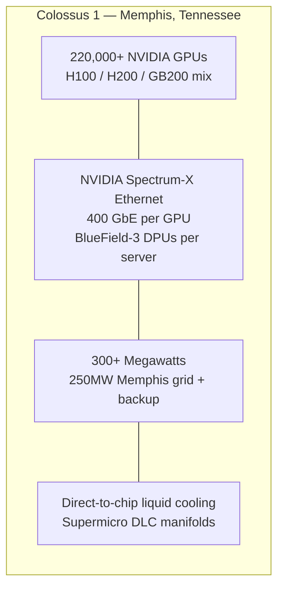
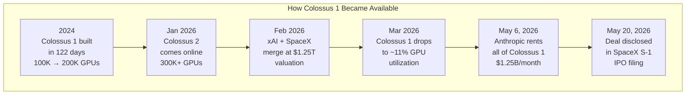
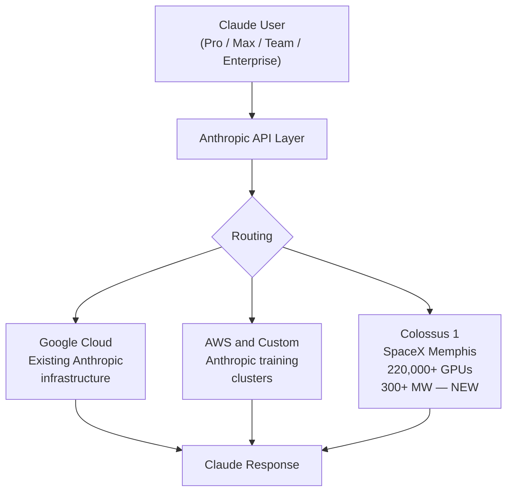
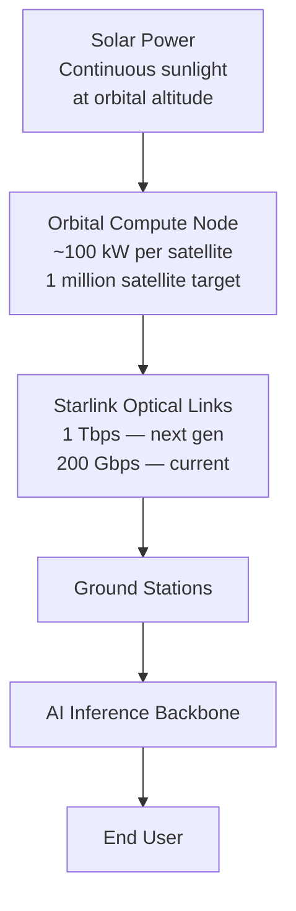

## The Deal Nobody Expected

On May 6, 2026, Anthropic — one of the most safety-focused AI labs in Silicon Valley — quietly announced it had signed a compute deal with SpaceX, the rocket company owned by Elon Musk, whose AI venture xAI makes a competing model family called Grok. The subject of the deal: **Colossus 1**, the world's largest AI supercomputer.

On paper, the arrangement makes no sense. xAI was folded into SpaceX in February 2026. Claude and Grok compete for the same enterprise customers, the same developer mindshare, the same AI coding market. And yet, within weeks of the announcement, Anthropic was running one of its largest inference clusters on Musk's hardware.

The price tag: **$1.25 billion per month through May 2029**, totaling up to **$45 billion over the full contract term** — a figure so large that SpaceX disclosed it as a material contract in its S-1 IPO filing on May 20, 2026. At full run rate, Anthropic's monthly payment alone exceeds 80% of SpaceX's total 2025 annual revenue.

This is not just a business deal. It is a signal about where AI is going, what the real bottlenecks are, and why infrastructure may end up mattering more than algorithms.

---

## What Is Colossus 1?

Colossus 1 is a data center at the site of a former Electrolux factory in South Memphis, Tennessee. xAI broke ground in 2024 and completed the initial 100,000-GPU cluster in **122 days** — a construction record for facilities of this scale. Typical data centers of comparable size take 18 months to two years.

The facility now houses more than **220,000 NVIDIA GPUs** — a mix of H100s, H200s, and next-generation GB200 Blackwell accelerators — consuming over 300 megawatts of power. For reference, 300 megawatts is roughly the electricity demand of a mid-sized city. The system's total memory bandwidth exceeds 194 petabytes per second, and its storage capacity tops one exabyte.

The networking is where Colossus diverges from most supercomputers. Rather than the InfiniBand fabric common to large AI clusters, Colossus uses **NVIDIA Spectrum-X Ethernet** — a high-performance Ethernet platform with BlueField-3 data processing units embedded at every node. Each GPU gets its own dedicated 400 GbE network interface card, and each server can aggregate up to 3.6 terabytes per second of bandwidth. The result: 95% sustained data throughput during training runs, compared to roughly 60% on standard Ethernet at this scale.

Cooling is handled by a direct-to-chip liquid system from Supermicro, circulating coolant directly across the silicon rather than relying on traditional air flow. This allows GPU density — and therefore compute density — to scale further than air-cooled designs can support.

---

## Why Was It Available?

The short answer: SpaceX-xAI built something even bigger, and moved on.

In February 2026, Elon Musk folded xAI into SpaceX in an all-stock merger that created a combined entity valued at **$1.25 trillion** — the world's most valuable private company at the time. The deal was partly driven by xAI's challenging economics: roughly $1 billion per month in expenses against roughly $500 million in annualized revenue.

Part of the merger's logic involved compute consolidation. xAI's Colossus 2 facility came online in January 2026, adding another 300,000+ GPUs at a neighboring Memphis site. With Colossus 2 handling Grok model training, Colossus 1 dropped to roughly **11% GPU utilization** — far below the 40–60% typical for hyperscalers like Meta and Google. A $10+ billion asset was sitting mostly idle.

Musk's calculation was straightforward: rent the idle capacity to a third party. What made Anthropic the tenant was more complex.

---

## The "Evil Detector" Test

Before signing, senior Anthropic researchers met personally with Elon Musk to discuss how the company approaches AI safety and what safeguards are built into Claude. On X, Musk described the outcome:

> "I spent time understanding what they do to ensure Claude is good for humanity. I was impressed. No one set off my evil detector."

Musk added that SpaceX reserves the right to reclaim the compute if Claude "engages in actions that harm humanity" — though the S-1 contract language describes standard 90-day termination rights rather than any active monitoring clause. Whether that caveat reflects a genuine technical gate or a public positioning statement is left to the reader's interpretation.

The exchange does capture something real about the current moment in AI: the two organizations most publicly invested in AI safety — Anthropic through its Constitutional AI research, and Musk through his stated concerns about AI risk — ended up in business together, with the practical constraint of needing compute to run models at scale overriding competitive friction.

---

## What Changed for Claude Users

The deal's immediate effect was visible. On May 6, the same day the partnership was announced, Anthropic pushed several changes:

- **Claude Code five-hour rate limits doubled** for Pro, Max, Team, and Enterprise plans
- **Peak-hour usage caps removed** — the quiet throttling that had frustrated developers since March 2026 was lifted
- **Claude Opus API rate limits raised 2–16×** across developer tiers

These changes matter because Anthropic had been genuinely constrained. In late March 2026, the company quietly tightened Claude limits during East Coast business hours — 8 a.m. to 2 p.m. Eastern — as demand began outrunning available GPU capacity. Developers building on the Claude API noticed their rate limits degrading without announcement. The Colossus capacity directly addressed that gap.

Anthropic's compute chief Tom Brown confirmed the Colossus 1 capacity is being used primarily for **inference** — serving Claude responses to end users — rather than model training. This distinction matters: training is a batch process that tolerates latency, but inference is interactive and requires fast, consistent access to large amounts of GPU memory.

The transition to full utilization of Colossus 1 was set to complete within a month of signing, with a discounted rate applying through June 2026 before full pricing of $1.25 billion per month begins.

---

## The Orbital Compute Angle

The most forward-looking part of the announcement is buried in a single line of Anthropic's press release: the company has "expressed interest in partnering with SpaceX to develop multiple gigawatts of orbital AI compute capacity."

SpaceX filed plans with the FCC in early 2026 for a constellation of up to **one million orbital data center satellites**. The architecture uses solar-powered satellites at 500–2,000 km altitude, connected via Starlink's optical mesh and linked to ground stations. SpaceX's projection: launching one million tonnes of satellites at 100 kW of compute per tonne would add **100 gigawatts of AI compute capacity annually** — roughly 7–10× the entire current global AI compute base, added every year.

Anthropic's interest in this concept is driven by a practical constraint: physical data centers are hard to scale. Memphis real estate, power grid permits, cooling water, zoning — each is a bottleneck that can add years to a build timeline. Space, in theory, is not. If SpaceX can drive per-launch costs low enough via Starship reusability, orbital compute could eventually be cheaper per FLOP than grid-constrained ground infrastructure.

That is a large "if." But the fact that multiple parties — Anthropic, Google, and SpaceX itself — are simultaneously pursuing it suggests the concept is being treated as a medium-term engineering program rather than science fiction.

---

## What This Signals About the AI Race

The Anthropic-SpaceX deal gets covered as a curiosity — rivals partnering, old adversaries finding common commercial ground. But the deeper story is about **compute as the binding constraint on AI progress**.

Training frontier models takes months and tens of thousands of GPUs. Inference takes hundreds of millions of GPU-hours per year to serve tens of millions of users. Anthropic, despite being one of the top three AI labs globally, was throttling its own developers in early 2026 because its infrastructure hadn't kept up with demand growth. That constraint directly affects developer retention, enterprise contract renewals, and the company's ability to serve larger context windows or run more capable models in production.

The $45 billion deal removes that constraint, at least for three years. At $1.25 billion per month, Anthropic is not buying cheap capacity — it is buying time. Time to build its own infrastructure, time to train better models on the Colossus cluster's raw FLOP budget, and time to establish the kind of developer trust that sticky platforms require.

There is a broader lesson here too. The AI infrastructure race increasingly looks like the semiconductor industry circa 1990: you do not have to fabricate your own chips to win in software, but you do have to secure reliable access to the output of fabs — or face supply shocks that competitors can exploit. Compute access is the new foundry relationship, and the Colossus deal is the most dramatic example yet of an AI lab solving it through an unusual counterpart.

When rivals rent from each other, it is usually because neither side had better options. In this case, both did, and they chose the deal anyway. That says something worth paying attention to.

---

## Sources

- [Anthropic: Higher Limits + SpaceX Compute Partnership — Anthropic Official Announcement](https://www.anthropic.com/news/higher-limits-spacex)
- [Anthropic, SpaceX Announce Compute Deal That Includes Space Development — CNBC](https://www.cnbc.com/2026/05/06/anthropic-spacex-data-center-capacity.html)
- [Anthropic Will Pay xAI $1.25 Billion Per Month for Compute — TechCrunch](https://techcrunch.com/2026/05/20/anthropic-will-pay-xai-1-25-billion-per-month-for-compute/)
- [SpaceX $45B Anthropic AI Compute Deal: Full S-1 Disclosure Breakdown — Tesery](https://www.tesery.com/blogs/news/spacex-unveils-landmark-45-billion-ai-compute-deal-with-anthropic-in-ipo-filing)
- [Anthropic to Use All of SpaceX-xAI's Colossus 1 Data Center Compute — Data Center Dynamics](https://www.datacenterdynamics.com/en/news/anthropic-to-use-all-of-spacex-xais-colossus-1-data-center-compute/)
- [Musk's SpaceX Rented 220,000 Nvidia GPUs to Rival Anthropic — Tom's Hardware](https://www.tomshardware.com/tech-industry/artificial-intelligence/musks-spacex-has-rented-out-access-to-its-supercomputers-220-000-nvidia-gpus-and-300-megawatts-of-ai-compute-power-to-rival-anthropic-musk-says-no-one-set-off-my-evil-detector-antrhropic-also-interested-in-orbital-data-centers)
- [SpaceX Files Plans for Million-Satellite Orbital Data Center Constellation — SpaceNews](https://spacenews.com/spacex-files-plans-for-million-satellite-orbital-data-center-constellation/)
- [NVIDIA Ethernet Networking Accelerates World's Largest AI Supercomputer — NVIDIA Newsroom](https://nvidianews.nvidia.com/news/spectrum-x-ethernet-networking-xai-colossus)
- [Colossus: The World's Largest AI Supercomputer — xAI Official](https://x.ai/colossus)
- [xAI Colossus Hits 2 GW: 555,000 GPUs — Introl Blog](https://introl.com/blog/xai-colossus-2-gigawatt-expansion-555k-gpus-january-2026)
- [Claude Code Limits Doubled After SpaceX Compute Deal — KnightLi](https://www.knightli.com/en/2026/05/09/anthropic-claude-code-higher-limits-spacex-compute/)
- [Anthropic's Capacity Crisis: Rate Limits and the Inference Tax — LongYield Substack](https://longyield.substack.com/p/anthropics-capacity-crisis-rate-limits)
