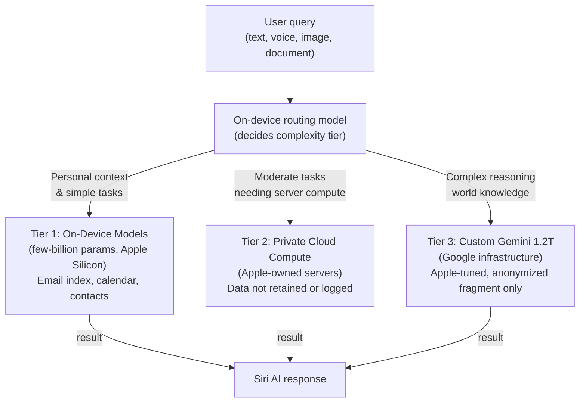
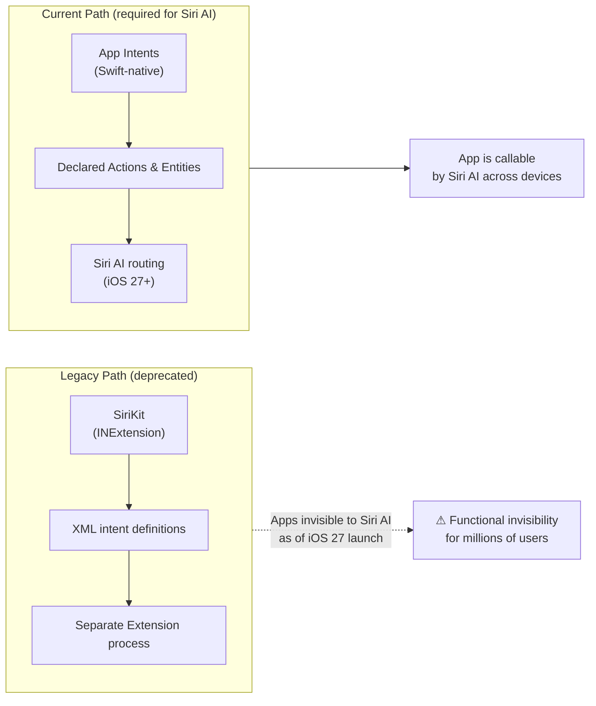

## The Moment Apple Stopped Going It Alone

For a decade, Apple's AI story was a story of restraint. While OpenAI scaled to hundreds of billions of parameters and Google poured resources into Gemini, Apple insisted it could serve its billion-plus users better by keeping things on-device, private, and tightly controlled. The results were, charitably, mixed. Siri remained the butt of assistant jokes while ChatGPT became a verb.

At WWDC 2026, held at Apple Park on June 9, Tim Cook made a different kind of keynote announcement — arguably one of the most strategically significant of his tenure. Apple is paying Google roughly **$1 billion per year** to license a custom 1.2-trillion-parameter Gemini model that now powers the cloud-intelligence layer of a completely rebuilt Siri. The new assistant has a new name, a new app, and a new architecture. And it arrives alongside a deprecation notice that could quietly break every iOS app that hasn't migrated to App Intents before iOS 27 ships this fall.

---

## What Is Siri AI?

Apple dropped the plain "Siri" branding in favor of **Siri AI** — a signal that this is not an incremental update. The new assistant is more conversational, context-aware, and capable of chaining actions across apps without the user needing to spell out every step.

Think of the old Siri as a lookup tool: you asked a question, it retrieved an answer. Siri AI is designed to feel more like a collaborator. You can hand it a photo of a restaurant receipt and ask it to split the bill and draft Venmo requests. You can tell it to read your last three emails from your manager and turn the action items into a task list. You can attach a document and ask it to summarize, compare, or rewrite specific sections. The assistant keeps a persistent conversation history synced across your iPhone, iPad, Mac, and Vision Pro via iCloud — so you can pick up a thread on your Mac that started on your phone.

A dedicated **Siri app** ships across all Apple platforms for the first time, placing Siri on equal footing with ChatGPT and Claude as a first-class application rather than a system overlay.

---

## The Architecture: Three Tiers, One Privacy Promise

The most technically interesting part of WWDC 2026 is how Apple architected the new system to keep its privacy promises while plugging into a trillion-parameter model it does not own or operate.

**Tier 1 — On-device.** A set of small models (in the few-billion-parameter range, optimized for Apple Silicon's unified memory) handle anything that can be answered from personal data: your calendar, messages, emails, contacts, and app state. This tier never leaves the device and is used for the majority of everyday requests.

**Tier 2 — Private Cloud Compute.** When a query needs more compute than the device can provide but doesn't require world knowledge, it routes to Apple's own servers through Private Cloud Compute. Apple says the data is processed without being retained or made readable — "not even by Apple." Only the relevant fragment of a query travels to the server, not the full conversation.

**Tier 3 — Custom Gemini.** The heaviest requests — complex reasoning, world knowledge, multi-step planning across unfamiliar domains — are handled by a custom Apple-tuned version of Google's Gemini model running approximately 1.2 trillion parameters. Apple maintains that personal identifiers are stripped before any query reaches this tier, and data is not stored on Google's infrastructure.

The routing decision happens entirely on-device, which means the device's on-device model acts as a privacy gatekeeper before any data leaves the phone. Whether that guarantee holds under scrutiny is something independent researchers will probe in the months ahead, but the architecture is meaningfully more sophisticated than the previous "either local or hand off to ChatGPT" approach.

---

## The Gemini Deal: What $1 Billion a Year Buys

The partnership was announced in January 2026 and formalized at WWDC. Apple reportedly pays Google **around $1 billion per year** under a multi-year agreement — a figure that puts the AI deal in the same category as the infamous Google search default arrangement (estimated at ~$20 billion annually).

The model Apple is licensing is not the public Gemini. It is a custom build, trained and fine-tuned in collaboration between Apple and Google teams, calibrated to behave in ways consistent with Apple's privacy posture and interaction design. Think of it as a Gemini variant shaped by Apple's constraints rather than Google's defaults.

For Apple, the deal is an admission it could not build a competitive 1T+ parameter model on its own timetable. For Google, it is access to every iPhone, iPad, and Mac as a distribution surface for Gemini intelligence — a remarkable outcome for a company that also competes directly with Apple in hardware. The combined search + AI arrangement between two companies of this scale will draw regulatory attention in both the US and EU.

---

## iOS 27: Extensions and the AI Marketplace

The most user-facing change in iOS 27, beyond Siri AI itself, is the new **Extensions framework**. In Settings, users can now select their preferred AI provider — and that choice propagates across Siri, Writing Tools, Image Playground, and Xcode's contextual AI features. Claude, ChatGPT, and Gemini are all expected to be available as options at launch.

This is a notable reversal. In previous versions of Apple Intelligence, ChatGPT was the only approved third-party handoff, and using it required an explicit user confirmation each time. Extensions makes third-party AI providers first-class citizens of the platform, selectable as defaults. It is both a competitive move (no single AI company can lock in the platform) and, arguably, a concession to regulators who have pushed for interoperability.

The other major iOS 27 feature is **Visual Intelligence**, now deeply integrated into Siri AI. Point the camera at a menu and ask Siri to recommend a dish for someone with nut allergies. Show it a handwritten note and ask it to schedule the items as calendar events. Screenshot a job posting and ask Siri to compare it against your resume. Visual intelligence bridges the physical and digital in ways that previous camera-based features hinted at but rarely delivered end-to-end.

**macOS Golden Gate 27** brings the same capabilities to the Mac, including a native Siri app that replaces the menubar overlay, deeper Spotlight integration, and the same Extensions provider selector.

---

## Developer Impact: The SiriKit Clock Is Ticking

Buried beneath the headline features is an announcement with significant near-term consequences for developers. Apple issued a **formal deprecation notice for SiriKit** at WWDC 2026, with a two-to-three-year support window before removal — roughly the iOS 29 cycle, projected around fall 2028.

The immediate practical effect is more urgent than that timeline suggests. Apps that remain on `INExtension` and legacy intent classes will compile under iOS 27 without errors but **will not surface in the rebuilt Siri experience**. When iOS 27 ships publicly in September, users with those apps installed will find they cannot invoke them through Siri AI at all.

The replacement is **App Intents** — a Swift-native framework introduced in iOS 16 that lets apps declare the actions and content Siri can call directly, without opening the app. SiriKit and App Intents are architecturally different; migration is not a rename. SiriKit relied on XML intent-definition files and a separate Intent Extension process; App Intents is built for an assistant that can now reason about and chain app-exposed actions.

Apple has left the door open for SiriKit apps to keep working — they will continue to function through fall 2028 — but they will not benefit from the new Siri's capabilities, nor will they appear when users ask Siri to find or invoke apps for a given task.

---

## The Developer Platform Shift

WWDC 2026 is the most significant Apple developer-platform update in years, and most of the change is AI-driven.

**Xcode 27** ships with a new Neural Engine-powered code completion system that runs entirely on-device without sending source code to any external server. Apple calls this the Neural Engine Completer. It understands the project's full symbol graph, suggests completions that are coherent with the rest of the codebase, and operates at latency comparable to traditional autocomplete. For teams with strict data-handling requirements — healthcare, finance, defense — on-device AI coding assistance without cloud exposure is a meaningful unlock.

**Core AI** replaces Core ML as the forward path for on-device inference on Apple Silicon. The new framework provides a standardized API for deploying custom model weights alongside Apple's own, optimized for the unified memory architecture and taking advantage of the ANE (Apple Neural Engine) directly. Core ML remains supported but will no longer receive new features.

**Foundation Models** — Apple's framework for calling AI models in apps — now includes server-side intelligence via Private Cloud Compute, dynamic sessions with instructions and profiles, and multimodal prompting for image analysis. The most developer-friendly addition: the ability to swap AI providers without code changes. An app that uses Foundation Models can present Gemini, Claude, or ChatGPT to users depending on their Extensions preference, with the framework handling the provider routing transparently.

**MCP goes platform-wide.** Apple's `mcpbridge` binary translates the Model Context Protocol over XPC into Xcode's live process, letting any MCP-compliant agent orchestrate Apple-platform development from external tools.

---

## Why This Is Apple's Most Consequential AI Bet

Apple's privacy-first positioning has always been both a product feature and a marketing tool. The WWDC 2026 announcements do not abandon that positioning — the three-tier architecture is a genuine attempt to extend it into an era of trillion-parameter models. But they do force a question the company has spent years avoiding: what happens when the only way to deliver competitive intelligence is to route requests through infrastructure you do not control?

Apple's answer is contractual and architectural: strip identifiers, limit retention, audit the pipeline. Whether that is sufficient — and whether users will find it sufficient — will be a defining story of the iOS 27 cycle.

For the billion-plus people carrying Apple hardware, the most tangible change is simple: Siri AI should finally be useful. That is a lower bar than it sounds, and clearing it matters more than any benchmark.

For the two million developers shipping on the App Store, the message is direct: migrate to App Intents before September, or ship a product that does not respond to the assistant your users will receive with iOS 27.

---

## Sources

- [WWDC 2026: Apple unveils Siri AI, Gemini-powered Apple Intelligence, more — Business Standard](https://www.business-standard.com/technology/tech-news/wwdc-2026-apple-unveils-siri-ai-gemini-powered-apple-intelligence-more-126060900042_1.html)
- [Apple finally ships its AI do-over: Siri AI, a standalone app, and a three-tier privacy stack — The Next Web](https://thenextweb.com/news/apple-wwdc-2026-siri-ai-gemini-ios-27)
- [WWDC 2026: Siri AI Runs on Google's $1B Gemini Deal — Tech Insider](https://tech-insider.org/wwdc-2026-siri-ai-gemini-deal/)
- [Apple Reveals New AI Architecture Built Around Google Gemini Models — MacRumors](https://www.macrumors.com/2026/06/08/apple-reveals-new-ai-architecture/)
- [WWDC 2026: App Intents Replaces SiriKit as Gemini Siri Migration Clock Starts — TechTimes](https://www.techtimes.com/articles/318005/20260608/wwdc-2026-app-intents-replaces-sirikit-gemini-siri-migration-clock-starts.htm)
- [WWDC 2026 Developer Tools: Foundation Models Now Swaps AI Providers Without Code Changes — TechTimes](https://www.techtimes.com/articles/318039/20260609/wwdc-2026-developer-tools-foundation-models-now-swaps-ai-providers-without-code-changes.htm)
- [WWDC 2026 Day 3: Xcode 27 Neural Engine Completes Code Without Sending Source to Any Server — TechTimes](https://www.techtimes.com/articles/318110/20260610/wwdc-2026-day-3-xcode-27-neural-engine-completes-code-without-sending-source-any-server.htm)
- [WWDC 2026 Keynote Confirmed: Siri Is Now Gemini, Core AI Replaces Core ML, MCP Goes Platform-Wide — ChatForest](https://chatforest.com/builders-log/wwdc-2026-keynote-confirmed-apple-ai-platform-builder-guide/)
- [Apple's AI Strategy Faces Challenges Amid Google Partnership — GuruFocus](https://www.gurufocus.com/news/8911545/apples-ai-strategy-faces-challenges-amid-google-partnership)
- [WWDC 2026: Everything announced on Siri AI, iOS 27, Apple Intelligence, and more — TechCrunch](https://techcrunch.com/2026/06/09/wwdc-2026-everything-announced-on-siri-ai-os-27-apple-intelligence-and-more/)
- [Your iOS app is invisible to Siri without App Intents — Medium / Mac O'Clock](https://medium.com/macoclock/your-ios-app-is-invisible-to-siri-without-app-intents-46781d98c120)
