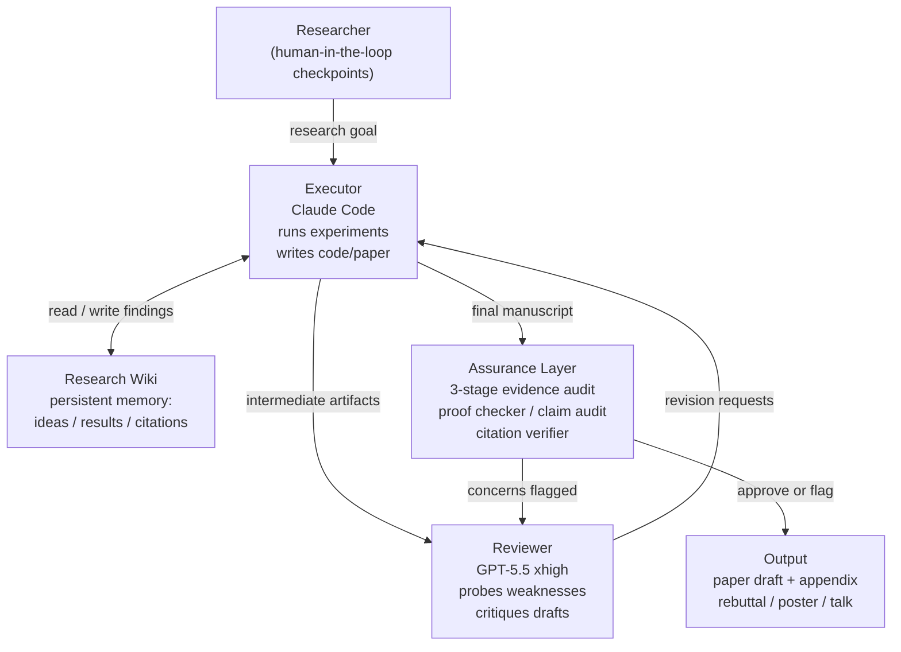
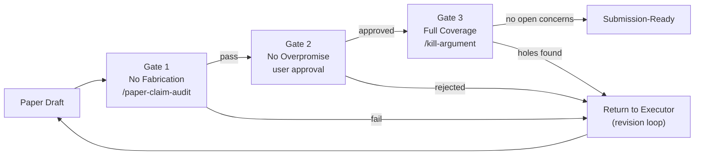

## The Problem with AI Reviewing Its Own Work

Imagine asking someone to proofread their own essay seconds after they write it. They know what they *meant* to say, so their eyes skip over what they *actually* wrote. The same thing happens when you ask a language model to critique its own output: the model carries the same assumptions, biases, and reasoning patterns into the review that produced the original artifact. It tends to confirm, not challenge.

This is the central failure mode of autonomous AI research agents: they can run for hours, generate confident-sounding results, and produce polished-looking papers — all while quietly propagating errors no single model can see. Call it the **self-review blind spot**.

A research team at Shanghai Jiao Tong University published a May 2026 paper on arXiv introducing a framework that takes direct aim at this problem. They call it **ARIS** — Autonomous Research-In-Sleep — and the fix is elegantly simple: bring in a second model from a *different* family to play the adversary.

---

## The Adversarial Insight

ARIS treats cross-model review not as a nicety, but as a structural requirement. The design philosophy draws on game theory: a single model self-reviewing is a **stochastic** process — there's noise in the feedback, but the model fundamentally knows what it said and why. A model from a different family reviewing that same work is **adversarial** — it has genuinely different reasoning patterns, different pretraining biases, and different failure modes. It can probe weaknesses the executor never thought to look for.

In practice, the default ARIS configuration pairs:

- **Executor**: Claude Code — fast, fluid at long-horizon task execution, writes and runs code
- **Reviewer**: GPT-5.5 with `reasoning_effort='xhigh'` (or GPT-5.5 Pro via Oracle MCP) — deliberate, slow-reasoning critique

The executor handles forward momentum. The reviewer acts as a skeptic who actively hunts for unsupported claims, incorrect math, and hallucinated citations. By design, neither model can drift into the comfortable loop of self-validation.



---

## Inside ARIS's Three-Layer Architecture

ARIS is built as a **skill-based workflow system** written entirely in Markdown — no framework lock-in, no infrastructure overhead. It works with Claude Code, Codex CLI, Cursor, and most other LLM agents that support custom skills.

The three layers are:

### 1. Execution Layer

74+ bundled Markdown-defined skills cover every stage of the research lifecycle: literature search, novelty checking, idea brainstorming, experiment scheduling (with OOM retry), result aggregation, and figure generation. Helpers are resolved through a fallback chain, so individual skills can be swapped or extended without breaking the workflow. A community of 5,000+ users has already contributed 30+ additional skills to the public repository.

### 2. Orchestration Layer

Five core workflows chain skills together into end-to-end pipelines:

| Workflow | What it does |
|---|---|
| **W1: Full Pipeline** | idea → literature → novelty check → method → experiments → paper |
| **W1.5: Targeted Improvement** | given a paper + codebase, find weaknesses and fix them specifically |
| **W2: Idea Discovery** | broad literature survey feeding into structured brainstorming |
| **W3: Experiment Execution** | multi-seed GPU runs, OOM retry, result aggregation |
| **W4: Paper Writing** | structured draft → assurance gates → polished submission |
| **W5: Resubmission** | cross-venue porting under frozen constraints — text-only edits, no new experiments |

Additional support workflows handle rebuttals, conference talks, poster design, and grant proposals.

### 3. Assurance Layer

This is the heart of what makes ARIS different. Before any claim reaches the paper, it must pass three independent gates:

1. **No Fabrication** — every claim maps to a paper citation, a reviewer-confirmed result, or a user-approved statement. The `/paper-claim-audit` skill cross-checks each sentence in the manuscript against the raw evidence log.
2. **No Overpromise** — the user explicitly approves each commitment the paper makes. No silent scope expansion.
3. **Full Coverage** — the reviewer's concerns are tracked exhaustively until resolved. Nothing gets closed by assertion.

These gates are enforced by four audit skills that run on every draft: `/proof-checker` (mathematical correctness), `/paper-claim-audit` (evidence mapping), `/citation-audit` (DBLP/CrossRef verification), and `/kill-argument` (adversarial scope attack). A five-pass scientific editing pipeline and automated PDF visual inspection round out the submission-readiness checks.



---

## How an Overnight Research Run Looks

The design intent is literal: you set a research goal, start ARIS, and check back in the morning.

A typical W1 run proceeds roughly like this. You type something like:

```text
/aris-run "investigate factorized gap in discrete diffusion language models"
```

From there, ARIS:

1. Runs a literature survey, builds a novelty score, surfaces the unexplored gap
2. Brainstorms candidate methods; you approve one at a human-in-the-loop checkpoint
3. Implements the method, runs multi-seed experiments, retries on GPU OOM
4. Drafts the paper with auto-generated figures
5. Routes the draft to the GPT reviewer, who probes for flaws
6. Runs the three assurance gates — flagging any claim lacking evidential support
7. Delivers a near-submission-ready PDF with an audit trail

For targeted improvement (W1.5), you supply an existing paper and its codebase. ARIS reads the paper, identifies its weakest section, clones the repo, generates targeted fixes, and writes the delta.

---

## Community Adoption and Early Results

ARIS landed as the **#1 Paper of the Day on Hugging Face** the week of its arXiv release (paper ID: 2605.03042), reflecting how directly it addresses a problem practitioners have been running into as agentic research tooling has matured.

The GitHub repository has crossed 8,000 stars with 5,000+ active users and over 30 community-contributed skills in a matter of weeks. Early community reports describe papers produced through ARIS's full pipeline that have been accepted at top ML venues — a meaningful signal that the assurance layer is doing real work, not just surface-level polish.

The framework is deliberately executor-agnostic. While Claude Code is the recommended executor and GPT-5.5 the recommended reviewer, the routing layer supports Gemini (via Antigravity CLI), DeepSeek-R1, Kimi, GLM, and MiniMax — and it can fall back to a manual paste-to-any-LLM review mode for environments without API access.

---

## Why This Matters Beyond ML Research

ARIS arrived at a specific inflection point. In early 2026, several teams — including the authors of *The AI Scientist-v2*, Arbor, and AutoResearch AI — published autonomous research frameworks that could, in principle, generate novel paper drafts without human involvement. The concern wasn't that these systems were too slow. It was that they were **too confident**: a long-running agent has many opportunities to make a small error that compounds silently through every downstream step.

What ARIS contributes is a concrete, deployable answer to that concern. The adversarial cross-model loop is not a theoretical safeguard — it's a practical workflow that produces a paper-trail of reviewer objections and executor responses. If a claim is fabricated, there is a specific audit skill that was supposed to catch it. If it didn't catch it, there's a log showing why.

This audit-trail accountability is what distinguishes ARIS from earlier "AI writes papers" demos. The question isn't whether an AI can produce text that looks like a research paper. The question is whether anyone — human or machine — can verify that the claims hold up. The three-gate assurance system is a first-principles attempt to answer yes.

Think of it like a scientific replication protocol, but automated and embedded into every research run. Just as peer review requires that a paper's conclusions be derivable from its methods and data, ARIS requires that every manuscript claim be traceable to a raw experimental result before the paper leaves the system.

---

## The Road Ahead

A self-improvement loop is already present in early ARIS builds: the system records its own research traces and proposes improvements to its own skill library, which are only adopted after reviewer approval. This meta-level learning — the harness improving itself through the same adversarial mechanism it uses for research — hints at a longer trajectory.

More immediately, the community skill ecosystem is the leverage point to watch. Skills contributed by 30+ external users already extend the framework into domain-specific areas well beyond the original scope. As that library grows, ARIS becomes more useful for research areas its original authors didn't anticipate — a familiar pattern for frameworks that manage to stay generic enough to be extendable.

For researchers interested in getting started, the GitHub repository includes a setup guide and a detailed runbook for the TRAE environment. The paper (arXiv 2605.03042) provides the theoretical grounding for the adversarial design and the assurance architecture.

---

## Sources

- [ARIS: Autonomous Research via Adversarial Multi-Agent Collaboration — arXiv 2605.03042](https://arxiv.org/abs/2605.03042)
- [ARIS paper page — Hugging Face Papers](https://huggingface.co/papers/2605.03042)
- [ARIS GitHub Repository — wanshuiyin/Auto-claude-code-research-in-sleep](https://github.com/wanshuiyin/Auto-claude-code-research-in-sleep)
- [ARIS Mirror Repository — mumulin5/ARIS](https://github.com/mumulin5/ARIS)
- [Shanghai Jiao Tong University Team: Let Claude Code Conduct "Reliable" Scientific Research While You Sleep — 36Kr](https://eu.36kr.com/en/p/3799050979040518)
- [AutoResearch AI: Towards AI-Powered Research Automation for Scientific Discovery — arXiv 2605.23204](https://arxiv.org/abs/2605.23204)
- [An Empirical Study of Multi-Agent Collaboration for Automated Research — arXiv 2603.29632](https://arxiv.org/pdf/2603.29632)
- [Open-Source AI June 2026: New Models, Agents & Papers — devFlokers](https://www.devflokers.com/blog/open-source-ai-roundup-june-2026)
- [From AI for Science to Agentic Science: A Survey on Autonomous Scientific Discovery — arXiv 2508.14111](https://arxiv.org/abs/2508.14111)
