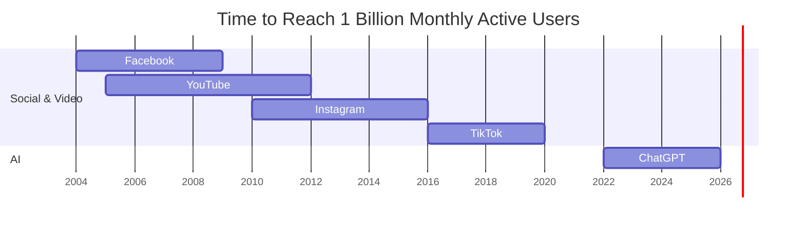
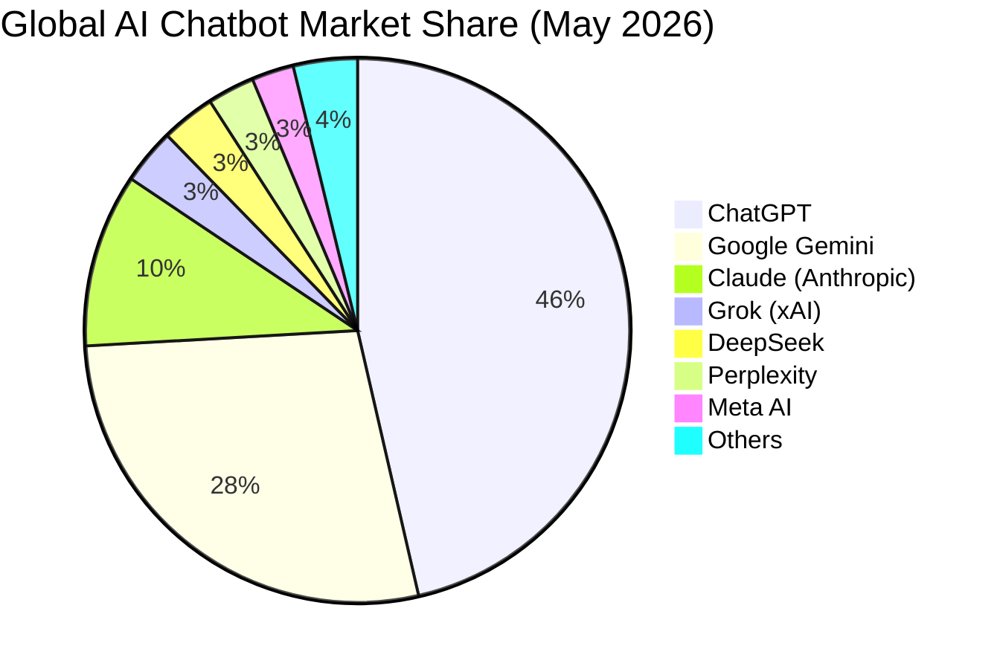
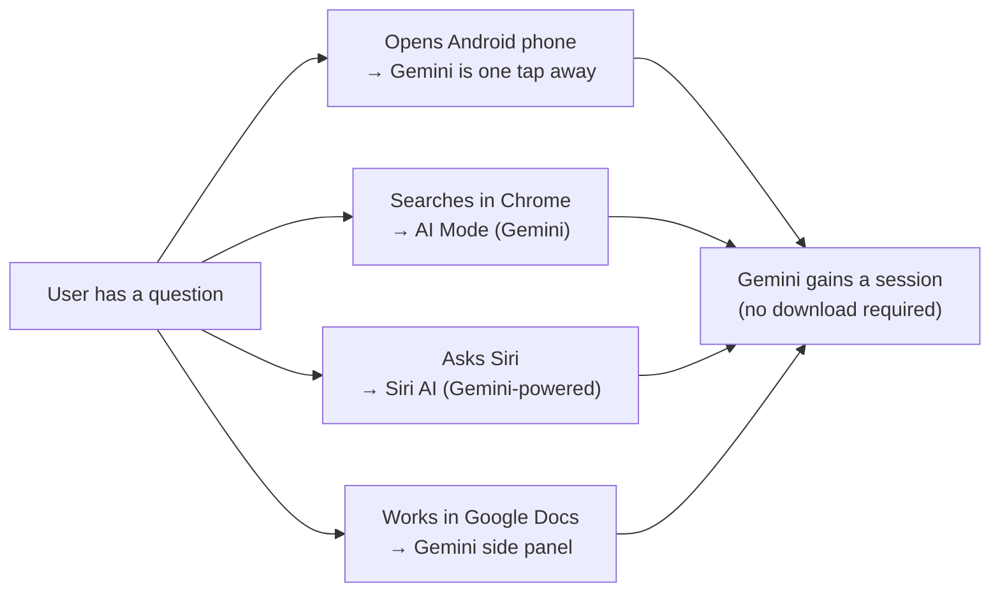

## The Number That Rewrote the History Books

In May 2026, OpenAI's ChatGPT crossed one billion monthly active users and, in doing so, became the fastest application in human history to reach that scale.

The comparison figures are striking. Facebook needed roughly four and a half years to reach its first billion monthly users. TikTok took about four years. YouTube needed more than six. Instagram took a similar span. ChatGPT — launched in November 2022 — did it in approximately three and a half years. According to Sensor Tower data, it hit one billion monthly users nearly **twice as fast as TikTok did**.

The trajectory has been breathtaking from the start: one million users in five days, one hundred million in two months, one billion by its third year. Every benchmark shattered every prior record for consumer software adoption.

---

## How Does an App Grow That Fast?

To understand the scale, it helps to understand what "monthly active users" means here. Sensor Tower tracks mobile app engagement; the billion-user figure covers the ChatGPT app specifically and excludes users who access ChatGPT via browser or API — meaning the actual user base is almost certainly larger.

The launch conditions were uniquely powerful. ChatGPT arrived at the exact moment public curiosity about AI had peaked but there was no accessible way to interact with it. It wasn't buried inside a search interface or sold to enterprises first — it was a free, conversational product anyone could try from day one.

The chart above illustrates just how compressed ChatGPT's growth curve is compared to any prior consumer platform. What took social networks half a decade, an AI chatbot achieved in roughly forty-two months.

---

## The Business Behind the Billion

User counts are a vanity metric if they don't translate to revenue. ChatGPT has, emphatically.

OpenAI crossed **$25 billion in annualized revenue** in February 2026, generating roughly **$2 billion per month**. That monetization pace — 31 months to $3 billion in consumer spending — outpaced both TikTok (58 months to the same milestone) and major streaming platforms like Disney+ and HBO Max at comparable user scales.

Enterprise adoption tells an equally compelling story. As of mid-2026:

- **92% of Fortune 500 companies** are ChatGPT customers
- **More than 9 million paying business users**
- Enterprise revenue accounts for **more than 40% of total revenue**, on track to reach parity with consumer revenue by year-end
- **50+ million consumer subscribers** paying for Plus, Pro, or Team plans

These numbers explain why OpenAI filed a confidential S-1 with the SEC on June 8, 2026, targeting a public listing as early as September at a valuation of **$730 billion to $850 billion**, with Goldman Sachs and Morgan Stanley serving as underwriters. The billion-user milestone isn't just a headline — it is the central argument in an upcoming IPO prospectus.

---

## The Paradox: A Record Milestone and a Retreating Moat

Here is the twist.

Even as ChatGPT hit its historic billion, something else happened for the first time: its market share fell below 50%.

For roughly three years, ChatGPT held an absolute majority of the global AI chatbot market — more than half of all AI assistant usage worldwide. By the end of May 2026, that share had dropped to **46.4%**, according to Sensor Tower's State of AI 2026 report. It is the first time since launch that ChatGPT has fallen below the 50% threshold.

This sounds alarming. It is also, in a sense, the natural consequence of success.

The total AI chatbot market expanded by **22% between September 2025 and March 2026**. More people are using AI assistants than ever. ChatGPT's absolute user count is still growing — it now sits at **1.1 billion monthly active users** as of June 2026. But its share of a larger pie has shrunk because rivals are growing faster. Think of it like a popular bakery that is selling more bread than ever, but a dozen new bakeries just opened on the same street.

---

## Who's Eating ChatGPT's Lunch?

The Sensor Tower data tells a clear story about where that share has gone.

**Google Gemini** now holds 27.7% of the global market, with roughly 662 million monthly active users. That makes it a genuine second-place competitor, not a distant also-ran.

**Anthropic's Claude** holds 10.3% with approximately 245 million monthly active users. The absolute numbers are smaller, but the velocity underneath is extraordinary: Claude's audience grew **452% year-over-year** in May 2026, compared to ChatGPT's 62%. In the United States specifically, Claude's market share jumped from 4.4% in December 2025 to nearly **14% by May 2026** — a tripling in five months. Claude also records the **highest paid conversion rate** among major AI assistants at 13%, versus an industry average closer to 5–7%.

**Grok**, **DeepSeek**, **Perplexity**, and **Meta AI** each sit below 5%, but their combined presence illustrates how fragmented the landscape has become. There is no longer a single "alternative to ChatGPT" — there are five or six, each with distinct positioning.

---

## Distribution Is the New Moat

The story of ChatGPT's market share decline is not primarily a story about quality. By most benchmarks, ChatGPT remains at the frontier. GPT-5.5, released in April 2026, scores 82.7% on Terminal-Bench 2.0 and is widely regarded as one of the strongest models for agentic coding and multi-step tasks.

What is shifting is **distribution**.

Gemini's growth is driven by defaults. When a user asks Google a question in AI Mode, Gemini answers. Google Workspace means Gemini is the AI inside Docs, Sheets, and Gmail for hundreds of millions of enterprise users. Android — the dominant global mobile OS — ships Gemini as a home-screen integration. And after Apple's WWDC 2026 announcement of "Siri AI," powered by a custom 1.2-trillion-parameter Gemini model, roughly two billion iPhone users will now interact with Google's AI every time they use Siri.

ChatGPT was built in an era when a better product could win on merit alone, because there were no entrenched defaults to compete with. That era has ended. Default placements — in the OS, in the browser, in the office suite, in the voice assistant — now do more to determine which AI a person uses than any individual product decision.

Claude's growth path is different: less about defaults and more about the professional users who actively seek the highest-quality model for coding, analysis, and long-context reasoning. Claude's 13% paid conversion is the clearest evidence of that. Users who pay for Claude are choosing to pay for it — not using it because it came pre-installed.

---

## What the IPO Era Changes

OpenAI's S-1 filing and Anthropic's $965 billion Series H valuation mark the beginning of a new phase: public-market scrutiny of AI economics.

Private investors have historically been patient with large cash burns in exchange for growth potential. Public markets are less forgiving. OpenAI's projected 2026 cash burn of roughly **$27 billion** — against $25 billion in annualized revenue — will be among the first hard numbers AI investors publicly evaluate.

Anthropic, which raised $65 billion in its Series H led by Altimeter, Dragoneer, Greenoaks, and Sequoia, is now valued at $965 billion — paradoxically *higher* than the company it was trailing in users just two years ago. That premium reflects a simple market judgment: at Claude's current growth rate (640% year-over-year), its future trajectory may justify a larger multiple than ChatGPT's already-realized scale.

The two companies heading toward simultaneous public listings — OpenAI potentially by September, Anthropic sometime after — will be the first real test of whether AI company valuations can survive contact with quarterly earnings reports.

---

## What This Tells Us About the AI Economy

ChatGPT's trajectory reveals three things about how AI markets mature that are worth internalizing.

**Consumer adoption happens faster than anyone expected.** Every analyst who projected AI adoption curves borrowed from prior technology S-curves — smartphones, social networks, cloud. ChatGPT made all of those curves look gradual. That speed created the opportunity (a first-mover advantage no competitor could match in the short term) and the vulnerability (explosive growth attracts well-resourced competition within months, not years).

**Platform integration compounds over time.** Google's distribution advantage was always structural. It just didn't matter when Gemini wasn't competitive enough to be worth defaulting to. Gemini 3.5 Flash changed that equation. Apple's Siri AI extends it to iOS. The lesson: distribution moats that look dormant can activate quickly once the product quality threshold is crossed.

**Paid conversion is a better signal than total users.** Claude's 13% paid rate, against ChatGPT's larger but less deeply monetized base in percentage terms, suggests that being the tool serious users are *willing to pay for* may be a more durable position than being the tool everyone has tried once.

One billion users is a genuinely remarkable milestone — the kind of number that would have seemed like science fiction three years ago. But in a market where the total user base is expanding 22% in six months, the more consequential question isn't who got to a billion first. It's who has the structural position to dominate the *next* billion.

---

## Sources

- [ChatGPT Hits 1 Billion Users Faster Than Any App in History — PYMNTS.com](https://www.pymnts.com/artificial-intelligence-2/2026/chatgpt-hits-1-billion-users-faster-than-any-app-in-history/)
- [ChatGPT hit 1 billion users nearly twice as fast as TikTok did — Sherwood News](https://sherwood.news/tech/chatgpt-hit-1-billion-users-nearly-twice-as-fast-as-tiktok-did/)
- [ChatGPT beats TikTok, Instagram and YouTube in race to 1 billion active monthly users — News9live](https://www.news9live.com/technology/artificial-intelligence/chatgpt-fastest-app-1-billion-users-tiktok-instagram-youtube-google-maps-2976682)
- [Sensor Tower: State of AI 2026 — ChatGPT's market share falls below 50% for the first time](https://sensortower.com/blog/state-of-ai-2026)
- [ChatGPT's market share slips below 50% for first time — TechCrunch](https://techcrunch.com/2026/06/16/chatgpts-market-share-slips-below-50-for-first-time/)
- [ChatGPT User Base Tops 1.1 Billion, but Its Market Share Just Dropped — Memeburn](https://memeburn.com/chatgpt-user-base-tops-1-1-billion-but-its-market-share-just-dropped/)
- [ChatGPT loses ground to Gemini and Claude, falling below 50% — Fast Company](https://www.fastcompany.com/91560276/chatgpt-loses-ground-gemini-claude-below-50-percent-market-share)
- [ChatGPT Is Still Huge, But Rival AI Chatbots Are Catching Up Fast — Decrypt](https://decrypt.co/371318/chatgpt-ai-market-share-claude-gemini-grok)
- [ChatGPT market share slips below 50% as Gemini, Claude gain ground — Business Standard](https://www.business-standard.com/technology/artificial-intelligence/chatgpt-market-share-slips-below-50-google-gemini-anthropic-claude-gain-ground-126061700765_1.html)
- [OpenAI Targets an IPO as Soon as September at Up to $850 Billion — TechTimes](https://www.techtimes.com/articles/317955/20260607/openai-targets-ipo-soon-september-850-billion.htm)
- [OpenAI Revenue, Losses, and Profitability in 2026 — FutureSearch](https://futuresearch.ai/openai-revenue-forecast/)
- [ChatGPT reaches 1 billion monthly users amid AI sentiment shift — CryptoBriefing](https://cryptobriefing.com/chatgpt-1-billion-monthly-users/)
