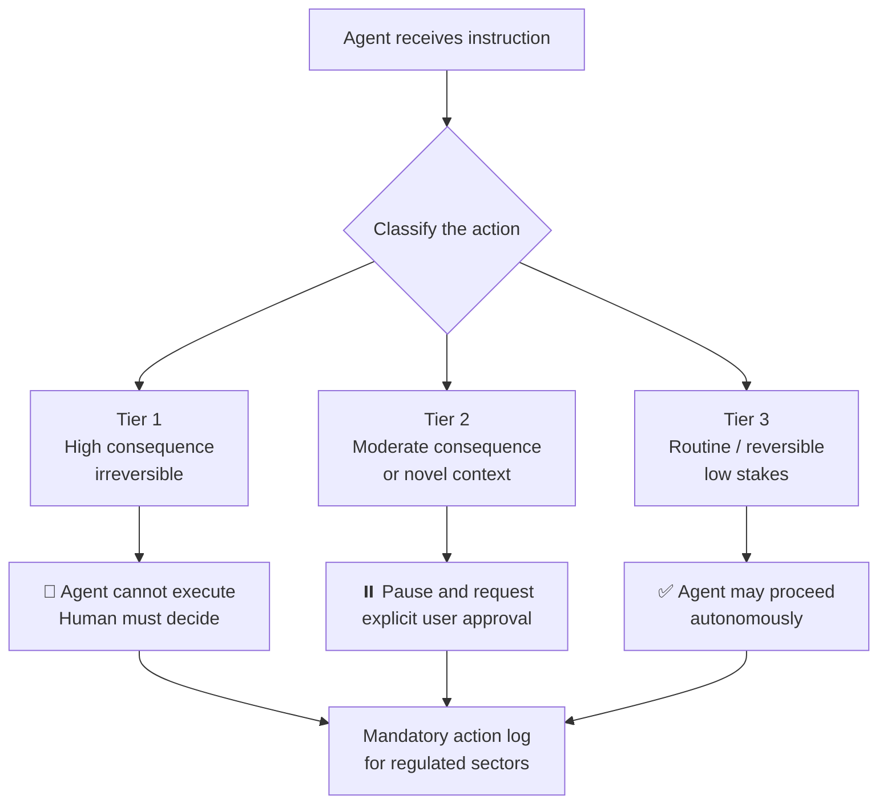
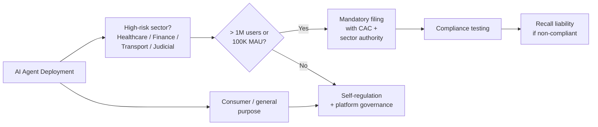

## Something Crossed the Line on July 15

On July 15, 2026, two sets of Chinese regulations became enforceable at the same moment. One targets AI agents that act in the world — scheduling appointments, executing financial transactions, routing medical decisions. The other targets AI agents that target your emotions — forming relationships, simulating love, cultivating companionship.

Both landed together because Chinese regulators see them as aspects of the same problem: **autonomous AI systems operating in high-stakes situations without adequate human oversight**.

The joint result is the world's first legal framework dedicated specifically to AI agents, predating anything in the European Union, United States, or anywhere else. For anyone building or deploying AI systems that do more than answer questions, this regulatory package sets a precedent worth understanding in detail.

---

## Two Rules, One Day

The two regulations that took effect July 15 are distinct documents with different lineages:

**1. Implementation Opinions on the Standardized Application and Innovative Development of Intelligent Agents**
Jointly issued May 8, 2026 by the Cyberspace Administration of China (CAC), the National Development and Reform Commission (NDRC), and the Ministry of Industry and Information Technology (MIIT). This is the broader framework governing agentic AI across all sectors.

**2. Interim Measures for the Administration of AI Anthropomorphic Interactive Services**
Jointly issued April 10, 2026 by the CAC and four partner agencies — the NDRC, Ministry of Industry and Information Technology, Ministry of Public Security, and State Administration for Market Regulation. This targets companion and humanlike interaction AI specifically.

Think of the first document as the structural rulebook and the second as a specific chapter within it, applied to the highest-emotional-risk category of agent.

---

## The Three-Tier Decision Framework

The most technically consequential part of the first regulation is Article 6's **three-tier decision authorization structure**. Before deploying any AI agent in China, developers must classify every action their agent might take into one of three tiers:

| Tier | Decision Type | Human Involvement |
|------|--------------|-------------------|
| **1** | High-consequence irreversible actions | Human must decide, agent may only assist |
| **2** | Moderate-consequence actions | User must explicitly approve before execution |
| **3** | Routine low-consequence actions | Agent may handle autonomously |

This is not vague guidance — it is a legal prerequisite for deployment. Users must retain "final decision-making power" over agent actions at all times, which means the system must actively surface that choice rather than burying it.



In practice, this means an AI scheduling assistant can autonomously book a meeting room (Tier 3) but must pause and ask before canceling a surgery appointment (Tier 2) and cannot by itself authorize a clinical procedure (Tier 1). The distinction isn't just philosophical — it is a software architecture requirement.

---

## Who Faces the Heaviest Obligations

Not every AI agent faces the same level of scrutiny. The Implementation Opinions adopt a risk-tiered governance model: the higher the stakes, the more direct regulatory oversight.

**High-risk sectors with mandatory filing and compliance testing:**
- Healthcare (imaging, diagnosis, treatment planning, surgical scheduling)
- Financial services
- Transportation
- Judicial services
- Public security and media

Agents deployed in these sectors must register with both the CAC and the relevant sectoral authority once they cross a threshold of **1 million registered users or 100,000 monthly active users**. Registration triggers compliance testing, and the rules include product recall provisions — meaning a non-compliant agent can be ordered off the market the way a defective physical product would be.

**Lower-risk consumer applications** are expected to rely more on platform governance, third-party evaluation, and industry self-regulation, backed by a credit scoring system that can impose penalties for violations.



The recall mechanism is globally unusual. Most AI regulatory frameworks stop at fines or mandatory modifications. China's rules go further: a high-risk agent that fails compliance testing can be recalled — suspended from operation entirely — until the problem is fixed. It treats an AI system more like a medical device or an automobile than a piece of software.

---

## When AI Companions Became a Policy Problem

The Anthropomorphic AI rules reveal a different concern: what happens when AI is designed to be emotionally compelling.

The Interim Measures define "anthropomorphic interactive services" as AI products that present human-like personas to form sustained relationships with users. This includes companion chatbots, virtual friends, relationship simulators, and any service designed around ongoing emotional engagement rather than task completion.

The regulations impose several concrete requirements on providers:

- **Mandatory identity disclosure** at the start of every session — users must know they are talking to an AI
- **Two-hour session interruption** — after two consecutive hours, the system must issue a machine-disclosure reminder and offer an exit mechanism
- **Real-time dependence detection** — providers must monitor for signs of unhealthy emotional attachment and escalate to intervention protocols
- **Anti-addiction system** — companion AI cannot be designed to cultivate or reward emotional dependence
- **Minor protections** — users under 14 require parental or guardian consent; virtual intimate-relationship services are completely banned for minors
- **Content governance** — AI-generated content within interaction flows is subject to existing content rules

The policy reasoning is unusually explicit in the regulatory text: these rules exist partly because emotional dependency on AI has been linked to declining human relationship formation and birth rates, concerns that carry particular weight in Chinese demographic policy.

---

## What Actually Happened When the Rules Hit

The compliance deadline was not abstract. ByteDance's **Doubao** and Alibaba's **Qwen** — two of China's most-used AI applications, each with tens of millions of active users — shut down their personalized companion features the moment the rules came into force.

The shutdown revealed an asymmetry in how the two companies handled user data:

- **Doubao** kept users' agent configurations and chat histories in read-only mode until October 15, 2026. Users have until that date to export their data before it is handled under ByteDance's standard data retention policy and no longer accessible within the app.
- **Qwen** made no equivalent offer. Alibaba immediately began permanently deleting companion agent configurations and conversation histories with no migration path for users.

For users who had spent months or years building relationships with these AI personas — in some cases using them as primary sources of emotional support — the data loss was not a minor inconvenience. The shutdown illustrated in sharp relief why the regulations target this category at all.

---

## How This Fits Into the Global Picture

China's July 15 rules arrive at a moment when AI agent governance is suddenly urgent everywhere, yet only China has a dedicated legal framework in place.

```mermaid
quadrantChart
    title AI Agent Regulation: Scope vs Enforcement Strength (July 2026)
    x-axis Low Scope --> High Scope
    y-axis Low Enforcement --> High Enforcement
    China Implementation Opinions: [0.80, 0.85]
    EU AI Act (Aug 2026): [0.75, 0.65]
    Illinois Frontier Audit Law: [0.30, 0.55]
    UK Adaptive Framework: [0.50, 0.35]
    US Federal (patchwork): [0.25, 0.20]
```

The **EU AI Act** becomes fully applicable on August 2, 2026 — just two weeks after China's rules — but it focuses primarily on risk classification of AI systems in general, with no agent-specific framework for autonomous decision-making tiers. The EU also relies on market-withdrawal rather than recall, a distinction that matters in practice because recall implies ongoing liability for existing deployments.

The **United States** has no federal framework governing AI agents at all. A July 14 Forbes headline captured the gap bluntly: *"China Plans AI Agent Recalls. America Can't Even Agree Who Regulates Them."* Illinois enacted a law in 2026 requiring annual independent safety audits for frontier model developers earning over $500 million in revenue — but that covers the underlying models, not the agents built on top of them.

The two frameworks that do exist — China's and the EU's — are largely incompatible as compliance tracks. A company building for both markets needs separate documentation, different governance architectures for the decision authorization model, and distinct content standards. Most multinationals treat them as two parallel workstreams rather than one.

---

## What Developers Need to Take Away

If you are building AI agents that interact with users, China's July 15 package establishes the clearest design requirements any jurisdiction has yet set down. Whether or not you operate in China, these rules preview the questions regulators everywhere will eventually ask:

1. **Can you enumerate every action your agent might take and classify it by consequence?** The three-tier framework requires this as a precondition to deployment, not an afterthought.

2. **Do users retain meaningful control, or is control merely cosmetic?** The rules define "final decision-making power" as a technical guarantee, not a UI pattern.

3. **Is your agent designed to maximize emotional engagement?** The companion AI rules treat addictive design as a legal liability, not a product virtue.

4. **What happens to user data if you are forced to shut down?** The Doubao/Qwen shutdown showed that compliance decisions cascade into data governance questions almost immediately.

5. **What is your recall response plan?** In high-risk sectors, non-compliance can trigger operational suspension — there is no such thing as "we'll fix it in the next release" at scale.

The enforcement may be in China, but the design questions are universal. The countries that figure out how to answer them — rather than waiting for a crisis to impose answers — will set the terms for the next decade of autonomous AI deployment.

---

## Sources

- [China's Agent Rules Take Effect July 15 and Illinois Mandates Third-Party Safety Audits — AI Governance Institute](https://aigovernance.com/news/chinas-agent-rules-take-effect-july-15-and-illinois-mandates-third-party-safety-audits)
- [China's AI Agent Rules: Three Tiers of Decision Authority — Pebblous Blog](https://blog.pebblous.ai/blog/china-ai-agent-decision-tiers/en/)
- [China Issues First National Policy Framework Dedicated to AI Agents — NYU Shanghai RITS](https://rits.shanghai.nyu.edu/ai/china-issues-first-national-policy-framework-dedicated-to-ai-agents/)
- [China AI: CAC Leads Release of New Rules on AI Agents in China — MMLC Group](https://mmlcgroup.com/china-ai-news-1105/)
- [China Plans AI Agent Recalls. America Can't Even Agree Who Regulates Them — Forbes](https://www.forbes.com/sites/robertszczerba/2026/07/14/china-plans-ai-agent-recalls-america-cant-even-agree-who-regulates-them/)
- [China's New Regulations on AI Anthropomorphic Interactive Services — Bird & Bird](https://www.twobirds.com/en/insights/2026/china/china's-new-regulations-on-ai-anthropomorphic-interactive-services)
- [China AI Companion Law Takes Effect: Doubao and Qwen Shut Down, Millions Lose Chat Data — TechTimes](https://www.techtimes.com/articles/320525/20260715/china-ai-companion-law-takes-effect-doubao-qwen-shut-down-millions-lose-chat-data.htm)
- [ByteDance's Doubao and Alibaba's Qwen to shut down AI agent features on July 15 — TechNode](https://technode.com/2026/07/06/bytedances-doubao-and-alibabas-qwen-to-shut-down-ai-agent-features-on-july-15/)
- [China's new AI agent framework puts healthcare in the regulatory spotlight — HealthTechAsia](https://healthtechasia.co/chinas-new-ai-agent-framework-puts-healthcare-in-the-regulatory-spotlight/)
- [AI Governance Weekly – July 16, 2026 — AI Governance Institute](https://aigovernance.com/news/ai-governance-weekly-july-16-2026)
- [Global AI Regulation Compared 2026: EU AI Act vs US vs China — SwarmSignal](https://swarmsignal.net/global-ai-regulation-comparison-2026/)
- [China Issues Interim Measures on Anthropomorphic AI Interaction Services, Effective 15 July 2026 — Licentium](https://www.licentium.io/post/china-cac-interim-measures-anthropomorphic-ai-10-april-2026)
