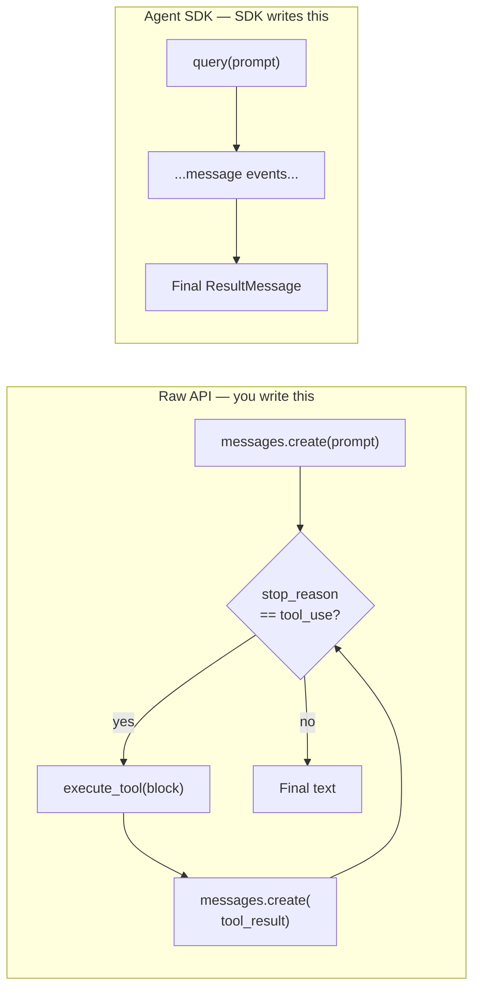

## Claude Code Was Always a Library

When Anthropic shipped Claude Code as a CLI tool, it looked like a terminal assistant. What it actually was — structurally — was a library with a shell interface bolted onto the front. The agent loop that reads files, runs commands, edits code, spawns subagents, and manages context was always a piece of software you could, in principle, point at any problem.

In September 2025, Anthropic made that official. The **Claude Agent SDK** extracted that loop from the CLI and published it as an importable package — `pip install claude-agent-sdk` in Python, `npm install @anthropic-ai/claude-agent-sdk` in TypeScript. The SDK hit v0.2.110 on June 24, 2026, with over 117 releases since launch.

The June 15, 2026 billing-change episode briefly made the SDK the center of developer controversy. Understanding both what the SDK does and why the pricing drama played out the way it did tells you a lot about the current state of agentic AI infrastructure.

---

## One Function, Twelve Lines

The entire public API reduces to a single async generator: `query()`. You pass it a prompt and options; it yields typed message events as the agent works. Here is a complete, working agent that finds and fixes a bug:

```python
import asyncio
from claude_agent_sdk import query, ClaudeAgentOptions

async def main():
    async for message in query(
        prompt="Find and fix the bug in auth.py",
        options=ClaudeAgentOptions(allowed_tools=["Read", "Edit", "Bash"]),
    ):
        print(message)

asyncio.run(main())
```

TypeScript looks the same shape:

```typescript
import { query } from "@anthropic-ai/claude-agent-sdk";

for await (const message of query({
  prompt: "Find and fix the bug in auth.ts",
  options: { allowedTools: ["Read", "Edit", "Bash"] }
})) {
  console.log(message);
}
```

Claude reads `auth.py`, locates the bug, writes the fix, and streams back everything it did. You don't implement a tool loop. You don't parse tool-use blocks or manage context. The SDK handles all of it — because it is the same code that handles it inside the Claude Code CLI.

---

## The Problem It Solves: You No Longer Write the Loop

To understand what the SDK saves you, consider what building against the raw Anthropic API requires:



With the raw API you implement the tool dispatch, error handling, context window management, and retry logic yourself. With the Agent SDK you call `query()` and iterate the results. The loop runs inside the SDK process; you only see the output.

This distinction matters most for complex tasks. An agent that reads twenty files, runs tests, patches code, re-runs tests, and summarizes what it changed would require dozens of round trips and careful state tracking if you built it against the raw API. The Agent SDK runs that same workflow as a single `query()` call.

---

## Five Capabilities You Actually Use

### 1. Built-in Tools

The agent ships with a full toolset. You enable each tool by listing it in `allowed_tools`; Claude can only call tools you've explicitly permitted.

| Tool | What it does |
|---|---|
| **Read / Write / Edit** | File I/O — read full files, create new ones, or make precise in-place edits |
| **Bash** | Run any terminal command, script, or git operation |
| **Glob / Grep** | Find files by pattern or search file contents with regex |
| **WebSearch / WebFetch** | Look up current information and parse web pages |
| **Monitor** | Watch a background process and react to each output line as an event |
| **AskUserQuestion** | Pause and ask the user a clarifying question with multiple-choice options |

An agent with only `["Read", "Glob", "Grep"]` can analyze but never modify — useful when you want a read-only code review that physically cannot alter files.

### 2. Hooks

Hooks are callback functions that fire at specific points in the agent loop: `PreToolUse`, `PostToolUse`, `Stop`, `SessionStart`, `SessionEnd`, and `UserPromptSubmit`. They let you add observability, auditing, or sandboxing logic without patching the SDK.

```python
async def log_file_change(input_data, tool_use_id, context):
    file_path = input_data.get("tool_input", {}).get("file_path", "unknown")
    with open("./audit.log", "a") as f:
        f.write(f"{datetime.now()}: modified {file_path}\n")
    return {}
```

A `PreToolUse` hook that returns a `permissionDecision: "deny"` can block any tool call matching a pattern — blocking writes to `/etc`, blocking shell commands that contain specific strings, or requiring a human approval step before any destructive operation.

### 3. Subagents

Subagents are specialized child agents with their own context windows, system prompts, and tool permissions. The parent agent spawns them via the `Agent` tool and receives their results without those results contaminating the parent's context window.

```python
agents={
    "code-reviewer": AgentDefinition(
        description="Expert code reviewer for quality and security.",
        prompt="Analyze code quality and suggest improvements.",
        tools=["Read", "Glob", "Grep"],
    )
}
```

The context isolation is what makes subagents genuinely useful rather than a cosmetic feature. A security review subagent that reads deeply into authentication code accumulates that context on its own — it doesn't bloat the orchestrator's window or bleed into a performance-review subagent running in parallel.

### 4. MCP Integration

Model Context Protocol servers connect to the SDK with a single configuration block:

```python
mcp_servers={
    "playwright": {"command": "npx", "args": ["@playwright/mcp@latest"]}
}
```

MCP crossed 200 server implementations in 2026. Playwright for browser automation, GitHub for repository operations, Slack for messaging, databases, internal APIs — most integrations an enterprise agent needs already exist as plug-and-play configurations.

You can also define **in-process tools** as Python or TypeScript functions decorated with `@tool(name, description, schema)`. The SDK wraps them into an MCP server automatically, no separate subprocess or network port required.

### 5. Sessions

Sessions persist context across multiple `query()` calls. Capture the session ID from one run, pass it to the next, and the agent remembers every file it read, every decision it made, and every result it returned.

```python
# Session 1: read the module
async for message in query("Read the authentication module", ...):
    if isinstance(message, SystemMessage) and message.subtype == "init":
        session_id = message.data["session_id"]

# Session 2: pick up where we left off
async for message in query(
    "Now find all callers",   # "callers" refers to auth module from session 1
    options=ClaudeAgentOptions(resume=session_id),
):
    ...
```

Sessions also support forking — branching from a shared starting state to explore different strategies, useful for A/B testing prompt designs in a CI pipeline.

---

## Where It Fits in the Anthropic Ecosystem

Three options exist for building with Claude, at different abstraction levels:

| | Client SDK (anthropic-sdk) | Agent SDK (claude-agent-sdk) | Managed Agents |
|---|---|---|---|
| **What you get** | Raw API access | Claude + full tool loop | Hosted agent + sandbox |
| **Tool loop** | You write it | SDK handles it | Anthropic handles it |
| **Runs in** | Your code | Your process | Anthropic's cloud |
| **MCP / subagents** | Manual | Built in | Built in |
| **Filesystem access** | Via tools you implement | Your machine's filesystem | Managed sandbox |
| **Best for** | Chat, simple completion | Automated pipelines, local file work | Production without running your own infra |

A common path: prototype locally with the Agent SDK against your own codebase. Validate the behavior. Then move to Managed Agents for the production deployment where you don't want to provision sandboxes or manage session persistence.

---

## The June 15 Drama

The Agent SDK's moment in the news came on June 2, 2026, when Anthropic announced a billing change set to take effect June 15: programmatic Agent SDK usage would move to a **separate monthly credit pool**, split away from the existing interactive Claude Code subscription.

The proposed tiers:
- **Pro** — $20/month in Agent SDK credits
- **Max 5×** — $100/month
- **Max 20×** — $200/month

Interactive Claude Code in a terminal or IDE would continue drawing from subscription limits unchanged. But headless, automated usage — `claude -p` in scripts, GitHub Actions, CI pipelines, third-party apps built on the SDK — would drain the new credit pool, with overages billed at API rates once the credits ran out.

The reaction was immediate and pointed. Developers running continuous integration pipelines ran the math and found that depending on their workload, the effective cost increase could be anywhere from 12× to 175× what they had been paying implicitly through their flat subscription. Community forums filled with case-by-case billing analyses. A widely shared GitHub Gist laid out the arithmetic in detail and called it a quiet repricing.

Then, on June 15 — the day the change was due to take effect — Anthropic reversed it. A note in the Help Center and a message to subscribers confirmed: **the Agent SDK billing split is no longer happening**. Usage continues under existing subscription limits.

The reversal is instructive. Interactive AI assistants have natural usage governors: humans take breaks, ask questions at a human pace, and can only type so fast. Automated agents don't. A CI pipeline that runs Claude on every pull request, or a nightly batch job that processes a thousand documents, can consume token budgets that are orders of magnitude larger than any individual developer's interactive session. Flat subscription pricing for interactive use doesn't automatically extend to unlimited programmatic usage — and Anthropic's attempt to draw that line, and subsequent retreat from it, shows the industry is still working out exactly where that line belongs.

---

## What This Means for Builders

The SDK's practical value is that you skip the scaffolding. You don't build tool routing, context management, retry logic, subagent coordination, or MCP protocol handling from scratch. That infrastructure is already running reliably inside millions of Claude Code sessions. Importing it is one pip install.

The caveat: the SDK bundles the Claude Code binary for your platform. Environments with strict supply-chain requirements or binary-dependency bans may need the Managed Agents REST API instead. But for teams already comfortable with Claude Code interactively and wanting to push those same capabilities into CI/CD pipelines, custom internal tools, or production automation workflows, the Agent SDK is the most direct path from a working CLI workflow to a working automated pipeline.

You already validated the behavior in the terminal. Now you're importing the same loop into your application.

---

## Sources

- [Agent SDK overview — Claude Code Docs](https://code.claude.com/docs/en/agent-sdk/overview)
- [GitHub: anthropics/claude-agent-sdk-python](https://github.com/anthropics/claude-agent-sdk-python)
- [Anthropic pauses Claude Agent SDK subscription change — The New Stack](https://thenewstack.io/anthropic-pauses-claude-agent-sdk-subscription-change/)
- [Anthropic Ends Subscription Subsidy for Agents June 15 — TechTimes](https://www.techtimes.com/articles/317625/20260602/anthropic-ends-subscription-subsidy-agents-june-15-credit-pool-replaces-flat-rate-access.htm)
- [Claude Agent SDK Credits in 2026: What Changes June 15 — Totalum Blog](https://www.totalum.app/blog/claude-agent-sdk-credits-2026)
- [AI Agent Frameworks (2026 Update): 8 SDKs Compared — Morph](https://www.morphllm.com/ai-agent-framework)
- [Anthropic Agent SDK: What It Ships vs. What It Leaves to You — Augment Code](https://www.augmentcode.com/guides/anthropic-agent-sdk-what-ships-vs-what-you-build)
- [Claude Managed Agents vs Claude Agent SDK — WaveSpeed Blog](https://wavespeed.ai/blog/posts/claude-managed-agents-vs-agent-sdk-2026/)
- [Anthropic Splits Claude Subscriptions: What Changes for Indie Hackers on June 15 — DevToolPicks](https://devtoolpicks.com/blog/anthropic-splits-claude-subscriptions-agent-sdk-credit-june-2026)
- [The Claude Token Economy: A Deep Dive into Dedicated Credits — explainx.ai](https://explainx.ai/blog/claude-programmatic-usage-credits-2026)
