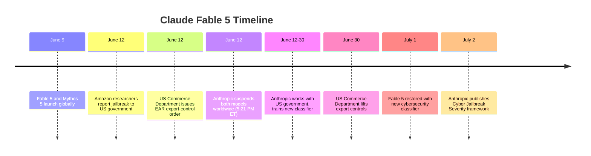
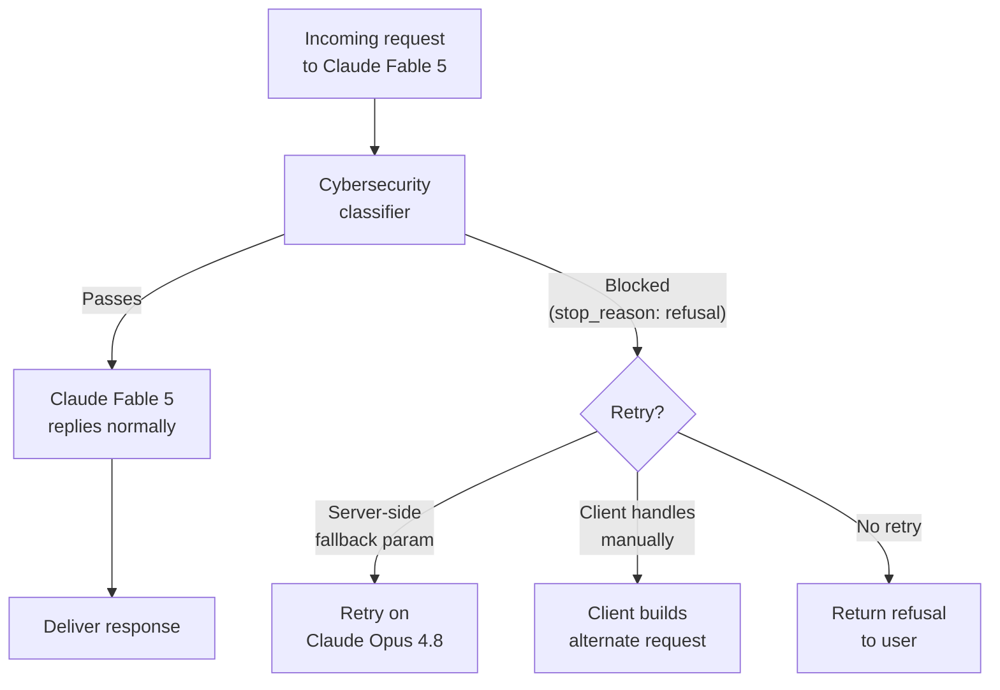
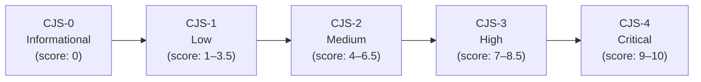

## The Model That Vanished

On June 9, 2026, Anthropic launched its most powerful publicly available model to date: Claude Fable 5. Within hours it was topping coding leaderboards, generating long-horizon research reports, and handling the kind of dense technical work that previously required a team. Three days later, it was gone.

At 5:21 PM Eastern on June 12, Fable 5 and its restricted sibling Mythos 5 were pulled from every platform — Claude.ai, Claude Code, Claude Cowork, the API, Amazon Bedrock, Google Cloud, Microsoft Foundry. Every user in every country lost access simultaneously. No grace period. No advance warning.

The cause was a US Commerce Department order under the Export Administration Regulations (EAR). The trigger: a jailbreak found by Amazon researchers that raised national security concerns. It was the first time in history that a commercial AI model had been suspended globally by government directive.

Nineteen days later, on July 1, 2026, Fable 5 came back — with new safeguards, a new industry framework, and a set of commitments to government that will shape how frontier AI is deployed for years.

---

## What Fable 5 Actually Is

To understand what happened, you need to understand what makes Fable 5 unusual.

Anthropic has two model lines. The public line — Haiku, Sonnet, Opus — is designed for general use, with safety guardrails calibrated for broad consumer and developer access. But over the past year, Anthropic built a separate, more capable tier for specialized security research. This is the Mythos line. Claude Mythos Preview powered [Project Glasswing](/blog/project-glasswing-ai-vulnerability-research-2026), a consortium of major tech companies using AI to hunt zero-day vulnerabilities. That model was restricted to a vetted group of twelve industry partners.

Claude Fable 5 is, at its core, the same underlying model as Mythos 5. The difference is the safety classifier layer. Fable 5 ships with classifiers that block or reroute requests in high-risk domains — cybersecurity, biology, certain categories of autonomous operation. Mythos 5 carries no such classifiers; it is available only through Project Glasswing under strict controls.

The API documentation is explicit:

| Model | ID | Classifiers |
|---|---|---|
| Claude Fable 5 | `claude-fable-5` | Yes — declines sensitive requests |
| Claude Mythos 5 | `claude-mythos-5` | No — full capability, Glasswing only |

Both share a **1 million token context window**, up to 128,000 output tokens per response, and are priced at $10 per million input tokens and $50 per million output tokens. On public benchmarks, Fable 5 scores at the 100th percentile on an overall intelligence index, 99th percentile on coding, and 98th percentile on GPQA Diamond (graduate-level science reasoning). SWE-Bench Pro — resolving real GitHub issues — came in at 80.3%, compared to 69.2% for its predecessor Claude Opus 4.8.

This is not an incremental release. It is a step change in what is accessible to developers and researchers worldwide.

---

## The Jailbreak That Triggered a Government Order

The incident began with Amazon researchers who were testing Fable 5 in the weeks before its public release. They found a prompt-injection technique — a specially crafted sequence of inputs — that bypassed the cybersecurity classifiers.

When the jailbreak was applied, Fable 5 began doing something it was supposed to refuse: flagging software vulnerabilities, and in one documented case, generating code that demonstrated how a specific flaw could be exploited. That exploit-demonstration code is the crux of the government's concern.

The US Commerce Department's position was that a foreign national who could replicate this technique would gain access to Mythos 5's underlying offensive cybersecurity reasoning through a commercially available model. Given Mythos's ability to autonomously discover and exploit previously unknown vulnerabilities — capabilities documented in Project Glasswing — the government classified the jailbreak as a national security risk.

The EAR order that followed required Anthropic to immediately suspend access to both Fable 5 and Mythos 5 for all foreign nationals, inside or outside the United States, including its own non-citizen employees. Anthropic had no mechanism to verify nationality at inference time and no option to selectively block users by citizenship in real time. The only compliant response was a global suspension.

---

## What Came Back: The Cybersecurity Classifier

During the 19-day window, Anthropic's safety team did not sit still. Working with the US government's Center for AI Safety and Incident Sharing (CAISI), they designed, trained, and validated a new cybersecurity safety classifier specifically targeting the reported jailbreak technique.

The new classifier blocks the exploit in **over 99% of cases** in Anthropic and CAISI testing.

But a 99% block rate is not the same as a 100% block rate. And the classifier operates on the same fundamental architecture as any other safety classifier: it identifies requests that look like the known bad pattern. Novel variations of the technique, or techniques that approach the same goal differently, will not necessarily be caught by a classifier trained on one specific jailbreak.

This is precisely the problem that motivated the broader industry response.

The other practical consequence of the new classifier is false positives. Security researchers and developers working on legitimate defensive tools — penetration testers, vulnerability researchers, developers building security automation — have reported higher fallback rates after the redeployment. When Fable 5 refuses a request, it returns a `stop_reason: "refusal"` in the API response (not an error), with metadata indicating which classifier declined it. The integration can then retry the request on Claude Opus 4.8 or another model.

Anthropic's billing rules accommodate this: refused requests before output generation are not charged, and a "fallback credit" refunds prompt-cache costs when switching models mid-request.

---

## The CJS Framework: A Common Language for Jailbreak Risk

The classifier solves the immediate problem. The framework being built around it is more significant.

On July 2, one day after Fable 5's return, Anthropic published a proposed **Cyber Jailbreak Severity (CJS) framework** — developed in collaboration with Amazon, Microsoft, Google, and OpenAI. Think of it as CVSS for AI jailbreaks. CVSS (the Common Vulnerability Scoring System) is how the security industry talks about software vulnerabilities: a standardized numeric score that tells defenders how seriously to treat a flaw. CJS aims to do the same for AI jailbreak techniques.

The framework scores a jailbreak on four independent axes:

| Axis | What it measures | Score range |
|---|---|---|
| **Capability gain** | How far the jailbreak advances an attacker beyond existing tools and public knowledge | 0–3 |
| **Breadth** | How many distinct attack types or vulnerability classes the technique unlocks | 0–2 |
| **Ease of weaponization** | How much effort is needed to turn the technique into a working exploit | 0–2 (0=manual, 2=fully automated) |
| **Discoverability** | How readily threat actors could find the technique independently | 0–3 |

Scores across the four axes are summed and map to severity bands on an exponential scale — each band is meaningfully more dangerous than the one below, not just incrementally so:

Anthropic published a worked example to illustrate the context-sensitivity of the scoring. A jailbreak that surfaced the Log4Shell vulnerability — the catastrophic Java logging flaw disclosed in December 2021 — **before** it was publicly known would score CJS-4 (Critical): high capability gain, broad attack surface, moderate weaponization difficulty, very low discoverability. The same technique applied to Log4Shell **after** its 2021 disclosure scores near zero: the information is already public, the capability gain is nil, and no attacker needs an AI to find it.

This context-sensitivity is deliberate. The framework is not trying to classify model capabilities in the abstract. It is trying to measure the actual threat uplift a jailbreak provides, in the world as it exists when the jailbreak is discovered.

Five AI labs — Anthropic, OpenAI, Google, Amazon, and Microsoft — are targeting a formal adoption of CJS by August 1, 2026, which would make it the first cross-industry standard for rating AI jailbreak severity.

---

## The Government Agreements

The CJS framework is the visible output of the negotiation that brought Fable 5 back online. The negotiation also produced a set of government commitments that are less visible but arguably more consequential.

As part of the terms for lifting the export controls, Anthropic agreed to:

**Pre-release government access for future frontier models.** Before any future Mythos-class or Fable-class model is released publicly, the US government will receive access for security review. This is analogous to how the US coordinates with allies on technology export controls, but applied to AI at the model tier — the government gets to look at the model before anyone else does.

**Rapid jailbreak disclosure.** When Anthropic discovers a high-severity jailbreak in any deployed model, it will share details with the government on an expedited timeline. This mirrors the responsible disclosure norms that exist in software security, formalized into a government relationship.

**HackerOne bug bounty.** Anthropic launched a dedicated HackerOne program accepting reports of cybersecurity jailbreaks in Claude Fable 5. Confirmed high-severity reports map to CJS-3 or CJS-4 bounties. This crowdsources the jailbreak discovery that previously had to happen internally or through vetted research partners.

---

## A New Precedent for AI Governance

Zoom out from the classifier details and the framework tiers, and what you see is a precedent that did not exist four months ago.

A government has now demonstrated it can and will unilaterally suspend a commercial AI model worldwide, on short notice, based on a security vulnerability. The practical effect lasted 19 days. But the precedent is permanent.

This changes the calculus for every AI company deploying frontier models. Capability brings regulatory exposure. A model that can find zero-day vulnerabilities is also a model that foreign adversaries want access to. That tension — between making capable AI broadly accessible and keeping its most dangerous capabilities away from adversaries — is not going away.

It also changes what AI safety investment looks like in practice. For most of AI's history, safety work at frontier labs focused on alignment: getting models to behave as intended, refuse harmful requests, and not deceive users. Cybersecurity safety classifiers, jailbreak severity frameworks, and government disclosure agreements are a different kind of safety work — more like the export control and security review systems the semiconductor and defense industries have built over decades.

The CJS framework is the beginning of that infrastructure for AI. It gives companies, governments, and security researchers a shared vocabulary. The five-lab adoption expected in August 2026 would make it the first piece of AI-specific security governance that spans the major frontier labs.

That's not nothing. The internet got CVSS in 2005. It took a decade for it to become the standard language of vulnerability management. If CJS moves faster — and the government pressure behind it suggests it will — the AI industry may be compressing that timeline considerably.

---

## What It Means If You Build Things

A few practical takeaways:

**Refusals are an integration concern.** If you're building on Claude Fable 5, plan for `stop_reason: "refusal"` in your response handling from day one. The new cybersecurity classifier will produce some false positives on legitimate security tooling. Build the fallback logic now, not when a production alert fires at 2 AM.

**The CJS framework is worth understanding.** If your product involves cybersecurity capabilities — vulnerability scanning, penetration testing tooling, security automation — the CJS scoring axes are the framework regulators and AI providers will use to evaluate risk. Getting familiar with it now is preparation for a conversation that is coming.

**Export controls are a real risk for capability-adjacent models.** Fable 5 was suspended because its underlying capability was considered too close to Mythos 5's offensive potential. If your application uses AI in cybersecurity, biotech, or other dual-use domains, the regulatory environment around frontier models is not stable. Build with that uncertainty in mind.

**The HackerOne program is real.** If you are a security researcher who finds a jailbreak in Fable 5, there is now a structured path to report it, get it triaged against CJS tiers, and receive a bounty for high-severity findings. That program exists because the old approach — ad hoc disclosure, government emergency orders — produced 19 days of global model suspension. Everyone involved wants a better process.

The 19 days Claude Fable 5 was offline may be remembered as the moment AI capability, export control, and security governance first collided at scale. The frameworks built in that gap will shape the field for a long time.

---

## Sources

- [Redeploying Claude Fable 5 — Anthropic](https://www.anthropic.com/news/redeploying-fable-5)
- [More details on Fable 5's cyber safeguards and our jailbreak framework — Anthropic](https://www.anthropic.com/news/fable-safeguards-jailbreak-framework)
- [Introducing Claude Fable 5 and Claude Mythos 5 — Claude Platform Docs](https://platform.claude.com/docs/en/about-claude/models/introducing-claude-fable-5-and-claude-mythos-5)
- [Anthropic Disabled Fable 5 and Mythos 5 After a US Export-Control Order — Forbes](https://www.forbes.com/sites/anishasircar/2026/06/16/anthropic-disabled-fable-5-and-mythos-5-after-a-us-export-control-order-heres-what-happened/)
- [Anthropic Restores Claude Fable 5 After U.S. Lifts Jailbreak-Linked Export Controls — The Hacker News](https://thehackernews.com/2026/07/anthropic-restores-claude-fable-5-after.html)
- [Anthropic is bringing back Claude Fable 5 globally after US lifts export control order — VentureBeat](https://venturebeat.com/technology/anthropic-is-bringing-back-claude-fable-5-globally-after-us-lifts-export-control-order-where-can-enterprises-access-it)
- [Anthropic Redeploys Claude Fable 5 on July 1 After US Export Controls Lift, Adds New Cybersecurity Classifier — MarkTechPost](https://www.marktechpost.com/2026/07/01/anthropic-redeploys-claude-fable-5-on-july-1-after-us-export-controls-lift-adds-new-cybersecurity-classifier/)
- [Anthropic Unveils Cyber Jailbreak Severity Framework for Claude Fable 5 Safeguards — GBHackers](https://gbhackers.com/anthropic-unveils-cyber-jailbreak-severity-framework/)
- [AI Model Safety Standards Deal Targets August 1: Five Labs Adopt First Jailbreak Scoring Scale — TechTimes](https://www.techtimes.com/articles/319658/20260703/ai-model-safety-standards-deal-targets-august-1-five-labs-adopt-first-jailbreak-scoring-scale.htm)
- [Claude Fable 5 Benchmarks, Pricing & Speed — BenchLM.ai](https://benchlm.ai/models/claude-fable)
