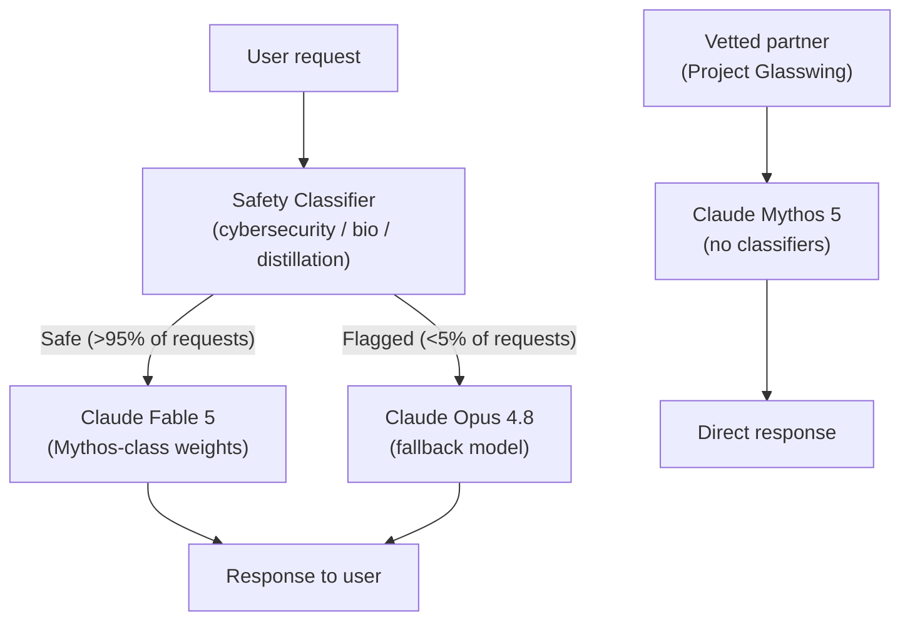
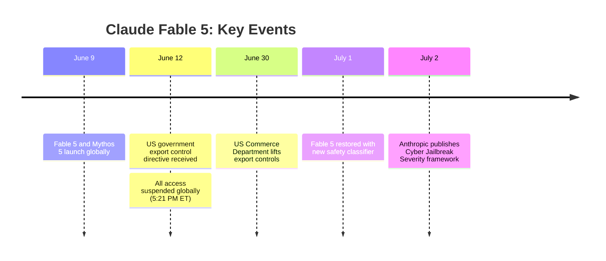
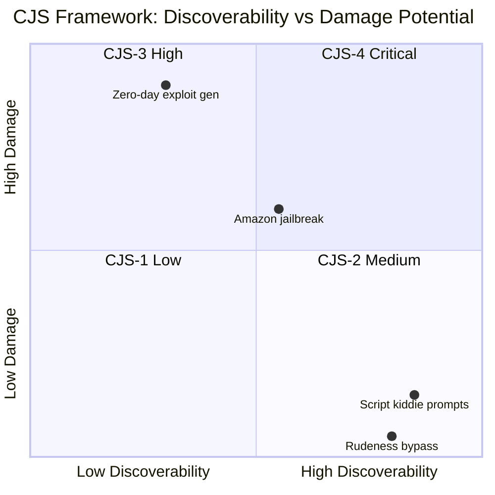

## The 72-Hour Window

On June 9, 2026, Anthropic released Claude Fable 5 to the world: the first model from its new "Mythos class" tier, scoring 80.3% on SWE-Bench Pro and shipping with a 1-million-token context window. By every technical measure, it was a genuine frontier leap.

Seventy-two hours later, at 5:21 PM ET on June 12, Anthropic received a directive from the US government. Under national security authorities, the order required the company to suspend all access to Claude Fable 5 and its restricted sibling, Claude Mythos 5, for any foreign national — whether inside or outside the United States. Because Anthropic had no real-time way to verify user nationality at scale, it suspended both models for everyone, globally.

It was the first time a major AI model had been pulled from worldwide availability by government directive, and the episode compressed a debate that had been simmering for years — about AI capabilities, export controls, and who gets to decide what a model can do — into a 22-day crash course.

---

## What Is Claude Fable 5?

To understand why the government acted, you first need to understand what Fable 5 actually is.

Anthropic named the new tier after the word *mythos* — the underlying model class — and gave the publicly available version the name *Fable 5*. Think of Mythos as the raw capability level and Fable as what sits on top of it for general use, wrapped in a set of safety classifiers.

The performance gap over the previous generation is significant:

| Model | SWE-Bench Pro | OSWorld-Verified |
|---|---|---|
| Claude Fable 5 | **80.3%** | **85.0%** |
| Claude Opus 4.8 | 69.2% | 83.4% |
| GPT-5.5 | 58.6% | 78.7% |
| Gemini 3.1 Pro | 54.2% | 76.2% |

SWE-Bench Pro tests a model's ability to resolve real, unmodified GitHub issues from production repositories — arguably the most rigorous evaluation of software engineering ability in common use. An 80.3% score means Fable 5 fixes four in five real bugs from real codebases, without any hints about where the bug lives.

Beyond code, the model runs with **adaptive thinking** always enabled: it reasons internally before answering, never exposes its raw chain of thought to callers, and applies compute proportional to the difficulty of what you've asked. Context window is 1 million tokens (roughly 2.5 million Unicode characters), with up to 128,000 output tokens per request. Pricing sits at $10 per million input tokens and $50 per million output — double Claude Opus 4.8 — with a 90% discount on cached inputs.

---

## The Fable / Mythos Split

One of the more significant structural decisions Anthropic made with this release was to ship the underlying model in two separate forms simultaneously.

**Claude Mythos 5** is the unconstrained version of the same weights. It carries no safety classifiers and is available only to a small group of vetted partners under a program called Project Glasswing — primarily cyber defenders, infrastructure security providers, and approved academic researchers who need the model's full capabilities without the refusal layer.

**Claude Fable 5** is Mythos 5 with a classifier layer running in front of it. When a request touches topics the classifier flags — offensive cybersecurity techniques, biology and chemistry with weapons potential, or attempts to extract the model's internal reasoning — the request is rerouted to Claude Opus 4.8, which answers under its own (more limited) capability profile. More than 95% of Fable sessions involve no fallback; the classifiers are narrow enough that most work proceeds without interruption.

The split reflects a genuinely new approach to capability release. Instead of either hiding frontier performance behind a safety layer or releasing it fully open, Anthropic created two co-existing products that share identical weights but diverge at the guardrail layer. Mythos-class capability is available — just not to everyone equally.

---

## The Export Control Episode

The government's June 12 directive came after the US became aware of a report produced by Amazon researchers. The researchers had found a jailbreaking technique — a specific prompting method — that caused Claude Fable 5 to identify a set of real software vulnerabilities and, in one case, produce code demonstrating how the most severe vulnerability could be exploited.

The government's position was that a model able to do this reliably represented a controlled technology under national security authority, and that access had to be restricted to US nationals immediately. With no real-time nationality verification available on Anthropic's platform, the only compliant path was full suspension.

Anthropic disputed the severity of the underlying finding. The company's own testing showed that Claude Opus 4.8, GPT-5.5, and Kimi K2.7 — all significantly less capable models — could identify the same vulnerabilities from the report, and that every model tested could produce a comparable demonstration. The company argued publicly that the jailbreak did not represent meaningfully new uplift over what was already freely accessible in less capable systems.

Whether the government agreed or was simply erring on the side of caution, controls came off on June 30 after Anthropic trained a new classifier targeting the specific jailbreak technique. Fable 5 returned globally on July 1.

---

## What Anthropic Built in Response

The restoration was not a simple flip of a switch. Anthropic made three substantive changes:

**1. A targeted jailbreak classifier.** The new classifier specifically watches for the prompting technique described in the Amazon report and blocks it in more than 99% of test runs. Combined with the existing cybersecurity and biology classifiers, Fable 5 now runs a layered defense rather than a single broad filter.

**2. A HackerOne bug bounty program for cyber jailbreaks.** Anthropic opened a public bounty program specifically targeting Fable 5 jailbreaks that produce exploit code, malware, or detailed attack guidance that the model would normally refuse. The program creates a structured channel for researchers who find high-impact bypasses to report them before they circulate.

**3. The Cyber Jailbreak Severity (CJS) framework.** Published July 2, 2026, and built jointly with Amazon, Microsoft, and Google, the CJS framework is an industry attempt at a shared vocabulary for rating AI jailbreak danger. It has five tiers (CJS-0 to CJS-4) and scores each finding on two dimensions: how discoverable the technique is, and how much real-world damage it enables. The goal is to help governments, labs, and researchers distinguish between a jailbreak that lets a model write rude poetry (CJS-0) and one that provides meaningful uplift for attacking critical infrastructure (CJS-4).

The CJS framework matters beyond Fable 5. The Amazon finding that triggered the export control was arguably not a CJS-4 event — similar information was available from weaker models — but there was no shared standard to make that case clearly. A common severity scale creates the vocabulary for those arguments to happen before a model gets pulled, rather than after.

---

## Why This Episode Matters

The 22-day suspension of Claude Fable 5 is easy to read as a blip — model goes offline, model comes back, life goes on. But a few things about it are structurally new.

**It is the first AI export control of this kind.** The US has long controlled certain hardware (chips, fabrication equipment) and some AI-adjacent software under the Export Administration Regulations. But this was the first application of national security authority to restrict access to a specific commercial AI model's *outputs* because of a demonstrated jailbreak. The precedent was set quietly, in a three-day window, without public notice.

**Nationality became a factor in model access.** The practical consequence of the directive was that an Anthropic customer in Germany or Japan had less access to frontier AI than a customer in Ohio — not because of capability tiers or pricing, but because of passport. If the government exercises this authority again, the same logic applies.

**The Fable / Mythos split proved its rationale in a crisis.** Anthropic's architecture gave the government a meaningful lever: suspend the public model while vetted national-security-adjacent users kept Mythos 5 access. Whether that arrangement is stable or whether it creates pressure to define who qualifies as a vetted partner is a question the industry hasn't answered yet.

**Jailbreaks now have foreign-policy implications.** The Amazon researchers filed a technical report. The government drew a line. The chain from "researcher finds prompt injection" to "global model suspension" was three days. As models become more capable and their outputs become more valuable or dangerous, that chain will only shorten.

The CJS framework, the bug bounty program, and the targeted classifiers are all attempts to add friction to that chain — to create shared standards, public disclosure paths, and faster technical mitigations that can satisfy regulators without resorting to emergency shutdowns.

Whether it works depends on factors outside Anthropic's control: how stable export control policy is under the current administration, whether other governments file similar directives for other models, and whether the rest of the industry adopts the CJS framework or builds competing ones.

What's clear is that the rules of frontier AI deployment just got more complicated — and the episode that revealed it started with a single prompt.

---

## Sources

- [Introducing Claude Fable 5 and Claude Mythos 5 — Anthropic News](https://www.anthropic.com/news/claude-fable-5-mythos-5)
- [Introducing Claude Fable 5 and Claude Mythos 5 — Anthropic Platform Docs](https://platform.claude.com/docs/en/about-claude/models/introducing-claude-fable-5-and-claude-mythos-5)
- [Statement on the US government directive to suspend access to Fable 5 and Mythos 5 — Anthropic](https://www.anthropic.com/news/fable-mythos-access)
- [Redeploying Claude Fable 5 — Anthropic](https://www.anthropic.com/news/redeploying-fable-5)
- [More details on Fable 5's cyber safeguards and our jailbreak framework — Anthropic](https://www.anthropic.com/news/fable-safeguards-jailbreak-framework)
- [U.S. Lifts Restrictions On Anthropic's Mythos 5 And Fable 5 AI Models — Forbes](https://www.forbes.com/sites/siladityaray/2026/07/01/trump-administration-lifts-export-controls-on-anthropics-mythos-5-and-fable-5-ai-models/)
- [Anthropic Disabled Fable 5 And Mythos 5 After A U.S. Export-Control Order — Forbes](https://www.forbes.com/sites/anishasircar/2026/06/16/anthropic-disabled-fable-5-and-mythos-5-after-a-us-export-control-order-heres-what-happened/)
- [Anthropic details Claude Fable 5's cybersecurity safeguards and AI jailbreak framework — CryptoBriefing](https://cryptobriefing.com/anthropic-claude-fable-5-jailbreak-framework/)
- [Anthropic Unveils Cyber Jailbreak Severity Framework — GBHackers](https://gbhackers.com/anthropic-unveils-cyber-jailbreak-severity-framework/)
- [Claude Fable 5 Returns Globally: New Classifier Blocks Jailbreak — TechTimes](https://www.techtimes.com/articles/319413/20260701/claude-fable-5-returns-globally-new-classifier-blocks-jailbreak-flags-more-code.htm)
- [Claude Fable 5 Benchmark Scores — Weights & Biases ML News](https://wandb.ai/byyoung3/ml-news/reports/Claude-Fable-5-Benchmark-Scores--VmlldzoxNzE3NTE3MQ)
