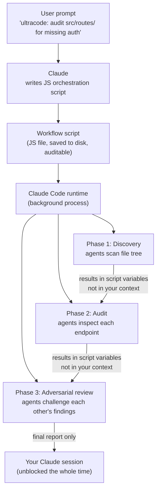

## The Context Window Was Always the Limit

Ask Claude to audit a large codebase for missing authentication checks and it will do a good job — for a while. Every file it reads, every issue it flags, and every explanation it writes accumulates in the context window. Eventually the window fills. Early findings get pushed out. The model loses track of decisions it made thirty tool calls ago. Complex, long-running tasks would hit this wall almost by design.

The real constraint was never the model's intelligence. It was **where the plan lived**.

With Claude Opus 4.8, released on May 28, 2026, Anthropic has a structural answer: move the orchestration plan out of Claude's context window and into an executable JavaScript script. The result is a new primitive called **Dynamic Workflows** — a mechanism that can coordinate up to 1,000 subagents on a single task while keeping your session completely responsive throughout.

---

## The Headline Numbers First

Before getting into the architecture, the benchmark jump in Opus 4.8 deserves attention.

Opus 4.8 scores **69.2% on SWE-bench Pro**, up from 64.3% for Opus 4.7 — a nearly five-point gain. For context, GPT-5.5 sits at 58.6% and Gemini 3.1 Pro at 54.2% on the same benchmark. SWE-bench Pro tests a model's ability to resolve real, unmodified GitHub issues in production repositories, making it one of the most rigorous evaluations for software engineering capability.

The other meaningful improvement is in **honest reporting**. Opus 4.8 flags its own code flaws roughly four times more often than Opus 4.7, and produces dishonest summaries of agentic coding work approximately seventeen times less often than Claude Sonnet 4.6. As AI models take on longer autonomous tasks, an AI that quietly glosses over the bugs it introduced becomes a real liability. These honesty improvements directly target that failure mode.

Pricing held steady at **$5 per million input tokens and $25 per million output tokens** — the same as Opus 4.7. No price bump for a frontier release is unusual, and it's the most immediately practical reason to upgrade.

---

## Dynamic Workflows: The Architecture Shift

The central idea is simple but consequential: **the orchestration plan becomes code, not conversation**.

In every previous Claude Code approach, Claude was the orchestrator. It would decide which subagent to spawn next, review that agent's output, add it to its context window, then decide what to do next. This worked for a handful of delegated tasks, but the context window grew with every round trip. Coordinate a hundred agents this way and you'd have a hundred sets of intermediate results competing for space inside a single context — exactly the problem you're trying to solve by using agents in the first place.

A dynamic workflow replaces that pattern entirely. When you ask Claude to run a workflow — either by typing a natural-language phrase like "use a workflow to audit every endpoint under `src/routes/`" or the trigger keyword `ultracode` — Claude writes a JavaScript script for the task. A dedicated runtime then executes that script **in the background**, completely separate from your conversation. Intermediate results live in script variables, not Claude's context. The model only receives the final answer when everything is complete.



The script itself has a deliberate constraint: it **cannot directly touch the filesystem or shell** — only the agents it spawns can do that. This keeps orchestration logic clean and auditable. You can read the script Claude wrote, modify it, and rerun it. The runtime caps runs at **16 concurrent agents** (bounded by local CPU cores) and **1,000 agents total per run** (to prevent runaway loops).

---

## How Workflows Compare to Subagents

Claude Code now has four multi-step primitives. Knowing which to reach for saves time:

| | Subagents | Skills | Agent Teams | Workflows |
|---|---|---|---|---|
| **Who orchestrates** | Claude, turn by turn | Claude, following a prompt | Lead agent, turn by turn | The script |
| **Where results live** | Context window | Context window | Shared task list | Script variables |
| **Scale** | A few tasks per turn | Same as subagents | Handful of long-running peers | Dozens to hundreds per run |
| **Repeatable** | Worker definition | Instructions | Team definition | The orchestration itself |
| **Resumable** | No — restarts the turn | No — restarts the turn | Teammates keep running | Yes — within the same session |

The resumability column is practically useful. A workflow persists as a file and the runtime tracks each agent's result as it goes. Pause a run with `p` in `/workflows`, do something else, then resume — completed agents return their cached results; only incomplete ones re-execute.

---

## Effort Modes: A Dial for Thinking Depth

Opus 4.8 formalizes an explicit effort control system. Every mode consumes the same per-token price; they differ only in how many tokens the model spends reasoning before it answers:

| Mode | When to use | Relative token spend |
|---|---|---|
| **low** | Quick questions, simple edits | Minimal |
| **high** (default) | Routine coding and analysis | Similar to Opus 4.7 default |
| **xhigh** | Hard problems, long async workflows | Higher |
| **max** | Maximum depth on the hardest tasks | Highest |
| **ultracode** | Whole-session workflow automation | Per-task variable |

Ultracode is the top setting and combines `xhigh` reasoning with **automatic workflow orchestration**. With `/effort ultracode` active, Claude decides when a task warrants a workflow without being asked. A single prompt can trigger a chain: one workflow to understand the codebase, one to make the changes, one to verify them. Because it applies to every task in the session, it's best reserved for deep-focus work.

Opus 4.8 also ships a **Fast Mode** endpoint at $10 input / $50 output per million tokens — 3× cheaper and roughly 2.5× faster than the standard endpoint. For teams running Opus-class intelligence in high-throughput pipelines, Fast Mode removes the hard choice between quality and cost.

---

## What It Looks Like in Production

Three early users from the research preview illustrate the range of tasks workflows handle:

**Security audits across a large codebase.** Alessio Vallero, Senior Engineering Manager at Klarna, used Dynamic Workflows for production code security audits — scanning for missing authentication patterns, fragile input validation, and insecure snippets copy-pasted across microservices. A review that would take a security team several days ran as a parallel sweep.

**Adversarial verification in practice.** Ken Takao, Lead Systems Engineer at CyberAgent, applied workflows to hardening passes on production services, configuring adversarial subagents that check and challenge each other's findings before anything is reported. This pattern — independent agents reaching conclusions, then a second set trying to find holes in those conclusions — is one of the structural advantages workflows enable that straight conversation cannot replicate.

**Large-scale language migrations.** Jarred Sumner used Dynamic Workflows to port Bun from Zig to Rust — roughly 750,000 lines of Rust — with 99.8% of the existing test suite passing. The migration went from first commit to merge in eleven days.

---

## How to Try It

Dynamic Workflows are in research preview for Claude Code on Pro, Max, Team, and Enterprise plans with Claude Code v2.1.154 or later. They also work through the Anthropic API, Amazon Bedrock, Google Cloud Vertex AI, and Microsoft Foundry.

The fastest entry point is the built-in `/deep-research` command, which demonstrates the pattern concretely:

```text
/deep-research What changed in the Node.js permission model between v20 and v22?
```

This fans out web searches across several angles, fetches and cross-checks sources, votes on each claim, and returns a cited report — with claims that didn't survive cross-checking filtered out. Your session stays responsive, and `/workflows` shows a live progress view with per-agent token usage as it runs.

For codebase tasks, include `ultracode` or ask explicitly:

```text
ultracode: audit every API endpoint under src/routes/ for missing auth checks
```

Claude writes the orchestration script, shows you the planned phases, and asks for approval before running. After a successful run, press `s` from `/workflows` to save the script as a reusable slash command — the same audit can then run on every branch with a single invocation.

---

## Why This Is More Than a Benchmark Story

The performance improvements in Opus 4.8 are real and worth noting. But the Dynamic Workflows architecture is the more structurally significant development, because it changes the **category of problem** an AI model can realistically address.

Large-scale code migrations, company-wide security audits, research synthesis across hundreds of documents — these tasks were "too big to automate" not because models lacked the intelligence but because coordinating dozens of agents through a context window was brittle and didn't scale. Moving the plan into code solves the coordination problem structurally rather than by asking the model to think harder.

The adversarial verification pattern is especially worth watching. Having independent agents challenge each other's findings before reporting is a step toward AI systems that are structurally less likely to hallucinate, because a hallucination has to survive adversarial review rather than just arrive unchallenged in the context. That's a different kind of reliability improvement than fine-tuning for honesty — and it's one that scales with the complexity of the task.

---

## Sources

- [Introducing Claude Opus 4.8 — Anthropic](https://www.anthropic.com/news/claude-opus-4-8)
- [Introducing dynamic workflows in Claude Code — Anthropic Blog](https://claude.com/blog/introducing-dynamic-workflows-in-claude-code)
- [Orchestrate subagents at scale with dynamic workflows — Claude Code Docs](https://code.claude.com/docs/en/workflows)
- [Anthropic Ships Claude Opus 4.8 Alongside Dynamic Workflows — MarkTechPost](https://www.marktechpost.com/2026/05/28/anthropic-ships-claude-opus-4-8-alongside-dynamic-workflows-and-cheaper-fast-mode-with-workflows-capped-at-1000-subagents/)
- [Claude Code Adds Dynamic Workflows for Parallel Agent Coordination — InfoQ](https://www.infoq.com/news/2026/06/dynamic-workflows-claude-code/)
- [Claude Opus 4.8 Tops GPT-5.5 With Dynamic Workflows and 4x Better Honesty — OpenTools](https://opentools.ai/news/claude-opus-4-8-dynamic-workflows-benchmarks-2026)
- [Claude Opus 4.8 brings effort modes and parallel subagents — AI Weekly](https://aiweekly.co/alerts/claude-opus-48-brings-effort-modes-and-parallel-subagents)
- [Anthropic releases Opus 4.8 with new 'dynamic workflow' tool — TechCrunch](https://techcrunch.com/2026/05/28/anthropic-releases-opus-4-8-with-new-dynamic-workflow-tool/)
- [Claude Code's Dynamic Workflows Take on Tasks That Were Too Big to Automate — DevOps.com](https://devops.com/claude-codes-dynamic-workflows-take-on-the-tasks-that-were-too-big-to-automate/)
- [Claude Opus 4.8: Features, Benchmarks, Claude Code — ComputingForGeeks](https://computingforgeeks.com/claude-opus-4-8-released-features-benchmarks/)
