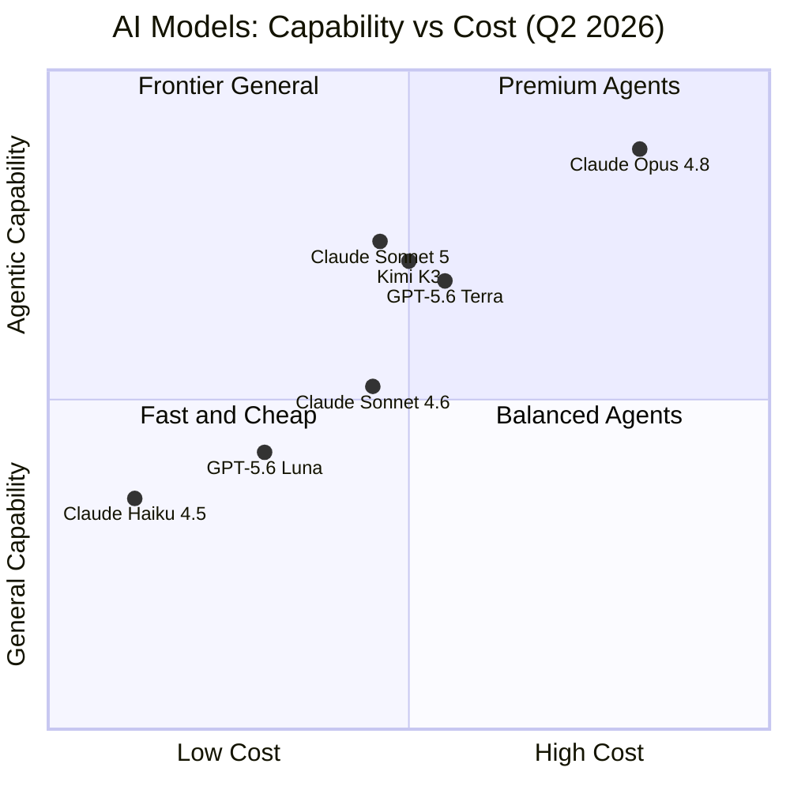
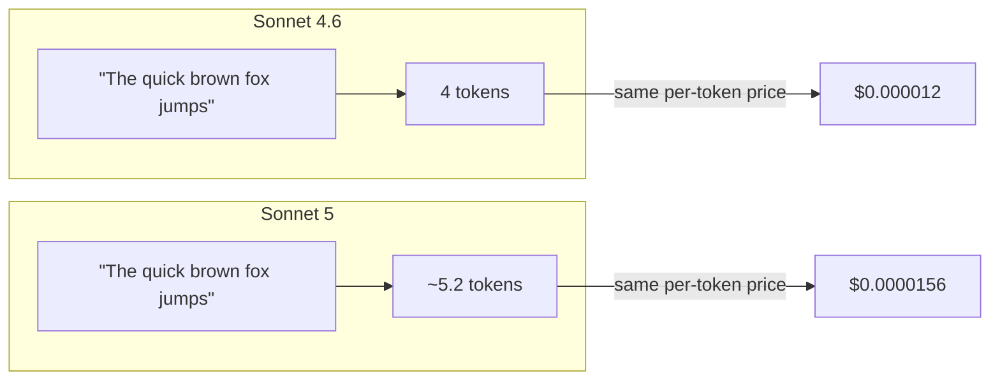

## The Model That Redraws the Tier Lines

For most of 2025, the unspoken rule in production AI was simple: if you needed an agent to actually *finish* a task — browse a few pages, write and run code, check its own output, and retry when it failed — you reached for Opus. Sonnet was fast and cheap, but it stopped short. It answered the question instead of solving the problem.

Claude Sonnet 5, released June 30, 2026, rewrites that rule.

On Anthropic's SWE-bench Pro benchmark — a test of whether a model can fix real GitHub issues end-to-end, not just write plausible-looking diffs — Sonnet 5 scores **63.2%**. Its predecessor, Sonnet 4.6, scored 58.1%. Claude Opus 4.8, the current flagship, scores 69.2%. Sonnet 5 has closed most of the gap at **Sonnet-tier pricing**.

On one benchmark — the GDPval-AA v2 knowledge work evaluation — Sonnet 5 actually **edges past Opus 4.8 entirely**.

That's not a typical incremental release. That's a tier shift.

---

## What Makes Sonnet 5 Different

### Adaptive Thinking, On by Default

The biggest behavioral change in Sonnet 5 isn't a new capability — it's a new default. On Sonnet 4.6, the model responded immediately, token by token, from the first word of the answer. On Sonnet 5, **adaptive thinking is on by default**: the model can silently emit a chain of reasoning before producing its visible reply.

Think of it like a doctor who pauses, runs through the differential diagnosis in their head, and then speaks — versus one who says the first thing that comes to mind. The pause is invisible in the output, but the quality of the answer reflects it.

```mermaid
flowchart TD
    Request["API Request"] --> AT["Adaptive Thinking\n(internal, silent)"]
    AT -->|"short tasks"| ST["Short think\n(~100–500 tokens)"]
    AT -->|"complex tasks"| LT["Long think\n(1,000–16,000 tokens)"]
    ST --> Response["Visible Response"]
    LT --> Response

    subgraph Developer Controls
        Effort["effort: 'low' | 'medium' | 'high' | 'xhigh'"]
        Disabled["thinking: &#123;type: 'disabled'&#125;"]
    end

    Request --> Developer Controls
    Developer Controls --> AT
```

Adaptive thinking scales its budget automatically based on the complexity of the request, up to an `xhigh` effort level for the hardest tasks. You can override it at any effort level or disable it entirely. But the key insight is that **the model decides** how much thinking each request warrants — you no longer have to pre-tune a token budget.

This was introduced on Opus-class models first. Shipping it as the default on Sonnet 5 makes the approach available at a price point most production workloads can actually sustain.

### Agentic Coding: A Step-Function Improvement

Numbers only tell part of the story. The SWE-bench suite is the most credible proxy for how models perform in real software engineering work, because it tests the full loop: reading a codebase, understanding an issue description, writing a fix, running tests, and verifying the result.

Here's how Sonnet 5 compares across the suite:

| Benchmark | Sonnet 4.6 | Sonnet 5 | Opus 4.8 |
|---|---|---|---|
| SWE-bench Verified | ~79% | **85.2%** | ~88% |
| SWE-bench Pro | 58.1% | **63.2%** | 69.2% |
| SWE-bench Multilingual | — | **78.3%** | — |
| FrontierCode v1 | 15.1 | **38.8** | ~44 |
| Terminal-Bench 2.1 | — | **80.4%** | — |
| OSWorld-Verified | — | **81.2%** | — |
| BrowseComp (single-agent) | — | **84.7%** | — |

The FrontierCode jump from 15.1 to 38.8 is the most striking: that's more than a doubling on a benchmark designed for the hardest real-world coding scenarios. Terminal-Bench and OSWorld measure the model's ability to use a terminal and desktop GUI respectively — classic agentic tasks — and Sonnet 5 scores above 80% on both.

BrowseComp, developed by OpenAI as a web research benchmark, tests whether a model can find information that requires navigating multiple sites, clicking through to sub-pages, and synthesizing across sources. A single-agent Sonnet 5 reaches **84.7%**, and a multi-agent configuration reaches **86.6%** — results that would have been frontier-only six months ago.

### Where It Sits in the Ecosystem



Sonnet 5 occupies the sweet spot that Anthropic's pricing strategy has always pointed toward: **Opus-adjacent capability at Sonnet-tier cost**. For workloads that don't need the absolute ceiling of Opus 4.8 — which is most of them — Sonnet 5 is the right default.

---

## The Hidden Detail Developers Need to Know

### New Tokenizer, New Math

There is a subtlety in the Sonnet 5 launch that's easy to miss if you're skimming the announcement: **a new tokenizer**.

Tokenizers are the input layer that breaks text into the numeric tokens the model actually processes. Different tokenizers slice text differently. Sonnet 5's new tokenizer — the same revision that shipped on Opus 4.7 — produces approximately **30% more tokens for the same input text** compared to Sonnet 4.6.

Here's why that matters:

- **Per-token pricing is unchanged**: $3 per million input tokens, $15 per million output tokens (introductory: $2/$10 through August 31, 2026).
- **But the same text costs more**: if your prompt that cost $X on Sonnet 4.6 now tokenizes into 30% more tokens, your effective cost per request goes up proportionally.
- **Context window capacity shrinks in text terms**: the window is still 1M tokens, but each token carries less text on average, so you fit less content in the same token budget.
- **`max_tokens` limits may truncate output**: if you tuned an output limit for Sonnet 4.6, the same limit may cut off Sonnet 5's response mid-thought.



The practical migration checklist is short but important:

1. **Recount your prompts** with the token counting API against `claude-sonnet-5` — don't reuse numbers measured on Sonnet 4.6.
2. **Review your `max_tokens` limits** — if they were sized close to your expected output length, add some headroom.
3. **Remove `temperature`, `top_p`, and `top_k`** from API calls — Sonnet 5 returns a 400 error if you set these to non-default values. This constraint was introduced on Opus-class models first and has now landed on Sonnet.
4. **Migrate extended thinking** — manual `thinking: {type: "enabled", budget_tokens: N}` is removed. Use adaptive thinking with the `effort` parameter instead.

---

## Safety as a First-Class Feature

Claude Sonnet 5 is the first Sonnet-tier model to ship with **real-time cybersecurity safeguards** — a capability previously limited to Opus-class models.

Requests that touch prohibited or high-risk cybersecurity topics may be refused at inference time rather than producing a response. The refusal comes back as an HTTP 200 with `stop_reason: "refusal"`, which keeps your error handling clean but means you should check the stop reason in agentic pipelines that might unexpectedly brush against this threshold.

More broadly, the model shows lower rates of hallucination and sycophancy than Sonnet 4.6, and it's better at refusing malicious requests and resisting prompt injection attacks in agentic contexts — a meaningful safety improvement for production deployments where the model is taking real actions in the world.

---

## What This Means for the Field

### The Tier Gap Is Collapsing

Sonnet 5's launch is the latest data point in a pattern that's been accelerating: **the gap between frontier and mid-tier AI is compressing fast**.

Eighteen months ago, the differences between a "Sonnet-class" and an "Opus-class" model were stark — they showed up on every benchmark and in every agentic scenario. Today, Sonnet 5 beats Opus 4.8 on knowledge-work evaluation and closes to within 6 points on hard agentic coding. The domains where Opus is clearly worth the premium are narrowing.

For teams building production AI systems, this compression is good news: it means the cost of capable agentic infrastructure is falling, and the tradeoffs between cost and capability are becoming easier to reason about.

### The Default Model Is Now an Agent

Before Sonnet 5, Anthropic's default for Free and Pro users was a fast, helpful, but fundamentally reactive model. It responded. Sonnet 5 becoming the default means that millions of everyday users are now being served by a model that can, by default, think before it speaks, sustain multi-step task completion, and take actions in the world.

That's a meaningful shift in what "default AI" means for most people — not just researchers and developers, but anyone who has opened claude.ai this week.

### Adaptive Thinking as a New Baseline

The most architecturally significant change in Sonnet 5 isn't a benchmark number — it's the decision to make adaptive thinking the **default mode**. This commits Anthropic to a design philosophy where every model in the family, at every tier, is expected to apply variable, task-appropriate reasoning to every request.

This aligns with what the research community has consistently found: the biggest gains in model reliability don't come from bigger models, but from giving models the computational budget to check their own work. Sonnet 5 makes that standard, not optional.

---

## Getting Started

If you're on Claude's API:

```python
import anthropic

client = anthropic.Anthropic()

# Sonnet 5 as default — adaptive thinking on automatically
message = client.messages.create(
    model="claude-sonnet-5",
    max_tokens=4096,
    messages=[
        {"role": "user", "content": "Refactor this function to eliminate the N+1 query."}
    ]
)

# Explicitly set thinking effort for hard tasks
message = client.messages.create(
    model="claude-sonnet-5",
    max_tokens=16384,
    thinking={"type": "adaptive"},
    extra_body={"effort": "xhigh"},  # 'low' | 'medium' | 'high' | 'xhigh'
    messages=[
        {"role": "user", "content": "Design a distributed rate limiter that works across 50 shards."}
    ]
)

# Disable thinking for latency-sensitive tasks
message = client.messages.create(
    model="claude-sonnet-5",
    max_tokens=1024,
    thinking={"type": "disabled"},
    messages=[
        {"role": "user", "content": "Summarize this paragraph in one sentence."}
    ]
)
```

Claude Sonnet 5 is available today on the Claude API, Amazon Bedrock, Google Cloud Vertex AI, and Microsoft Foundry. It is the default model for Free and Pro plans on claude.ai. Introductory pricing of $2/$10 per million input/output tokens runs through August 31, 2026.

---

## Sources

- [What's new in Claude Sonnet 5 — Anthropic Platform Docs](https://platform.claude.com/docs/en/about-claude/models/whats-new-sonnet-5)
- [Introducing Claude Sonnet 5 — Anthropic](https://www.anthropic.com/news/claude-sonnet-5)
- [Anthropic launches Claude Sonnet 5 as a cheaper way to run agents — TechCrunch](https://techcrunch.com/2026/06/30/anthropic-launches-claude-sonnet-5-as-a-cheaper-way-to-run-agents/)
- [Claude Sonnet 5 Benchmarks, Pricing & How It Compares — Codersera](https://codersera.com/blog/claude-sonnet-5-launch-guide-2026/)
- [Claude Sonnet 5 Benchmarks — LLM Stats](https://llm-stats.com/models/claude-sonnet-5)
- [Anthropic Claude Sonnet 5 vs Sonnet 4.6 vs Opus 4.8: Agentic Coding Benchmarks, API Pricing, and Cost-Performance Tradeoffs Compared — MarkTechPost](https://www.marktechpost.com/2026/07/13/anthropic-claude-sonnet-5-vs-sonnet-4-6-vs-opus-4-8-agentic-coding-benchmarks-api-pricing-and-cost-performance-tradeoffs-compared/)
- [Sonnet 5 Counts 30% More Tokens. Its Discount Ends Aug 31 — Automation Labs on Medium](https://medium.com/@automation.labs/sonnet-5-counts-30-more-tokens-its-discount-ends-aug-31-dee15db1f45d)
- [Claude Sonnet 5 Ships as Anthropic Default: Agentic Performance Closes Opus Gap — TechTimes](https://www.techtimes.com/articles/319409/20260701/claude-sonnet-5-ships-anthropic-default-agentic-performance-closes-opus-gap.htm)
- [Claude Sonnet 5 Launch Analysis: What Changed, What Matters, and What to Validate — Caylent](https://caylent.com/blog/claude-sonnet-5-launch-analysis-what-changed-what-matters-and-what-to-validate)
- [Claude Sonnet 5 Is the New Claude Code Default: Recount Your Token Budgets — Start Debugging](https://startdebugging.net/2026/07/claude-sonnet-5-claude-code-default-new-tokenizer-token-budgets/)
