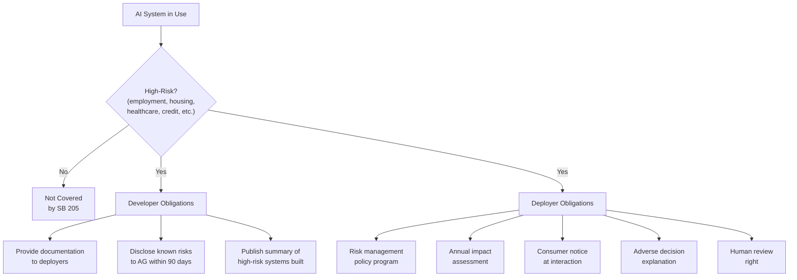
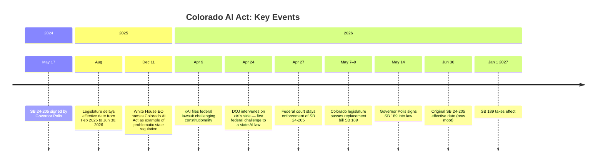
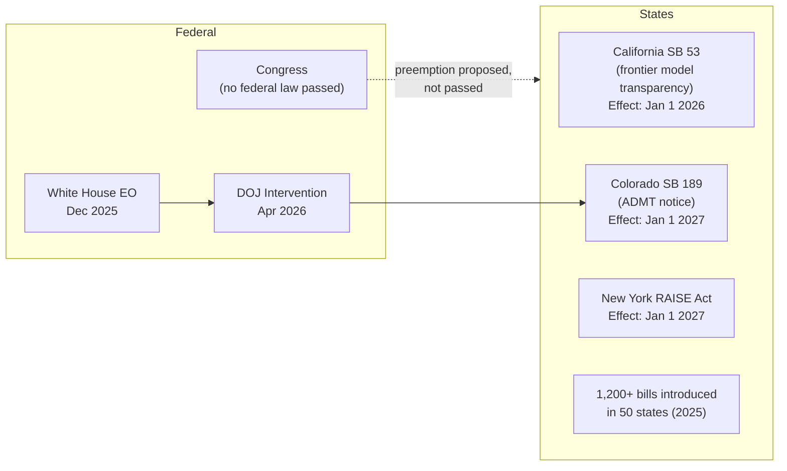

## The Law That Was Going to Change Everything

When Colorado Governor Jared Polis signed Senate Bill 24-205 on May 17, 2024, legal observers called it a landmark. For the first time in the United States, a state had passed a comprehensive, risk-based AI law: one that imposed not just disclosure requirements but actual duties of care — obligations to investigate bias, document it, and fix it.

The model was borrowed directly from the EU AI Act: classify AI systems by risk level, place the heaviest obligations on those affecting the most consequential decisions, and require ongoing compliance programs rather than one-time filings.

Eighteen months later, that law is gone. Replaced. The replacement is something narrower, lighter, and almost entirely different in philosophy.

The story of how that happened — in the span of about six weeks in spring 2026 — is one of the most instructive case studies in AI policy to emerge from this decade's regulatory scramble.

---

## What the Original Law Actually Required

SB 24-205, also known as the Colorado Anti-Discrimination in AI Law (ADAI), applied to **developers** and **deployers** of "high-risk artificial intelligence systems." A system was "high-risk" if it made, or substantially influenced, decisions in any of these domains affecting Colorado residents:

- Employment and hiring
- Education (including enrollment and financial aid)
- Housing and rental access
- Financial services and credit
- Insurance
- Healthcare services
- Legal services
- Essential government services

The law drew a distinction between two types of actors:

**Developers** build the underlying model or system. They were required to:
- Provide deployers with documentation describing the system's intended uses, known risks, and training data
- Disclose any known risks of algorithmic discrimination to the Colorado Attorney General and to known deployers within 90 days of discovery
- Publish a public statement summarizing the types of high-risk AI systems they develop

**Deployers** are the businesses and organizations that integrate an AI system into their operations to make decisions about people. They faced the heavier obligations:
- Implement a **risk management policy** aligned with recognized frameworks (NIST AI RMF or ISO/IEC 42001)
- Complete an **annual impact assessment** before deployment, then yearly, and within 90 days of any material system modification
- Test for algorithmic discrimination and document mitigation steps
- **Notify consumers** when a high-risk AI system is used in a consequential decision about them
- Notify consumers and provide an **explanation** when a decision goes against them
- Allow consumers to **correct their data** and request **human review**

The impact assessments alone were substantial. Each one had to document the system's purpose, the training data used, performance metrics and known limitations, bias testing results, and post-deployment monitoring plans.

Penalties could reach **$20,000 per violation**, with enhanced penalties when the affected consumer is elderly. Enforcement was held exclusively by the Colorado Attorney General. Companies that discovered and cured violations — and maintained compliance with a recognized AI risk management framework — had an affirmative defense.

---

## A Law Under Pressure Before It Even Launched

SB 24-205 was originally supposed to take effect February 1, 2026. It never made it to that date.

In August 2025, a special legislative session pushed the effective date back to **June 30, 2026**, after significant industry lobbying. The AI industry — including hyperscalers, model providers, and a wide range of enterprise software companies — had complained that the annual impact assessment requirement alone would be operationally impossible at scale: hundreds of AI-assisted HR and lending tools, each requiring its own annual audit.

Governor Polis, himself a former tech entrepreneur, had always been ambivalent about the law. He signed it while publishing an unusual letter distancing himself from it, calling the bill "not a model" for other states and urging the legislature to revisit it in 2025.

That hesitation would matter enormously in 2026.

---

## The Lawsuit, the DOJ, and the Stay

On **April 9, 2026**, Elon Musk's AI company xAI filed suit in the U.S. District Court for the District of Colorado, seeking to block the law before its June 30 effective date.

xAI's complaint raised four constitutional arguments:

1. **First Amendment — Compelled Speech.** xAI argued that requiring a company to document, assess, and disclose information about its model's potential biases compels the disclosure of private, non-commercial speech — specifically, internal editorial judgments about what the model says and how it weights information. The company said compliance would force Grok to "redesign, retrain, or constrain" how it handles certain topics.

2. **Commerce Clause.** Because the law applied to any system affecting even a single Colorado resident — regardless of where the system is built or deployed — xAI argued it imposed an unconstitutional burden on interstate commerce and extraterritorial regulation.

3. **Vagueness.** Key terms like "algorithmic discrimination" and "substantial factor" were too undefined to give companies clear notice of what was prohibited.

4. **Equal Protection.** An exemption in the law for AI systems "designed to advance equal opportunity" created, in xAI's view, an impermissible classification based on race and other protected characteristics.

Then, on **April 24**, the U.S. Department of Justice filed to intervene in the case — on xAI's side. It was the first time the federal government had moved to invalidate a state AI law. The DOJ focused its brief primarily on the equal protection argument, contending the diversity exemption constituted unconstitutional racial classification.

Three days later, on **April 27**, Magistrate Judge Cyrus Y. Chung granted a joint motion from xAI and the Colorado Attorney General to **stay enforcement** of the law. With both the plaintiff and the state regulator agreeing to pause enforcement, the court had little reason to refuse.

---

## The Replacement: SB 26-189

With the original law dead in the water, the Colorado legislature moved fast. Both chambers passed **Senate Bill 26-189** between May 7 and 9. Governor Polis signed it on **May 14, 2026** — thirty-five days after xAI filed suit.

SB 189 repeals SB 24-205 entirely and replaces it with a different type of law. It does not just amend the original — it reconceives what state AI regulation should look like.

### What Was Removed

The three core elements of SB 205 that industry found most objectionable are gone:

- **No more duty of care** to prevent algorithmic discrimination
- **No more risk management programs** for deployers
- **No more annual impact assessments**

The shift from "you must prevent harm" to "you must tell people what's happening" is a fundamental change in philosophy. SB 205 was a *substantive* law: it required companies to actually investigate and mitigate discriminatory outcomes. SB 189 is a *procedural* law: it requires companies to disclose what they're doing.

### What Was Kept

SB 189 preserves the consumer-facing rights that were least controversial:

- **Notice** at the point of interaction when a covered automated decision-making system is used
- **Post-decision explanation** when a decision goes against a consumer
- **Data correction rights** — consumers can contest inaccurate data used in a decision
- **Human review rights** — consumers can request that a human re-examine an automated decision

### What Changed in Scope

The new law replaces "high-risk AI systems" with a broader category called **automated decision-making technology** (ADMT). The definition does not require that a system learn from data or make inferences — a system that simply checks whether a value falls within a predefined range could qualify if it contributes to a consequential decision.

Covered sectors remain the same: employment, education, housing, financial services, insurance, healthcare, and essential government services.

The new law also introduces clearer sector-specific accommodations for HIPAA-covered healthcare entities, insurers, FERPA-covered educational institutions, and FDA-regulated medical devices — carve-outs that were ambiguous or absent in SB 205.

### When It Takes Effect

SB 189 takes effect **January 1, 2027**, with enforcement contingent on the Colorado Attorney General completing a rulemaking process.

---

## The Bigger Picture: America's AI Regulation Patchwork

Colorado's reversal is not just a Colorado story. It sits in the middle of a wider tension between state regulators and a federal government that wants to keep AI development moving.

In **December 2025**, the White House issued an executive order directing federal agencies to challenge state AI laws through litigation and coordinated action. It specifically named Colorado's law as an example of regulation that would, in the administration's view, force AI companies to produce "false results in order to avoid a differential treatment or impact on protected groups." The DOJ's April 2026 intervention was that order in action.

At the same time, Congress has not passed a federal AI law. More than **1,200 state AI bills** were introduced in 2025 alone. California, Texas, Illinois, and New York have each enacted or advanced substantive AI legislation — with conflicting requirements, enforcement timelines, and penalty structures.

The pattern echoes the state privacy law patchwork that emerged in the absence of a federal privacy law after 2018: California leads, other states follow in different directions, companies face compliance programs covering 50 overlapping jurisdictions, and Congress debates preemption without acting.

The EU took the opposite approach: one comprehensive, risk-tiered law across all member states, phased in over three years. The EU AI Act's high-risk provisions came into force in August 2026 and apply to any AI system affecting EU residents, including systems built by US companies. Colorado's original law borrowed that architecture. Its replacement abandoned it.

Whether the EU model or the US notice-and-transparency model does more to protect people from AI-driven discrimination is genuinely contested. Risk-based regimes are harder to comply with and easier to litigate. Notice-based regimes are easier to implement but do little if the underlying system is producing unfair outcomes that companies don't have to fix.

---

## What This Means for Developers and Deployers

If you build or use AI systems that affect decisions about people in Colorado, here is the practical picture:

**Under the original SB 205 (now moot):** You would have needed a risk management program, annual bias audits, and documentation showing your system does not cause algorithmic discrimination. You had until June 30, 2026 — a deadline you will not face.

**Under SB 189 (effective January 1, 2027):** Your obligations are narrower but still real:
- **Tell users** when an automated system contributed to a decision about them
- **Explain** any adverse outcome in enough detail that a consumer can understand and contest it
- **Allow correction** of data errors in the underlying record
- **Provide a path** to human review upon request

The Attorney General's rulemaking will set the precise contours. Given the timeline, expect draft rules in late 2026.

**Nationally:** The 2026 landscape requires tracking California's transparency law (in force since January), New York's RAISE Act (effective January 2027), and whatever emerges from the federal preemption debate. Building a unified compliance posture across all three is already a meaningful legal engineering task.

---

## A Consequential Experiment, Interrupted

Colorado's SB 24-205 was the first real attempt by a U.S. state to say that deploying AI in high-stakes decisions is not just a product choice but a governance responsibility — one that requires ongoing oversight, documented controls, and accountability when things go wrong.

It failed to take effect. The reasons are layered: constitutional challenges with real merit, a White House that sided with industry, a legislature willing to retreat, and a governor who never loved the law he signed.

What replaced it is more like a consumer protection disclosure rule than an AI accountability regime. Whether Colorado's revised approach, or something like it, becomes the national template — or whether a federal law eventually forecloses the entire state-level experiment — will be among the defining questions of AI governance in the coming years.

For now, the most ambitious AI regulation in U.S. history lasted about two years on paper, and zero days in practice.

---

## Sources

- [SB24-205 Consumer Protections for Artificial Intelligence — Colorado General Assembly](https://leg.colorado.gov/bills/sb24-205)
- [SB26-189 Automated Decision-Making Technology — Colorado General Assembly](https://leg.colorado.gov/bills/sb26-189)
- [Colorado AI Act (SB 24-205): Complete Compliance Guide 2026 — ALM Corp](https://almcorp.com/blog/colorado-ai-act-sb-205-compliance-guide/)
- [Colorado Hits Reset on AI Regulation: SB 26-189 Repeals and Reenacts the Colorado AI Act — Crowell & Moring](https://www.crowell.com/en/insights/client-alerts/colorado-hits-reset-on-ai-regulation-sb-26-189-repeals-and-reenacts-the-colorado-ai-act)
- [Colorado Legislature Repeals and Replaces Colorado AI Act: What SB 189 Means for Your Business — Wilson Sonsini](https://www.wsgr.com/en/insights/colorado-legislature-repeals-and-replaces-colorado-ai-act-what-sb-189-means-for-your-business.html)
- [X.AI sues, DOJ intervenes, enforcement of Colorado's AI Act suspended — Norton Rose Fulbright](https://www.nortonrosefulbright.com/en-us/knowledge/publications/de3ad9de/xai-sues-doj-intervenes-enforcement-of-colorado-ai-act-suspended)
- [Elon Musk's xAI sues Colorado over AI consumer protection law — Colorado Newsline](https://coloradonewsline.com/briefs/elon-musk-sues-colorado-ai/)
- [DOJ Joins xAI in Lawsuit Challenging Colorado AI Act — Jenner & Block](https://www.jenner.com/en/news-insights/client-alerts/doj-joins-xai-in-lawsuit-challenging-colorado-ai-act)
- [Judge stays Colorado AI bias law following joint motion by xAI, state regulators — HR Dive](https://www.hrdive.com/news/colorado-ai-bias-law-unconstitutional-elon-musks-xai/817258/)
- [Colorado's AI Reset: Two Weeks, a White House Callout, and a Pivot Away from the EU Model — Carpe Datum Law](https://www.carpedatumlaw.com/2026/05/colorados-ai-reset-two-weeks-a-white-house-callout-and-a-pivot-away-from-the-eu-model/)
- [Colorado AI law in flux: Comprehensive replacement bill signed after federal court blocks predecessor — McDermott Will & Emery](https://www.mcdermottlaw.com/insights/colorado-ai-law-in-flux-comprehensive-replacement-bill-signed-after-federal-court-blocks-predecessors-enforcement/)
- [Colorado's AI Anti-Discrimination Law Is Dead Before It Ever Took Effect — TechTimes](https://www.techtimes.com/articles/316756/20260517/colorados-ai-anti-discrimination-law-dead-before-it-ever-took-effect-replaced-notice-only.htm)
- [A Deep Dive into Colorado's Artificial Intelligence Act — National Association of Attorneys General](https://www.naag.org/attorney-general-journal/a-deep-dive-into-colorados-artificial-intelligence-act/)
- [Colorado Anti-Discrimination in AI Law (ADAI) Rulemaking — Colorado Attorney General](https://coag.gov/ai/)
