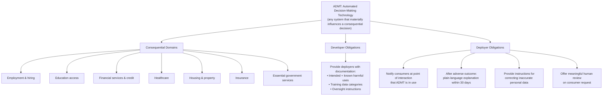
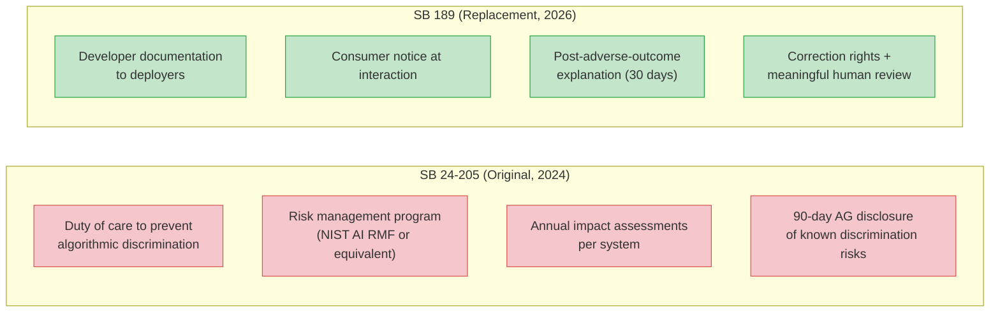

## The Law That Almost Was

In May 2024, Colorado did something no US state had done before: it passed a comprehensive law regulating artificial intelligence. Senate Bill 24-205, signed into law by Governor Jared Polis, created duties for companies building and deploying AI systems that affect people's lives — their job applications, loan applications, health care, and government benefits. It was hailed by advocates as an important first step toward consumer protection in the AI era.

Then, on May 14, 2026 — with the law's June 30, 2026 effective date just six weeks away — Governor Polis signed a new bill. Senate Bill 26-189, titled "Automated Decision-Making Technology," repealed and replaced the original Colorado AI Act almost entirely.

The vote was bipartisan and lopsided: 34-1 in the Senate, 57-6 in the House. A law two years in the making was effectively erased in a single legislative session.

Understanding *why* this happened, and *what replaced it*, is a lens into the messy, contested future of AI regulation in the United States.

---

## What the Original Law Actually Required

SB 24-205 was built around a concept borrowed from the EU AI Act: **risk-based regulation**. The law applied to "high-risk AI systems" — any AI that made or substantially influenced a "consequential decision." The list of consequential domains was broad: employment, education, financial services, healthcare, housing, insurance, legal services, and government benefits.

Under the original framework, both AI **developers** (companies that build the models) and **deployers** (companies that use them) had affirmative duties.

**Developers** had to document and disclose known risks of algorithmic discrimination — bias encoded in how systems treat different groups — and share that information with deployers and the state Attorney General within 90 days of discovery.

**Deployers** faced a heavier lift:
- Maintain a documented, public-facing **risk management policy** mapped to a recognized framework like NIST's AI Risk Management Framework or ISO 42001
- Complete an **impact assessment** for each high-risk AI system annually and before any material change — covering the system's purpose, known risks, data inputs, outputs, and oversight mechanisms
- Retain all documentation for at least three years

Violations were treated as unfair trade practices under the Colorado Consumer Protection Act, which carries real enforcement teeth.

The vision was ambitious. Colorado wanted companies to think systematically about how their AI systems could harm people — before deployment, not after complaints.

---

## Why It Got Rewritten

Almost immediately after SB 24-205 passed, the pushback began.

The practical criticism was that impact assessments and risk management programs were genuinely burdensome — especially for smaller companies deploying AI tools they didn't build. A startup integrating a third-party hiring tool into its HR workflow would theoretically need to conduct annual assessments of an AI system whose internals it couldn't fully see. Critics argued the compliance costs would fall disproportionately on businesses without the legal and engineering resources of large tech firms.

Governor Polis, who had signed the original bill while expressing reservations, convened a **Colorado AI Policy Work Group** to study whether the law could be refined. What emerged was a recommended framework that moved away from prescriptive risk management toward disclosure-based transparency.

The political environment shifted too. In December 2025, President Trump signed an executive order on "Ensuring a National Policy Framework for Artificial Intelligence" that specifically targeted SB 24-205 as an example of "excessive State regulation" inconsistent with federal deregulatory priorities. Shortly after, the **Great American Artificial Intelligence Act** — a 269-page federal bill introduced in Congress on June 4, 2026 — proposed a three-year preemption of state AI laws including Colorado's, arguing that a patchwork of state rules would create compliance chaos and slow AI development.

Faced with industry pressure, federal headwinds, and its own governance concerns, the Colorado legislature didn't simply delay the law again. It replaced it.

---

## What SB 189 Actually Does

The new law keeps the same essential premise — AI affecting high-stakes decisions about people should come with guardrails — but shifts the mechanism from **risk management** to **transparency and consumer rights**.

The term "high-risk AI system" is gone. SB 189 instead regulates "**automated decision-making technology**" (ADMT): any automated computational system that processes personal data to make, or materially influence, a **consequential decision**.

The definition of what counts as consequential is similar to before: education, employment, property transactions, financial services, insurance, healthcare, and essential government services. But the obligations attached to that scope are substantially different.

**For developers**, the obligation is narrow: when you market an ADMT for use in consequential decisions, provide your deployer customers with documentation covering intended uses, known harmful uses, categories of training data used, and instructions for deployer oversight.

**For deployers**, the obligations are consumer-facing:

1. **Pre-decision notice**: Tell people when ADMT is being used to influence a consequential decision about them.

2. **Post-decision disclosure**: If a consumer experiences an adverse outcome — denied a loan, rejected for a job — the deployer must, within 30 days, provide a plain-language explanation of what the ADMT contributed and explain the consumer's rights.

3. **Correction rights**: Consumers can request that factually incorrect or materially inaccurate personal data used by the system be corrected.

4. **Meaningful human review**: Consumers can request a human reconsideration of the decision. This isn't just a formality — the law defines "meaningful" carefully. The reviewer must have actual authority to modify or override the decision, must not default to the system's output, must be trained for the review, and must have access to information about the system's inputs, limitations, and principal factors.

**Enforcement** remains with the Colorado Attorney General under the Consumer Protection Act. But SB 189 builds in a 60-day notice-and-cure period before enforcement action, giving companies a chance to fix violations without immediately facing penalties.

The law takes effect **January 1, 2027**.

---

## A Notable Expansion: Workers Are Consumers Now

One provision in SB 189 that received less attention than the rollbacks is actually an expansion of coverage.

The Colorado Privacy Act — the state's broad data privacy law — largely excludes employment contexts. It governs how businesses handle consumer data but draws the line at employee data.

SB 189 doesn't make that distinction. It expressly defines "consumer" to include **employees and Colorado resident job applicants**. That means ADMT used in hiring, performance evaluations, or workforce decisions is fully covered. If a company uses an AI tool to screen resumes or predict employee attrition and an adverse outcome results, all of SB 189's transparency obligations apply — notice, explanation, correction rights, and human review.

For employers using AI in HR processes, this is arguably the most operationally significant provision in the new law.

---

## What Was Lost, and What Was Preserved

A comparison of the two frameworks reveals a clear trade-off.

What's gone: the system-level review of AI before it harms anyone. Impact assessments required deployers to audit their AI systems proactively, documenting risks before deployment and updating that documentation annually. That ex-ante scrutiny is entirely eliminated.

What's preserved: the consumer's ability to know an AI influenced a decision that hurt them, to challenge inaccurate inputs, and to get a human second look. These are *after-the-fact* rights — they activate once someone has already experienced an adverse outcome.

The philosophical shift is from "prove your AI is safe before you use it" to "be transparent when your AI affects someone, and give them recourse."

---

## What This Signals for the Broader US Landscape

Colorado's reversal matters far beyond the state's borders.

When SB 24-205 passed in 2024, it was widely seen as a potential template for other states and for eventual federal legislation. Advocates hoped it would become the California Consumer Privacy Act (CCPA) of AI law — a pioneering state rule that eventually pressured the rest of the country toward higher standards.

Instead, it became a cautionary tale about overreach. The law's repeal, under bipartisan pressure and well before a single company faced enforcement, signals to legislators nationwide that comprehensive risk-management mandates for AI are politically difficult to sustain.

The resulting trend looks like this: US states are moving toward **disclosure-based AI governance** — requiring notice, explanation, and human review — rather than the **risk-based governance** model pioneered by the EU. The EU AI Act, which takes full effect in August 2026, still requires conformity assessments, risk management systems, and technical documentation for high-risk AI. The US, at least at the state level, appears to be choosing a lighter-touch path.

That doesn't make SB 189 toothless. The human review requirement in particular has real teeth if enforced — a reviewer who "must not default to the system output" and "must consider primary evidence" is a genuine constraint on rubber-stamp processes. And the inclusion of employees as consumers in employment AI decisions goes further than most existing law.

But for those who believe that consequential AI systems should face systematic scrutiny before deployment — not just transparency rights after harm — Colorado's reset is a setback.

The question now is whether January 1, 2027, will actually arrive this time.

---

## Sources

- [Colorado Enacts Artificial Intelligence Replacement Law — Seyfarth Shaw LLP](https://www.seyfarth.com/news-insights/colorado-enacts-artificial-intelligence-replacement-law.html)
- [Colorado Hits Reset on AI Regulation With a New AI Act — Morrison Foerster](https://www.mofo.com/resources/insights/260515-colorado-hits-reset-ai-regulation)
- [Colorado Governor Signs SB 189, Significantly Amending the State's AI Law — Holland & Knight](https://www.hklaw.com/en/insights/publications/2026/05/colorado-governor-signs-sb-189)
- [Colorado Legislature Repeals and Replaces Colorado AI Act: What SB 189 Means for Your Business — Wilson Sonsini](https://www.wsgr.com/en/insights/colorado-legislature-repeals-and-replaces-colorado-ai-act-what-sb-189-means-for-your-business.html)
- [SB26-189 Automated Decision-Making Technology — Colorado General Assembly](https://leg.colorado.gov/bills/sb26-189)
- [Colorado AI Act Repealed and Replaced by Narrower Statute — Davis Wright Tremaine](https://www.dwt.com/blogs/privacy--security-law-blog/2026/05/colorado-ai-act-repeal-new-transparency-law)
- [Colorado Revises Its AI Act: What Changed and Why — Future of Privacy Forum](https://fpf.org/blog/colorado-revises-its-ai-act-what-changed-and-why/)
- [Colorado Is Repealing Its Own AI Law: What SB 189 Means for State AI Regulation in 2026 — ComplianceHub.Wiki](https://compliancehub.wiki/colorado-ai-law-sb189-rewrite-2026/)
- [Colorado Amends Its Artificial Intelligence Law, Substantially Reducing Obligations on Employers — Littler](https://www.littler.com/news-analysis/asap/colorado-amends-its-artificial-intelligence-law-substantially-reducing)
- [State AI Laws — Where Are They Now? — Cooley LLP](https://www.cooley.com/news/insight/2026/2026-04-24-state-ai-laws-where-are-they-now)
- [Colorado Legislature Passes Bill to Repeal and Replace Colorado AI Act — Troutman Privacy Blog](https://www.troutmanprivacy.com/2026/05/colorado-legislature-passes-bill-to-repeal-and-replace-colorado-ai-act/)
- [Colorado Scales Back AI Law, with Targeted Implications for Health Care — Ropes & Gray](https://www.ropesgray.com/en/insights/alerts/2026/05/colorado-scales-back-ai-law-with-targeted-implications-for-health-care)
