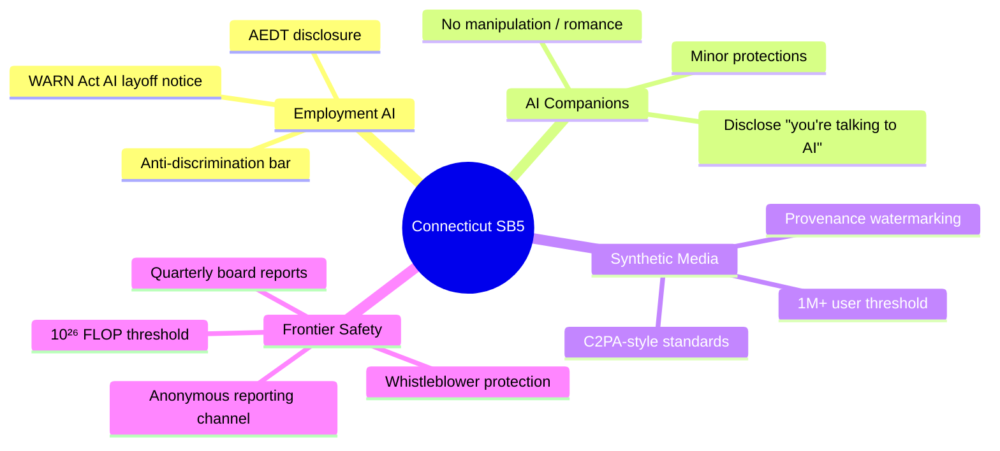
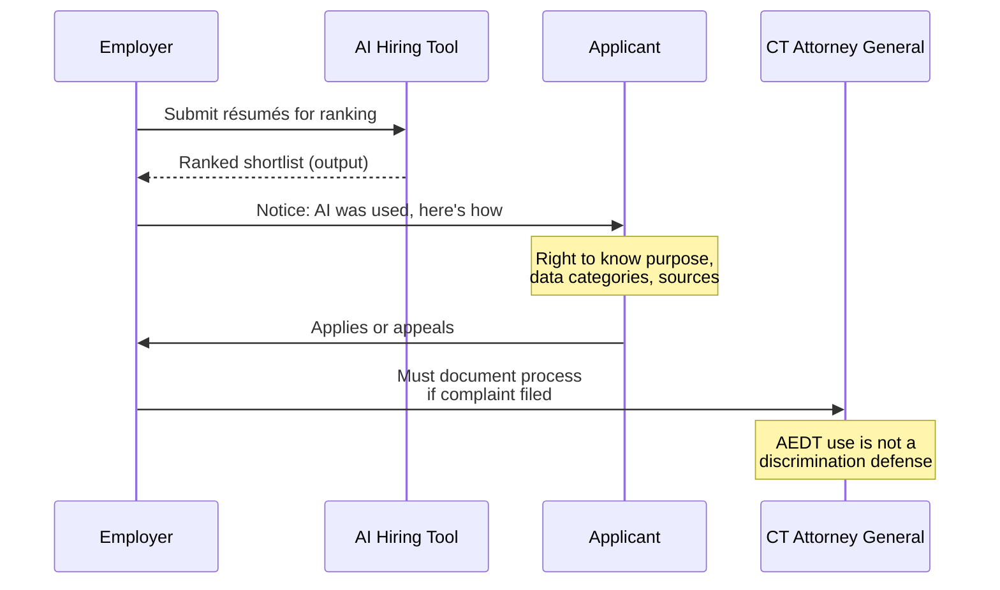
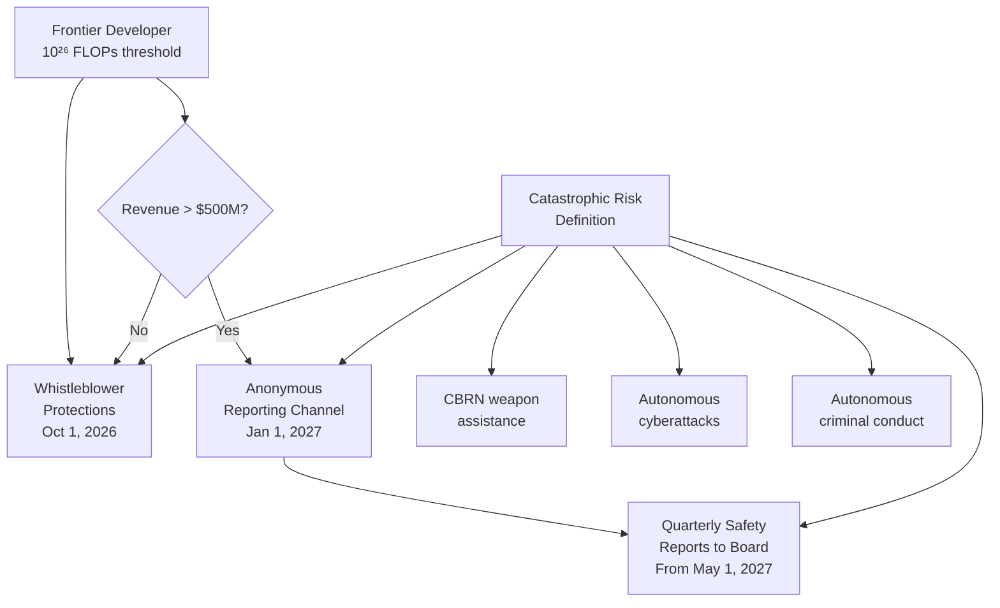

## A Small State Makes a Big Swing

Connecticut is not where you'd expect the boldest AI regulation in the United States to originate. But on May 1, 2026, the state's General Assembly passed Senate Bill 5 — the **Connecticut Artificial Intelligence Responsibility and Transparency Act** — by an astonishing 131–17 margin in the House and 32–4 in the Senate. With Governor Ned Lamont signaling his intent to sign it, SB5 is poised to become one of the most comprehensive AI laws anywhere in the country.

It's 67 pages long. It covers four distinct domains. It phases in across three years. And it has the AI industry watching nervously.

This post unpacks what it actually requires, who it affects, and why it matters — even if you don't live in Connecticut.

---

## The Big Picture: Four Pillars in One Bill

Unlike narrow, single-issue legislation (a ban on AI deepfakes here, a disclosure rule there), SB5 is an omnibus. It wraps four separate regulatory frameworks into one law:

1. **Automated Employment Decision Technology (AEDT)** — rules for AI that makes or heavily influences hiring, promotion, and firing decisions
2. **AI Companion Chatbots** — rules for AI personas that form ongoing relationships with users, with special protections for minors
3. **Synthetic Media Provenance** — watermarking requirements for large generative AI providers
4. **Frontier Model Safety** — whistleblower protections and internal reporting mandates for developers of the most powerful AI systems

A fifth provision, technically an amendment to Connecticut's existing WARN Act, requires employers to disclose when AI was a factor in any mass layoff.



---

## Pillar 1: AI in the Hiring Process

If you've applied for a job in the last five years, an AI system probably touched your application. Resume screeners, video interview analyzers, psychometric scoring tools — these systems are now routine in corporate recruiting. SB5 is the first Connecticut law to directly regulate them.

**What counts as an AEDT?** The law defines an *automated employment-related decision technology* as any computational process — that includes machine learning, statistical modeling, rule engines, or any other kind of algorithm — that generates an output that is a "substantial factor" in an employment decision. That definition is deliberately broad. It sweeps in:

- Third-party applicant tracking systems that rank résumés
- Video interview tools that score candidates on tone and pacing
- Performance analytics that flag employees for underperformance
- Scheduling algorithms that determine shifts or assignments

**What must employers do?**

- **Notify** job applicants and employees when an AEDT is involved in a decision affecting them
- **Disclose** the tool's purpose, the categories of data it uses, and where that data comes from
- Acknowledge that using an AEDT is **not a legal defense** if a discrimination claim arises; a biased algorithm is still biased even if it was an off-the-shelf product

The key implementation split: the disclosure framework starts October 1, 2026. Substantive compliance obligations — the more detailed requirements on how employers document and validate these tools — kick in October 1, 2027, giving organizations a full year to audit their AI stack.



**The WARN Act twist.** Starting October 1, 2026, any employer that files a mass-layoff notice with the Connecticut Department of Labor must also disclose whether the workforce reduction was related to AI or other technological change. It's a transparency measure — not a prohibition — but it creates a paper trail that regulators and workers can use to understand the real-world effects of automation on employment.

---

## Pillar 2: The Companion Chatbot Rules

This is the provision that generated the most attention from consumer advocates. "Companion chatbots" — AI systems designed to sustain ongoing, relationship-like interactions with users — have grown explosively. Apps like Character.AI, Replika, and a dozen newer entrants now have millions of users who treat their AI companions as friends, therapists, or romantic partners.

SB5's definition of a companion chatbot is specific: it's an AI with a natural language interface that provides "adaptive, human-like responses" and can "sustain a relationship across multiple interactions." That's different from a one-off chatbot that helps you reset your password.

**Required for all companion chatbot operators** (effective January 1, 2027):

- **Disclose at the start of every session** that the user is talking to an AI, not a human — and repeat that disclosure at least hourly during extended conversations
- Make account management and screen-time controls available to users and, for minors, to their parents
- Meet or exceed industry standards to prevent the chatbot from:
  - Entering romantic or sexual interactions with any user it knows to be a minor
  - Encouraging self-harm or substance use
  - Offering unsupervised mental health services
  - Using manipulative techniques to foster emotional dependence

The private right of action — the ability for individuals, not just the state, to sue — applies specifically to violations of the minor-protection provisions. That's a meaningful deterrent: it means parents can take AI companies to court directly if their child is harmed.

---

## Pillar 3: Watermarking AI-Generated Media

Deepfakes, AI-generated news articles, synthetic audio of real voices — these are no longer hypothetical threats. SB5 responds with a provenance requirement targeted at the largest generative AI providers.

**Who it applies to:** Developers of generative AI systems with more than **one million monthly users** who create or materially alter audio, images, or video.

**What they must do:** Embed *provenance data* into any synthetic content their systems produce. Provenance data is defined as machine-readable metadata that documents the content's origin and history of modification — essentially a digital chain of custody. The law explicitly notes that acceptable standards include those developed by the **Coalition for Content Provenance and Authenticity (C2PA)**, the industry group whose specifications are already embedded in products from Adobe, Microsoft, and others.

**Exceptions:** The watermarking requirement does not apply to clearly labeled artistic or satirical content, text-only public-interest journalism, or standard photo editing tools that don't generate synthetic media (cropping a photo doesn't count).

This provision takes effect **October 1, 2026** — the tightest timeline in the bill and a signal that the legislature considers synthetic media the most urgent risk.

---

## Pillar 4: Frontier Model Safety

This is the part of the law that took policy observers by surprise. Most state AI legislation deals with downstream effects — how AI is used by businesses and consumers. SB5 goes upstream, imposing obligations directly on the companies that *train* the most powerful AI models.

**Who is a "frontier developer"?** Any company doing business in Connecticut that trains a foundation model using at least **10²⁶ floating-point operations** — roughly the compute scale of systems like GPT-4 or Claude Opus when they were trained. That threshold is deliberately high: it targets a handful of the most capable labs, not every company experimenting with fine-tuning.

**What is a "catastrophic risk"?** The law defines it as a foreseeable and material risk that a foundation model will cause:
- Death or serious injury to **more than 50 people**, or
- More than **$1 billion in property damage**, from a single incident —

where the cause is the model providing expert-level assistance in creating a CBRN (chemical, biological, radiological, or nuclear) weapon, or autonomously executing cyberattacks or other serious crimes without meaningful human oversight.

**Whistleblower protections (effective October 1, 2026):** Employees at frontier developers cannot be fired, demoted, or penalized for reporting a good-faith belief that the company's AI poses a catastrophic risk. This mirrors the whistleblower protections that exist for nuclear and pharmaceutical safety — industries where the consequences of a cover-up are irreversible.

**For large frontier developers** (revenue over $500M) — a tier that covers all the major US AI labs — the law goes further:

- Establish an anonymous internal reporting channel for employees by **January 1, 2027**
- Beginning **May 1, 2027**, and every three months thereafter, publish a board-level quarterly report documenting all employee safety reports, the status of investigations, and any remedial actions taken

This is the kind of governance structure that financial regulators imposed on banks after 2008 — mandatory internal controls with board-level accountability.



---

## One More: Independent AI Model Verification

Buried deeper in the bill is a provision with no equivalent in any other US state law: Connecticut's Department of Consumer Protection would be authorized to approve up to **five organizations** as official third-party AI model verifiers. AI systems subject to the law could be submitted to these organizations for verification against safety standards before deployment.

This is conceptually similar to how the FDA approves third-party testing labs for drugs, or how the FAA certifies independent organizations to inspect aircraft. It's a voluntary safe-harbor mechanism: participate and get presumptive compliance, skip it and bear the full audit burden yourself if a complaint arises.

---

## Where Connecticut Fits in the National Picture

SB5 doesn't exist in isolation. As of May 2026, US legislators have introduced more than **1,500 AI-related bills** across all 50 states. 145 became law in 2025 alone. The US effectively has 50 different AI regulatory regimes developing simultaneously, with no federal law to harmonize them.

The Trump administration has responded to the patchwork by trying to preempt it: a White House executive order directed the Department of Justice to challenge state AI laws it deems incompatible with a "minimally burdensome" national standard. But Congress has twice rejected proposals to preempt state AI legislation outright.

Connecticut's law stands in sharp contrast to what's happening elsewhere:

- **Colorado's AI Act** — a broad high-risk AI framework that Colorado lawmakers amended significantly before it could take effect — was stayed by a federal court in April 2026
- **California** passed the Transparency in Frontier Artificial Intelligence Act, which imposes broader safety testing and public reporting on frontier developers, but is more narrowly focused on that single tier
- **The EU AI Act** is the most comprehensive framework globally, using a risk-tiered approach that covers nearly all consequential AI use cases — but it's an international treaty, not applicable to US-only operations

SB5 occupies a middle ground: more targeted than the EU AI Act, but broader than any other currently-in-force US state law. It doesn't try to classify all "high-risk AI" — it picks four specific domains where the legislature concluded the risks are concrete, demonstrable, and immediate.

```mermaid
quadrantChart
    title Scope vs. Enforcement Strength of Major AI Laws
    x-axis Narrow --> Broad
    y-axis Weak Enforcement --> Strong Enforcement
    quadrant-1 "Broad + Strong"
    quadrant-2 "Narrow + Strong"
    quadrant-3 "Narrow + Weak"
    quadrant-4 "Broad + Weak"
    EU AI Act: [0.85, 0.80]
    Connecticut SB5: [0.55, 0.70]
    California TFAIA: [0.40, 0.65]
    Colorado AI Act (stayed): [0.70, 0.45]
    Most State Disclosure Bills: [0.20, 0.30]
```

---

## The Opposition: "Regulation Already Exists"

SB5 is not without critics. NetChoice, a trade association representing major online platforms, submitted a formal veto request to Governor Lamont, arguing that:

1. **The premise is wrong.** Existing law already covers most of what SB5 targets — anti-discrimination statutes already apply to AI-driven hiring decisions, consumer protection laws already regulate deceptive chatbots.
2. **The patchwork is the problem.** Adding Connecticut-specific definitions, thresholds, and timelines to an already-fragmented landscape makes compliance harder for companies operating nationally, without adding meaningful safety.
3. **The scope is too broad.** Definitions like "substantial factor" in employment decisions could technically apply to calendar scheduling tools or basic skill-matching filters — not just the high-stakes hiring algorithms the bill's authors had in mind.

The legislature addressed some of these concerns in amendments before the final vote, which is why the House passed the revised bill 131–17 rather than the closer margins seen in other states. But the business community's concern about the definition of AEDT is likely to drive early enforcement attention to the boundary cases.

---

## What the Timeline Means in Practice

SB5 has three key dates:

| Date | What Kicks In |
|------|---------------|
| **October 1, 2026** | AEDT disclosure framework, synthetic media provenance, frontier developer whistleblower protections, WARN Act AI disclosure, safe harbor program |
| **January 1, 2027** | AI companion chatbot requirements, anonymous reporting channels for large frontier developers |
| **October 1, 2027** | Full substantive AEDT compliance (documentation, validation, audit obligations) |

The staggering is intentional. Legislators gave companies a year-long warning before the heaviest obligations land, which is more runway than most state AI laws have provided.

For developers and employers in Connecticut (or companies serving Connecticut employees and consumers), the practical checklist runs roughly:

- **Now:** Inventory all AI tools used in HR, scheduling, and performance management to determine AEDT exposure
- **By October 2026:** Draft employee-facing disclosures; update WARN Act procedures; verify provenance capabilities in your generative AI stack
- **By January 2027:** Confirm companion chatbot disclosures and age-gating; (for frontier labs) stand up anonymous reporting infrastructure
- **By May 2027:** (For frontier labs) establish the quarterly board reporting process
- **By October 2027:** Complete full AEDT validation documentation

---

## Why This Matters Beyond Connecticut's Borders

Laws travel. The California Consumer Privacy Act, once a California-only regime, became the de facto template for US data privacy compliance because companies found it easier to apply CCPA standards everywhere than to maintain separate systems state by state.

SB5 has a credible shot at the same dynamic. Connecticut is small but demographically concentrated — it's home to major financial services and insurance companies, significant biotech and pharma, and a substantial share of the US hedge fund industry. Companies serving those sectors will need SB5 compliance regardless of where they're headquartered.

And if the law works — if AI-related layoff disclosures reveal patterns, if companion chatbot rules protect vulnerable users, if the frontier model whistleblower channel produces actionable safety reports — it becomes a template other states will copy. That's how the US regulatory system typically works: one state experiments, others watch, the successful experiments spread.

The question is not whether state-level AI legislation will shape the industry. It already is. The question is which laws become the models.

Connecticut just raised its hand.

---

## Sources

- [Connecticut passes AI regulations after years in development — CT Mirror](https://ctmirror.org/2026/05/01/artificial-intelligence-house-regulation-passage-ct/)
- [Unpacking SB5: Connecticut's new AI law — DLA Piper / JDSupra](https://www.jdsupra.com/legalnews/unpacking-sb5-connecticut-s-new-ai-law-9227118/)
- [Connecticut Passes Legislation Regulating AI in Employment Decisions — National Law Review](https://natlawreview.com/article/connecticut-passes-legislation-regulating-use-ai-employment-decisions/)
- [Connecticut Passes First US Law Requiring Independent AI Model Verification — TechJack Solutions](https://techjacksolutions.com/ai-brief/connecticut-passes-first-us-law-requiring-independent-ai-mod/)
- [Connecticut SB5: AI Companion Rules Take Effect January 1, 2027 — TechJack Solutions](https://techjacksolutions.com/ai-brief/connecticut-sb5-ai-companion-rules-take-effect-january-1-202/)
- [Connecticut SB 5's Two-Mechanism Design — TechJack Solutions](https://techjacksolutions.com/ai-brief/connecticut-sb-5s-two-mechanism-design-what-ai-model-verific/)
- [Connecticut Passes Comprehensive AI Regulation Bill SB5 — Connecticut Passes Comprehensive AI Law, Inside Global Tech](https://www.insideglobaltech.com/2026/05/14/connecticut-passes-comprehensive-ai-law/)
- [NetChoice Veto Request Letter to Gov. Lamont — NetChoice](https://netchoice.org/netchoice-veto-request-letter-to-gov-ned-lamont-on-connecticuts-ai-overreach/)
- [The U.S. has 1,200 AI bills and no good test for any of them — Fortune](https://fortune.com/2026/05/15/ai-policy-patchwork-state-federal-regulation-framework-sonnenfeld-marcus/)
- [AI Regulatory Roundup: Colorado, Connecticut, and California — Kelley Drye / JDSupra](https://www.jdsupra.com/legalnews/ai-regulatory-roundup-recent-1608362/)
- [Proposed State AI Law Update: May 4, 2026 — Troutman Privacy Blog](https://www.troutmanprivacy.com/2026/05/proposed-state-ai-law-update-may-4-2026/)
- [TCAI Bill Guide: SB 5 — Transparency Coalition](https://www.transparencycoalition.ai/news/tcai-bill-guide-sb-5-connecticuts-omnibus-ai-and-online-safety-bill)
