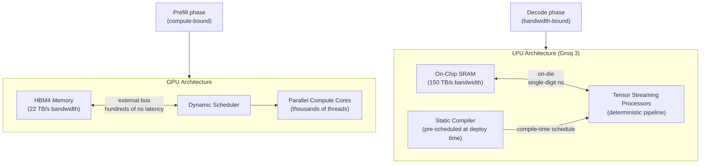
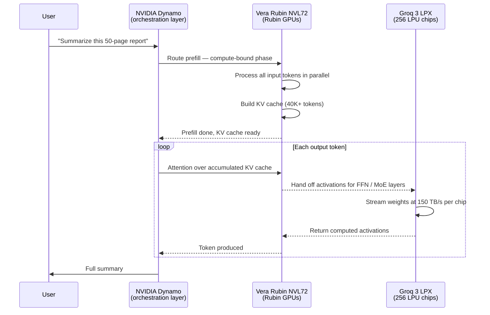

## The Admission NVIDIA Couldn't Avoid

In December 2025, NVIDIA — the company that had dominated AI hardware so completely it seemed to be running a one-player race — quietly paid approximately $20 billion for a license to a chip it did not build. The chip was Groq's Language Processing Unit (LPU), and its architecture is about as different from an NVIDIA GPU as a conveyor belt is from a forklift.

The deal, unveiled at GTC 2026 in March, produced the seventh chip in NVIDIA's Vera Rubin platform: the **Groq 3 LPX**. It sits alongside NVIDIA's own Vera CPU, Rubin GPU, NVLink 6 Switch, ConnectX-9 SuperNIC, BlueField-4 DPU, and Spectrum-6 Ethernet switch — all unified into a rack-scale AI supercomputer.

Combined, the Vera Rubin NVL72 and Groq 3 LPX deliver up to **35 times higher inference throughput per megawatt** for trillion-parameter models compared to the previous Blackwell platform alone. That number reflects something important: NVIDIA had found the limit of what GPUs can do on their own.

---

## Why Token Generation Is a Different Problem Than Training

To understand why NVIDIA needed Groq, you need to understand a fundamental split in how large language models work during inference.

When a model like GPT-5 responds to your query, it does two very different things in sequence.

**Prefill** comes first. The model reads your entire input prompt — every word, every document you pasted in — and processes it all at once to create a compressed representation called the KV (key-value) cache. This phase is massively parallel and *compute-bound*: you need enormous numbers of floating-point operations happening simultaneously across thousands of GPU cores. This is what GPUs were built for.

**Decode** comes second. The model generates your response one token (roughly one word) at a time. For each new token, it must load the model's full weight matrices from memory, perform the attention calculation over the accumulated KV cache, run those weights through feed-forward layers, and produce a single output number. Then it repeats — potentially thousands of times for a long response. This phase is *memory-bandwidth-bound*: the compute units sit largely idle, waiting for weights to be streamed in from memory.

The bottleneck shifts completely between the two phases. Prefill needs compute. Decode needs memory bandwidth. And GPUs, designed to be excellent at compute-heavy tasks, are mediocre at the memory-streaming-intensive decode loop.

---

## What a Language Processing Unit Actually Is

Groq's LPU was not an incremental GPU improvement. It was built from scratch in 2017 by former Google TPU engineers, specifically to run LLM inference as fast as physically possible — years before "inference at scale" was the dominant concern in the industry.

Two ideas make it fundamentally different.

### On-Chip SRAM Instead of External Memory

A GPU stores model weights in high-bandwidth memory (HBM) — essentially DRAM chips attached to the outside of the processor die. Every time the GPU needs a weight, it sends a request across a bus to HBM and waits. HBM access takes hundreds of nanoseconds and tops out at around 22 TB/s on NVIDIA's newest Rubin GPUs.

The LPU stores weights in **SRAM directly on the processor die** — the same technology used for CPU cache, but repurposed as primary model storage. SRAM sits right next to the compute units, with access latency measured in single-digit nanoseconds. A Groq 3 LPU chip delivers **150 TB/s of SRAM bandwidth** — nearly seven times faster than the Rubin GPU's HBM4.

The trade-off is density. SRAM requires more silicon area per bit than DRAM. An NVIDIA H200 GPU carries 141GB of HBM. A single Groq 3 LPU carries **500MB of SRAM**. Running a 70-billion-parameter model requires spreading it across hundreds of LPU chips, with the weights partitioned across a distributed SRAM fabric. For token generation — where those weights need to stream at maximum possible speed — this is exactly the right architectural choice.

### Deterministic Execution

GPUs are general-purpose processors. They handle unpredictable workloads using dynamic runtime schedulers that decide, moment to moment, what computation happens next. This flexibility introduces variable latency and scheduling overhead.

The LPU uses a **statically compiled execution model**. A specialized compiler analyzes the full model graph before deployment and produces a fixed schedule where every computation happens at a predetermined clock cycle. There is no runtime scheduler, no cache miss uncertainty, no queuing. The result is deterministic, predictable inference — every token takes the same amount of time, making it ideal for real-time applications that can't tolerate latency spikes.

### The Rack Problem

Because 500MB cannot hold a production LLM (a 70B-parameter model needs roughly 140GB in fp16), the Groq 3 LPX connects **256 LPU chips** per rack via dedicated chip-to-chip interconnects running at 2.5 TB/s per chip. The full rack aggregates to:

- **128GB** of total on-chip SRAM (spread across 256 chips)
- **40 petabytes per second** of total SRAM bandwidth
- **640 TB/s** of chip-to-chip scale-up bandwidth

The model is partitioned across the rack's distributed SRAM, and software presents it as a single unified memory space. The bandwidth numbers at rack scale are unprecedented for an inference system.

---

## The NVIDIA-Groq Deal

The transaction was structured unusually. NVIDIA paid approximately $20 billion in December 2025 for a **non-exclusive license** to Groq's LPU architecture, along with the departure of Groq CEO Jonathan Ross and president Sunny Madra to join NVIDIA. Groq as a company continues to exist independently, still operating the GroqCloud inference API.

U.S. senators asked the Department of Justice and Federal Trade Commission to investigate whether the structure was designed to sidestep Hart-Scott-Rodino premerger notification requirements — laws that require companies to disclose large acquisitions to regulators in advance. NVIDIA obtained the technology and the key engineers without technically acquiring the company, which may have kept the deal below the notification threshold.

Why $20 billion? Because the alternative was worse. Building a competitive LPU architecture internally from scratch would have taken three to five years and cost uncertain billions in R&D. Paying for the shortcut meant NVIDIA could solve the decode bottleneck in its next platform generation rather than the one after. At the pace AI hardware is moving, that timing gap is an eternity.

---

## How Disaggregation Works: Splitting One Request Across Two Systems

The core insight of the Vera Rubin + Groq 3 LPX system is **inference disaggregation**: prefill and decode run on separate hardware, each matched to its bottleneck.

NVIDIA's **Dynamo** inference framework acts as the orchestrator that coordinates the handoff between the two hardware systems. Here is what happens to a single user request:

The attention computation over the KV cache stays on the GPU side because it's inherently parallel and suited to GPU throughput. The feed-forward network (FFN) and mixture-of-experts (MoE) layers — which together contain the vast majority of a model's parameters — move to the LPX because they are pure weight-streaming operations where bandwidth dominates.

For a trillion-parameter MoE model, the FFN/MoE weight streaming step is the bottleneck almost every time. Routing it to hardware with 40 PB/s of rack-level bandwidth instead of 1.6 PB/s removes the ceiling on how fast tokens can be produced.

---

## Not Just NVIDIA: A Converging Design Pattern

NVIDIA is not the only organization that reached this conclusion.

In March 2026, **Amazon Web Services** and **Cerebras Systems** announced a similar disaggregated architecture. AWS Trainium accelerators handle the compute-intensive prefill phase. Cerebras CS-3 wafer-scale chips — each a single silicon die the size of a dinner plate, with hundreds of gigabytes of on-chip SRAM — handle the bandwidth-intensive decode phase. AWS claims the combined system delivers **5× more high-speed token capacity** in the same hardware footprint. It is scheduled to arrive on Amazon Bedrock in H2 2026.

Two separate hardware ecosystems, designed by competing teams with different silicon approaches, arrived at the same architectural answer: split inference at the prefill/decode boundary and match hardware to bottleneck. When independent teams converge on the same solution, it usually means the solution is correct.

---

## What This Means in Practice

**For developers:** Applications that send large documents or maintain long conversation histories will see faster response times as the decode phase stops bottlenecking on GPU bandwidth. Real-time applications — voice assistants, interactive coding agents, tool-calling loops — benefit most from the LPU's deterministic latency profile. The 35× throughput-per-watt improvement also translates directly into lower cost per token at the frontier model tier.

**For infrastructure:** The Groq 3 LPX enters production in Q3 2026, with AWS, Google Cloud, Microsoft Azure, and Oracle Cloud Infrastructure among the first deployments of Vera Rubin–based systems. Enterprises building on hosted APIs will see the benefit without thinking about the hardware at all.

**For AI architecture:** Trillion-parameter models become economically viable to serve at scale. These models — a category that includes the largest MoE architectures in production today — were previously prohibitively expensive to run for interactive use. Lower cost unlocks them for applications that couldn't afford them.

---

## The $20 Billion Lesson

The NVIDIA-Groq deal is remarkable for what it reveals about the limits of the GPU.

NVIDIA has outspent every competitor in AI hardware R&D for a decade. Yet even with those resources, they encountered a problem that couldn't be solved by making another, bigger GPU. The LLM decode loop is memory-bandwidth-limited in a way that is architectural, not a matter of scale or process node.

Groq built the right chip at the wrong time — arriving years before inference became the dominant AI workload. By the time it mattered, NVIDIA had noticed. The $20 billion is, in hindsight, an acknowledgment that the decode wall is real and that GPUs alone can't climb it.

The AI hardware story through 2025 was about who had the most GPUs. Through 2026 and beyond, it is about who has the right combination of compute and bandwidth — matched to each phase of an increasingly complex inference problem.

---

## Sources

- [NVIDIA Kicks Off the Next Generation of AI With Rubin — Six New Chips, One Incredible AI Supercomputer | NVIDIA Newsroom](https://nvidianews.nvidia.com/news/rubin-platform-ai-supercomputer)
- [NVIDIA Vera Rubin Opens Agentic AI Frontier | NVIDIA Newsroom](https://nvidianews.nvidia.com/news/nvidia-vera-rubin-platform)
- [Inside NVIDIA Groq 3 LPX: The Low-Latency Inference Accelerator for the NVIDIA Vera Rubin Platform | NVIDIA Technical Blog](https://developer.nvidia.com/blog/inside-nvidia-groq-3-lpx-the-low-latency-inference-accelerator-for-the-nvidia-vera-rubin-platform/)
- [How the NVIDIA Vera Rubin Platform Is Solving Agentic AI's Scale-Up Problem | NVIDIA Technical Blog](https://developer.nvidia.com/blog/how-the-nvidia-vera-rubin-platform-is-solving-agentic-ais-scale-up-problem/)
- [NVIDIA Dynamo: A Low-Latency Distributed Inference Framework for Scaling Reasoning AI Models | NVIDIA Technical Blog](https://developer.nvidia.com/blog/introducing-nvidia-dynamo-a-low-latency-distributed-inference-framework-for-scaling-reasoning-ai-models/)
- [Nvidia's $20B Groq Acquisition: Why It Paid 2.9x Valuation for LPU Tech | IntuitionLabs](https://intuitionlabs.ai/articles/nvidia-groq-ai-inference-deal)
- [Nvidia's Groq deal: Acquisition, acquihire or creative licensing deal? | Constellation Research](https://www.constellationr.com/blog-news/insights/nvidias-groq-deal-acquisition-acquihire-or-creative-licensing-deal)
- [What Is a Language Processing Unit? | Groq](https://groq.com/blog/the-groq-lpu-explained)
- [Inside the LPU: Deconstructing Groq's Speed | Groq](https://groq.com/blog/inside-the-lpu-deconstructing-groq-speed)
- [Groq AI in 2026: Nvidia Deal, LPU Architecture, GroqCloud, and What It Means for Builders | Voiceflow](https://www.voiceflow.com/blog/groq)
- [AWS partners with Cerebras for AI inference disaggregation | Data Center Dynamics](https://www.datacenterdynamics.com/en/news/aws-partners-with-big-chip-co-cerebras-for-ai-inference-disaggregation/)
- [Nvidia bets big on bandwidth with Groq 3 LPU to complement GPUs | SDxCentral](https://www.sdxcentral.com/news/nvidia-bets-big-on-bandwidth-with-groq-3-lpu-to-complement-gpus/)
- [Nvidia Groq 3 LPU and Groq LPX racks join Rubin platform at GTC | Tom's Hardware](https://www.tomshardware.com/pc-components/gpus/nvidia-groq-3-lpu-and-groq-lpx-racks-join-rubin-platform-at-gtc-sram-packed-accelerator-boosts-every-layer-of-the-ai-model-on-every-token)
