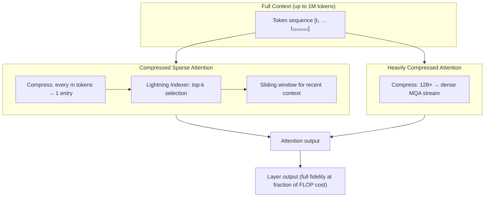
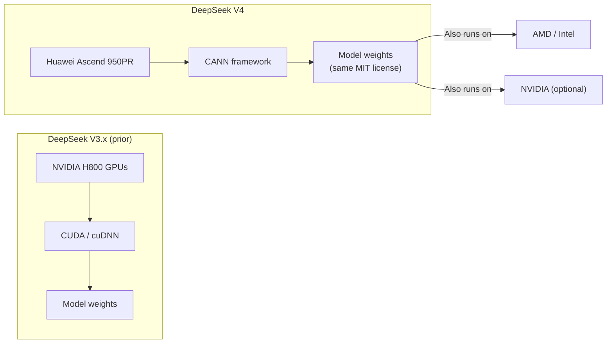

## The Lab That Keeps Surprising the Industry

Twelve months ago, DeepSeek's V3 series arrived and triggered what some in the industry called an "AI Sputnik moment." A relatively unknown Chinese lab had matched or beaten the largest Western frontier models — and released the weights for free. Hardware stocks shuddered. Assumptions about the compute requirements for state-of-the-art AI had to be revised overnight.

On April 24, 2026, DeepSeek did it again.

**DeepSeek V4 Flash** is a new open-weight language model with 284 billion total parameters (13 billion active per forward pass), a one-million-token context window, and pricing that undercuts comparable Western API services by an order of magnitude. Its larger sibling, **V4 Pro**, scales to 1.6 trillion parameters and 49 billion active, and both are released under the **MIT License** — meaning anyone can use, fine-tune, host, and redistribute the weights commercially, with no strings attached.

But the story is not just about the numbers. It is about how DeepSeek solved a fundamental problem that has held long-context AI back, the optimizer they used that the broader field had barely explored at scale, and the fact that V4 runs on Huawei chips — a development Jensen Huang has called "a horrible outcome."

---

## Why a Million-Token Context Window Is Hard

A context window of one million tokens sounds like a marketing number, but the engineering challenge behind it is real. Standard transformer attention has **quadratic cost**: if you double the sequence length, you multiply the attention computation by four. At one million tokens, naïve full attention would be computationally infeasible for any practical inference setup.

Previous attempts to extend context windows fell into two camps: either they approximated attention (sacrificing quality on long dependencies) or they sharded the context across hardware (adding latency and system complexity). Neither approach scaled gracefully.

DeepSeek V4 takes a different route. Instead of approximating attention over the full sequence, it **compresses the sequence before attending to it** — and does so in two complementary ways.

---

## The Attention Innovations: CSA and HCA

The technical paper behind V4 (published simultaneously with the release, titled *DeepSeek-V4: Towards Highly Efficient Million-Token Context Intelligence*) introduces a hybrid attention architecture combining two novel mechanisms:

**Compressed Sparse Attention (CSA)** works by grouping every *m* consecutive key-value tokens into a single learned representation. A dedicated compression network produces this condensed entry, and a fast top-k indexer — called the **Lightning Indexer** — selects the most relevant compressed entries for each query. A short sliding window handles the most recent tokens, where recency matters most. The result: you attend over a much shorter sequence, but the information from the full context is still there in compressed form.

**Heavily Compressed Attention (HCA)** takes this further, compressing by a factor of 128 into a dense, multi-query stream. Where CSA is like summarising paragraphs, HCA is like keeping a running executive summary of the entire document.

The layers alternate: some transformer blocks use CSA, others use HCA. This interleaving ensures that both fine-grained sparse retrieval and global summary context are available throughout the network.

The payoff is dramatic. At one million tokens:

- **V4 Flash** requires only **10% of the FLOPs and 7% of the KV cache** of DeepSeek V3.2 performing the same inference.
- **V4 Pro** requires only **27% of the FLOPs and 10% of the KV cache**.

That is not a minor efficiency improvement. It is the difference between long-context inference being a niche research capability and something you can run at scale in production.

---

## The Muon Optimizer and Manifold-Constrained Training

DeepSeek V4 also represents one of the largest public deployments of the **Muon optimizer** — a training method that had attracted attention in research circles but had not yet been validated at frontier scale.

Standard optimizers like AdamW update each parameter independently, tracking per-parameter momentum and variance. Muon takes a different approach: it applies **Newton-Schulz iterations** to approximately orthogonalize the gradient update matrix before applying it as a weight update. The intuition is that orthogonal updates explore the weight space more efficiently, reducing the wasteful redundancy that occurs when correlated parameters update in similar directions.

In practice, DeepSeek uses Muon for most of the model's parameters and falls back to AdamW only for embeddings, prediction heads, and normalization weights — the parts of the network where orthogonality is less meaningful. This combination trained both Flash (on 32 trillion tokens) and Pro (on 33 trillion tokens) more stably than prior large-scale experiments suggested was feasible.

A third architectural innovation — **Manifold-Constrained Hyper-Connections (mHC)** — addresses training stability at 1.6 trillion parameters. The mHC mechanism constrains the residual mixing matrix to lie on the Birkhoff polytope (the space of doubly stochastic matrices), achieved through Sinkhorn-Knopp iterations. This bounds the matrix's spectral norm to at most 1, keeping the transformation non-expansive and preventing the runaway activation scaling that tends to destabilize very large models during training.

---

## Flash vs Pro: Two Tiers, One Vision

The V4 family ships in two configurations, deliberately targeting different use cases.

| | V4 Flash | V4 Pro |
|---|---|---|
| Total parameters | 284B | 1.6T |
| Active per token | 13B | 49B |
| Context window | 1M tokens | 1M tokens |
| Max output | 384K tokens | 384K tokens |
| Training data | 32T tokens | 33T tokens |
| License | MIT | MIT |

**V4 Flash** is optimised for throughput and cost. At 83.6 tokens per second with a 1.04-second time-to-first-token on DeepSeek's own API, it is measurably faster than most comparable open models. Its intelligence score on the Artificial Analysis index sits at 47, well above the median of 30 for models with similar active-parameter counts. For workloads involving large codebases, long documents, or multi-turn agentic tasks — the places where a million-token window genuinely helps — Flash delivers near-flagship quality at a fraction of the cost.

**V4 Pro** pushes to the frontier. On **LiveCodeBench** (competitive programming), V4 Pro leads the public leaderboard at 93.5, ahead of Gemini 3.1 Pro (91.7) and Claude Opus 4.6 (88.8). On **MMLU-Pro** it matches GPT-5.4 at 87.5%, trailing only Gemini 3.1 Pro (91.0%). On **Codeforces** rating — a real-world competitive coding measure — V4 Pro's 3,206 rating tops GPT-5.4 (3,168) and Gemini (3,052).

V4 Flash falls 7–10 points behind Pro on agentic coding benchmarks like SWE-Pro and Terminal-Bench, which makes sense: those tasks reward raw reasoning depth over throughput. But for most production use cases — retrieval-augmented generation, document processing, code review — Flash's profile is compelling.

---

## Open Weights and the Price Inversion

The pricing tells its own story.

DeepSeek V4 Flash costs **$0.14 per million input tokens** and **$0.28 per million output tokens** on the DeepSeek API. Enable prompt caching — which V4 supports natively — and cache-hit input tokens drop to **$0.0028 per million**, a 98% discount.

For reference: at launch, GPT-5.4 input pricing was roughly 10–20× higher per token on comparable workloads. The flash tier of Gemini 3.1, Google's cheapest frontier option, came in at $0.25 per million — still nearly twice what you pay for V4 Flash output.

More importantly, because both models are MIT-licensed with publicly available weights (Flash weighs in at roughly 160GB, easily fitting on a cluster of high-end consumer GPUs), anyone can self-host and pay only electricity and hardware depreciation. For organisations processing millions of documents, that changes the unit economics of AI entirely.

---

## The Huawei Question

The most geopolitically significant aspect of V4 is something that does not appear in any benchmark table: it was built and optimised, from the ground up, to run on **Huawei Ascend 950PR processors** — not NVIDIA GPUs.

DeepSeek worked closely with Huawei and Cambricon (a Chinese AI chip designer) to port every component of the V4 stack from NVIDIA's CUDA framework to Huawei's CANN framework. The result, according to reporting at the time of launch, is the first frontier-class Chinese model with **no American software dependency anywhere in its stack** — from chip firmware to training runtime to inference serving.

NVIDIA CEO Jensen Huang, speaking on a podcast, called this trajectory "a horrible outcome" for the United States: if DeepSeek proves that top-tier AI can be built and served without CUDA, other labs may follow, and the software moat that underpins NVIDIA's market dominance begins to erode. US lawmakers have floated placing DeepSeek on the entity list; others have pointed out that the MIT-licensed weights are already globally distributed and enforcement would be largely symbolic.

The technology-policy dimension here is real. For years, semiconductor export controls have been a central US lever for slowing China's AI development. V4 suggests that lever is weaker than assumed: the capability gap between what Chinese labs can build on domestic silicon and what Western labs build on NVIDIA has narrowed to the point where the models are competing on benchmark tables.

---

## What This Means for Developers

For a developer or architect evaluating models today, V4 Flash presents a straightforward value proposition:

- You need long-context processing (legal documents, large codebases, long transcripts) at scale.
- You want open weights for compliance, fine-tuning, or on-premises deployment.
- You want competitive coding and reasoning performance without paying frontier-tier prices.

The one-million-token window is genuinely usable — not a marketing claim with asterisks — because the CSA/HCA efficiency breakthrough makes it economically viable to serve. You can drop in an entire large codebase, a full year of meeting transcripts, or a multi-hundred-page legal contract, and the model can reason across the whole thing in a single context.

Self-hosting V4 Flash requires serious hardware (the 160GB weight file wants 4–8 high-VRAM GPUs or equivalent), but for teams already operating GPU infrastructure, the weights are available on Hugging Face under a license that permits any use. Third-party providers including DeepInfra and RunPod began offering V4 Flash on their APIs within days of launch.

---

## The Bigger Pattern

DeepSeek V4 Flash is not just an incremental model release. It is a demonstration of something the AI industry has been reluctantly coming to terms with: **algorithmic efficiency and architectural innovation can, in the right hands, substitute for raw compute at a surprising rate.**

The CSA/HCA attention system solves a problem — long-context inference cost — that had been blocking practical deployment of million-token models. The Muon optimizer, validated at trillion-parameter scale for the first time, offers a genuine alternative to AdamW for future large-scale training runs. The Huawei chip story signals that China's domestic AI hardware ecosystem has crossed a threshold that export controls were designed to prevent.

DeepSeek will not be the last lab to release an MIT-licensed frontier model. The more consequential question is what the industry looks like when open-weight models at this quality level are available to any team with a GPU cluster and an internet connection — and when that GPU cluster doesn't need to be stocked with American chips to produce results that sit at the top of public leaderboards.

---

## Sources

- [DeepSeek AI Releases DeepSeek-V4: Compressed Sparse Attention and Heavily Compressed Attention Enable One-Million-Token Contexts — MarkTechPost](https://www.marktechpost.com/2026/04/24/deepseek-ai-releases-deepseek-v4-compressed-sparse-attention-and-heavily-compressed-attention-enable-one-million-token-contexts/)
- [DeepSeek is back among the leading open weights models with V4 Pro and V4 Flash — Artificial Analysis](https://artificialanalysis.ai/articles/deepseek-is-back-among-the-leading-open-weights-models-with-v4-pro-and-v4-flash)
- [DeepSeek returns with V4-Pro and V4-Flash, a year after its 'Sputnik moment' — The Next Web](https://thenextweb.com/news/deepseek-v4-pro-flash-launch-open-source)
- [Three reasons why DeepSeek's new model matters — MIT Technology Review](https://www.technologyreview.com/2026/04/24/1136422/why-deepseeks-v4-matters/)
- [DeepSeek Releases DeepSeek V4-Pro & V4-Flash, Delivers GPT 5.4 & Opus 4.6-Level Performance At Fraction Of The Price — OfficeChai](https://officechai.com/ai/deepseek-v4-pro-deepseek-v4-flash-benchmarks-pricing/)
- [DeepSeek's new models offer big inference cost savings — The Register](https://www.theregister.com/2026/04/24/deepseek_v4/)
- [Nvidia's Jensen Huang warns DeepSeek running on Huawei chips would be 'horrible outcome' for America — The Next Web](https://thenextweb.com/news/nvidia-huang-deepseek-huawei-chips-horrible-outcome)
- [DeepSeek Launches V4 AI Model on Huawei Chips — Modern Diplomacy](https://moderndiplomacy.eu/2026/04/24/deepseek-launches-v4-ai-model-on-huawei-chips/)
- [China's DeepSeek Unveils V4 Built On Huawei Chips, Challenging Nvidia Dominance — Benzinga](https://www.benzinga.com/markets/tech/26/04/52050357/chinas-deepseek-unveils-v4-built-on-huawei-chips-challenging-nvidia-dominance-amid-us-tech-curbs)
- [DeepSeek V4: The Next Frontier of Open-Source AI — Ken Huang (Substack)](https://kenhuangus.substack.com/p/deepseek-v4-the-next-frontier-of)
- [DeepSeek-V4 Review: Why Million-Token Context Needs Efficient Attention — Medium (Andrew Lukyanenko)](https://artgor.medium.com/deepseek-v4-review-why-million-token-context-needs-efficient-attention-not-just-larger-windows-6dc8e74a00b1)
- [DeepSeek V4 Released: Open-Source 1.6T MoE, 1M Context, Apache 2.0 — oFox.ai](https://ofox.ai/blog/deepseek-v4-release-guide-2026/)
- [DeepSeek API Pricing 2026: V4 Flash & Pro Cost per 1M Tokens — DevTk.AI](https://devtk.ai/en/blog/deepseek-api-pricing-guide-2026/)
