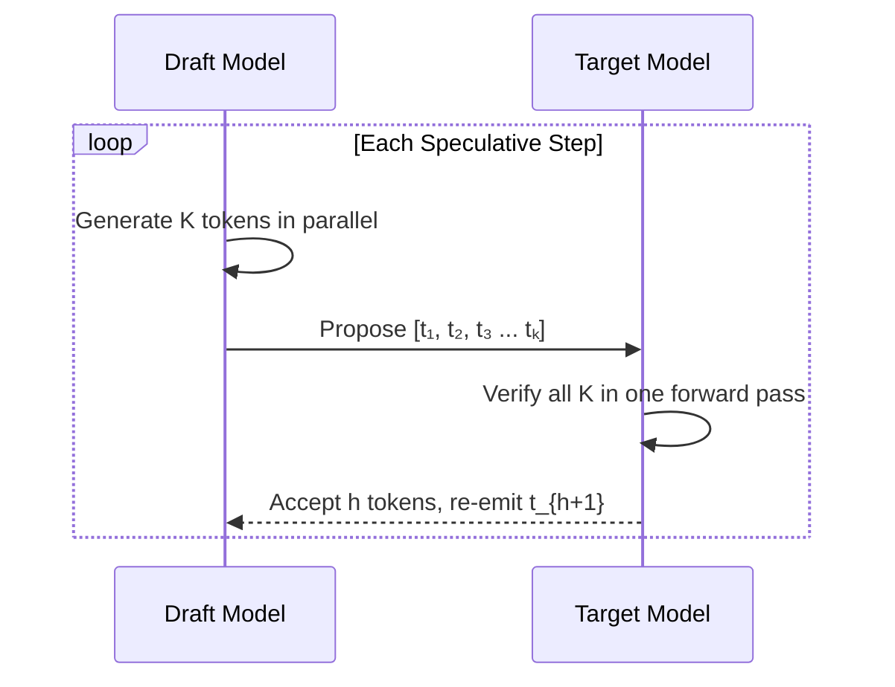
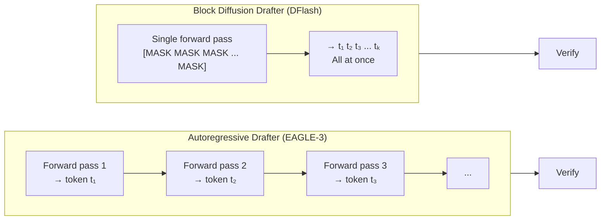
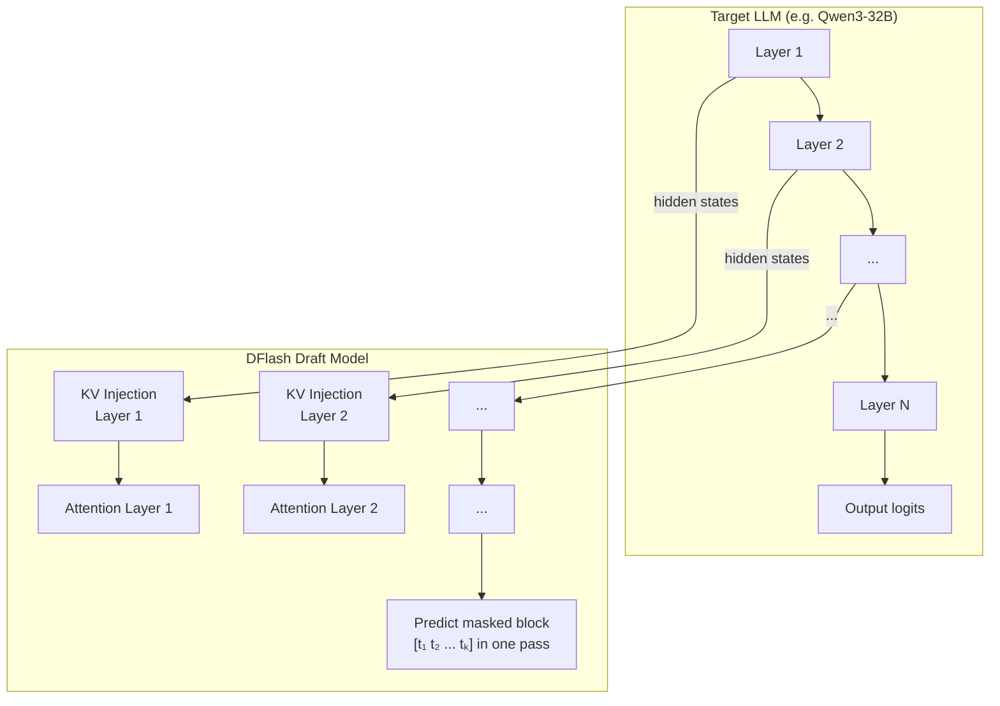

## The Speed Wall That Has Quietly Frustrated Everyone

Ask a large language model to solve a hard math problem and it feels slow. Ask it to draft a 2,000-word document and a progress bar would genuinely help. This is not a hardware failure. Dedicated data-center GPUs capable of doing trillions of floating-point operations per second sit there, mostly idle, while your model emits about 30 tokens per second.

The culprit is the way all modern language models generate text: **one token at a time**. Each word (or word-piece) depends on everything that came before it, so generation must be strictly sequential. You cannot start generating token 47 until you have finished generating token 46. No matter how many GPU cores you have, they are largely underutilized during the decoding phase because each step is too small to saturate them.

This is the wall that researchers have been trying to crack, and in early 2026 a technique called **DFlash** punched through it with results that surprised the field: **over 6× lossless acceleration** on tasks like math and code generation, and up to **2.5× better speedup** than the previous state of the art.

---

## Speculative Decoding: The Cheat Code That Already Existed

The insight behind speculative decoding is elegant: what if you used a small, fast model to guess ahead, and then let the big model check all the guesses at once?

Here is the basic loop:

1. A lightweight **draft model** generates the next K tokens — quickly, because it is small.
2. The large **target model** evaluates all K draft tokens in a single parallel forward pass (the same operation it would perform during prefilling, which GPUs handle efficiently).
3. The target model accepts the longest prefix of drafts that agree with its own probability distribution. If it accepts H tokens, it produces the (H+1)-th token itself and the cycle restarts.

The critical guarantee: this procedure produces **exactly the same output distribution** as running the big model alone. Not approximately — exactly. There is no quality tradeoff.



On tasks where the draft model is closely aligned with the target, you might accept 3–5 tokens per step instead of 1, delivering 3–5× effective throughput from the same hardware. On tasks where the draft regularly disagrees, the speedup degrades.

This idea has been productized across the industry: Meta's Llama inference stack, Google's Gemini serving, and most vLLM deployments all use some variant. The previous state of the art, **EAGLE-3**, achieved real-world speedups of roughly 2–3× by training a small autoregressive head that sees the target model's internal hidden states before predicting each draft token.

So why wasn't 3× good enough? Because for long generations — complex reasoning chains, lengthy code, detailed analysis — every additional millisecond compounds. And because the draft model itself was still autoregressive.

---

## The Bottleneck Hidden Inside the Solution

EAGLE-3 and its predecessors solved the verification bottleneck elegantly. But they left a different bottleneck untouched: **draft generation is still sequential**.

To produce K draft tokens, an autoregressive drafter must run K consecutive forward passes. Each pass depends on the previous one. The larger K is, the longer drafting takes — linearly. There is a ceiling on how many tokens you can speculatively draft before drafting itself becomes the dominant cost.

This is why, even with EAGLE-3, you rarely see more than 4–5 accepted tokens per step in practice. Draft deeper and drafting overhead eats the gains. Draft shallower and you leave verification throughput on the table.

**DFlash's central claim:** the draft model does not need to be autoregressive at all.

---

## Block Diffusion: Generating 10 Tokens in the Time It Takes to Generate 1

DFlash replaces the autoregressive draft head with a **block diffusion model**. Diffusion models — the same family of models behind image generators like Stable Diffusion — work by starting from noise and iteratively denoising toward a target. Discrete-token diffusion (also called masked diffusion) applies this idea to text: mask out positions you want to predict, then fill them all in one denoising step.

The drafting process in DFlash looks like this:

1. Take the current context (already computed tokens).
2. Mark the next K positions as **masked** (unknown).
3. Run the diffusion draft model for **one denoising step**, which fills all K masked positions in parallel.
4. Send all K draft tokens to the target model for verification.

Because all K positions are filled simultaneously in a single forward pass, drafting cost is **flat** with respect to block size. Draft 4 tokens or 16 tokens — the drafting latency is essentially the same. This breaks the linear scaling penalty that capped autoregressive drafters.



The practical impact is that DFlash can afford to draft **10 or more tokens per step** without paying a proportional latency penalty — something that was fundamentally infeasible for autoregressive drafters.

---

## KV Injection: Why the Draft Model Knows What It Is Talking About

A diffusion model generating tokens in a vacuum would produce low-quality drafts — it would not know what the big model is likely to say. The quality of the draft determines the acceptance rate, which determines the speedup.

DFlash solves this with a technique called **KV injection**. The big target model — Qwen3, Gemma 4, Llama 3 — runs its full forward pass and produces rich internal representations at every transformer layer. These are the **hidden states**: high-dimensional vectors that encode everything the model "knows" about the context at each layer of processing.

Instead of just feeding these hidden states into the draft model's input embedding (as EAGLE did, and as the signal fades across deeper layers), DFlash injects them into the **key and value projections** of every attention layer inside the diffusion drafter.



This is a subtle but important difference. EAGLE's single-input injection loses signal as computation flows through deeper draft layers. KV injection **re-conditions every draft layer** independently, so the draft model retains a strong sense of what the big model is thinking even in its deepest layers. The result: the draft model can be made larger and more expressive without hitting a signal-saturation ceiling — and a more expressive draft model produces better token predictions, which means higher acceptance rates.

In practice, DFlash achieves approximately **8 accepted tokens per step**, compared to about 3 for chain-EAGLE. That ratio — more than 2× as many accepted tokens per speculative cycle — is the engine behind the headline speedups.

---

## The Numbers: What DFlash Actually Delivers

The paper, authored by researchers at Z Lab (Jian Chen, Yesheng Liang, Zhijian Liu), was published on arXiv in February 2026. The headline results:

| Task | DFlash speedup over autoregressive | DFlash vs EAGLE-3 |
|---|---|---|
| Math (GSM8K, MATH500) | **up to 6.1×** | **2.5× faster** |
| Code (HumanEval, MBPP) | **4–5×** | **~2×** |
| General chat (MT-Bench) | **3–4×** | **1.5–1.8×** |

These are **lossless** — the output distribution is statistically identical to running the target model alone. No quality tradeoff.

**On real inference hardware:**
- **NVIDIA B200 GPU with SGLang**: Qwen3-8B achieves **5.1× throughput speedup** at batch size 1, holding **2.8×** even at concurrency 32.
- **Google TPU v5p**: Integrated into the open-source vLLM TPU backend, DFlash delivered an **average 3.13× tokens-per-second increase**, with peaks near **6×** for complex math tasks. On one math benchmark, per-token latency dropped from 8.02 ms to 1.40 ms.

The speedup is most dramatic on tasks where the target model's reasoning is "predictable" — long chains of arithmetic, code that follows conventional patterns, structured JSON output. On open-ended creative writing, where unpredictability is the point, gains are still meaningful but closer to the lower end of the range.

---

## Open Source and Immediate Availability

DFlash is not a research artifact waiting for productization. The Z Lab team released:

- **Pre-trained DFlash draft models** on Hugging Face for Gemma 4 (31B and 26B), Qwen 3.5 and 3.6 (multiple sizes up to 122B), Llama 3.1-8B, GPT-OSS 20B and 120B, MiniMax, and Kimi variants.
- **Open-source training code** on GitHub (github.com/z-lab/dflash).
- **Integrations** with vLLM, SGLang, and Hugging Face Transformers — meaning most production inference stacks can adopt DFlash without significant engineering effort.
- **Apple Silicon (MLX) support**, allowing DFlash to accelerate local inference on MacBook Pro hardware.

Enabling DFlash in vLLM is effectively a configuration change:

```bash
vllm serve Qwen/Qwen3-32B \
  --speculative-model z-lab/Qwen3.6-35B-A3B-DFlash \
  --num-speculative-tokens 10
```

No retraining of the target model. No accuracy evaluation to run. Drop in the draft model and get the speedup.

---

## Why This Matters Beyond the Benchmark

The practical implications extend in a few directions.

**Cost at scale.** A 6× inference speedup is, at constant throughput, a ~6× reduction in required GPU time. For any organization running inference at scale, that is not a minor optimization — it is a line item that changes business models. Latency improvements also unlock use cases that were previously impractical: real-time code completion in editors, low-latency voice assistants, responsive agentic loops where the model must take many small steps quickly.

**Reasoning models benefit most.** The tasks where DFlash shines — math, code — are precisely the tasks where the current generation of "thinking" models spend the most tokens. A model that reasons through 4,000 tokens before answering a question benefits proportionally more from a 5× token throughput boost than a model that gives a 50-token answer.

**The efficiency race compounds.** DFlash is arriving at the same time as TurboQuant (which compresses the KV cache to 3 bits), MoE architectures like Gemma 4 (which reduce active parameter count), and improved hardware (NVIDIA Blackwell, Google TPU v5p). These optimizations stack multiplicatively. A model that would have required 8 H100s in 2024 might run, at the same speed, on a single B200 by late 2026.

**Open-source closes the gap.** Because DFlash draft models are available for the leading open-weight models, anyone building on top of Qwen3, Llama, or Gemma 4 gains access to frontier-level inference speed without any dependency on proprietary serving infrastructure. The gap between "what you can run locally" and "what a hyperscaler can serve" keeps shrinking.

---

## The Bigger Pattern

DFlash is part of a broader realization in the field: **the next wave of AI performance gains will not come only from larger models or faster chips.** They will come from clever algorithmic work that extracts more throughput from the hardware that already exists.

Block diffusion as a drafting strategy is a conceptually clean idea — abandon the sequential constraint that makes drafting slow, exploit the parallelism that verification already uses — but executing it required solving non-obvious problems about how to condition the draft model without losing signal across depth.

The fact that a three-person research team published this, released complete open-source code, and integrated with vLLM and SGLang within weeks is itself a signal about the pace of 2026 AI research. The gap between "paper on arXiv" and "running in production" has never been shorter.

For developers serving LLM inference, the message is straightforward: check whether your target model has a DFlash draft on Hugging Face. If it does, a configuration change is all that stands between you and a 3–6× speedup.

---

## Sources

- [DFlash: Block Diffusion for Flash Speculative Decoding — arXiv 2602.06036](https://arxiv.org/abs/2602.06036)
- [DFlash GitHub repository — z-lab](https://github.com/z-lab/dflash)
- [Supercharging LLM inference on Google TPUs: Achieving 3× speedups with diffusion-style speculative decoding — Google Developers Blog](https://developers.googleblog.com/supercharging-llm-inference-on-google-tpus-achieving-3x-speedups-with-diffusion-style-speculative-decoding/)
- [DFlash on GPU Cloud: 6× Faster LLM Inference — Spheron Blog](https://www.spheron.network/blog/dflash-block-diffusion-speculative-decoding-gpu-cloud/)
- [Accelerating Speculative Decoding with Block Diffusion Draft Trees — arXiv 2604.12989](https://arxiv.org/html/2604.12989v1)
- [DFlash Models in vLLM Speculators — vLLM Docs](https://docs.vllm.ai/projects/speculators/en/latest/user_guide/algorithms/dflash/)
- [DFlash: 3× Faster LLM Inference — Baseten Blog](https://www.baseten.co/blog/dflash-faster-llm-inference/)
- [The Speculative Decoding Handbook: DFlash, Lorbus, and MTP for Speed — dasroot.net](https://dasroot.net/posts/2026/04/speculative-decoding-dflash-lorbus-mtp-speed/)
- [An Introduction to Speculative Decoding for Reducing Latency in AI Inference — NVIDIA Developer Blog](https://developer.nvidia.com/blog/an-introduction-to-speculative-decoding-for-reducing-latency-in-ai-inference/)
- [DART: Diffusion-Inspired Speculative Decoding for Fast LLM Inference — arXiv 2601.19278](https://arxiv.org/html/2601.19278v1)
