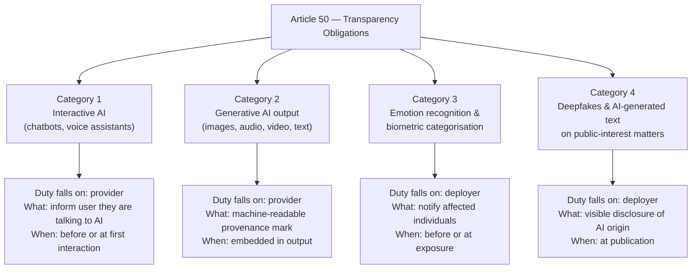
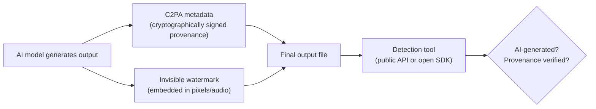

## Seeing Is No Longer Believing

In the spring of 2026, a video of a European finance minister accepting a bribe circulated widely on social media before fact-checkers confirmed it was AI-generated. No watermark. No disclosure. No way for a viewer to know without specialist tools.

That kind of incident is exactly what prompted Article 50 of the EU AI Act — and as of August 2, 2026, it is no longer a law on paper. It is enforceable, with teeth.

The rule is simple at its core: if AI created or substantially altered a piece of content that a human might encounter, the human should be able to know that. Simple in principle. Surprisingly intricate in practice — because "content" covers everything from a chatbot reply to a synthetic news photograph to a political attack ad voiced by someone who never spoke those words.

---

## What Article 50 Actually Says

Article 50 is the transparency chapter of the EU AI Act (Regulation 2024/1689). It doesn't touch high-risk AI systems or foundation models directly — those have their own chapters. Instead it focuses on the *interface* between AI and people: the moment a user reads, hears, watches, or talks to something that AI shaped.

The law splits obligations across four distinct categories, and it's important not to confuse them.

Each category has a different obligated party (sometimes the provider who built the tool, sometimes the deployer who used it), a different audience, and a different technical mechanism. Getting these distinctions wrong is one of the most common compliance mistakes organisations are making right now.

---

## Category 1: Chatbots Must Say They're Chatbots

Any AI system designed to have a conversation with a human must make clear — before or at the very start of that interaction — that the user is talking to a machine. This obligation falls on the **provider**: the company that built and deployed the system.

The disclosure must be "clear and distinguishable" and must meet accessibility standards so it reaches users with disabilities. Technically, this doesn't need to be a legal disclaimer buried in a terms-of-service modal. A visual label reading "AI Assistant" in the chat header, or an automated opening message — "Hi, I'm an AI and here to help you" — satisfies the obligation.

What doesn't satisfy it: a fine-print footnote after twenty turns of conversation, or a generic "help" interface that could plausibly be either a human or a machine.

One nuance: if a user *wants* to roleplay with an AI system that pretends to be human — and explicitly sets that up themselves — the law permits this. The obligation is to inform, not to break immersion that the user voluntarily created.

---

## Category 2: Machine-Readable Provenance Marks

This is the most technically ambitious obligation, and the one that has the widest industry impact.

Any provider of a generative AI system — text, image, audio, or video — must ensure its outputs are **marked in a machine-readable format** detectable as artificially generated or manipulated. The idea is that even if a human can't distinguish a synthetic image from a real photograph, a detection system should be able to.

The law is deliberately **technology-neutral**: it does not name a specific format or standard. In practice, the industry has coalesced around two approaches that are often used together:

### Provenance Metadata: C2PA

C2PA (Coalition for Content Provenance and Authenticity), developed by Adobe, Microsoft, Google, Intel, and others, embeds a cryptographically signed record directly into a file. This record describes the file's origin and editing history — whether it was generated by AI, which tool was used, and any human edits made afterward.

The signature is tamper-evident: if someone strips or modifies the metadata, the signature breaks, which is itself a signal. Many major image generators and editing tools have begun embedding C2PA manifests by default.

### Invisible Watermarks

A separate layer uses signal-processing techniques to embed imperceptible patterns in image pixels, audio waveforms, or video frames. Unlike metadata, watermarks persist even if the file is re-saved, converted to a different format, or screenshotted. The trade-off: watermarks can be degraded by compression or adversarial attacks, and a missing watermark doesn't prove a file is authentic — only that it wasn't marked.

The practical advice from the European Commission's guidelines is to **use both**: metadata for the rich provenance record, and watermarks for resilience when the file travels outside controlled pipelines.

Critically, the Code of Practice on Transparency of AI-Generated Content — a voluntary compliance tool endorsed by the European Commission — requires signatories to **make their detection tools available free of charge** to the public, either as a downloadable SDK, a cloud API, or both. About 190 organisations signed the Code ahead of August 2, including most major AI labs and platform providers.

---

## Category 3: Emotion Recognition and Biometric Categorisation

If a company uses an AI system to infer a person's emotional state — from their facial expression, voice tone, or physiological signals — or to categorise them by race, gender, political opinion, or other protected attributes, the **deployer** must notify affected individuals before or at the point of exposure.

This obligation caused a notable shake-up in HR tech and retail analytics, both of which have widely used emotion-recognition tools for hiring interviews and customer sentiment tracking. The disclosure requirement doesn't prohibit the use of these tools; it requires that people know they are being assessed by them.

---

## Category 4: Deepfakes and AI Text on Public-Interest Matters

The last category targets the most politically sensitive outputs: deepfakes depicting real people, and AI-generated text published on matters of public interest (news, elections, public health).

The **deployer** — the entity publishing the content — must disclose that it was artificially generated or manipulated. For deepfakes, this means a visible label on the content itself. For AI-generated news-style text, the rules are more nuanced.

### The Editorial Review Exception

If an AI system drafted text that was subsequently reviewed by a human editor who bears editorial responsibility for its publication, the transparency disclosure obligation is waived. The theory is that a human made a professional judgment call about the accuracy and integrity of the text. Standard newsroom review satisfies this. Automated pipeline → publish, without human review, does not.

This exception is narrowly defined. A "review" that consists of clicking "approve" without reading the text doesn't qualify.

### The Satire and Fiction Exception

Article 50(4) carves out space for artistic and satirical work. If a deepfake is "evidently" part of a fictional, satirical, or creative production, the deployer still needs to disclose the AI origin — but can do so in accompanying materials (such as credits, show notes, or metadata) rather than as a visible overlay on the content itself. The word "evidently" matters: content that requires knowing context to understand as satire doesn't automatically qualify.

---

## Grace Periods: What's Live Now vs. December

Not everything under Article 50 went live on August 2. The enforcement schedule has two tiers:

| Obligation | Effective |
|---|---|
| Chatbot disclosure (Category 1) | **August 2, 2026** |
| Emotion recognition / deepfake disclosure (Categories 3 & 4) | **August 2, 2026** |
| Machine-readable marking of AI content (Category 2) | **August 2, 2026 for new systems** **December 2, 2026 for systems deployed before August 2** |

In other words, every AI system placed on the market after August 2 must already ship with provenance marking. Tools launched before that date get a four-month grace period to retrofit it — but the clock is running.

---

## Penalties and Who Must Comply

Enforcement is split between the **AI Office** (for general-purpose AI model providers) and **national market surveillance authorities** (for most other cases). The European Data Protection Supervisor handles cases where EU institutions are the provider or deployer.

Fines reach the greater of **€15 million** or **3% of total worldwide annual turnover**. For a company with €10 billion in global revenue, that's up to €300 million — serious money by any measure.

The territorial reach is broad: Article 50 applies to **any provider or deployer whose AI system is made available or used by people in the EU**, regardless of where the company is headquartered. A San Francisco-based image generator with European users must comply. A Seoul-based chatbot studio serving European markets must comply.

Companies that signed the Code of Practice get a practical benefit beyond legal certainty: enforcement attention will be focused on adherence to the code's specific obligations, which are more predictable than the general statutory standard. Non-signatories face enforcement without that roadmap.

---

## Why This Is a Global Story

The EU rarely stops at its own borders. When a market the size of the EU mandates machine-readable provenance marks, the practical result is that global platforms adopt the standard — because maintaining separate product versions for EU and non-EU users is expensive and error-prone.

C2PA adoption has already accelerated dramatically since the enforcement deadline was announced. The Coalition's membership has expanded to include camera manufacturers, social platforms, news agencies, and AI labs. Content authenticity is beginning to function like a supply chain standard: upstream generators produce marked content, downstream platforms verify and display provenance information, and users benefit from a consistent signal about what they're seeing.

The harder problem — and the one the law doesn't fully solve — is detection. A watermark embedded by a responsible provider can be stripped by a bad actor willing to do a bit of image processing. An unsigned photo doesn't prove the photo is authentic. The current rules set a floor: making AI disclosure the default for responsible actors. They don't, and probably can't, guarantee that irresponsible actors comply.

That's not a reason to dismiss Article 50. Floor-setting matters. A world where responsible AI content is consistently labeled, where chatbots introduce themselves, and where deepfake disclosures are legally required — even if not perfectly enforced — is meaningfully different from a world without any of these requirements.

---

## Sources

- [EU AI Act Article 50: Transparency Obligations Take Effect – Cloud Security Alliance Labs](https://labs.cloudsecurityalliance.org/research/csa-research-note-eu-ai-act-article-50-transparency-20260729/)
- [Europe's AI Watermarking Rules Are Now Live – Silicon Canals](https://siliconcanals.com/t-europes-ai-watermarking-rules-are-now-live-but-visible-labels-hidden-machine-readable-marks-and-editorial-review-apply-to-different-companies-content-and-moments-under-article-50/)
- [EU AI Act Article 50: Chatbot and Deepfake Rules for UK Firms – Bratby Law](https://bratby.law/ai-act-transparency-obligations-2026/)
- [EU Commission Article 50 AI Transparency Law Has Four Exemptions – Search Engine Journal](https://www.searchenginejournal.com/eu-commission-article-50-ai-transparency-law-has-four-exemptions/584528/)
- [Taking the EU AI Act to Practice: The Final Transparency Code of Practice – Bird & Bird](https://www.twobirds.com/en/insights/2026/taking-the-eu-ai-act-to-practice-the-final-transparency-code-of-practice)
- [EU AI Act: Commission Confirms Transparency Code of Practice as Adequate – Faegre Drinker](https://www.faegredrinker.com/en/insights/publications/2026/7/eu-ai-act-commission-confirms-transparency-code-of-practice-as-adequate-and-publishes-final-version-of-its-guidelines-on-transparency-obligations)
- [EU AI Act: Does Article 50 Mandate C2PA? – Lumethic](https://www.lumethic.com/en/articles/eu-ai-act-c2pa-mandate)
- [Watermarks and Metadata: How to Actually Comply With the EU AI Act's Article 50 – ComplianceHub.Wiki](https://compliancehub.wiki/eu-ai-act-marking-labelling-code-of-practice-article-50-2026/)
- [Article 50: Labelling Synthetic Content from August 2026 – TrueScreen](https://truescreen.io/insights/ai-act-article-50-labelling-synthetic-content-august-2026/)
- [Deployer Obligations Under the AI Act: Implications for Employers – DLA Piper](https://knowledge.dlapiper.com/dlapiperknowledge/globalemploymentlatestdevelopments/2026/deployer-obligations-under-the-ai-act-implications-for-employers-from-2-august-2026)
