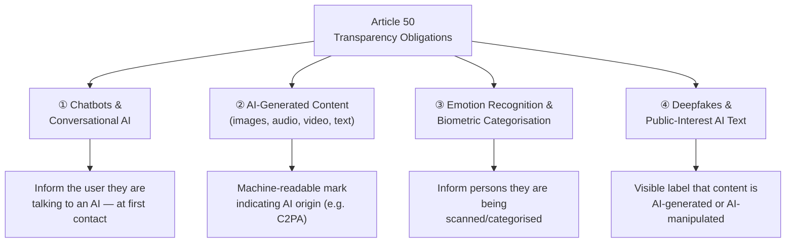
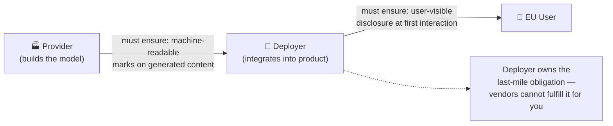
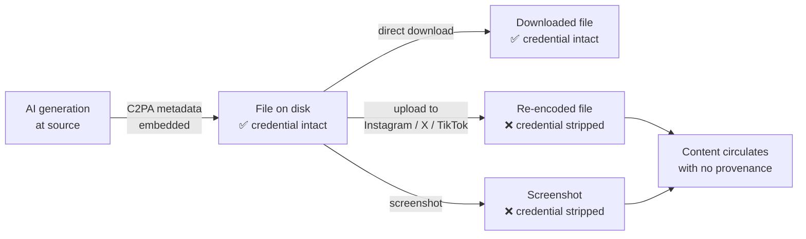

## The Date Everyone in AI Circled

August 2, 2026. That's when the European Union crossed a line that no major jurisdiction had crossed before: AI systems that interact with people, generate synthetic content, or scan human faces and emotions must now legally disclose what they are.

The requirement comes from **Article 50 of the EU AI Act (Regulation (EU) 2024/1689)**, the world's first comprehensive AI law. The act entered into force on August 2, 2024. Most of its provisions take effect over a two-year phased schedule. Article 50 — the transparency chapter — completes that first cycle.

This isn't a soft code of conduct or a voluntary pledge. Fines for non-compliance can reach **€15 million, or 3% of a company's global annual turnover**, whichever is higher. Enforcement sits with national market surveillance authorities across all 27 EU member states.

---

## What Article 50 Actually Requires

The law covers four distinct categories of AI use, each with its own disclosure obligation. Think of them as four separate triggers, not a single blanket rule.

**① Chatbots and conversational AI.** Any system a person can have a dialogue with — a customer service bot, an AI tutor, a virtual assistant — must tell the user they are speaking with AI at the very first interaction. The disclosure cannot be hidden behind a terms-of-service link or buried two screens in.

**② AI-generated content.** Providers of generative AI systems must ensure their outputs — images, audio, video, and text — carry a **machine-readable mark** establishing AI origin. This obligation belongs to the company that built the model or the generation tool, not the person using it.

**③ Emotion recognition and biometric categorisation.** Companies deploying systems that read emotional states from faces, voices, or body language — or that silently sort people into biometric categories — must inform the people being analysed. An obvious exception applies to law enforcement tools used under existing legal frameworks.

**④ Deepfakes and AI text on public-interest topics.** If you publish a synthetic image of a person, an AI-voiced audio clip, or a video where someone appears to say something they never said, you must label it clearly — even if your intent was never to deceive. Similarly, deployers publishing AI-generated text on matters of public interest must disclose the AI origin, unless a human editor has taken editorial responsibility for the content.

---

## Who Is Responsible: The Provider–Deployer Split

One of Article 50's most important practical distinctions is the divide between **providers** and **deployers** — and the fact that the compliance burden often falls on the deployer.

A *provider* is the organization that built the AI model or system and places it on the market. Think OpenAI, Anthropic, Google.

A *deployer* is the business that takes a provider's model and puts it in front of real users — a SaaS startup that builds a customer support chatbot using the OpenAI API, for example.

Here's the critical implication: **deployers cannot simply pass responsibility up the chain to their AI vendor.** If your business deploys a chatbot to EU users, the obligation to inform those users rests with you, not with the model maker. Vendors can help — by building disclosure prompts into their platforms, for instance — but compliance is non-delegable.

This split is why the compliance lift felt so asymmetrical in the weeks before August 2: large providers spent months updating their APIs and content pipelines; smaller deployers scrambled to add disclosure banners to interfaces they had never thought of as regulated products.

---

## The Hard Technical Problem: Watermarks That Don't Survive

The legal text sounds clear — AI-generated content must carry a machine-readable mark. But the technology available to implement that requirement tells a messier story.

The industry's leading answer to machine-readable provenance is **C2PA (Coalition for Content Provenance and Authenticity)**, a cryptographic standard co-developed by Adobe, Microsoft, the BBC, the New York Times, and others. When an AI system generates an image, it can embed a signed C2PA "content credential" in the file's metadata — a tamper-evident record of when the file was created, by which system, and that AI was involved.

The problem is **metadata gets stripped**. When a C2PA-signed image is uploaded to Instagram, TikTok, or X, the platform compresses and re-encodes the file. The credential disappears. A screenshot on any phone removes it instantly. The content continues to circulate, now indistinguishable from a photograph.

Microsoft's February 2026 Media Integrity and Authentication report put it plainly: no single method — C2PA provenance, invisible statistical watermarks, or AI detection fingerprinting — can prevent digital deception on its own. The EU's own Code of Practice on Transparency of AI-Generated Content (finalized June 10, 2026) acknowledges the same gap: it mandates a **layered approach** combining metadata embedding, invisible watermarking, and logging simultaneously, which is an implicit admission that any one layer alone will fail.

Statistical watermarking — where the model biases its word choices or pixel values according to a secret key — can survive light editing. But it fails under heavy paraphrase, translation, or short outputs where there's not enough statistical signal to detect.

---

## Anthropic's Response: Watermarks Everywhere, Globally

On August 11, 2026, Anthropic announced it had begun embedding invisible watermarks in text generated by Claude models worldwide — not just for EU users. Starting with Claude Sonnet 4.6 and Claude Haiku 4.5 (both released on or after the August 2 enforcement date), Claude statistically biases token selection according to a key held by Anthropic. The pattern is imperceptible to a reader, but detectable by a tool with access to the key.

Supported image, SVG, and audio files can additionally carry **C2PA-signed content credentials** — the open standard's cryptographic provenance record.

Anthropic was candid about the limitations: heavy editing, paraphrasing, translation, very short passages, and any re-upload to a platform that strips metadata may cause detection to fail. The watermark proves processing by Claude; it does not prove authorship in a legally watertight sense. Other major providers took similar steps around the same deadline — the enforcement date was effectively a starting gun for the industry's watermarking roadmap.

---

## The Exceptions: When Labels Can Be Lighter

Article 50 is not a blanket mandate with no exceptions. Two scenarios allow a lighter-touch disclosure.

**Satire, fiction, and artistic works.** A deepfake that forms part of an evidently satirical, fictional, or creative work — a comedy sketch, a film, a piece of digital art — still requires disclosure, but it can appear in a less intrusive way. A credit at the end of the video, an unobtrusive label in supporting materials, or a note in the description suffices. The disclosure does not need to interrupt the work itself. The guidelines emphasize, however, that this carve-out is interpreted narrowly: purely commercial or informational content cannot claim artistic license.

**Human editorial review.** AI-generated text published on matters of public interest does not require an AI-origin label if a human editor has reviewed it and holds editorial responsibility for its publication. This is the newsroom exemption: a journalist who uses an AI draft as a starting point, meaningfully edits it, and publishes it under their byline is not required to attach an AI disclosure.

---

## What Companies Need to Do Now

The compliance checklist is shorter than the debate around Article 50 might suggest:

1. **Chatbot disclosure:** Add a clear notification at the first point of contact — ideally a visible banner or system message — stating that the user is interacting with an AI. This applies to any conversational interface accessible to users in the EU.

2. **Content-generation pipeline:** Work with your AI vendor to understand whether their output carries machine-readable provenance marks (C2PA, watermarks, or both). If you are the provider, embed marks at generation time.

3. **Deepfake labels:** Any synthetic image or video of a real or fictional person that looks or sounds authentic requires a visible human-readable label. The standard for "visible" is that a person must be able to recognise the disclosure without using a separate detection tool.

4. **Emotion recognition disclosure:** If your product reads users' faces, voices, or body language, tell them — before or at the moment of scanning, not buried in a privacy policy.

5. **Public-interest AI text:** If you publish AI-generated content on news, public affairs, or civic topics, either disclose the AI origin or assign a named human editor with genuine editorial responsibility.

---

## Why This Matters Beyond Europe

Article 50 is European law, but its practical reach is global for two reasons.

First, the **Brussels Effect**: companies that serve EU users cannot run separate product lines for EU and non-EU audiences without significant engineering overhead. The easiest path to compliance is to apply the same disclosure standards everywhere. Anthropic's decision to watermark Claude outputs globally — not just in Europe — is a direct illustration of this dynamic.

Second, **AI transparency is moving from voluntary to mandatory** across multiple jurisdictions simultaneously. The EU AI Act's August 2 deadline coincided with California's SB 942 compliance window and the first phase of Australia's new mandatory AI regulatory framework. These aren't coincidences; they reflect a global legislative moment where the "disclose or justify" norm is crystallizing into enforceable law.

The gap between what the law requires and what the technology can reliably deliver — especially for watermarking — will drive significant R&D investment over the next two years. Article 50 is less the end of a regulatory process than the beginning of a technical one.

---

## Sources

- [EU AI Act Article 50 transparency rules take effect — EdTech Innovation Hub](https://www.edtechinnovationhub.com/news/eu-ai-act-transparency-rules-take-effect-for-chatbots-deepfakes-and-ai-content)
- [Article 50: Transparency Obligations for Providers and Deployers of Certain AI Systems — EU AI Act](https://artificialintelligenceact.eu/article/50/)
- [The EU AI Act's Transparency Rules: A Practical Guide to Article 50 — EU AI Act](https://artificialintelligenceact.eu/transparency-rules-article-50/)
- [European Commission adopts final Guidelines on AI Act Article 50 transparency obligations — Bird & Bird](https://www.twobirds.com/en/insights/2026/european-commission-adopts-final-guidelines-on-ai-act-article-50-transparency-obligations-first-impr)
- [EU AI Act Article 50: AI transparency from 2 August 2026 — AI Act Blog](https://www.aiactblog.nl/en/posts/article-50-enforcement-fines-ai-act-2026)
- [EU Finalizes AI Disclosure Rules as Watermarking Mandate Outpaces Technology — TechTimes](https://www.techtimes.com/articles/321174/20260721/eu-finalizes-ai-disclosure-rules-watermarking-mandate-outpaces-technology.htm)
- [Anthropic says it will watermark text generated by its AI models — TechCrunch](https://techcrunch.com/2026/08/11/anthropic-says-it-will-watermark-text-generated-by-its-ai-models/)
- [Anthropic watermarks all Claude outputs globally — The Decoder](https://the-decoder.com/anthropic-watermarks-all-claude-outputs-globally-with-marks-that-may-persist-through-some-editing/)
- [EU Commission Article 50 AI Transparency Law Has Four Exemptions — Search Engine Journal](https://www.searchenginejournal.com/eu-commission-article-50-ai-transparency-law-has-four-exemptions/584528/)
- [European AI Office releases Code of Practice on Transparency of AI-Generated Content — IPTC](https://iptc.org/news/eu-ai-transparency-code-of-practice-june-2026/)
- [Missing the Mark: Adoption of Watermarking for Generative AI Systems in Practice — arXiv](https://arxiv.org/html/2503.18156v3)
- [Deepfakes, Chatbots, AI-Generated Text: European Commission Details Transparency Obligations Under the AI Act — Greenberg Traurig](https://www.gtlaw.com/en/insights/2026/6/deepfakes-chatbots-ai-generated-text-european-commission-details-transparency-obligations-under-the-ai-act)
