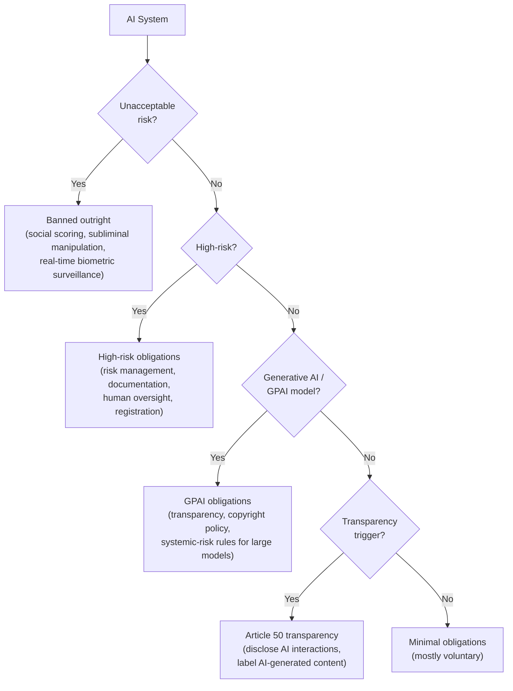
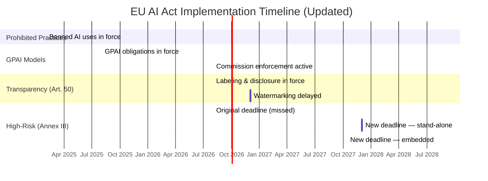
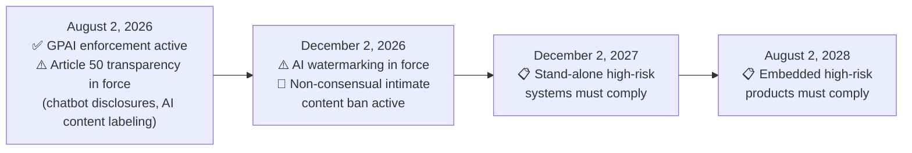

## The Deadline Everyone Was Watching

August 2, 2026 was supposed to be the moment the EU AI Act fully landed. After two years of phased implementation — prohibited practices in February 2025, general-purpose AI obligations in August 2025 — the rules for high-risk AI systems were set to follow. Recruiters screening CVs, hospitals using diagnostic tools, banks scoring loan applications: all of them would have faced mandatory risk assessments, conformity documentation, and registration in a new EU database by that date.

Then, on June 29, 2026, the Council of the EU pressed pause.

The move came through a broader legislative package called the **Digital Omnibus** — a simplification effort first proposed by the European Commission in November 2025. The package sailed through the European Parliament on June 16 and received final Council approval thirteen days later. Among other things, it pushed the high-risk deadline by sixteen months and rewrote several provisions that had drawn industry criticism since the AI Act passed in 2024.

Understanding what changed — and what very deliberately did not — matters for any company that deploys AI in or toward European markets.

---

## A Quick Recap: How the EU AI Act Is Structured

Before getting into the changes, it helps to understand the law's layered architecture. The EU AI Act takes a **risk-tiered approach**, sorting AI systems into four categories:

**High-risk** is the biggest category by affected systems. Annex III of the AI Act lists eight domains where AI automatically triggers the high-risk label: biometric identification, critical infrastructure, education and training, employment and worker management, access to essential private and public services, law enforcement, migration and border control, and administration of justice. Any AI system used in these areas for consequential decisions is subject to the Act's most demanding requirements.

The **General Purpose AI (GPAI)** tier covers large foundation models — the GPTs, Claudes, and Geminis of the world. These obligations went live on August 2, 2025 and were not touched by the Omnibus.

The **transparency tier** (Article 50) covers any AI that interacts with people or generates content — chatbots, image generators, deepfake detectors. More on why this tier matters below.

---

## What the Digital Omnibus Changed

### The Big One: High-Risk Deadline Pushed to December 2027

The most headline-grabbing change is the deadline shift for Annex III high-risk systems. Stand-alone high-risk AI systems — meaning those not embedded inside another regulated physical product — must now comply by **December 2, 2027**, rather than August 2, 2026. For AI systems embedded inside products already covered by other EU safety regulations (like medical devices, machinery, or vehicles), the deadline extends even further to **August 2, 2028**.

The practical implication is that a hospital using an AI diagnostic system, a bank using an AI credit-scoring tool, or an HR platform automating resume screening now has until December 2027 to complete its risk management documentation, conformity assessment, quality management system, and registration in the EU's AI database.

### The SME Threshold Expansion

One of the loudest industry complaints about the original AI Act was that it defined "SME" too narrowly, leaving many small European companies subject to the same full compliance burden as trillion-dollar multinationals. The Omnibus fixes this.

Under the revised text, the simplified compliance pathway — lighter technical documentation, proportionate quality-management requirements, reduced fine caps, and priority access to regulatory sandboxes — now extends to companies with:

- **Up to 750 employees** (up from 250), and
- **Up to €150 million in annual revenue** (up from €50 million)

This new "small mid-cap" category captures a substantial portion of European tech companies that were previously stuck in the full-obligation tier despite limited legal and compliance resources.

### New Bans: AI-Generated Intimate Content

Not everything in the Omnibus was a relaxation. The package also added a new prohibition that takes effect in December 2026: AI systems that generate non-consensual sexual content, including **AI-generated nudity of real individuals** or AI-assisted removal of clothing from existing photos to reveal intimate body parts, are now banned outright.

This provision sits alongside the existing ban on AI-generated child sexual abuse material and responds to a wave of deepfake abuse cases across the EU that drew significant legislative attention in 2025.

### Machinery Regulation Exemption

A more technical but commercially significant change: AI systems that are already governed by the EU's Machinery Regulation are now largely **exempt from overlapping AI Act high-risk obligations**. For industrial robotics manufacturers, automated assembly systems, and similar physical machinery, this removes the risk of double compliance — having to satisfy both regulations' conformity assessment requirements for the same product.

---

## What the Omnibus Did Not Change

### Article 50 Transparency — Still August 2, 2026

This is the most important "what didn't change" for companies with consumer-facing AI products. The Omnibus did delay one narrow piece of Article 50 — the **AI watermarking obligation** (digitally marking AI-generated content in a machine-detectable way) was shifted to December 2026 — but the core transparency requirements remain on their original schedule.

Starting August 2, 2026:
- **Chatbots and AI assistants** must inform users they are interacting with an AI (unless this is obvious from context)
- **Providers of AI systems that generate synthetic media** must mark outputs as artificially generated or manipulated in a machine-readable format
- **Operators deploying AI** in emotion recognition or biometric categorization must notify the affected individuals

The European Commission published a final Code of Practice on Transparency of AI-Generated Content on June 10, 2026, specifying the technical standards. The code calls for a layered approach combining C2PA cryptographic metadata and invisible watermarking, with different disclosure requirements for "fully AI-generated" versus "AI-assisted" content. Penalties for non-compliance with Article 50 reach up to **€15 million or 3% of worldwide annual turnover**.

### GPAI Enforcement — Now Live

The other unchanged (and newly live) milestone: as of August 2, 2026, the European Commission formally assumes enforcement powers over GPAI model providers. This means fines are now possible for major labs failing to maintain the technical documentation, copyright policies, and training-data summaries required since August 2025. For models presumed to carry systemic risk — those trained using more than 10²⁵ FLOPs — adversarial testing and incident reporting obligations are also now fully enforceable.

---

## Why the Extension Happened

The Commission's stated rationale was that the original August 2026 deadline was simply not achievable — not because companies were dragging their feet, but because the harmonized technical standards (EN standards) needed to demonstrate conformity were themselves not ready in time. Without agreed-upon standards, companies had no reliable way to prove compliance even if they wanted to.

The Digital Omnibus was also shaped by a broader European competitiveness conversation. The Draghi Report on EU competitiveness, published in late 2024, argued that Europe's regulatory burden was slowing AI investment relative to the United States and China. The Omnibus was partly a political response: demonstrating that Europe could be both principled on AI safety and pragmatic about compliance timelines.

---

## What Companies Should Do Now

The extension is real and meaningful relief for organizations building high-risk AI. But the compliance calendar is still active, and several obligations are not waiting.

**If you run a consumer-facing AI product**, the August 2 deadline is yours regardless of the Omnibus. Build disclosures for chatbot interactions and implement technical content marking before that date.

**If you are a GPAI model provider**, the Commission is now watching. Ensure your training data summary, copyright policy, and technical documentation are current and can withstand scrutiny.

**If you run a high-risk AI system** in recruitment, credit, healthcare, or another Annex III domain, use the 16-month extension wisely. The December 2027 deadline gives you time to build a proper risk management process — but the harmonized EN standards are expected to be ready by late 2026, and early movers will have more time to catch issues before the clock runs out.

**If you are an SME**, check whether the new 750-employee / €150M revenue threshold changes your tier. If it does, access to regulatory sandboxes and simplified documentation requirements should materially reduce your compliance burden.

---

The Digital Omnibus does not change what the EU AI Act is trying to accomplish. It changes the pace at which the most demanding parts of that project arrive. For companies building AI in or for European markets, the law is still coming — just with more time to be ready for it.

---

## Sources

- [Council gives final green light to simplify and streamline AI rules — EU Council Press Release, June 29, 2026](https://www.consilium.europa.eu/en/press/press-releases/2026/06/29/artificial-intelligence-council-gives-final-green-light-to-simplify-and-streamline-rules/)
- [EU AI Act Omnibus Agreement: Postponed High-Risk Deadlines and Other Key Changes — Gibson Dunn](https://www.gibsondunn.com/eu-ai-act-omnibus-agreement-postponed-high-risk-deadlines-and-other-key-changes/)
- [The Digital Omnibus and the Postponement of High-Risk Obligations to December 2027 — AI Act Blog](https://www.aiactblog.nl/en/posts/digital-omnibus-high-risk-postponement-december-2027)
- [EU AI Act High-Risk Deadline Pushed to December 2027 — Cloud Security Alliance Labs](https://labs.cloudsecurityalliance.org/research/csa-research-note-eu-ai-act-omnibus-vii-deadline-delay-20260/)
- [Simpler, Safer, Stricter Where It Counts: Inside the EU AI Omnibus Deal — Dastra](https://www.dastra.eu/en/blog/simpler-safer-stricter-where-it-counts-inside-the-eu-ai-omnibus-deal/60025)
- [EU AI Act Transparency Rules: A Practical Guide to Article 50 — artificialintelligenceact.eu](https://artificialintelligenceact.eu/transparency-rules-article-50/)
- [EU AI Act Implementation Timeline — artificialintelligenceact.eu](https://artificialintelligenceact.eu/implementation-timeline/)
- [Digital Omnibus on AI: What Is in It and What Is Not — Morrison Foerster](https://www.mofo.com/resources/insights/251201-eu-digital-omnibus)
- [EU Agrees to Delay Key AI Act Compliance Deadlines — Travers Smith](https://www.traverssmith.com/knowledge/knowledge-container/eu-agrees-to-delay-key-ai-act-compliance-deadlines/)
- [EU AI Act: Key Amendments Adopted Under the Digital Omnibus Package — Loyens & Loeff](https://www.loyensloeff.com/insights/news--events/news/eu-ai-act-key-amendments-adopted-under-digital-omnibus-package/)
- [General-Purpose AI Obligations Under the EU AI Act Kick in From 2 August 2025 — Baker McKenzie](https://www.bakermckenzie.com/en/insight/publications/2025/08/general-purpose-ai-obligations)
- [Code of Practice on Transparency of AI-Generated Content — European Commission](https://digital-strategy.ec.europa.eu/en/policies/code-practice-ai-generated-content)
