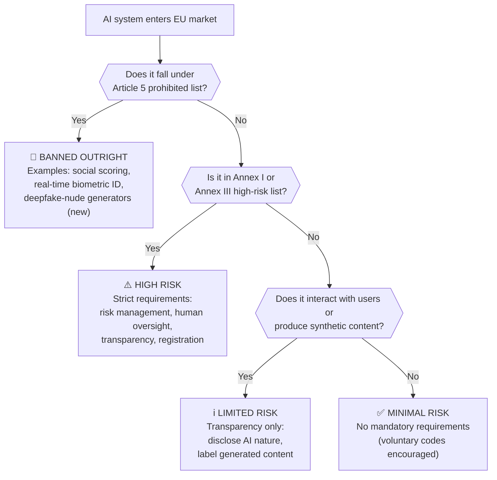
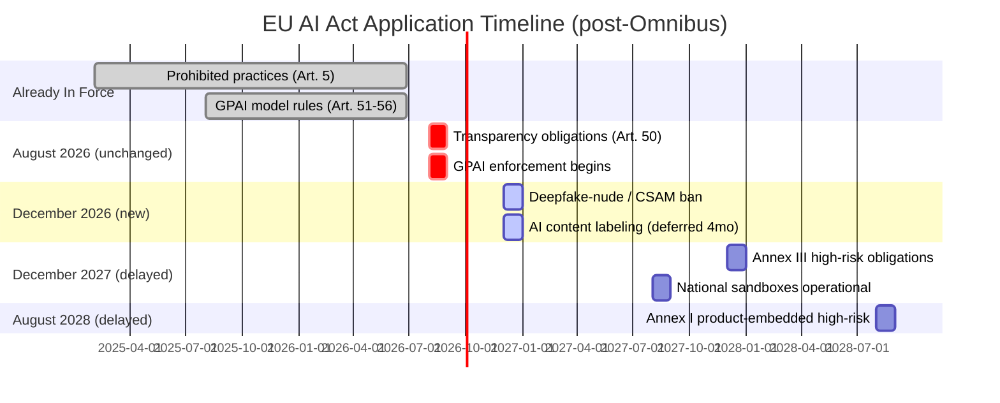

## A Law That Keeps Moving

The EU AI Act entered into force in August 2024 and started phasing in immediately. But it was never meant to hit all at once — it was designed as a staggered wave, with the most severe restrictions arriving first and the most operationally intensive requirements arriving later, once the supporting infrastructure (standards, guidance, conformity bodies) could be in place to support them.

What nobody fully anticipated was that the wave would need redirecting before it arrived.

On **7 May 2026**, the European Council and Parliament reached a political agreement on what is now called the **AI Omnibus** — a package of amendments to the AI Act built into a broader digital simplification effort. The deal delays some deadlines, adds new prohibitions, expands support for smaller companies, and makes a few structural changes to how compliance actually works. Formal adoption by Parliament and Council is expected by **July 2026**.

With the next big enforcement milestone — **2 August 2026** — now just weeks away, this is the moment to understand exactly what that milestone covers, what got pushed back, and what businesses are still on the hook for.

---

## How the Risk Tiers Work

Before getting into what changed, it helps to understand the four-tier structure the AI Act uses. Think of it as a traffic light system with an extra category at each end.

The **Prohibited** tier has been in force since **February 2025**. Once something lands in Article 5, it is banned across the entire EU with no compliance pathway — only an outright prohibition. The **High-Risk** tier is where most of the regulatory machinery lives: risk management systems, human oversight, technical documentation, registration in an EU database. **Limited-Risk** covers things like chatbots and deepfakes, where the primary obligation is disclosure. **Minimal-Risk** is everything else.

---

## The August 2 Deadline: What Still Applies

Despite the Omnibus, **2 August 2026 remains a real and non-deferred deadline** for the transparency obligations in **Article 50**. Any company deploying AI systems in the EU that interact with users or generate content needs to be ready by this date.

### Chatbot disclosure

Any AI system designed to interact directly with people — a customer service bot, a virtual assistant, an autonomous agent — must **clearly notify users they are talking to an AI** at the first point of contact. The European Commission's draft guidance (published May 8, 2026) deliberately narrows the "obviously AI" exemption: it only covers cases where a reasonably observant person would self-evidently recognize AI involvement. In practice, most consumer deployments will not qualify for the exemption.

### AI content labeling and watermarking

Providers of generative AI systems must embed **machine-readable markers** in AI-generated audio, images, video, and text — making it technically detectable as artificially generated. This is not just a visible label; it requires implementation-level solutions like metadata tagging, cryptographic provenance, or watermarking that survives processing. Article 50(4) additionally requires disclosure when AI-generated text on matters of public interest is published.

The takeaway: if you deploy chatbots, image generators, or AI writing tools to EU users, Article 50 applies to you in **37 days**. The Omnibus did not touch this.

---

## What the Omnibus Delayed

### High-risk systems (Annex III): 16 months extra

The most consequential deferral is for **stand-alone Annex III systems** — AI used in high-stakes contexts like recruitment and HR, credit scoring, access to education, law enforcement, border control, and administration of critical infrastructure. These were supposed to face the full weight of high-risk obligations from **2 August 2026**. That date has moved to **2 December 2027**.

The rationale is practical: high-risk compliance requires not just internal process changes but also **harmonized standards** from bodies like CEN and CENELEC, **guidance documents** from the EU AI Office, and **notified conformity assessment bodies** to exist and be operational. Most of those are not yet available. Pushing compliance ahead of the infrastructure to support it would create legal obligations that companies had no reliable way to meet.

The delay is **not** a reprieve in the spirit of the law. The AI Office has stated explicitly that companies should not slow down preparation — because the 16 months will go fast once the standards actually land.

### Annex I systems: deferred to August 2028

High-risk systems embedded in **regulated products** under other EU legislation (medical devices, machinery, lifts, radio equipment) get a one-year extension: their deadline moves from **2 August 2027** to **2 August 2028**.

### Regulatory sandboxes: deferred to 2027

Member States were required to stand up at least one national **AI regulatory sandbox** by August 2026 — a controlled testing environment where companies can trial AI systems under lighter regulatory conditions with supervisory oversight. This obligation has been deferred to **2 August 2027**, giving both national authorities and industry more time to design them properly.

---

## New Prohibitions: Deepfakes and CSAM

The Omnibus added two new entries to the **Article 5 prohibited practices** list — the tier that is banned with no compliance pathway.

**Non-consensual intimate deepfakes ("nudification apps").** AI systems whose intended purpose is to generate sexual or intimate images of real identifiable people without their consent are now explicitly prohibited in the EU, effective **2 December 2026**. The prohibition also covers systems where such generation is a reasonably foreseeable and reproducible outcome, unless the provider has implemented adequate technical safeguards to prevent it. This is a structural change: it moves the regulatory burden from the user of a bad output to the developer of a system that produces it.

**AI-generated child sexual abuse material (CSAM).** Any AI system designed or used to generate CSAM is banned under the same December 2026 timeline, with fines up to **€35 million or 7% of global annual turnover**, whichever is higher.

These are not high-risk rules subject to deferral. They join Article 5's existing prohibitions — social scoring systems, real-time biometric identification in public spaces, AI that exploits cognitive vulnerabilities — as outright bans. Once the text is formally adopted, deploying systems that fall under these categories in the EU is illegal, full stop.

---

## Expanded SME Relief

The original AI Act extended a set of simplified compliance provisions to **small and medium-sized enterprises** (SMEs, defined as under 250 employees and under €50M revenue). The Omnibus extends this relief to **small mid-cap companies** — up to 750 employees and up to €150 million in annual revenue.

This matters because a substantial number of AI startups that have scaled past traditional SME thresholds now qualify for:
- **Simplified technical documentation** templates
- **Reduced fines** relative to their revenue
- **Priority access** to regulatory sandboxes
- **Standardized guidance** from national authorities

For context: a company with 400 employees and €100M revenue building a specialized AI tool for, say, legal discovery or clinical decision support previously had to prepare full enterprise-class conformity documentation. Under the Omnibus, they get the simplified path.

The AI literacy requirement was also softened. Rather than requiring providers and deployers to "ensure" staff have AI literacy, the new standard requires them to "take measures to support" AI literacy. The obligation moves from a hard outcome requirement to a process requirement.

---

## GPAI: The Unchanged Tier

**General-Purpose AI model rules** — which apply to foundation models like GPT-5.5, Gemini, Claude, and similar — were **not changed by the Omnibus**. These rules became applicable in August 2025 and enforcement began with the GPAI Code of Practice, which Amazon, Anthropic, Google, IBM, Microsoft, and OpenAI all signed.

GPAI providers above a certain compute threshold (10^25 FLOP) face additional systemic risk obligations: adversarial testing, incident reporting to the EU AI Office, and heightened transparency about training data and capabilities. Enforcement actions (model access requests, formal investigations, potential recalls) are now possible from **2 August 2026** — the deadline the Omnibus didn't touch.

This means foundation model providers are simultaneously facing their first live enforcement window and watching the high-risk deployment rules that depend on their models get pushed back. The resulting gap — GPAI rules enforceable, downstream deployment rules deferred — creates an unusual regulatory posture where the model layer is live but many of the application layers running on top of it still have time to prepare.

---

## What This Means in Practice

If you are a company deploying AI in or to the EU, the practical reading of the post-Omnibus landscape looks like this:

| Your situation | What applies now | Your next deadline |
|---|---|---|
| Deploying chatbots, AI assistants, generative content tools | Article 50 transparency | **2 August 2026** |
| Providing a GPAI foundation model | GPAI obligations + enforcement | **Active since Aug 2025** |
| Deploying AI in HR, credit, law enforcement, education | Annex III obligations | **2 December 2027** |
| Embedding AI in medical devices, machinery, radio equipment | Annex I high-risk | **2 August 2028** |
| Building deepfake-nude or CSAM generation capabilities | Banned outright | **2 December 2026** |
| Company with 400–750 staff and up to €150M revenue | Simplified SME track | All of the above with lighter docs |

The most urgent action for the broadest population of AI-deploying businesses is the Article 50 transparency work: implementing chatbot disclosure, AI content labeling, and watermarking pipelines before August 2. That work is measurable and relatively well-defined.

For everything else, the Omnibus bought time — but the AI Office has been explicit that the time is for building real compliance programs, not for waiting to see if further delays arrive.

---

## The Bigger Picture

The AI Omnibus is, in part, a response to competitive pressure. The US has moved in the opposite direction under the GAAIA draft, which would explicitly preempt state AI laws and back open-source models with lighter-touch rules. The EU's simplification push — extending SME relief, softening literacy requirements, deferring high-risk deadlines — reflects a recognition that the original timeline was running ahead of both the standards infrastructure and the practical capacity of European companies to comply.

What makes the Omnibus significant is that the EU simultaneously moved the compliance goalposts **later** and the prohibition goalposts **earlier**. High-risk deployment rules were pushed back; the ban on deepfake-nude tools and CSAM generators was accelerated. That combination reveals the underlying logic: the EU is willing to give businesses time to build compliance systems, but it is not willing to wait on banning the most clearly harmful applications.

With August 2 approaching and formal adoption of the Omnibus expected before then, this is likely the final major regulatory surprise before the next wave hits. The next real deadline after August is December 2026, when the deepfake bans take effect. After that, the calendar is relatively stable through the December 2027 high-risk deadline — unless the regulatory landscape shifts again.

For now, the actionable checklist is short: get your Article 50 transparency stack in order by August 2, document your AI inventory and risk classifications for the high-risk work ahead, and if you are building generative systems, verify that nothing you deploy produces non-consensual intimate images before December arrives.

---

## Sources

- [Artificial Intelligence: Council and Parliament agree to simplify and streamline rules — Consilium, May 7 2026](https://www.consilium.europa.eu/en/press/press-releases/2026/05/07/artificial-intelligence-council-and-parliament-agree-to-simplify-and-streamline-rules/)
- [EU agrees to simplify AI rules to boost innovation and ban 'nudification' apps — European Commission Press Corner](https://ec.europa.eu/commission/presscorner/detail/en/ip_26_1024)
- [EU AI Act Update: Timeline Relief, Targeted Simplification, and New Prohibitions — Inside Global Tech / Global Policy Watch, May 28 2026](https://www.globalpolicywatch.com/2026/06/eu-ai-act-update-timeline-relief-targeted-simplification-and-new-prohibitions-2/)
- [AI Act Update: EU Resolves to Change Rules and Extend Deadlines — Latham & Watkins](https://www.lw.com/en/insights/ai-act-update-eu-resolves-to-change-rules-and-extend-deadlines)
- [EU AI Act Digital Omnibus: Extended Compliance Deadlines, Delayed Watermarking, and New Bans on CSAM and Non-Consensual Explicit Deepfakes — LexisNexis UK](https://www.lexisnexis.com/en-gb/legal/news/european-parliament-approves-ai-act-amendments-extending-compliance-deadlines-banning-nudifier-apps)
- [EU AI Act Transparency Obligations: Preparing for Compliance by 2 August 2026 — Sidley Data Matters Blog, June 24 2026](https://datamatters.sidley.com/2026/06/24/eu-ai-act-transparency-obligations-preparing-for-compliance-by-2-august-2026/)
- [EU's Digital Omnibus on AI: 7 Key Changes You Need to Know — Orrick, May 2026](https://www.orrick.com/en/Insights/2026/05/EUs-Digital-Omnibus-on-AI-7-Key-Changes-You-Need-to-Know)
- [EU AI Act Omnibus Agreement — Postponed High-Risk Deadlines and Other Key Changes — Gibson Dunn](https://www.gibsondunn.com/eu-ai-act-omnibus-agreement-postponed-high-risk-deadlines-and-other-key-changes/)
- [OpenAI, Anthropic sign EU AI Code of Practice — Nemko Digital](https://digital.nemko.com/news/openai-anthropic-signs-eu-ai-code)
- [EU AI Act Chatbot Disclosure and Deepfake Labeling: July 22 Signatory Deadline — TechTimes, June 22 2026](https://www.techtimes.com/articles/318822/20260622/eu-ai-act-chatbot-disclosure-deepfake-labeling-july-22-signatory-deadline.htm)
- [EU AI Act News 2026: The Revised Timeline, August Enforcement & Omnibus Deal Explained — Axis Intelligence](https://axis-intelligence.com/eu-ai-act-news/)
- [The EU AI Act's Transparency Rules: A Practical Guide to Article 50 — artificialintelligenceact.eu](https://artificialintelligenceact.eu/transparency-rules-article-50/)
