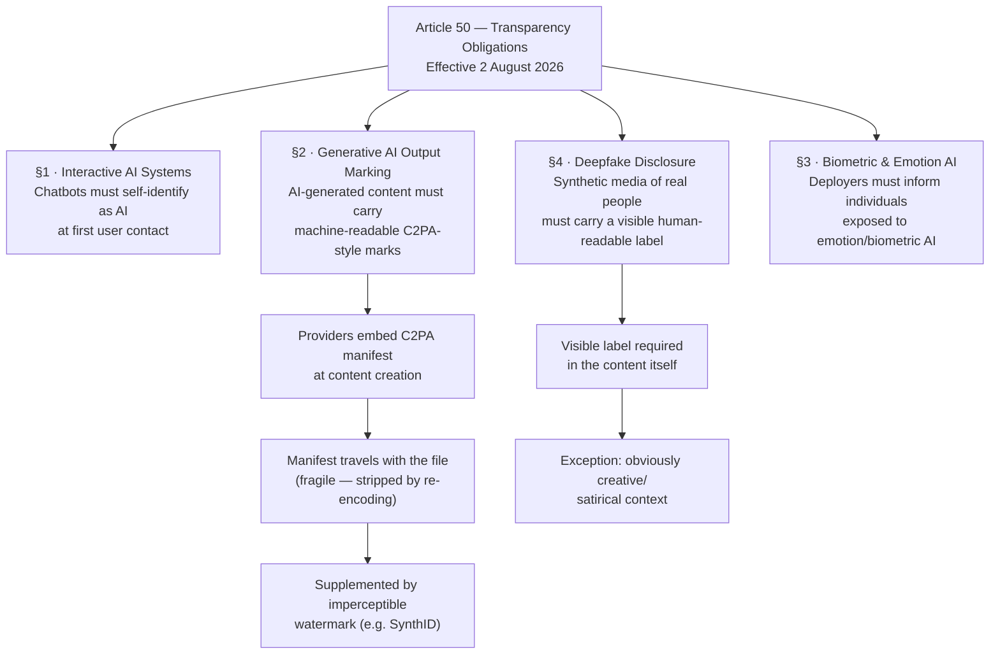

## August 2 Was Not a Soft Launch

Regulation often arrives with a whimper. For two years, the EU AI Act's transparency rules hovered on the horizon as a "coming soon" requirement — something to track, workshop about, and add to compliance roadmaps. On August 2, 2026, they arrived in full force.

That date is significant because it marks 24 months after the AI Act entered into force in August 2024 — the legally mandated runway that the European Commission baked into the regulation's schedule. When the clock ran out, Article 50 began to apply. The European Commission's AI Office started enforcing. Fines became real.

The transparency tier of the AI Act is not the most technically demanding part of the regulation — the rules on high-risk AI systems are stricter, and the GPAI (General-Purpose AI) requirements are more comprehensive. But Article 50 is the broadest in reach. Unlike high-risk rules, which apply to AI used in specific domains like hiring, credit scoring, or medical diagnosis, **Article 50 covers nearly any AI system that interacts with people, generates content for people, or shows people synthetic media**. That means the transparency obligations land on a far wider set of products than anything the Act imposed before.

---

## What Article 50 Actually Requires

The rule breaks into four distinct obligations, each targeting a specific kind of AI interaction.

### 1. Chatbots Must Identify Themselves

Any AI system designed to have a natural-language conversation with a person must disclose, at first contact, that the user is talking to an AI. The disclosure must be clear and up front — not buried in terms of service, not accessible only via a settings menu, but present at the start of the interaction.

The practical bar is low: a brief "You're chatting with an AI assistant" notice satisfies the rule in most interpretations. The law carves out one exception: if it is "obvious from the context" that the user is dealing with an AI, no extra disclosure is required. A chatbot icon clearly labeled "AI" on a tech product's support page would likely qualify. A customer service chat window designed to feel like a human agent would not.

The spirit of the rule is about **deceptive AI personas** — systems designed to impersonate humans. Anthropic, Google, Meta, Microsoft, and OpenAI all signed the voluntary Code of Practice on Transparency of AI-generated Content ahead of August 2, suggesting the major deployments are largely prepared.

### 2. AI-Generated Content Must Carry Machine-Readable Marks

This is the most technically involved requirement. Providers of generative AI systems — anything producing text, images, audio, or video — must embed machine-readable marks in their outputs so the content can be detected as AI-generated.

The law does not prescribe a specific technical format. But it does require the marks to be interoperable and machine-detectable. In practice, **the industry has largely converged on C2PA (Coalition for Content Provenance and Authenticity)** as the mechanism of choice. C2PA attaches a cryptographically signed manifest to a media file — a record of who created it, what tools were used, and whether AI was involved. The European Commission's Code of Practice cites C2PA by name as an example of the kind of established standard that satisfies the requirement.

About **190 organisations signed the voluntary Code of Practice** before August 2, signaling intent to comply. The list includes Aleph Alpha, Anthropic, Black Forest Labs, Cohere, Google, Meta, Microsoft, Mistral AI, OpenAI, and Synthesia on the provider side — joined by enterprise deployers from sectors including telecom, retail, and aviation.

### 3. Deepfakes Must Be Visibly Labeled

Deepfakes — images, video, or audio manipulated or generated by AI to resemble real people or events — must carry a visible disclosure. This is a "human-readable" obligation layered on top of the machine-readable marking requirement: users must be able to see the label, not just have software detect it.

The requirement applies regardless of artistic intent. A satirical video of a politician saying something they didn't say still needs a label. A realistic AI-generated photograph of a historical figure needs one too. The one context where this obligation relaxes is **clearly artistic or creative work** where the AI nature is already evident — but the burden of proving that the audience understood it falls on the deployer, not the regulator.

### 4. Emotion Recognition and Biometric Categorisation Systems Must Disclose Their Operation

This obligation sits apart from the others. If an AI system is used to recognise emotion states (stress, sentiment, mood) or to categorise people biometrically (by inferred demographic characteristics), the people being analysed must be informed — at the latest at the moment they first come under its observation.

Critically, this disclosure duty is **separate from the Article 5 prohibition**, which already banned emotion recognition in workplaces and educational institutions. Article 50 covers the uses that aren't banned — for instance, emotion recognition in retail environments or biometric categorisation in public-facing AI — and requires that affected individuals be told it is happening.

---

## The Grace Period and the Clock Still Ticking

Not everything switched on immediately. The machine-readable marking obligation for **generative AI systems already on the market before August 2** comes with a transitional period — providers of pre-existing systems have until **December 2, 2026** to embed the marks. New systems placed on the market after August 2 must comply from day one.

The chatbot disclosure and deepfake labeling requirements have no such grace period. They apply now.

This distinction matters because it separates "we need to update our infrastructure" (a longer runway) from "we need to change what we say to users" (immediate). A company that updated its chat widget to include an AI disclosure last month is compliant. A company that hasn't embedded C2PA in its image generator has four months of runway remaining.

---

## Why C2PA Is Both the Answer and an Incomplete One

C2PA is the best available answer to the machine-readable marking requirement. It works by attaching a cryptographically signed manifest to a media file — essentially a digital certificate of provenance. When a file with a C2PA manifest is opened in a compatible viewer, that viewer can verify the chain of custody and display whether AI was involved.

But **C2PA has a well-documented fragility**: metadata stripping. When a file is re-encoded — by ffmpeg, ImageMagick, a browser-based image resizer, or standard social media upload pipelines — the C2PA manifest is typically discarded. A screenshot strips it instantly. This is not a theoretical edge case: platforms including Facebook, Instagram, X, and TikTok strip embedded metadata as a byproduct of their transcoding pipelines, designed to minimize file size.

Microsoft's February 2026 Media Integrity and Authentication report explicitly acknowledged that **preventing metadata stripping across the full distribution chain is not achievable** with C2PA alone. The standard's intended use case is a verifiable chain of custody where the distributor chooses to preserve provenance — not a universal "detect AI content anywhere on the internet" system.

The proposed solution is a **dual-layer approach**: C2PA metadata for structured provenance where it survives the distribution chain, plus an imperceptible watermark (models like Google's SynthID embed statistical patterns directly into image pixels or audio samples) that persists through more aggressive transformations. Some evidence suggests even imperceptible watermarks can be degraded with adversarial perturbations, though this is harder than metadata stripping.

The regulation, deliberately technology-neutral, leaves room for this layered approach to emerge as the practical standard — but it also means the hard technical problem of reliable AI content detection is nowhere near solved by the mere fact of legal enforcement.

---

## Who Must Comply, and Where the Brussels Effect Reaches

The AI Act applies to any AI system that affects individuals **within the EU**, regardless of where the provider or deployer is headquartered. A company based in San Francisco with no EU office still falls under Article 50 if its chatbot responds to EU users or its image generator distributes content in EU markets.

This extraterritorial reach is a structural feature of the regulation, sometimes called the **Brussels Effect** — the mechanism by which EU regulatory standards become de facto global norms. Nearly 47% of companies citing the EU AI Act in their regulatory disclosures are headquartered outside the EU, with US companies the largest group. For global products, compliance typically means a single global build aligned to the strictest standard — the EU — rather than separate EU-specific variants.

The practical implication for US and Asian tech companies: the transparency rules are not Europe's problem. They are a global product requirement for any product with meaningful EU distribution.

---

## The Enforcement Backstop

Noncompliance with Article 50 carries fines of up to **€15 million or 3% of worldwide annual turnover**, whichever is higher. The European Commission's AI Office and national market surveillance authorities share enforcement responsibility.

The fines are lower than the maximums for prohibited AI practices (€35 million / 7% of turnover) and GPAI violations (€15 million / 3%), but on par with each other. For a large AI company with billions in revenue, a 3% fine is meaningful. For a smaller company, a €15 million ceiling is a hard ceiling.

Enforcement in the early months is widely expected to focus on **egregious failures** — chatbots explicitly impersonating humans, deepfakes published without any disclosure — rather than technical metadata compliance. But regulators tend to sharpen their focus over time.

Industry reaction has been mixed. Compliance-ready major platforms, having signed the Code of Practice and already implemented chatbot disclosure banners, are broadly supportive. The pushback centers on a narrower concern: critics from CCIA Europe argue that the deceptive-intent test the law originally implied has been eroded — that mandatory labeling of all AI-generated content, including clearly labeled creative work, goes further than the regulation was intended to reach. The counter-argument is that the rules explicitly exempt "obvious context" situations and that the labeling burden on well-designed systems is minimal.

---

## What This Means for Builders

If you build or deploy AI systems that reach EU users, the practical checklist is short:

- **Interactive chat interfaces**: Add a disclosure at first message. Clear, prominent, not hidden.
- **Image and video generators**: Plan for C2PA manifest embedding plus imperceptible watermarking. Systems launched before August 2 have until December 2 to complete this.
- **Content generation pipelines**: If your system produces text, images, audio, or video that goes to EU users, it now needs machine-readable provenance.
- **Emotion or biometric AI**: If you use emotion recognition or biometric categorisation, inform exposed individuals before — or at the moment of — first exposure.
- **Deepfakes or synthetic personas**: Any realistic synthetic media must carry a human-readable label, with no grace period.

The rule that will cause the most friction over time is the machine-readable marking requirement, not because it is hard to implement at the point of creation, but because **content travels through distribution chains that don't preserve provenance metadata**. Until C2PA manifests survive social media upload pipelines, the regulation will be partially theoretical for content that escapes controlled distribution.

---

## A Floor, Not a Ceiling

The transparency obligations in Article 50 are the broadest thing the EU has ever mandated about AI — affecting more products and providers than any prior regulation. But they are also, deliberately, a floor. They don't prevent AI-generated misinformation; they require disclosure that content is AI-generated. They don't stop deepfakes; they require that deepfakes identify themselves as such. The assumption is that informed users make better decisions than uninformed ones.

Whether that assumption holds in practice is an empirical question that August 2 didn't answer. The rules are now live. The labels are required. The fines are real.

What happens next — whether disclosure nudges behavior, whether watermarks survive the open internet, whether enforcement produces deterrence — is the experiment the regulation just set in motion.

---

## Sources

- [Commission starts enforcing AI Act rules and new transparency requirements on 2 August — European Commission](https://digital-strategy.ec.europa.eu/en/news/commission-starts-enforcing-ai-act-rules-and-new-transparency-requirements-2-august)
- [Safer and more transparent AI — European Commission](https://commission.europa.eu/news-and-media/news/safer-and-more-transparent-ai-2026-08-02_en)
- [EU AI Act: Transparency Obligations Take Effect 2 August 2026 — Cooley LLP](https://www.cooley.com/news/insight/2026/2026-08-03-eu-ai-act-transparency-obligations-take-effect-2-august-2026)
- [The EU AI Act's Transparency Rules: A Practical Guide to Article 50 — artificialintelligenceact.eu](https://artificialintelligenceact.eu/transparency-rules-article-50/)
- [Guidelines on transparency obligations for providers and deployers of AI systems — European Commission](https://digital-strategy.ec.europa.eu/en/library/guidelines-transparency-obligations-providers-and-deployers-ai-systems)
- [EU Finalizes AI Disclosure Rules as Watermarking Mandate Outpaces Technology — TechTimes](https://www.techtimes.com/articles/321174/20260721/eu-finalizes-ai-disclosure-rules-watermarking-mandate-outpaces-technology.htm)
- [EU AI Act: 190 organisations sign voluntary Code of Practice on AI transparency — LexisNexis UK](https://www.lexisnexis.com/en-gb/legal/news/commission-highlights-uptake-of-ai-generated-content-transparency-code)
- [EU makes AI content labels and watermarks compulsory August 2 — AI Weekly](https://aiweekly.co/alerts/eu-makes-ai-content-labels-and-watermarks-compulsory-august-2)
- [EU AI Act and C2PA: What Article 50 Requires for AI Content — C2PA Viewer](https://c2paviewer.com/articles/eu-ai-act-content-credentials)
- [EU begins enforcing AI Act, putting AI models under the microscope — Help Net Security](https://www.helpnetsecurity.com/2026/08/04/eu-ai-act-enforcement-ai-models/)
- [AI Watermarking Standards and C2PA: Building Infrastructure for Content Provenance — Editors Weblog](https://editorsweblog.org/2026/03/28/ai-watermarking-standards-c2pa-content-credentials-provenance)
- [The Brussels Effect and AI: How EU Regulation Will Impact the Global AI Market — Montreal AI Ethics Institute](https://montrealethics.ai/the-brussels-effect-and-ai-how-eu-regulation-will-impact-the-global-ai-market/)
- [Transparency as Architecture: Structural Compliance Gaps in EU AI Act Article 50 II — arXiv](https://arxiv.org/pdf/2603.26983)
- [Emotion recognition and biometric categorisation: inform, or simply prohibited? — AI Act Blog](https://www.aiactblog.nl/en/posts/emotion-recognition-biometrics-transparency-ai-act-2026)
