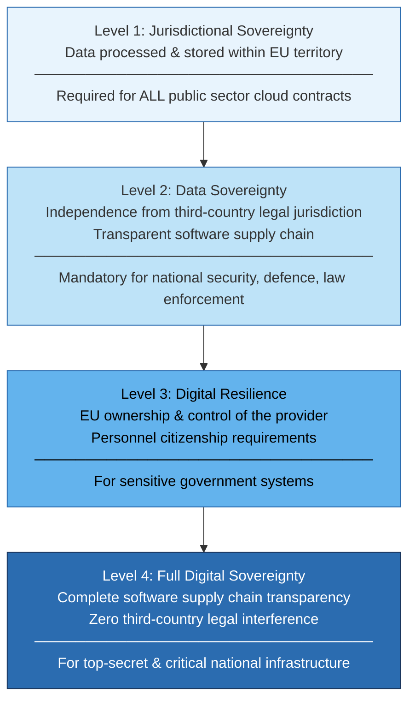
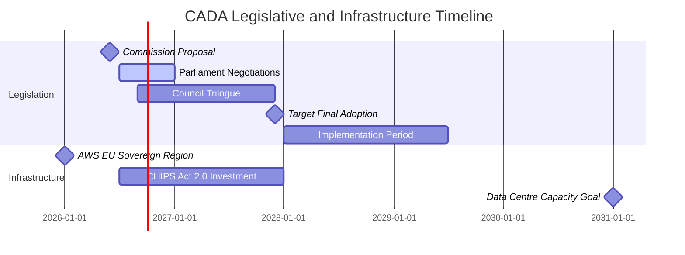

## The Dependency Problem Europe Can No Longer Ignore

By 2026, roughly **77% of EU cloud workloads** run on infrastructure owned by non-European companies — primarily Amazon Web Services, Microsoft Azure, and Google Cloud. For most commercial use cases this is fine. But for a government benefits system, a military communications network, or a national hospital's patient records, that dependency carries a different kind of risk: a court order, a geopolitical dispute, or a corporate decision made in Seattle or Redmond can cascade directly into European public infrastructure.

The European Commission has been watching this gap widen for years. On June 3, 2026, it acted: publishing the **Cloud and AI Development Act (CADA)** as the centrepiece of a broader **Tech Sovereignty Package** that also includes the EU Open Source Strategy and CHIPS Act 2.0. Together, these proposals represent the most coordinated push yet by any major political bloc to restructure its relationship with foreign digital infrastructure.

This post unpacks what CADA actually says, why the Level 3 clause is existentially difficult for US hyperscalers, and what it means for anyone building or procuring cloud and AI services in Europe.

---

## Four Levels of Sovereignty

The structural core of CADA is a **four-level assurance framework**. Every public-sector body in the EU will be required to conduct a sovereignty risk assessment before any cloud or AI procurement and select the appropriate level. Think of it as a security-clearance system — not for people, but for cloud infrastructure.

**Level 1** is the baseline every provider must meet. Data must be physically processed and stored within EU territory. AWS, Azure, and Google Cloud already satisfy this through their EU regions — this is not the hard part.

**Level 2** is where things get genuinely challenging. Providers must demonstrate **independence from third-country legal jurisdiction** and **transparency over their software supply chain**. Level 2 is the mandatory minimum for national security, defence, border management, justice, and law enforcement workloads. Under CADA's risk assessment framework, most sensitive government systems will land here by default.

**Level 3** requires providers to be **owned and controlled from within the EU** and to meet additional **personnel citizenship criteria** — key staff must be EU nationals. This rules out providers where ultimate governance sits with a non-EU parent company.

**Level 4** demands complete software supply chain visibility and legal barriers that make it impossible for any foreign court or government to compel disclosure of EU data.

### Why the US Cloud Act Is the Elephant in the Room

Levels 3 and 4 are where American hyperscalers face a wall that cannot be climbed with an engineering solution.

The **US Cloud Act (2018)** allows American law enforcement to require US-headquartered companies to produce customer data stored on their servers — anywhere in the world — regardless of where that data physically sits or what local law says. AWS, Azure, and Google Cloud are incorporated in the United States. Under current US law, a valid US court order can reach their Frankfurt or Dublin data centres.

This is not a hypothetical risk. It is a **structural feature of US law** that directly conflicts with what Level 2 demands (independence from third-country jurisdiction) and makes Level 3 compliance essentially impossible without either fundamental corporate restructuring or a bilateral legal treaty between the US and EU.

---

## Open Source First — And the €264 Billion Gap

Beyond the sovereignty tiers, CADA establishes an "**open source first**" principle for all public-sector IT procurement: when selecting software or AI services, public authorities must consider open-source alternatives before proprietary ones and document their reasoning if they choose not to.

This is backed by a **€2 billion investment** in the EU Open Source Strategy, targeting:

- European open-source start-ups and accelerators
- A Public Sector Open Source Programme Office (OSPO) Network across member states
- Long-term maintenance funding for critical open-source infrastructure
- The "Open Internet Stack" — a European-developed alternative to dominant proprietary software layers

The ambition is real. The arithmetic is harder: critics have quickly noted that €2 billion over seven years sits against a Commission-estimated **€264 billion per year** in EU spending on non-EU proprietary IT. The open-source mandate creates a preference, not a replacement. It is a directional signal backed by thin resources.

That said, the direction matters. For providers like **Mistral AI** (France) and **Aleph Alpha** (Germany), whose models are open-weight, CADA's procurement principle is a structural advantage baked into law for the first time.

---

## The Wider Package: CHIPS Act 2.0 and Data Centres

CADA is one piece of a three-part package. The rest:

**CHIPS Act 2.0** updates the 2023 semiconductor subsidy law to redirect funding specifically toward AI-optimised chips and European chip design. With TSMC's Dresden fab (Germany) now producing advanced nodes, the political argument for investing in EU chip capacity is more credible than it was three years ago.

**The EU Open Source Strategy** elevates open source from a procurement preference to a **named strategic principle** of EU digital policy, establishing it as part of the structural answer to tech dependency alongside sovereignty regulation.

The Commission also set a concrete infrastructure target: **triple the EU's data centre capacity** within five to seven years. Europe currently accounts for roughly 15% of global data centre capacity despite representing 22% of global GDP — and the gap is widest in AI-specific infrastructure (GPU clusters, high-bandwidth interconnect). Achieving a tripling would require an estimated €250-300 billion in private and public investment.

---

## Who Is Affected, and How

**EU public sector bodies** in all 27 member states must conduct a sovereignty risk assessment for every cloud and AI procurement. This assessment becomes mandatory (not advisory) once CADA is adopted and implemented.

**US hyperscalers** face a graduated challenge. Level 1 is achievable through existing EU data residency products. Level 2 requires structural legal arguments about independence from US jurisdiction — arguments that are currently untested and legally contested. Levels 3 and 4 are structurally very difficult without joint-venture arrangements with EU-controlled entities.

**European cloud providers** — OVHcloud, Hetzner, T-Systems, Ionos, Deutsche Telekom Cloud — gain a concrete procurement advantage for the first time. Their EU-controlled status moves from a marketing claim to a legal requirement in certain procurement categories.

**Enterprises operating in Europe** need to understand which assurance level applies to their public-sector customers. A healthcare AI system serving an EU government agency may find that its SaaS provider cannot legally win future contracts at the required level.

---

## The DMA Gatekeeper Double-Tap

Three weeks after CADA landed, the Commission fired a second shot: on June 25, 2026, it **designated AWS and Microsoft Azure as cloud gatekeepers** under the **Digital Markets Act (DMA)** — the preliminary finding that would pull both platforms into Brussels' toughest competition law regime, imposing obligations around interoperability, data portability, and fair dealing with business users.

Amazon responded that the assessment "ignored the breadth of options available to European customers and risked deterring investment." Microsoft argued that "overlooking the growing power of Google Cloud and Gemini would skew the market."

The combined move — CADA controlling who can win sensitive procurement, DMA controlling how platforms must behave in the market — is the clearest signal yet that the Commission views cloud and AI market concentration as a structural policy problem, not a temporary competitive condition.

---

## What CADA Does Not Do

It is worth being precise about what the law does not do, at least as currently proposed:

- It does not ban US cloud providers from EU markets.
- It does not require existing contracts to be migrated.
- It does not apply to private-sector procurement.
- It does not require governments to immediately adopt open-source alternatives.

These are limitations, not loopholes. The Commission is threading a needle: creating incentives and requirements strong enough to shift the market structure over time, without triggering the kind of investment deterrence that Amazon's statement hinted at.

---

## What Comes Next

CADA must pass through **trilogue** — the three-way negotiation between the European Commission, the European Parliament, and the Council of Member States — before any provision becomes binding. That process typically takes 12 to 36 months for complex digital legislation. Final adoption is targeted for **late 2027**, followed by an implementation period likely running into 2029.

The immediate effects are anticipatory: procurement offices are beginning to build sovereignty assessments into their planning cycles, hyperscalers are expanding EU infrastructure partly to strengthen their compliance argument, and legal teams across the industry are modelling what Level 2 independence actually means under current US law.

For builders and product teams, the practical checklist is short: understand which assurance level your EU public-sector customers will be required to meet, map your current infrastructure architecture against the four levels, and watch the Level 2 third-country independence clause as the key variable. That is the hinge that will determine whether US-headquartered cloud providers can participate in EU government AI contracts at all — and it is the clause most likely to be fought over during trilogue.

---

## Sources

- [Proposal for the Cloud and AI Development Act (CADA) — European Commission](https://digital-strategy.ec.europa.eu/en/library/proposal-cloud-and-ai-development-act-cada)
- [Cloud and AI Development Act — EC Digital Strategy Policy](https://digital-strategy.ec.europa.eu/en/policies/cloud-and-ai-development-act)
- [The EU's CADA: Towards a Sovereignty-Focused Framework for Cloud — Hogan Lovells](https://www.hoganlovells.com/en/publications/the-eus-cloud-and-ai-development-act-cada-towards-a-sovereigntyfocused-framework-for-cloud)
- [The EU Cloud and AI Development Act — Lawfare](https://www.lawfaremedia.org/article/the-eu-cloud-and-ai-development-act)
- [European Commission's Proposed Cloud Sovereignty Framework — Jones Day](https://www.jonesday.com/en/insights/2026/06/european-commissions-proposed-cloud-sovereignty-framework-creates-new-compliance-tiers-for-software-providers)
- [EU tech sovereignty package curbs US cloud, launches Chips Act 2.0 — The Next Web](https://thenextweb.com/news/eu-tech-sovereignty-cloud-chips-act)
- [EU Tech Sovereignty Laws Target Amazon, Microsoft, Google Cloud — TechTimes](https://www.techtimes.com/articles/317962/20260607/eu-tech-sovereignty-laws-target-amazon-microsoft-google-cloud-sensitive-government-work.htm)
- [European Commission lines up Amazon and Microsoft for cloud gatekeeper status — The Register](https://www.theregister.com/legal/2026/06/25/european-commission-lines-up-amazon-and-microsoft-for-cloud-gatekeeper-status/5262127)
- [How the EU's Tech Sovereignty Package Puts Open Source to the Test — TechPolicy.Press](https://www.techpolicy.press/how-the-eus-tech-sovereignty-package-finally-puts-open-source-to-the-test/)
- [EU Cloud and AI Development Act: A Major Step for Open Source — SUSE Blog](https://www.suse.com/c/eu-cloud-ai-development-act-open-source-first/)
- [EU Tech Sovereignty: Sovereignty as a Prerequisite of Openness — CEP](https://www.cep.eu/eu-topics/details/eu-tech-sovereignty-package.html)
- [CADA: A New Proposal for Digital Sovereignty Rules in the EU — NautaDutilh / EACC](https://eaccny.com/news/nautadutilh-cada-a-new-proposal-for-digital-sovereignty-rules-in-the-eu/)
