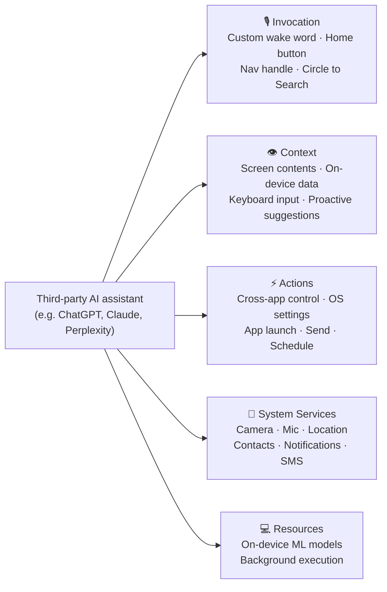
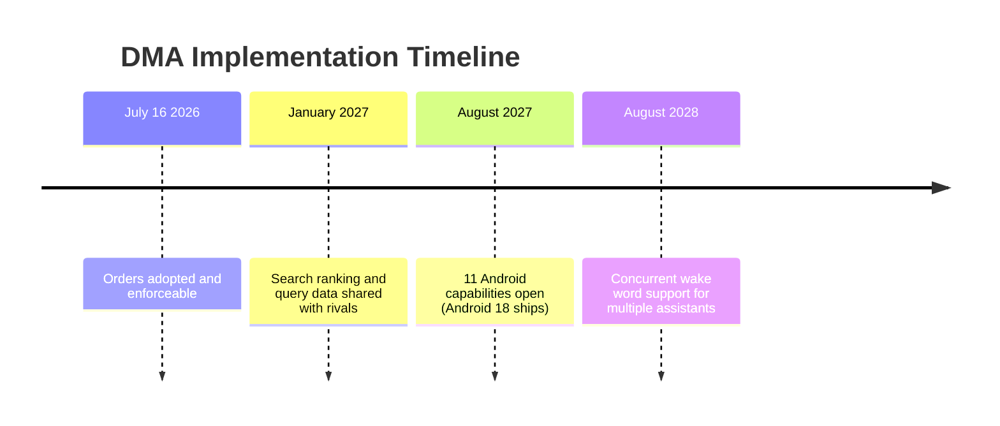

## The App Gap

When you install ChatGPT or Claude on an Android phone, you get an app. A very capable app, perhaps — but still just an app, confined to its own window and accessible only when you deliberately open it.

When you use Gemini, you get something categorically different: a feature of the operating system itself. Gemini listens for a wake word. Hold the home button on any Android phone and Gemini springs to life, reads your screen, and can execute tasks across every other app on the device — send a message in WhatsApp, set a timer in Clock, place an order in a food delivery app.

That asymmetry — between a tenant confined to a single room and a landlord who moves freely through the whole building — has defined AI competition on the 60% of EU smartphones that run Android. On July 16, 2026, the European Commission issued two binding orders under the Digital Markets Act to end it.

---

## What the Digital Markets Act Actually Is

The DMA is the EU's attempt to rewrite platform competition rules before markets tip irreversibly toward a single dominant player. Enacted in 2022, it targets companies the Commission designates as "gatekeepers" — platforms so large that they can effectively set the terms for entire neighboring markets.

Six companies received gatekeeper status in September 2023: Alphabet, Amazon, Apple, ByteDance, Meta, and Microsoft. For Alphabet, the designation covers Android, Google Search, Chrome, YouTube, Google Maps, and the Play Store.

The DMA's core prohibition is structural: gatekeepers must not leverage dominance in one market to tilt a neighboring market in their favor. Google using its position as Android's author to give Gemini OS-level integration that no rival can match — even if rivals build a technically superior product — is precisely the pattern the DMA was designed to address.

Apple has already felt the law's edge: DMA obligations forced it to allow alternative app stores on iOS in the EU and to give users a browser choice screen. The July 16 Google order is the DMA's first direct intervention in the AI assistant market.

---

## The July 16 Decision

The Commission's order covers two separate obligations:

**Android AI interoperability.** Google must open 11 Android capabilities to competing AI assistants on the same terms it provides to Gemini.

**Search data sharing.** Google must provide anonymized ranking, query, click, and view data from Google Search to rival search engines and AI providers on fair, reasonable, and non-discriminatory (FRAND) terms.

The decision followed months of formal specification proceedings and a July 9 EU court ruling that eliminated Google's remaining legal avenues to delay. Both orders took effect immediately on adoption and are now enforceable.

---

## What "11 Capabilities" Actually Means

The order groups its requirements into five categories. Understanding them in plain terms matters — the technical gap they close is substantial.

**Invocation** is the entry point. Today only Gemini can be activated by a user-defined wake word at the OS level — the same deep hook that made "OK Google" feel native. The order gives any qualifying assistant the same right, plus the ability to respond to long-pressing the home button or the navigation handle (the gesture that currently always opens Gemini).

**Context** is about awareness. When you ask Gemini "what is this?", it reads the screen of whatever app is open. Third-party assistants cannot do this — they have no view outside their own window. The order mandates equal access to on-screen content, on-device app data, and keyboard-level input: the inputs that let an assistant understand what a user is doing *right now*, not just what they typed into the assistant's own chat box.

**Actions** is where assistants become genuinely agentic. Google reserves for Gemini the ability to carry out tasks inside other apps: compose and send a message in Gmail, create a calendar event, adjust screen brightness, toggle Do Not Disturb. The order opens these cross-app action pathways to rivals on exactly the same terms.

**System services and processing resources** cover the hardware layer — persistent microphone access, background execution so an assistant can stay alert, and access to the on-device ML models Google bakes into Android. These capabilities are what make a voice assistant feel instant and always-available rather than slow and intermittent.

---

## The Search Data Angle

The second order is less visible to end users but equally consequential for the broader AI industry.

Google Search holds above 90% of the EU search market — a position it has maintained for decades. That dominance is not just a competitive moat in search. It is a training and grounding advantage for any AI that needs real-time, high-quality signal about what humans search for and which results they trust.

Every query, every result clicked, every snippet read: this behavioral signal has helped Google tune both Search and Gemini for years. AI assistants that rely on web search for grounding — including ChatGPT's search mode and Perplexity — have had no practical way to close that gap.

From January 2027, Google must share anonymized versions of that signal — query text, ranking order, click-through rates, and view time — with rival search engines and AI providers. The anonymization method was developed jointly with the European Data Protection Board to satisfy GDPR requirements. Pricing is set by a FRAND formula rather than negotiated bilaterally, preventing Google from making the data technically available but commercially unaffordable.

---

## Enforcement and Penalties

The Commission has made clear it is not issuing advisory opinions. On July 23 — one week after the AI interoperability order — it levied its largest DMA fine to date: **€890 million** (roughly $1 billion) against Google for separate violations involving self-preferencing in Search results and restrictions on app developers in the Play Store.

Non-compliance with the Android AI order would expose Alphabet to fines of up to **10% of global annual turnover** — a figure that, based on 2025 revenues, represents approximately $35 billion. Persistent violations could escalate further to structural remedies: the Commission has the power to impose behavioral separation between Gemini and Android.

---

## Who Benefits, and When

The practical beneficiaries of the Android interoperability order are the AI assistants that have built strong products but faced a structurally asymmetric playing field at the OS level.

**ChatGPT** is the most obvious candidate. OpenAI has already done deep OS integrations on iOS through the Apple Intelligence partnership, and the Android door is now open to the same depth. The technical work is largely understood — the blocker was legal access, not engineering capability.

**Claude** has competitive strengths in long-form reasoning, code generation, and safety guarantees, but has been limited to app-level access on Android. OS-level invocation and screen context would let Claude compete directly on the scenarios where Gemini currently dominates by default — quick on-device queries, contextual assistance, and agentic task execution.

**Perplexity**, which positions itself as a search-native AI assistant, benefits from both sides of the order: an Android entry point from July 2027 *and* access to Google Search signal from January 2027.

Google, for its part, faces reduced home-court advantage on its own platform. But Gemini is not standing still — it ships new capabilities monthly, and the same Android 18 release that must carry interoperability hooks will also carry whatever Gemini improvements Google ships on the same date. The order levels the playing field; it does not hand rivals a win.

---

## A Precedent Bigger Than Europe

The July 16 orders apply only to Android phones sold in the EU. But regulation has a way of spreading.

Apple's DMA compliance on iOS has already produced partial precedents that US regulators and courts have cited. The US Department of Justice's ongoing antitrust case against Google references the same Android default-assistant practices at issue in Brussels. If OS-level AI interoperability demonstrably benefits EU users — and if third-party assistants gain meaningful market share as a result — the pressure for similar rules elsewhere will build quickly.

The DMA is, in effect, a large-scale experiment in what a competitive AI assistant market looks like when the operating system layer is forced to be neutral. The question being tested is not merely whether rivals can compete in the EU, but whether the entire market for AI assistants has been shaped by a structural advantage that users never consciously chose.

The results — in adoption data, user satisfaction, and market share — will be watched closely well beyond Brussels.

---

## Sources

- [Commission provides guidance to Google for AI interoperability on Android — Digital Markets Act Official](https://digital-markets-act.ec.europa.eu/commission-provides-guidance-google-ai-interoperability-android-and-sharing-google-search-data-under-2026-07-16_en)
- [EU Gives Rival AI Assistants System-Level Android Access Google Reserved for Gemini — TechTimes](https://www.techtimes.com/articles/320760/20260716/eu-gives-rival-ai-assistants-system-level-android-access-google-reserved-gemini.htm)
- [EU Orders Google to Open Android and Search Data to AI Rivals — The Daily Newsfront](https://www.dailynewsfront.com/article/eu-google-android-ai-search-data-rules-2026/)
- [EU Opens Android to ChatGPT and Claude: US Impact? — TechJournal](https://techjournal.org/eu-google-android-rival-ai-assistants)
- [EU Fines Google €890 Million Under DMA, Orders Search Redesign in 60 Days — TechTimes](https://www.techtimes.com/articles/321410/20260723/eu-fines-google-890-million-under-dma-orders-search-redesign-60-days.htm)
- [EU Forces Google to Open Android AI to Third Parties — Model Diplomat](https://modeldiplomat.com/story/eu-forces-google-to-open-android-ai-to-third)
- [EU Orders Google to Break Gemini's Android Lock-In — TechTimes](https://www.techtimes.com/articles/321118/20260720/eu-orders-google-break-geminis-android-lock-search-data-sharing-starts-january.htm)
- [EU Compels Google to Share Android and Search Data With Rival AI Assistants — Unite.AI](https://www.unite.ai/eu-compels-google-to-share-android-and-search-data-with-rival-ai-assistants/)
- [EU Mandates System-Level Android Access for Rival AI Assistants — Cloud Security Alliance](https://labs.cloudsecurityalliance.org/research/csa-research-note-eu-dma-android-ai-interoperability-2026071/)
- [Alphabet specification proceedings — Interoperability for AI services — Digital Markets Act](https://digital-markets-act.ec.europa.eu/developer-portal/interoperability/alphabet-specification-proceedings-interoperability-ai-services_en)
