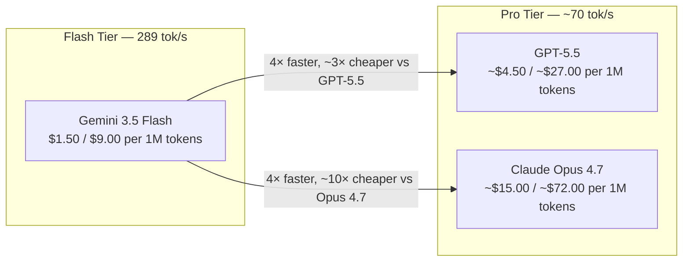
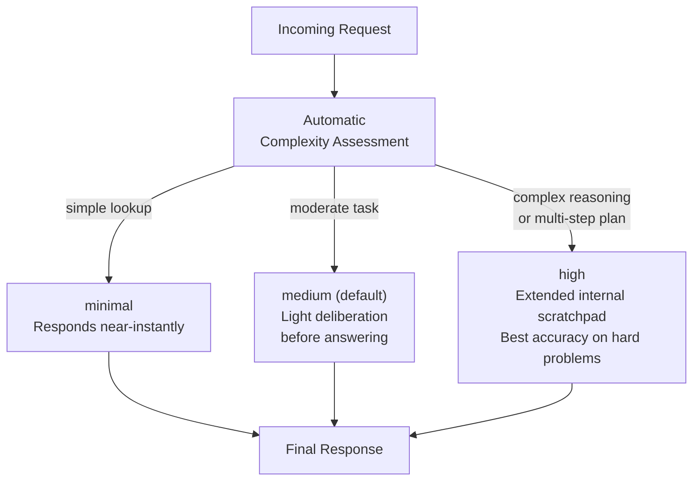

## The Old Hierarchy Is Gone

For years, picking an AI model came down to a legible trade-off: **Flash** models (fast, cheap) for high-volume tasks where quality could flex a little; **Pro** models (slower, expensive) for the hard stuff — complex reasoning, multi-step agent workflows, production coding. The tiers were clear.

On May 19, 2026, at Google I/O, that hierarchy got complicated. Google released **Gemini 3.5 Flash**, a model that sits at the Flash price point — $1.50 per million input tokens — but now outperforms last year's Pro-tier flagship (Gemini 3.1 Pro) on nearly every agentic and coding benchmark Google published. More strikingly, it beats the current frontier Pro models from OpenAI and Anthropic on several of those same agent benchmarks.

At the same time, it runs at **289 tokens per second** — roughly four times the speed of GPT-5.5 (71 tok/s) and Claude Opus 4.7 (67 tok/s).

Something structural changed. It is worth unpacking what.

---

## What Gemini 3.5 Flash Is

Gemini 3.5 Flash is the first model in Google's new 3.5 family, released generally available at Google I/O 2026. It is a **multimodal model**: it accepts text, images, audio, and video as input, and produces text (including structured JSON) as output. Its context window handles up to **1,048,576 input tokens** — roughly 750,000 words, or about ten full-length novels — and can emit up to 65,536 output tokens.

It is built first for **agentic workloads**: multi-step tasks where an AI model calls tools, reads the results, decides what to do next, and iterates — sometimes for dozens of rounds. The model natively supports:

- Function calling and structured output
- Search-as-a-tool (integrated retrieval)
- Code execution in a sandboxed runtime
- Native integration with **Google Antigravity**, Google's agent-first development platform launched at the same I/O

It is available through the Gemini API, Google AI Studio, and Vertex AI. Knowledge cutoff is January 2026.

---

## Four Times Faster — What That Actually Means

Speed in language models is measured in **output tokens per second** (tok/s): how fast the model generates text. At 289 tok/s, Gemini 3.5 Flash is not incrementally faster than its competitors. It is four times faster.

To make that concrete: generating a 4,000-word document (~5,500 tokens) takes GPT-5.5 about **77 seconds** at 71 tok/s. Gemini 3.5 Flash does the same in about **19 seconds**.

For an agentic workflow that calls the model fifty times — not unusual for a complex software engineering task with planning, execution, and verification phases — that gap multiplies: what takes GPT-5.5 roughly an hour takes Flash about fifteen minutes. For real-time applications (coding assistants, live chat, interactive agents) that difference is not a nice-to-have. It is a product decision.

---

## The Benchmarks: Where Flash Now Beats Pro

The benchmark story has two parts: Flash versus the model it replaces (Gemini 3.1 Pro), and Flash versus today's frontier Pro-tier models.

### Against Gemini 3.1 Pro: Not Close

| Benchmark | Gemini 3.5 Flash | Gemini 3.1 Pro |
|---|---|---|
| Terminal-Bench 2.1 (coding) | **76.2%** | 70.3% |
| MCP Atlas (tool-use reliability) | **83.6%** | 78.2% |
| Finance Agent v2 | **57.9%** | 43.0% |
| CharXiv Reasoning | **84.2%** | — |
| GDPval-AA agent Elo | **1,656** | 1,314 |

Gemini 3.5 Flash is an unambiguous step change over its predecessor in every dimension that matters for agentic work.

### Against Current Frontier Pro Models: Genuinely Mixed

| Benchmark | Gemini 3.5 Flash | GPT-5.5 | Claude Opus 4.7 |
|---|---|---|---|
| MCP Atlas (tool-use) | **83.6%** | lower | lower |
| Finance Agent v2 | **57.9%** | — | — |
| CharXiv Reasoning | **84.2%** | — | — |
| Terminal-Bench 2.1 | 76.2% | **78.2%** | — |
| GDPval-AA agent Elo | 1,656 | **1,769** | — |
| SWE-Bench Pro (software eng.) | — | — | **64.3%** |
| ARC-AGI-2 (abstract reasoning) | lower | **84.6%** | — |
| OSWorld-Verified (GUI agents) | — | **78.7%** | — |

Flash wins on **MCP Atlas** — arguably the most important benchmark for production agents, because it measures how reliably a model handles many tool calls in sequence without dropping context, hallucinating tool names, or confusing results between calls. It wins on Finance Agent v2, a benchmark that penalizes wrong numbers with real-cost consequences. It wins on CharXiv Reasoning.

It loses to GPT-5.5 on ARC-AGI-2, OSWorld-Verified, and GDPval-AA Elo. It trails Claude Opus 4.7 on SWE-Bench Pro, the hardest software engineering evaluation. For the genuinely difficult edge of the reasoning frontier, Pro-tier models still have an advantage.

The takeaway: Flash is not a universal replacement for Pro models. It is, however, the right default for **most agentic workflows** — which is a much stronger claim than any Flash model could have made twelve months ago.

---

## Dynamic Thinking: The Hidden Lever

One of the most practically significant features of Gemini 3.5 Flash is **dynamic thinking**, which is enabled by default.

The idea is simple: some queries are easy, some are hard, and a fixed compute budget is wasteful in both directions. Dynamic thinking lets the model self-regulate. A new API parameter — `thinking_level` — replaces the old integer `thinking_budget` with four named levels:

- `minimal` — near-instant response, almost no internal reasoning
- `low` — light chain-of-thought before answering
- `medium` — default; balanced quality and latency
- `high` — extended internal scratchpad for difficult problems

The model decides when a question is hard enough to warrant longer deliberation. For most practical use cases you do not need to tune `thinking_level` manually — the default `medium` mode already outperforms Gemini 3.1 Pro across benchmarks. But the option exists to lock it to `minimal` for latency-critical paths or `high` for tasks where accuracy matters more than speed.

This is the same capability earlier models called "extended thinking" or "thinking mode," but it is now the default configuration rather than an opt-in feature.

---

## Pricing: The Cost Math

| Model | Input (per 1M tokens) | Output (per 1M tokens) |
|---|---|---|
| Gemini 3.5 Flash | $1.50 | $9.00 |
| Gemini 3.1 Pro | $2.50 | $15.00 |
| GPT-5.5 (est.) | ~$4.50 | ~$27.00 |
| Claude Opus 4.7 (est.) | ~$15.00 | ~$72.00 |

Gemini 3.5 Flash is **40% cheaper** than the previous Pro-tier Gemini model on both input and output. Compared to GPT-5.5, the difference is approximately **3x on both dimensions**. Against Claude Opus 4.7, the input cost gap is roughly **10x**.

For a product making 10 million model calls per day — realistic for a consumer-facing app — the difference between Flash and Opus 4.7 pricing runs to several hundred thousand dollars per month. At that scale, model pricing is not an infrastructure detail; it is a core business constraint.

Compared to the previous generation's Flash (Gemini 3 Flash at $0.50/$3.00), Gemini 3.5 Flash does cost 3x more. But it is buying meaningfully more: frontier-competitive intelligence, a million-token context window, and built-in dynamic thinking that the older Flash lacked entirely.

---

## What This Means for AI Development

The boundary between "fast-cheap" and "smart-expensive" tiers has been eroding for several model generations. Gemini 3.5 Flash is the clearest statement yet that the line has moved — not just nudged.

**Agent pipelines can simplify.** Previously, production agents would route hard sub-tasks to an expensive Pro model and simpler routing to a Flash model, adding complexity and latency at the routing layer. With Flash now competitive on most agent benchmarks, running the whole pipeline on a single model tier becomes viable.

**Speed enables different interaction patterns.** At 289 tok/s, streaming responses feel qualitatively different. Coding assistants can suggest entire functions before the user finishes typing a comment. Real-time voice pipelines become more tractable. The experience ceiling for Flash-speed products just rose.

**Cost unlocks iteration.** Models at Flash's price point are viable for fine-tuning experiments and evaluations that would be prohibitive at Pro pricing. Teams that could not afford to iterate on Opus 4.7-class models may find Flash's price point unlocks those workflows.

**Some tasks still belong at Pro.** For the hardest software engineering problems (SWE-Bench Pro), highest-stakes abstract reasoning (ARC-AGI-2), and deep GUI agent work (OSWorld-Verified), Pro-tier models remain the stronger choice. Flash is not a universal replacement; it is the right new default for most cases.

The broader pattern: this release is evidence that **model efficiency — not just raw scale — is the primary driver compressing the capability gap between tiers**. Capabilities that required flagship-level compute eighteen months ago now live in a Flash model available at less than $2 per million tokens. That trend is not slowing down.

---

## Sources

- [Google Introduces Gemini 3.5 Flash at I/O 2026: A Faster and Cheaper Model for AI Agents and Coding — MarkTechPost](https://www.marktechpost.com/2026/05/20/google-introduces-gemini-3-5-flash-at-i-o-2026-a-faster-and-cheaper-model-for-ai-agents-and-coding/)
- [Gemini 3.5 Flash is here: Google's smartest speed model promises better coding and agents — Android Authority](https://www.androidauthority.com/google-gemini-3-5-flash-3668559/)
- [Google says Gemini 3.5 Flash rivals large flagship models for coding and agentic tasks — Engadget](https://www.engadget.com/2176592/google-says-gemini-3-5-flash-rivals-large-flagship-models-for-coding-and-agentic-tasks/)
- [Google announces Gemini 3.5 Flash, its strongest coding model yet — Neowin](https://www.neowin.net/news/google-announces-gemini-35-flash-its-strongest-coding-model-yet/)
- [I/O 2026 developer highlights: Antigravity, Gemini API, AI Studio — Google Developers Blog](https://blog.google/innovation-and-ai/technology/developers-tools/google-io-2026-developer-highlights/)
- [Gemini 3.5 Flash Shipped: A Flash-Tier Model Now Leads the Pro Tier on Agent Benchmarks — WaveSpeed Blog](https://wavespeed.ai/blog/posts/gemini-3-5-flash-shipped-leads-agent-benchmarks/)
- [Gemini 3.5 Flash vs GPT-5.5 vs Opus 4.7: Can a Fast-Tier Model Beat the Flagships? — ApiDog](https://apidog.com/blog/gemini-3-5-vs-gpt-5-5-vs-opus-4-7/)
- [Gemini 3.5 Flash: Benchmarks, Pricing, and Complete Specs — LLM Stats](https://llm-stats.com/blog/research/gemini-3.5-flash-launch)
- [100 things we announced at Google I/O 2026 — Google Blog](https://blog.google/innovation-and-ai/technology/ai/google-io-2026-all-our-announcements/)
- [New AI Models May 2026: The Frontier Took a Breath, Architecture Took the Stage — WhatLLM.org](https://whatllm.org/blog/new-ai-models-may-2026)
