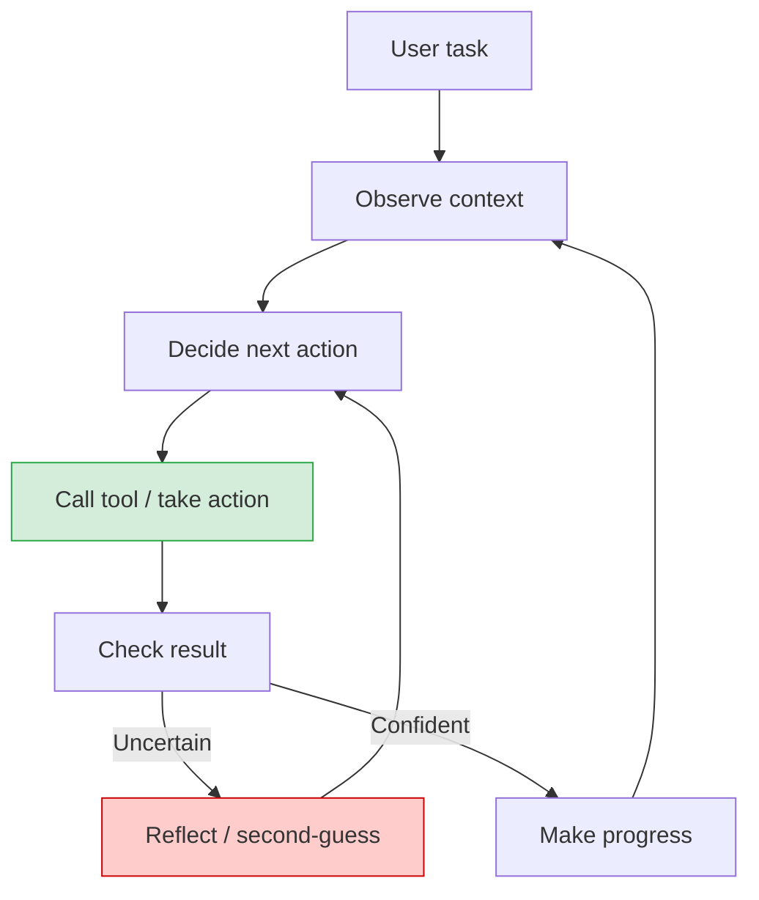
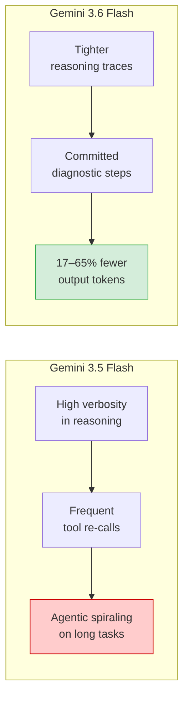
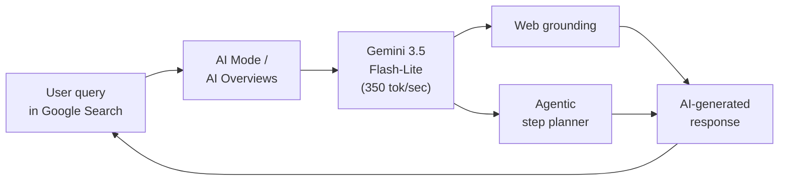
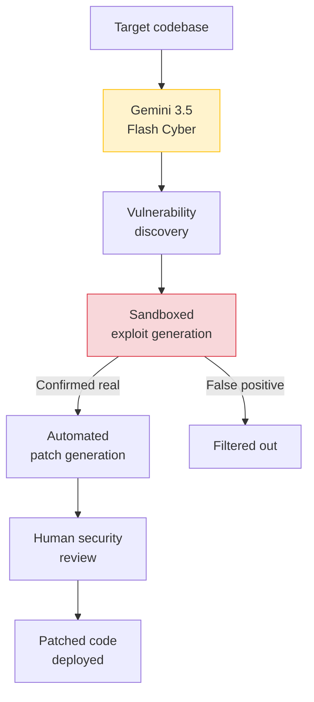

## Three Models, One Day, Three Very Different Jobs

When model releases happen, they usually come one at a time — a flagship upgrade, a press release, a benchmark table. On July 21, 2026, Google did something different: it shipped three distinct Gemini Flash models simultaneously, each targeting a different part of the market with a different set of trade-offs.

The move was deliberate. **Gemini 3.6 Flash** is the new workhorse for developers and enterprises — smarter, cheaper to run, and significantly better at multi-step tasks. **Gemini 3.5 Flash-Lite** is a speed-first model already deployed inside Google Search, handling AI queries at a scale that makes "millions of users" an understatement. And **Gemini 3.5 Flash Cyber** is something genuinely new: a model fine-tuned specifically for finding and patching security vulnerabilities — and available only to governments and vetted partners.

Each of these is interesting on its own. Together, they sketch a picture of where the AI industry is heading: away from a single "best model" and toward a portfolio of specialized tools, with the most capable variants quietly restricted to those who can be trusted with them.

---

## The Problem 3.6 Flash Was Built to Fix

To understand why Gemini 3.6 Flash matters, you need to understand a problem that has quietly plagued AI agents for the past year: **agentic spiraling**.

When an AI model works through a multi-step task — debugging code, executing a research workflow, managing files across a project — it loops through a cycle: observe what's there, decide what to do next, call a tool, check the result, then repeat. That loop is how the model makes progress.

But models trained primarily on language prediction don't always handle that loop gracefully. They can get stuck in repetitive reflection — calling the same tool twice, second-guessing a result they already have, generating long explanations before taking any action. Each unnecessary step burns tokens. In a sufficiently complex task, this spiraling can turn a straightforward job into an expensive, slow one.

The red node is the problem. A model that is constantly uncertain loops through reflection repeatedly, generating output without advancing the task. Google's engineers describe this as the model failing to "commit" — taking diagnostic steps before committing to an action, rather than acting directly on available evidence.

**Gemini 3.6 Flash was explicitly trained to reduce this pattern.** According to Google's release materials, 3.6 Flash "takes fewer reasoning steps and tool calls to accomplish multi-step workflows" and exhibits reduced verbosity throughout. In complex multi-file coding tasks, the model now executes precise diagnostic steps, then acts — rather than iterating through trial-and-error edits.

The results show up in the numbers. Compared to 3.5 Flash, 3.6 Flash uses **17% fewer output tokens** on comparable tasks. On long-horizon engineering evaluations like DeepSWE, the token reduction reaches **up to 65%**. That is not a small efficiency gain — it means a task that cost $1.00 in tokens could cost $0.35 on the same model class.

---

## What Changed Under the Hood

Google did not publish a detailed technical architecture for 3.6 Flash, but the pattern of improvements gives a clear picture of where the training emphasis landed.

The benchmark improvements back this up:

| Benchmark | Gemini 3.5 Flash | Gemini 3.6 Flash | What It Measures |
|---|---|---|---|
| **OSWorld-Verified** | 78.4% | **83.0%** | Autonomous computer use (mouse, apps, browser) |
| **GDM-MRCR (1M tokens)** | 26.6% | **54.0%** | Long-context retrieval and reasoning |
| **DeepSWE** | baseline | **−65% tokens** | Real-world software engineering, long horizon |
| **Intelligence Index** | — | **52** | Composite reasoning, knowledge, math, code |

The long-context jump is particularly striking. Jumping from 26.6% to 54.0% on GDM-MRCR — a benchmark that tests whether a model can actually use its full 1 million-token context — is more than an incremental gain. It means 3.6 Flash can reliably work with very long contexts in a way that 3.5 Flash often could not. For applications that need to reason across large codebases, lengthy documents, or hours of conversation history, this is the upgrade that matters.

**Pricing and access:** 3.6 Flash costs $0.75 per million input tokens and $3.75 per million output tokens through December 31, 2026, with a planned step-up to $1.50/$7.50 in 2027. The model is available on day one across Google AI Studio, the Gemini API, Android Studio, and Vertex AI, with support for tool calling, extended reasoning, prompt caching, web search, and structured JSON outputs.

---

## Gemini 3.5 Flash-Lite: AI at Search Scale

While 3.6 Flash is built for thoughtful multi-step work, **Gemini 3.5 Flash-Lite** occupies a different role entirely: raw throughput at the lowest possible cost.

Flash-Lite is Google's fastest model in the Gemini 3.5 class, delivering **350 output tokens per second** according to the Artificial Analysis benchmark index — significantly faster than previous Flash-Lite generations. It outperforms its predecessors substantially on agentic workflows despite its smaller footprint.

The deployment story is what makes Flash-Lite genuinely interesting: **it is already running inside Google Search**. Since July 2026, Flash-Lite has been powering Google's AI Overviews, AI Mode, and the agentic search features first shown at I/O in May — features that let users ask the search engine to plan trips, compare products, or complete multi-step research tasks without leaving the search page.

To understand the scale: Google Search handles billions of queries per day. Running an AI model on a meaningful fraction of those queries — even at very low per-query cost — represents a deployment scale that dwarfs most AI product launches. Flash-Lite is the model that makes that economically viable.

For developers, Flash-Lite is also available via API as a sub-agent option in orchestration pipelines: tasks where you need a fast, cheap model to handle high-volume routing or preprocessing, with a more capable model handling the harder reasoning steps.

---

## Gemini 3.5 Flash Cyber: Gated AI for Defenders

The most unusual member of the trio is **Gemini 3.5 Flash Cyber**, and it deserves particular attention — not because of what it can do, but because of *who is allowed to use it*.

Flash Cyber is a fine-tuned variant of 3.5 Flash built specifically for vulnerability discovery and patching. It is integrated into Google's **CodeMender** agent, an AI-powered tool for finding and fixing security flaws in code, which Google originally unveiled in October 2025. Flash Cyber powers the most sophisticated part of CodeMender's pipeline: autonomously generating exploit code to *verify* that discovered vulnerabilities are real — not false positives — by attempting to reproduce them in a sandboxed environment, then automatically writing the patches.

In V8 engine evaluations, Flash Cyber found **55 issues**, 10 of which were missed entirely by other models. That kind of result puts it in the category of a genuine force-multiplier for security teams.

The access restriction is where things get interesting. **Flash Cyber is not publicly available.** Google has limited it to a closed pilot for governments and "trusted partners." The reasoning, from Tulsi Doshi, Google's Senior Director of Product Management for Gemini, was straightforward: the goal is "enabling frontline defenders to patch critical vulnerabilities before they are widely exploited while reducing the risk of technology misuse."

The dual-use problem with models like Flash Cyber is obvious: a model that can write exploit code to *verify* a vulnerability can just as easily be used to *launch* one. By keeping it out of the public API entirely, Google is acknowledging that some capabilities are too sharp to release without accountability structures in place.

This is a notable precedent. It is the first major case of a top-tier AI lab shipping a frontier-adjacent model directly to governments as a restricted, pilot-gated tool — not open-sourced, not available via the standard API, but provisioned in a controlled way to specific institutional actors. Whether this becomes the norm for dual-use AI capabilities is one of the more consequential questions in the field right now.

---

## The Bigger Trend: Specialization Replaces the Single Best Model

Taken together, the three Flash models on July 21 are a data point in a broader shift that has been building for the past year: **the era of the single "best model" is giving way to an ecosystem of purpose-built tools**.

A year ago, the common developer question was "which frontier model should I use?" Today, the question is increasingly "which model fits *this specific task* at *this specific cost point*?" Google's three-model release is a deliberate answer to that shift:

- Tasks where quality matters and you can wait: 3.6 Flash with extended reasoning enabled
- High-volume, latency-sensitive pipelines: 3.5 Flash-Lite as a fast sub-agent
- Sensitive security workflows: 3.5 Flash Cyber, if you qualify

Google also teased that **Gemini 3.5 Pro and Gemini 4** are forthcoming — the inference being that the Flash tier covers the cost-optimized spectrum, with a more capable Pro and a next-generation 4.x model covering the frontier. The Flash trifecta is not the whole story; it is Google filling in the middle of the stack while the top remains under development.

For developers building on top of the Gemini API today, the practical takeaway is straightforward. If you are running agentic loops that previously burned through tokens on reflection and re-calls, 3.6 Flash is worth testing immediately — the 17–65% token reduction compounds quickly in multi-step workflows. If you are routing high-volume requests and latency is more important than depth, Flash-Lite at 350 tokens/second is now one of the most cost-effective options at any major lab.

And if you are a national cybersecurity agency wondering whether your defenders can leverage AI for vulnerability research at scale — apparently, there is a waiting list.

---

## Sources

- [Google launches Gemini 3.6 Flash and 3.5 Flash-Lite, teases Gemini 4 — 9to5Google](https://9to5google.com/2026/07/21/gemini-3-6-flash-launch/)
- [Introducing Gemini 3.6 Flash, 3.5 Flash-Lite, and 3.5 Flash Cyber — Google Blog](https://blog.google/innovation-and-ai/models-and-research/gemini-models/gemini-3-6-flash-3-5-flash-lite-3-5-flash-cyber/)
- [Google's Gemini 3.6 Flash model cuts AI agent token costs by up to 65% — VentureBeat](https://venturebeat.com/technology/googles-gemini-3-6-flash-model-cuts-ai-agent-token-costs-by-up-to-65-on-long-horizon-engineering-tasks-and-3-5-pro-is-on-the-way)
- [Google Launches Gemini 3.5 Flash Cyber AI to Find and Fix Software Vulnerabilities — The Hacker News](https://thehackernews.com/2026/07/google-launches-gemini-35-flash-cyber.html)
- [Google's Gemini 3.5 Flash Cyber becomes a vulnerability hunter — Help Net Security](https://www.helpnetsecurity.com/2026/07/22/google-gemini-3-5-flash-cyber-model/)
- [Introducing Gemini 3.5 Flash Cyber — Google DeepMind](https://deepmind.google/blog/introducing-gemini-3-5-flash-cyber/)
- [Google Releases Gemini 3.6 Flash, 3.5 Flash-Lite, and 3.5 Flash Cyber — MarkTechPost](https://www.marktechpost.com/2026/07/21/google-releases-gemini-3-6-flash-3-5-flash-lite-and-3-5-flash-cyber-a-cheaper-more-token-efficient-flash-tier-built-for-agentic-workloads/)
- [3.5 Flash-Lite rolling out in Google Search — Search Engine Land](https://searchengineland.com/3-5-flash-lite-rolling-out-in-google-search-482893)
- [Gemini 3.6 Flash — Artificial Analysis](https://artificialanalysis.ai/models/gemini-3-6-flash)
- [Gemini 3.5 Flash Cyber and the Rise of Gated AI Models — Digital Applied](https://www.digitalapplied.com/blog/gemini-3-5-flash-cyber-restricted-security-model-2026)
