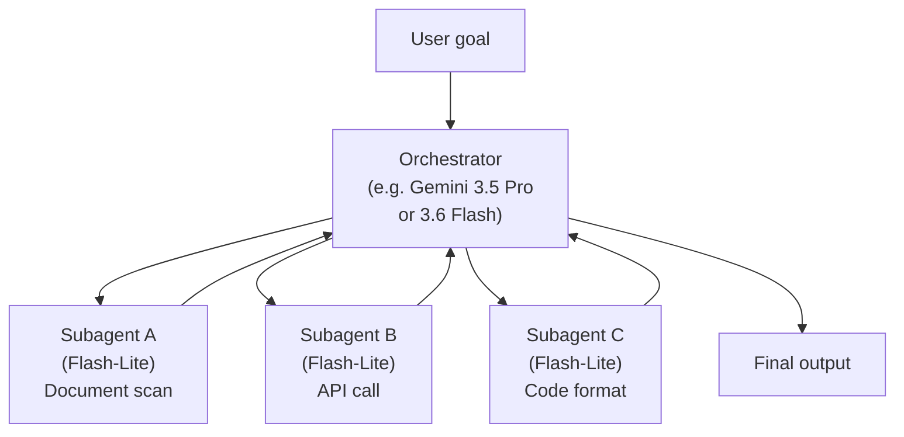
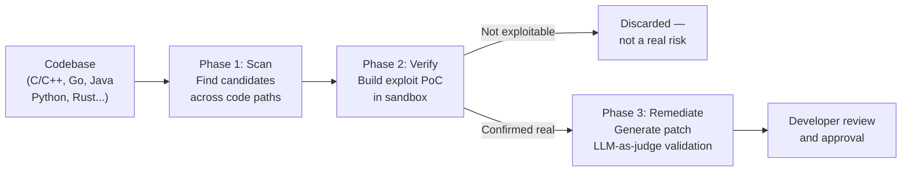
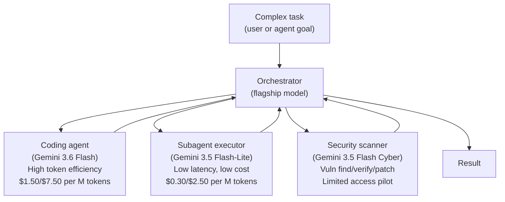

## One Release, Three Very Different Models

When Google released three Gemini Flash variants in a single afternoon on July 21, 2026, it made a quiet argument about the future of model deployment: the era of "one model for everything" is over — even within a single tier.

The three models are **Gemini 3.6 Flash**, **Gemini 3.5 Flash-Lite**, and **Gemini 3.5 Flash Cyber**. Each is built on Gemini 3.5 Flash's foundation. Each targets a distinct job. And taken together, they suggest Google's view of where agentic AI workloads are actually going — not a single smart model doing everything, but a coordinated stack of purpose-fit models working together.

Here is what each one does and why it exists.

---

## Gemini 3.6 Flash: The Same Intelligence, Half the Cost

### What changed

Gemini 3.6 Flash does not meaningfully improve on 3.5 Flash's broad intelligence. In terms of general reasoning and knowledge, the two models score similarly. But that is not the point.

The changes are about *how* the model reaches its answers. Post-training optimizations targeted three things: token efficiency, tool-call reliability, and coding accuracy. The result is a model that completes agentic coding tasks in **17% fewer output tokens** — and because those output tokens also cost less per million ($7.50 vs. $9.00), the combined effect is roughly a **31% drop in output spend** for equivalent work.

On long-horizon software engineering tasks — the kind that dominate agentic coding workflows — the savings are larger. Google reported up to **65% lower token costs** on the DeepSWE benchmark compared to 3.5 Flash.

### Why that matters in production

A typical agentic coding task in 2026 — the kind where a model plans, writes code, runs tests, reads error messages, and tries again — consumes somewhere between 1 and 3.5 million tokens per run, including retries and self-correction loops. A 17% output reduction at a lower per-token price compounds into real money at production volume.

But the efficiency gain is not only about cost. Fewer tokens to reach the answer also means fewer round-trips, less latency, and shorter feedback loops for the human overseeing the work. On agentic benchmarks, 3.6 Flash achieved more than a **50% reduction in time per task** compared to 3.5 Flash, measured at 304 output tokens per second.

### Benchmark comparison

| Benchmark | 3.5 Flash | 3.6 Flash | What it tests |
|---|---|---|---|
| **DeepSWE** | 37% | **49%** | Long-horizon software engineering |
| **MLE-Bench** | 49.7% | **63.9%** | ML research task automation |
| **OSWorld-Verified** | 78.4% | **83.0%** | Autonomous computer use |

The OSWorld-Verified result — 83.0% on a benchmark that tests a model's ability to operate a real computer with a mouse and keyboard — places 3.6 Flash among the top performers in the Flash tier for autonomous computer use.

### The honest trade-off

Artificial Analysis measured 3.6 Flash's Intelligence Index as roughly flat versus 3.5 Flash. If your task requires broad factual knowledge or complex multi-step reasoning from scratch, you are not gaining much by switching. The upgrade is for *efficiency in repeated, tool-heavy, code-heavy workflows* — and that is exactly the profile of most production agent deployments.

---

## Gemini 3.5 Flash-Lite: The First Model Google Marketed Explicitly for Subagents

### A new role in the hierarchy

Gemini 3.5 Flash-Lite is the most conceptually interesting of the three because it formalizes something that developers have been doing informally for a year: using a cheaper, faster model as the worker inside a larger multi-agent system, while a more capable model orchestrates.

Flash-Lite is priced at **$0.30 per million input tokens** and **$2.50 per million output tokens** — less than a third of 3.6 Flash's output price. At 340–350 tokens per second, it is fast enough to be called many times per orchestrated task without becoming a bottleneck. Google is, for the first time, explicitly positioning a Gemini tier for subagent execution.

### What "subagent" means here

In a multi-agent architecture, a pipeline typically has:
- An **orchestrator** — a high-capability model that plans, routes, and synthesizes
- **Subagents** — smaller, faster models that execute focused tasks (read a file, run a query, check an API response, format a result)

Flash-Lite fills the subagent role with purpose. It is optimized for simple coding tasks, document understanding, and latency-sensitive agentic steps where the decision logic has already been handled upstream by a more capable model.

### Benchmark numbers in context

Despite its low price, Flash-Lite meaningfully outperforms the older Gemini 3 Flash — a model that was released as a general-purpose workhorse — on agentic-relevant tests:

| Benchmark | Gemini 3 Flash | 3.5 Flash-Lite | What it tests |
|---|---|---|---|
| **SWE-Bench Pro** | 49.6% | **54.2%** | Real-world GitHub issue resolution |
| **OSWorld-Verified** | 65.1% | **74.0%** | Autonomous computer use |
| **Terminal-Bench 2.1** | 31% | **54%** | Complex CLI workflows |

For a model priced at $0.30/M input, scoring 74% on OSWorld-Verified is a meaningful result. That benchmark is hard — it tests the ability to navigate real operating system interfaces, not just generate correct code.

---

## Gemini 3.5 Flash Cyber: When Your Security Scanner Builds Its Own Exploits

### The problem with traditional vulnerability scanning

Traditional vulnerability scanning tools are good at finding known patterns: a SQL injection template in a query string, an unsafe `strcpy` call in C code, a missing HTTPS check. What they are poor at is understanding *context* — whether a particular code path is actually reachable by an attacker, whether a potential injection is guarded by something upstream, or whether the vulnerability is exploitable in practice.

The result is alert fatigue. Security teams routinely get thousands of findings from static analysis tools, of which a fraction are real, exploitable vulnerabilities. The rest are false positives that consume engineering time.

Gemini 3.5 Flash Cyber — deployed through Google's **CodeMender** multi-agent platform — addresses both problems.

### How CodeMender works

CodeMender runs Gemini 3.5 Flash Cyber in a three-phase loop: scan, verify, remediate.

The key innovation is **Phase 2: Verify**. The model does not just flag a potential vulnerability — it attempts to build working exploit code in an isolated, customer-managed sandbox. If the exploit succeeds, the vulnerability is confirmed real and gets escalated to remediation. If it does not, the finding is discarded. This closes the false-positive loop before a human ever sees it.

Phase 3 uses an LLM-as-a-judge pattern: a separate model evaluates whether the generated patch preserves the codebase's existing behavior, catches regressions before they reach developers, and respects the repository's style conventions.

### What makes Flash Cyber distinct from a general model

Gemini 3.5 Flash Cyber is fine-tuned specifically for security reasoning tasks. A general-purpose Flash model can write exploit code when prompted, but it lacks the domain knowledge to analyze large codebases systematically, track complex call graphs, and reason about what is reachable from an attacker's entry point versus what is dead code. The fine-tuning gives the model a mental model of security reasoning that does not need to be prompted into existence each time.

CodeMender invokes the model multiple times per scan — running parallel sub-agent instances across different code paths — which is why the low cost-per-token of the Flash tier matters. At frontier model prices, that level of coverage would be prohibitively expensive.

### Deployment and access

As of July 2026, Gemini 3.5 Flash Cyber is available exclusively to **governments and trusted partners** through CodeMender as part of a limited-access pilot. Broader access is expected in 2026. Integration paths include:

- **Gemini Enterprise Agent Platform** — managed, secure deployment with enterprise governance
- **AI Threat Defense** — integrated with Wiz for cloud-native security context, where Wiz's Security Graph enriches CodeMender's findings with deployment and exposure data

Developers working within the pilot can integrate CodeMender into CI/CD pipelines, commit-scanning workflows, or local development environments via VS Code and Antigravity.

---

## The Bigger Picture: A Specialized Fleet, Not a Single Model

The reason to pay attention to this triple release is not any individual model — it is the strategy it reveals.

Google is moving toward what you might call a **fleet model of AI deployment**: a set of purpose-built models that cover different roles in a workflow, rather than a single frontier model that tries to do everything at a cost-inefficient price point.

This mirrors how software engineering teams themselves work: you do not use a principal engineer's time to format a JSON file. You use the right skill level for the right task.

The economics of AI are forcing the same discipline. At scale, routing every call to the most capable model is wasteful. The practical question is no longer "which model is best" but "which model is right-fit for this specific step in this specific pipeline."

Google's July 21 release is one of the clearest signals yet that this is how the frontier labs are thinking about the problem.

---

## Practical Guidance

A few things worth noting if you build on the Gemini API:

**Use 3.6 Flash for agentic coding pipelines.** If your agent runs multi-step coding or research tasks with tool calls, the 17% token reduction compounds into real savings. The improvement in DeepSWE (49% vs 37%) is meaningful for tasks involving long code contexts.

**Use 3.5 Flash-Lite for high-volume subagent work.** At $0.30 input / $2.50 output, it is the right choice for orchestrated pipelines where individual sub-steps are focused and the orchestrator handles routing logic. The 74% OSWorld-Verified score means it can handle UI-facing tasks, not just pure text operations.

**Watch CodeMender.** Even if you are not in the current pilot, the architecture — scan in parallel, verify with exploit PoC, fix with LLM-as-judge — is a template for AI-native security tooling that will diffuse across the ecosystem. Understanding how it works now will help you evaluate (and eventually deploy) similar tools when they reach broader availability.

**3.5 Pro is reportedly coming.** Multiple sources noted Google teased Gemini 3.5 Pro alongside this release. No date was given, but a 3.5-tier Pro model would fill the gap between 3.6 Flash and the more expensive flagship models.

---

## Sources

- [Introducing Gemini 3.6 Flash, 3.5 Flash-Lite, and 3.5 Flash Cyber — Google Blog](https://blog.google/innovation-and-ai/models-and-research/gemini-models/gemini-3-6-flash-3-5-flash-lite-3-5-flash-cyber/)
- [Now in preview: Find and fix software vulnerabilities with CodeMender — Google Cloud Blog](https://cloud.google.com/blog/products/identity-security/find-and-fix-software-vulnerabilities-with-codemender)
- [CodeMender: AI Agent for Code Security — Google Cloud](https://cloud.google.com/security/codemender)
- [Google Launches Gemini 3.5 Flash Cyber AI to Find and Fix Software Vulnerabilities — The Hacker News](https://thehackernews.com/2026/07/google-launches-gemini-35-flash-cyber.html)
- [Gemini 3.6 Flash Cuts Token Costs and Scores Higher on Every Benchmark — TechTimes](https://www.techtimes.com/articles/321268/20260722/gemini-36-flash-cuts-token-costs-scores-higher-every-benchmark.htm)
- [Google's Gemini 3.6 Flash model cuts AI agent token costs by up to 65% on long horizon engineering tasks — VentureBeat](https://venturebeat.com/technology/googles-gemini-3-6-flash-model-cuts-ai-agent-token-costs-by-up-to-65-on-long-horizon-engineering-tasks-and-3-5-pro-is-on-the-way)
- [Google Releases Gemini 3.6 Flash, 3.5 Flash-Lite, and 3.5 Flash Cyber: A Cheaper, More Token-Efficient Flash Tier Built for Agentic Workloads — MarkTechPost](https://www.marktechpost.com/2026/07/21/google-releases-gemini-3-6-flash-3-5-flash-lite-and-3-5-flash-cyber-a-cheaper-more-token-efficient-flash-tier-built-for-agentic-workloads/)
- [Gemini 3.6 Flash vs 3.5 Flash: What Changed and Should You Upgrade? — Apidog](https://apidog.com/blog/gemini-3-6-flash-vs-gemini-3-5-flash/)
- [Gemini 3.5 Flash-Lite: The Purpose-Built Subagent Tier — DigitalApplied](https://www.digitalapplied.com/blog/gemini-3-5-flash-lite-subagent-economics-multi-agent-2026)
- [Gemini 3.5 Flash-Lite — Artificial Analysis](https://artificialanalysis.ai/models/gemini-3-5-flash-lite)
- [Introducing Gemini 3.5 Flash Cyber — Google DeepMind](https://deepmind.google/blog/introducing-gemini-3-5-flash-cyber/)
