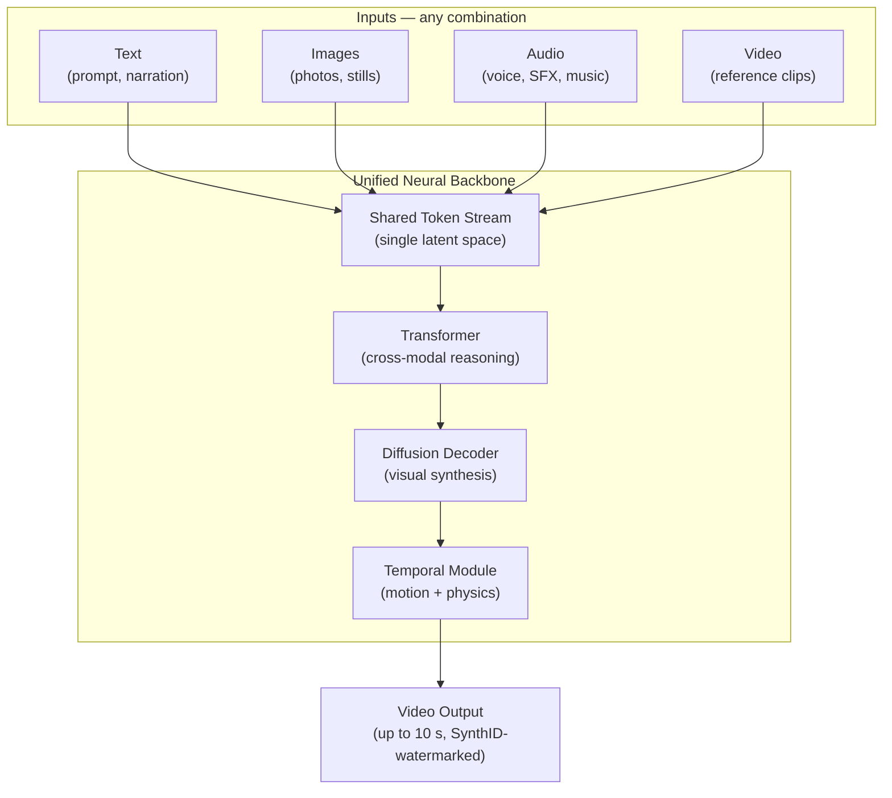
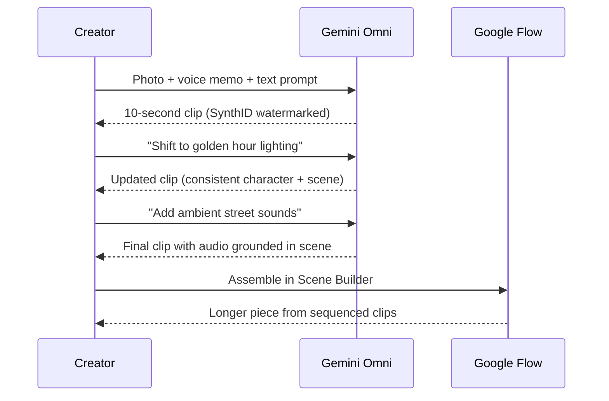

## The Problem with Patchwork AI

For most of AI's recent history, turning a photo and a voice memo into a video required three separate pipelines. A vision model would analyze the image, a language model would write a script, and a video diffusion model would produce the output — with custom glue code holding everything together.

The results showed the seams. Each subsystem worked in isolation. The video model never quite understood the audio. The audio model had never seen the image. Context bled between the steps.

Google's answer, announced at Google I/O 2026 on May 19, is **Gemini Omni** — a model trained from scratch to accept text, images, audio, and video simultaneously and produce video output through a single, unified neural architecture. It is the most significant change to Google's AI media stack since Gemini 1.5 introduced long-context multimodal understanding in 2024.

---

## What "Any-to-Any" Actually Means

The phrase "any-to-any multimodal" gets used loosely in the AI industry. For Gemini Omni, it has a specific meaning.

Previous multimodal models were good at *understanding* multiple formats — you could show Gemini 1.5 an image and ask questions in text, and it would reason across both. But generating new content in a different modality (producing a video from an image) required routing through specialist models. Understanding and generation lived in separate systems.

Gemini Omni Flash, the first model in the Omni family, closes that gap on the generation side. It accepts any combination of text, image, audio, and video in a single prompt — and produces **video grounded in its reasoning about all of them at the same time**.

Think of it as the difference between two interpreters whispering to each other and one bilingual speaker. The former loses meaning at every handoff. The latter never drops a thread.

---

## Inside the Architecture

At the core of Gemini Omni is a single neural backbone that processes all modalities inside a **shared token space**. Text, image pixels, audio frequencies, and video frames are all represented as tokens — the same basic unit — and the model reasons across all of them simultaneously before generating output.

The key difference from predecessor models like Veo 3.1 is **where** fusion happens. In a pipeline system, modalities are fused at the boundaries between sub-models — the video model receives a finished text description and nothing else. In Gemini Omni, fusion happens inside every transformer layer, so the model never loses track of the audio while computing video frames.

Google describes the training graph as three coupled components: a **transformer** for cross-modal reasoning, a **diffusion decoder** for visual synthesis, and a **temporal perception module** for motion and physics coherence. All three are trained jointly on billions of examples mixing text, images, audio, and video.

Audio and video training data was annotated with text captions at multiple levels of detail. That annotation pipeline is what lets Gemini Omni take a prompt like "add rain hitting the windowpane" and produce physics-plausible fluid simulation — the model has seen countless descriptions of rain alongside the corresponding video, so the concept is grounded in both language and moving pixels.

---

## What You Can Actually Do With It

The first model, **Gemini Omni Flash**, went live at I/O on May 19, 2026 and rolled out the same day to the Gemini app, Google Flow, and YouTube Shorts. Free access launched immediately for YouTube users 18+; the broader Gemini app rollout follows paid tiers starting at AI Plus ($7.99/month).

The core loop:

1. Provide any combination of inputs — a voice memo, a photo, a written description, a reference video clip.
2. The model generates a **10-second video** that reasons across all inputs simultaneously: audio shapes pacing, image determines the visual world, text steers the narrative.
3. You continue the conversation. Ask it to "push the camera left," "make it golden hour," or "extend the movement in the back half" — and Gemini Omni updates the output in context, maintaining character and scene consistency across edits.

That loop — generate, refine, generate again — is what Google calls **conversational editing**, and it is the product bet behind Omni. In independent testing, Gemini Omni's output after three rounds of conversational editing exceeded what any single-shot prompt produced from Seedance 2.0 or Kling 3.0 — even though those models generate higher-quality individual clips on raw first attempts. The multi-turn quality advantage compounds where single-shot quality eventually plateaus.

---

## SynthID: Every Pixel Marked at Source

Every video Gemini Omni produces carries a **SynthID watermark** — an imperceptible pattern embedded in the pixel data, verifiable through the Gemini app, Chrome, and Google Search. There is no API parameter to disable it.

SynthID is Google's answer to the provenance problem: as AI-generated video becomes visually indistinguishable from filmed footage, downstream viewers need a way to know what they're looking at. The watermark persists through re-encoding, compression, and most common editing operations.

Google reports that SynthID has now marked over **100 billion AI-generated images and videos** since its launch. Gemini Omni extends mandatory marking to video output in a way no previous Google model did by default — and the timing is not coincidental. The EU AI Act's August 2026 compliance deadline includes requirements for provenance marking on AI-generated content distributed to European users.

---

## How It Compares

The AI video generation market heading into Google I/O 2026 was led by two Chinese-built models:

| Model | Elo (text-to-video) | Elo (image-to-video) | Differentiator |
|---|---|---|---|
| Seedance 2.0 (ByteDance) | 1,269 | 1,351 | Best single-shot naturalistic quality |
| Kling 3.0 (Kuaishou) | ~1,213 | — | Native 4K, multilingual audio |
| Gemini Omni Flash | Not yet benchmarked | — | Multi-modal inputs, conversational editing |

Gemini Omni Flash sits below both on raw single-shot quality in early independent evaluations. Google's positioning is deliberate. The company is building a **generation tool that also edits**, rather than optimizing for the best single-shot clip from a text description. Combined with integration across the Gemini app, Google Flow, and YouTube Shorts, Omni has distribution reach that neither ByteDance nor Kuaishou can replicate in Western markets.

A more capable **Gemini Omni Pro** model is on the roadmap, targeting professional filmmakers and enterprise customers. Google Flow's Scene Builder already allows creators to sequence 10-second clips into longer productions while the clip limit remains in place.

---

## Limitations Worth Knowing

**The 10-second cap** is the most visible constraint. Google describes it as a compute-management decision during rollout, not a model ceiling. Scene Builder in Google Flow is the workaround for longer content.

**Complex motion** is a challenge. Fluids, cloth, and standard object interactions render well, but chaotic motion — explosions, dense crowd scenes, fast pans with many moving objects — can produce warping or flickering in the output.

**Character drift** between sessions can occur. Consistency within a single edit session is strong, but regenerating a character from scratch in a new session without a reference image can produce subtle identity shifts.

---

## Why This Matters

The shift from pipelined specialist models to a single unified architecture is the same transition that defined the move from GPT-3 to GPT-4: you stopped choosing which model to call for which subtask and started describing what you wanted.

Gemini Omni does that for video. A creator who wants to turn a voice memo and a photograph into a shareable clip no longer needs to know anything about video diffusion models, audio encoders, or latent-space alignment. They describe what they want — in whatever format they have it — and refine it in conversation.

That workflow change tends to expand the user base more than any benchmark jump. Professional filmmakers follow quality metrics. The billion people on YouTube Shorts follow the workflow. Google is betting that owning the workflow is the more durable competitive moat, and Gemini Omni is how they intend to claim it.

---

## Sources

- [Introducing Gemini Omni — Google Blog](https://blog.google/innovation-and-ai/models-and-research/gemini-models/gemini-omni/)
- [Everything Google announced at I/O 2026 — 9to5Google](https://9to5google.com/2026/05/19/google-io-2026-news/)
- [Google's Gemini Omni turns images, audio, and text into video — TechCrunch](https://techcrunch.com/2026/05/19/googles-gemini-omni-turns-images-audio-and-text-into-video-and-thats-just-the-start/)
- [Google unveils Gemini Omni at I/O 2026 — Cybernews](https://cybernews.com/ai-news/google-io-2026-gemini-omni-antigravity-agentic-ai/)
- [Gemini Omni Flash vs Seedance 2.0 vs Kling 3.0 — WaveSpeed Blog](https://wavespeed.ai/blog/posts/gemini-omni-flash-vs-seedance-2-kling-3/)
- [How Gemini Omni's Single-Network Architecture Unifies Text, Image, Audio, and Video — Atlas Cloud](https://www.atlascloud.ai/blog/guides/gemini-omni-one-model-for-text-image-audio-and-video)
- [Gemini Omni Flash — Model Card, Google DeepMind](https://deepmind.google/models/model-cards/gemini-omni-flash/)
- [Gemini Omni Flash: What Actually Launched — WaveSpeed Blog](https://wavespeed.ai/blog/posts/gemini-omni-flash-shipped-what-actually-launched/)
- [Google Launches Gemini Omni Flash and 100 AI Products at I/O 2026 — Valasys](https://valasys.com/google-gemini-omni-flash-io/)
