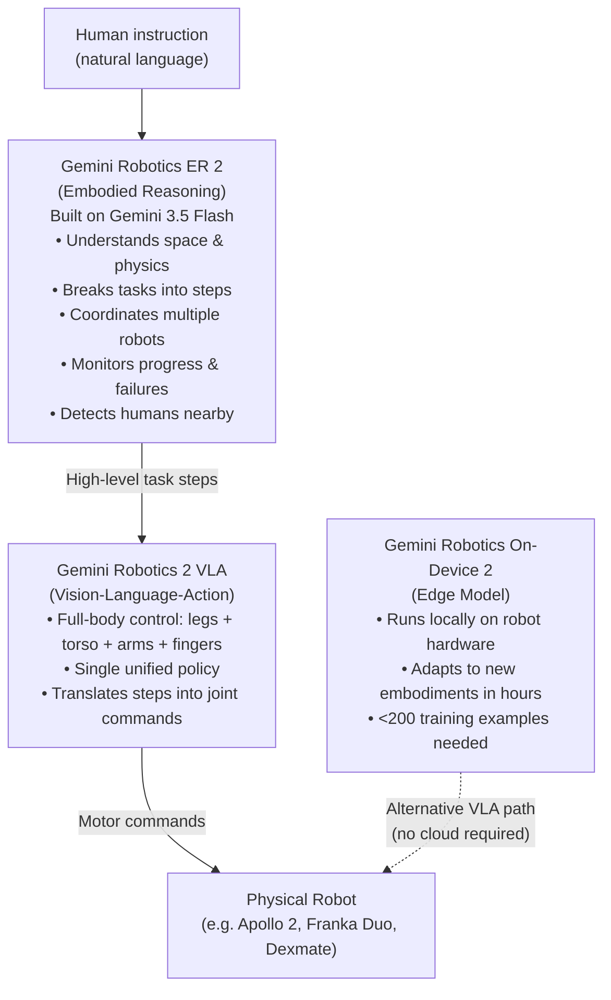

## The Problem With Robot Brains

Imagine trying to carry a heavy box across a room while someone is whispering directions in your ear in a language you only half understand. Each step requires you to balance your weight, adjust your grip, avoid obstacles, and keep the box level — all simultaneously. Now imagine that the part of your brain handling your legs has no idea what the part handling your arms is doing.

That, roughly, is the situation most advanced robots have been in.

Before July 30, 2026, Google DeepMind's Gemini Robotics family could do impressive things with a robot's upper body: sorting objects, assembling components, picking items off a shelf. But those tasks assumed the robot was already standing still in front of a table. The moment you needed the whole machine — walking across a room, bending down, crouching, then reaching up — you were back to patchwork: separate controllers for locomotion, separate ones for arm motion, and a coordination layer that struggled to keep them talking to each other.

Gemini Robotics 2 eliminates that division. It is the first release in the family to control an entire humanoid — legs, torso, arms, and multi-finger hands — under a **single learned policy**. The model sees a camera feed and a natural-language instruction, and outputs coordinated commands to every joint simultaneously.

---

## What Is a Vision-Language-Action Model?

Before getting into the specifics, it helps to understand the category of model involved.

A **Vision-Language-Action (VLA) model** is a neural network that takes in images and text as input and outputs motor commands — the low-level signals that tell a robot how to move each joint. Think of it as a direct line from perception and language understanding to physical action, with no separate planning script in between.

The earlier generation of robotics AI typically split this into stages: a vision model to identify objects, a language model to interpret instructions, a planner to sequence actions, and a low-level controller to turn those plans into motor commands. Each stage had to hand off to the next, and mistakes compounded across the pipeline.

VLA models collapse these stages. They train on massive datasets of robot demonstrations alongside natural language, learning to map what they see and what they're asked directly into the physical moves required. The trade-off is that the model needs far more training data — but the reward is a much smoother, more generalizable robot.

---

## Three Models, Three Jobs

Gemini Robotics 2 is not a single model but a suite of three, each targeting a different layer of the problem:

**Gemini Robotics 2 (the VLA)** is the core. It handles whole-body control — the low-level, real-time job of turning task steps into joint-by-joint motor commands while keeping the robot balanced and safe. The flagship demo ran on Apptronik's Apollo 2 humanoid: the robot walks to a watering can, grasps it, carries it across a room, and sets it down on a bottom shelf. Each moment of that sequence — walking, adjusting grip while moving, crouching to reach a low shelf — is handled by this one model, not by a committee of controllers.

**Gemini Robotics ER 2 (the Embodied Reasoner)** is the high-level brain, built on Gemini 3.5 Flash. It is a vision-language model (not action-generating, but reasoning-generating) that holds conversations with humans, breaks long multi-step tasks into executable steps, monitors progress as the VLA carries them out, and recovers when something goes wrong. Crucially, ER 2 also coordinates **multiple robots at once**, recognizing each machine's physical strengths and autonomously delegating sub-tasks. Two robots that can't individually reach a destination from one side can split the job — one fetches, one places.

**Gemini Robotics On-Device 2** is the edge-optimized version of the VLA. It runs entirely on the robot's own hardware, without needing cloud connectivity. Its most striking property is fast adaptation: given fewer than 200 demonstration examples, it can learn to control a completely new robot body — different shape, different sensors, different degrees of freedom — in a matter of hours. This is a direct result of Motion Transfer, a technique inherited from Gemini Robotics 1.5 that normalizes demonstrations across heterogeneous robot platforms into a shared representation, so the model doesn't have to start from scratch each time it meets new hardware.

---

## What the Numbers Look Like

Benchmark results from the July 30 launch give a concrete sense of where the capability sits today.

**Whole-body pick tasks on Apollo 2 (Inspire hands):**
- Shelf pick-up: 76.3% success
- Table pick-up: 68.4% success
- Floor pick-up: 45.7% success

Floor pick-ups are the hardest because they require the robot to crouch — coordinating leg, core, and arm simultaneously — while maintaining balance. Getting nearly half of them right with a single policy, on a task that requires full-body movement, is a meaningful step forward from "robot stands still and uses its arms."

**Fine motor dexterity (SharpaWave 22-DOF tactile hands):**
- Unscrewing a light bulb: 92%
- Tying a trash bag: 44%
- Screwing a bulb back in: 36%

Dexterous hand manipulation remains the hardest part of the problem. Tying a bag and screwing in a bulb require force sensing, subtle fingertip positioning, and physical reasoning that the model hasn't fully cracked. Google is transparent about this: ER 2 is not cleared for safety-critical applications like healthcare or transport.

**On-Device 2 adaptation (zero-shot to new hardware):**
- SO101 open-source arm: 6.7% (v1) → **53.3% (v2)**
- Dexmate platform: 24.4% (v1) → **75.6% (v2)**

Neither the SO101 nor the Dexmate appeared in On-Device 2's training data. The 8× improvement on SO101 and 3× improvement on Dexmate represent how much the model's ability to generalize to new hardware has grown in one generation.

---

## A New Safety Benchmark: ASIMOV-Agentic

Previous robotics evaluations measured how well a robot completes a task. ASIMOV-Agentic, introduced alongside this release, measures something different: how well the system **refuses** tasks it shouldn't attempt.

The benchmark evaluates four behaviors in the embodied reasoning layer:
1. Refusing tool calls from the VLA that would violate operational safety constraints
2. Detecting when a task is physically impossible before attempting it
3. Proactively requesting human intervention when uncertain
4. Pausing and safely stopping when a human enters the robot's workspace

On the human-proximity test, ER 2 demonstrated the ability to detect when a person approaches too closely, trigger a safety stop, and autonomously resume only once the area is clear. For environments like warehouses and factories where humans and robots share space, this is a precondition for real deployment — not just a nice feature.

---

## Why "One Policy" Matters So Much

To understand why unifying control under a single policy is significant, consider the alternative.

Traditional humanoid control stacks separate the robot into domains: a locomotion controller for the legs, a manipulation planner for the arms, and sometimes a third layer for the hands. Each controller is tuned for its own domain, and they communicate through carefully designed interfaces. When a task requires them to work together — like walking toward something and preparing to grab it at the same time — the interfaces between them become a source of failure. The robot pauses before reaching. It stops walking before it starts grasping. The movements look robotic precisely because they're modular.

A single learned policy, trained end-to-end on whole-body demonstrations, develops an implicit understanding of these couplings. Reaching forward while walking shifts the robot's center of mass — the policy learns to compensate with leg and torso adjustments before the arm even arrives at its target. It's not that the model reasons about this explicitly; it learns to do it from experience, the same way a human learns to carry a heavy bag without consciously calculating the physics.

This is why the Apollo 2 watering-can demo was chosen as the flagship: it is specifically a task that requires locomotion and manipulation to cooperate, not take turns.

---

## The Industry Implication: Who Builds the Brain?

Google's strategic position here is deliberate. DeepMind is not building its own robots. Apptronik builds Apollo. Franka Robotics builds Duo. The Dexmate and SO101 are third-party platforms. Google's bet is that Gemini Robotics becomes **the intelligence layer inside hardware that others manufacture** — the same play it made with Android in mobile.

This puts pressure on physical-AI startups that have been building their own model stacks to run on humanoid platforms. If a general-purpose model from DeepMind can adapt to new hardware in hours with 200 examples, the moat around specialized proprietary VLAs narrows considerably.

The Apptronik Robot Park is the data pipeline that makes this sustainable: Apollo 2 units collecting real-world interaction data at scale, feeding training runs that improve the next version of the model. More data → better generalization → more robots willing to use Gemini Robotics → more data.

---

## What Comes Next

Fine-motor dexterity is the clear frontier. Tying a bag at 44% and re-screwing a bulb at 36% are honest numbers for hard tasks, but they also mark the ceiling of what's reliably deployable today. The research community's focus on high-DOF tactile sensing — SharpaWave's 22-degree-of-freedom hands are an example of this direction — suggests that the next generation of results will hinge on better hardware-model co-design as much as pure algorithmic improvement.

Multi-robot coordination via ER 2 is the feature most immediately useful for production environments. A fleet of robots that can divide and adapt to shared tasks without human re-programming addresses one of the hardest logistics problems in warehouse automation today.

The edge of what's possible in physical AI is moving fast. Gemini Robotics 2 doesn't solve humanoid robotics — the floor pick-up numbers alone make that clear — but it establishes a new floor for what a general-purpose foundation model can do when it meets a physical body.

---

## Sources

- [Gemini Robotics 2 brings whole body intelligence to robots — Google DeepMind](https://deepmind.google/blog/gemini-robotics-2-brings-whole-body-intelligence-to-robots/)
- [Google DeepMind Ships Three Physical AI Models For Whole Body Control, Dexterity And Multi Robot Collaboration — MarkTechPost](https://www.marktechpost.com/2026/07/30/google-deepmind-gemini-robotics-2-whole-body-control-dexterity-multi-robot-collaboration/)
- [Google DeepMind unveils Gemini Robotics 2 as Apptronik humanoid demonstrates whole-body AI — Robotics & Automation News](https://roboticsandautomationnews.com/2026/07/31/google-deepmind-unveils-gemini-robotics-2-as-apptronik-humanoid-demonstrates-whole-body-ai/103802/)
- [Google Ships Gemini Robotics ER 2 With Multi-Robot Teamwork — Unite.AI](https://www.unite.ai/google-ships-gemini-robotics-er-2-with-multi-robot-teamwork/)
- [Gemini Robotics 2 Controls Full Humanoids: Legs, Torso, Arms, and Fingers Under One Policy — TechTimes](https://www.techtimes.com/articles/322309/20260730/gemini-robotics-2-controls-full-humanoids-legs-torso-arms-fingers-under-one-policy.htm)
- [Google DeepMind Launches Gemini Robotics 2 With Full Humanoid Body Control — MLQ News](https://mlq.ai/news/google-deepmind-launches-gemini-robotics-2-with-full-humanoid-body-control/)
- [Gemini Robotics: Bringing AI into the Physical World — arXiv (original paper)](https://arxiv.org/abs/2503.20020)
- [Gemini Robotics 1.5: Pushing the Frontier of Generalist Robots with Advanced Embodied Reasoning, Thinking, and Motion Transfer — arXiv](https://arxiv.org/pdf/2510.03342)
- [Google Unveils Gemini Robotics 2, Tackling the 'Whole-Body Intelligence' Challenge in Robotics — BigGo Finance](https://finance.biggo.com/news/47ed3d13-c3f4-411e-8b74-a057ceca3682)
- [Industry Insights: Google DeepMind Brings Gemini Robotics to Humanoids — Association for Advancing Automation](https://www.automate.org/ai/industry-insights/google-deepmind-announces-gemini-robotics-2-new-safety-measures-for-humanoids/aph)
