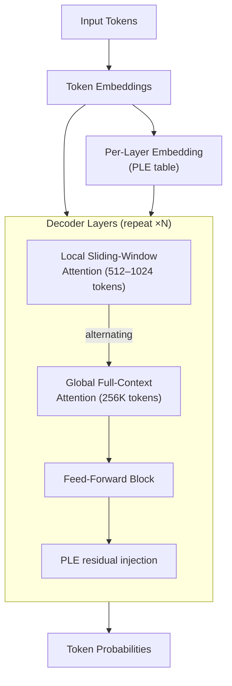
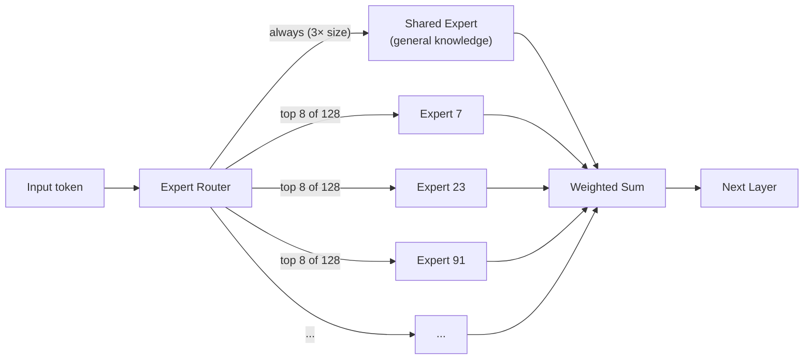

## The Model That Shouldn't Exist

If you had asked a betting person two years ago whether a fully open, commercially permissive, locally runnable AI model would score **89.2% on a graduate-level math competition** and reach **expert competitive programmer** level on Codeforces, they would have told you to wait for the next GPT.

Then Google DeepMind released Gemma 4 on April 2, 2026.

The headline number is that the 31-billion-parameter dense model now ranks **#3 among all open models** on the Arena AI text leaderboard — above models with hundreds of billions of parameters. The 26-billion-parameter variant, which costs no more to run than a 4-billion-parameter model, sits at #6.

This is not a typical capability jump. It is a demonstration that the rules of how model size relates to model quality are being rewritten.

---

## What Is Gemma 4?

Gemma 4 is a family of four open-weight models built directly from the same research that powers Google's flagship Gemini 3 family. Unlike many "open" releases, it ships under the **Apache 2.0 license** — no acceptable-use restrictions, no monthly-user caps, no royalties, and full freedom to modify, redistribute, and commercialize.

The family has four members:

| Model | Total Params | Active Params | Context | Hardware (4-bit) |
|-------|-------------|---------------|---------|-----------------|
| E2B | 2B | 2B | 128K | ~5 GB RAM |
| E4B | 4B | 4B | 128K | ~5 GB RAM |
| 26B MoE | 26B | **3.8B** | 256K | ~18 GB RAM |
| 31B Dense | 31B | 31B | 256K | ~20 GB RAM |

The E2B and E4B ("Effective 2B/4B") are designed for **phones and edge devices** — they add native audio input on top of vision and text. The 26B and 31B target developer workstations and cloud instances. All four models are multimodal, support 140+ languages, and natively handle function-calling for agentic workflows.

---

## The Engineering Behind the Efficiency

The benchmarks are only surprising until you look at what Google actually changed under the hood. Gemma 4 packs four architectural innovations that collectively produce frontier intelligence in a fraction of the usual parameter budget.

### 1. Hybrid Attention: Thinking Locally, Acting Globally

Standard transformer attention is expensive. Every token attends to every other token — quadratic cost as sequence length grows. Gemma 4 uses **alternating local and global attention layers**.

Most layers use a *sliding-window* attention pattern that only looks at the nearest 512–1024 tokens. A smaller set of layers use full global attention across the entire context. This cuts memory and compute dramatically while preserving the model's ability to reason over long documents and code files up to 256K tokens.



### 2. Per-Layer Embeddings (PLE)

Traditional models learn one embedding per vocabulary token and reuse it across all layers. Gemma 4 adds a **second, smaller embedding table** that injects a lightweight conditioning signal into every decoder layer independently.

Think of it as a "tone of voice" knob at each layer. The PLE vector encodes both the identity of the current token and a context-aware component, giving each layer extra information about what kind of representation it should produce. The result is better calibration without a proportional increase in compute.

### 3. Mixture of Experts (MoE) — With a Twist

The 26B variant uses a **Mixture of Experts** architecture. Instead of routing all computation through one dense feed-forward network per token, the model has **128 specialist sub-networks** ("experts"). For each token, a learned router activates only 8 of them.

But Gemma 4 adds one non-obvious detail: a **shared expert** that is always activated, and is **three times the size** of the specialized experts. This shared expert captures general world knowledge that every token needs regardless of topic. The specialist experts handle domain-specific patterns on top of that foundation.



The practical effect: a 26B-parameter model that costs about as much to run as a 4B model during inference, because only 3.8B parameters fire per token.

### 4. Shared KV-Cache

The final layer group doesn't compute its own key-value projections — it reuses the K and V tensors from the last layer that did. This eliminates redundant computation in the attention mechanism and reduces the memory footprint of the KV cache at inference time, which matters enormously when you're serving long-context requests.

---

## What Gemma 4 Can Do

### Reasoning: Competition-Grade Math

The 31B model scores **89.2% on AIME 2026** — a benchmark based on the American Invitational Mathematics Examination, one of the hardest standardized math competitions in the world. That's a score that would place most humans in the top percentile.

This comes from a **thinking mode**: the model can emit an internal chain-of-thought up to 4,000+ tokens before producing its final answer. It breaks down problems, tries approaches, checks its work, and backtracks when something doesn't add up. This thinking is configurable — you can turn it on for hard problems and off for speed.

### Coding: Expert Competitive Programmer

Gemma 4's Codeforces ELO jumped from **110 to 2150** between Gemma 3 and Gemma 4. ELO 2150 is solidly in the "expert" tier on Codeforces, above more than 99% of registered competitive programmers. On LiveCodeBench v6, it scores 80.0%. On MMLU Pro it reaches 85.2%.

For context: GPT-4 scored 86.5% on MMLU when it was released and was considered a landmark. Gemma 4 31B hits 87.1%.

### Vision, Video, and Audio

All Gemma 4 models natively process **images and video** at variable resolutions (configurable token budgets of 70 to 1,120 visual tokens). Tasks include:

- Document and PDF parsing
- Chart and graph understanding
- OCR, including handwriting and multilingual scripts
- Screen and UI understanding
- Object detection and pointing

The two smallest models — E2B and E4B — also add **native audio input** for speech recognition and understanding. This makes them genuinely end-to-end multimodal for on-device use cases.

### Agents and Tool Use

Gemma 4 has native support for structured function-calling and JSON output, which is the foundation of tool-using agents. Combined with a 256K context window and the thinking mode, it can sustain complex multi-step workflows — reading long documents, calling APIs, reasoning about the results, and producing structured outputs — without needing a wrapper to manage state.

---

## Running It Yourself

Getting Gemma 4 running locally is straightforward on most modern hardware:

```bash
# Via Ollama (simplest path)
ollama pull gemma4:27b    # MoE variant, runs on most gaming GPUs
ollama run gemma4:27b

# Via llama.cpp (GGUF quantized weights from Hugging Face)
./llama-cli -m gemma-4-31B-Q4_K_M.gguf -c 8192 -n 512 -p "Your prompt here"

# Via Python (transformers)
from transformers import pipeline
pipe = pipeline("text-generation", model="google/gemma-4-31B-it", device_map="auto")
```

For the 26B MoE model, an NVIDIA RTX 4090 (24 GB VRAM) handles it comfortably in 4-bit quantization. The E2B and E4B variants run on phones with modern NPUs or laptops with integrated graphics.

---

## Apache 2.0: Why the License Is the Real Story

Previous Gemma generations shipped under a custom license that imposed restrictions on commercial use at scale. Gemma 4 drops that entirely for **Apache 2.0** — the same license used by TensorFlow, Kubernetes, and most of the web's foundational infrastructure.

This is not a minor legal detail. It means:

- Companies can fine-tune and ship Gemma 4 in products without negotiating terms with Google.
- Researchers can modify and republish weights without asking permission.
- Startups can build on it with the same freedom they'd have with any open-source library.

The community has responded. In the first week after launch, the base Gemma 4 models hit **10 million downloads**. Within a month, over **1,000 community-built variants** had appeared — quantizations, fine-tunes, domain-specific adapters. The broader Gemma family, across all generations, has now crossed **400 million total downloads**.

For comparison, it took GPT-2 over a year to reach similar community adoption metrics.

---

## The Bigger Picture: Efficiency Becomes the New Arms Race

Gemma 4 is part of a pattern that started becoming clear in late 2025 and has accelerated through 2026: **the efficiency of open models is catching up to proprietary ones faster than anyone expected**.

The old mental model was: closed models lead by one to two years, open models follow. The gap was compute — you needed billion-dollar clusters to train frontier models, and only a handful of companies had them.

What's changed is the algorithmic side. Mixture of Experts, per-layer conditioning, hybrid attention, shared KV caches — these are not hardware breakthroughs. They are software innovations that make each FLOP of training and inference count for more. And those innovations diffuse quickly through the research literature.

The result is that Gemma 4's 31B parameter model — a model you can run on a single consumer GPU — posts numbers that were frontier-only 18 months ago. That gap will keep compressing.

For developers, researchers, and companies trying to decide between hosted APIs and local inference, Gemma 4 makes the local case significantly stronger. For the field as a whole, it's evidence that frontier-quality reasoning is becoming infrastructure — available, modifiable, and free.

---

## Sources

- [Gemma 4: Byte for byte, the most capable open models — Google Blog](https://blog.google/innovation-and-ai/technology/developers-tools/gemma-4/)
- [Welcome Gemma 4: Frontier multimodal intelligence on device — Hugging Face Blog](https://huggingface.co/blog/gemma4)
- [Gemma 4 — Google DeepMind](https://deepmind.google/models/gemma/gemma-4/)
- [Gemma 4 model overview — Google AI for Developers](https://ai.google.dev/gemma/docs/core)
- [Bring state-of-the-art agentic skills to the edge with Gemma 4 — Google Developers Blog](https://developers.googleblog.com/bring-state-of-the-art-agentic-skills-to-the-edge-with-gemma-4/)
- [Bringing AI Closer to the Edge and On-Device with Gemma 4 — NVIDIA Technical Blog](https://developer.nvidia.com/blog/bringing-ai-closer-to-the-edge-and-on-device-with-gemma-4/)
- [A Visual Guide to Gemma 4 — Maarten Grootendorst](https://newsletter.maartengrootendorst.com/p/a-visual-guide-to-gemma-4)
- [Gemma 4 vs Qwen 3.5 vs Llama 4: Updated Benchmarks — ai.rs](https://ai.rs/ai-developer/gemma-4-vs-qwen-3-5-vs-llama-4-compared)
- [Gemma 4 31B vs GPT-5: Model Comparison — Artificial Analysis](https://artificialanalysis.ai/models/comparisons/gemma-4-31b-vs-gpt-5)
- [Google Gemma 4: Apache-2.0 Open AI, 89.2% on AIME 2026 — Nerd Level Tech](https://nerdleveltech.com/google-gemma-4-open-model-guide-benchmarks-local-deployment)
