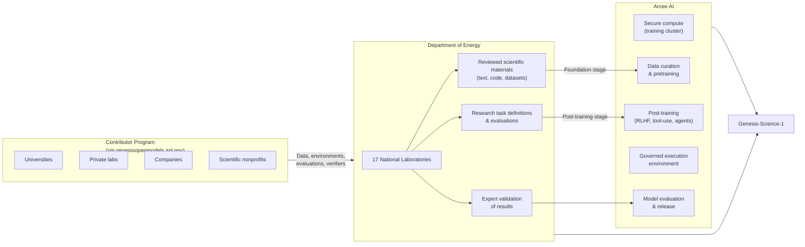

## The Problem Science Can't Afford to Ignore

Science runs on reproducibility. The whole point of a published result is that another researcher, with the same data and the same method, can run the same experiment and get the same answer. That principle is what separates science from opinion.

AI is now threatening to break it.

In the last two years, large language models have become ubiquitous in research workflows. They draft literature reviews, write analysis code, summarize datasets, and — increasingly — autonomously design and execute experiments. The speed-up is real. But AI systems are also opaque. If an LLM wrote part of your method section, or a model decided which simulation parameters to use, can another researcher reproduce your result? Often the answer is: probably not, because no one captured what the model actually did.

This is the problem that **Genesis-Science-1 (GS1)** is built to solve.

---

## What Is Genesis-Science-1?

On July 23, 2026, Arcee AI and the US Department of Energy jointly announced Genesis-Science-1 — an American open-weight AI model built from the ground up for scientific research workflows. GS1 is designed as a **trillion-parameter-class** model, placing it in the same scale bracket as the largest proprietary frontier models, but with two unusual commitments: it will be fully open-weight under a permissive license, and it will ship with a *governed research harness* that records every step of its reasoning in a form another researcher can inspect and re-run.

The announcement landed under the umbrella of the **Genesis Mission**, a $5 billion national initiative that President Trump launched by Executive Order in November 2025. The Genesis Mission mobilizes all 17 of the Department of Energy's national laboratories — Argonne, Oak Ridge, Lawrence Berkeley, Los Alamos, and the rest — alongside academia and private industry, to build what DOE describes as "the world's most powerful scientific platform." The vision connects the US's most capable supercomputers, AI systems, and quantum processors into a single integrated discovery machine.

GS1 is the AI layer inside that machine.

---

## The Governed Research Harness: AI That Shows Its Work

The term "governed research harness" sounds bureaucratic. What it means in practice is more interesting.

Standard AI models — even very good ones — are black boxes when it comes to scientific work. You prompt the model, it produces an output, and unless you've been careful to log every step, that output is essentially provenance-free. You know what it said; you don't know *how* it got there.

A governed research harness changes that by making provenance intrinsic to the computation, not an afterthought. Every time GS1 executes a step in a scientific workflow — fetching data, running a simulation, interpreting results, deciding to change approach — that action is recorded in a structured audit log. The log captures:

- What the model was asked to do
- What data it accessed, and which version
- What tools or code it invoked, and with what parameters
- What intermediate outputs it produced
- Why it revised its approach when evidence changed

The standard Arcee has set publicly is blunt: a successful GS1 run must carry a workflow from plan through report, revise its approach when evidence changes, recover from tool failures, and **leave a record that another researcher can inspect** — with scientific experts judging whether the result is sound and whether the supporting evidence is complete enough to reproduce.

Think of it as the difference between a lab notebook and a post-hoc description of what you remember doing. The harness generates the notebook automatically, in real time, as the model works.

```mermaid
flowchart TD
    Request["Research Workflow Request\n(natural language)"] --> GS1["Genesis-Science-1\n(Trillion-Parameter Model)"]

    subgraph Governed Harness
        direction TB
        Plan["Plan workflow steps"]
        Fetch["Fetch / access data\n(versioned)"]
        Exec["Execute code / simulations\n(captured parameters)"]
        Interpret["Interpret results"]
        Revise{"Evidence\nchanged?"}
        Report["Generate report"]

        Plan --> Fetch
        Fetch --> Exec
        Exec --> Interpret
        Interpret --> Revise
        Revise -->|Yes| Plan
        Revise -->|No| Report
    end

    GS1 --> Governed Harness

    subgraph Audit Log
        direction LR
        AL1["Data provenance records"]
        AL2["Tool call logs\n(params + versions)"]
        AL3["Decision rationale"]
        AL4["Intermediate outputs"]
    end

    Governed Harness --> Audit Log

    Report --> Researcher["Researcher gets:\n• Result\n• Complete reproducible record"]
    Audit Log --> Researcher
```

---

## Who Does What: The DOE–Arcee Partnership

GS1 is not a DOE model that happens to be built by Arcee, nor an Arcee model that DOE is licensing. It is a genuine division of labor where each party contributes what it actually has.



DOE's 17 national labs supply the scientific content: peer-reviewed texts, simulation codes, experimental datasets, domain-specific task definitions, and evaluation rubrics designed by experts who actually work on the problems the model will tackle. Arcee's role is the engineering work: securing and managing the compute, curating the training data, running the model through pretraining and post-training, building the governed harness itself, and finally releasing the weights.

On August 7, 2026, DOE opened the **Genesis Open Models Initiative** at Argonne National Laboratory, inviting universities, companies, research organizations, and scientific nonprofits to contribute to the program — supplying training data, workflow environments, held-out evaluations, and scoring rubrics. The first contribution window closed August 14.

---

## Who Is Arcee AI?

Arcee is an unusual company to be at the center of a $5 billion national mission. The San Francisco startup employs about 30 people, has raised roughly $50 million in total — a $24 million Series A from Emergence Capital — and operates with what CTO Lucas Atkins calls "engineering through constraint."

Despite the small headcount, Arcee already has a credible track record in open-weight frontier models. In April 2026, the company released **Trinity Large Thinking**, a 399-billion-parameter reasoning model under the Apache 2.0 license. Trinity is a sparse Mixture-of-Experts architecture: while the model has 399B total parameters, only about 13 billion fire for any given token — which keeps inference cost manageable even at frontier scale.

To build Trinity, Arcee committed $20 million — nearly half its total funding — to a single 33-day training run on a 2,048-GPU cluster of NVIDIA B300 Blackwell chips. That's a company betting its future on one run.

The GS1 project represents a different kind of bet: that a lean team with strong model-building expertise is exactly what you need when the goal is a tightly scoped, scientifically governed model — not a general-purpose assistant optimized to pass every public leaderboard.

---

## What GS1 Will Actually Do

The initial application areas for GS1 are firmly in the domain of hard, structured scientific work:

**HPC code modernization** — The DOE's national labs run enormous codebases, some decades old, written in Fortran and C for architectures that no longer exist. Modernizing that code for GPU-accelerated supercomputers is an unglamorous but critical bottleneck. GS1 is being trained specifically on the kind of scientific Fortran, C++, and CUDA that appears nowhere in typical web-crawl training data.

**Experimental analysis** — Given raw instrument data from, say, a particle detector or a materials characterization tool, GS1 should be able to design and run a statistically appropriate analysis pipeline and document every decision.

**Simulation campaigns** — Running parameter sweeps on climate models, fusion plasma simulators, or protein folding codes requires methodical planning, monitoring for anomalies, and interpretation of outputs. GS1 is intended to manage this end-to-end.

**Materials science** — DOE labs are central to the search for new materials for batteries, superconductors, and catalysts. Iterating on hypotheses, literature searches, and experimental designs are high-value targets for an agentic AI system.

**Energy systems** — Grid modeling, nuclear reactor design, and carbon capture process optimization all involve complex multi-physics simulations where the bottleneck is often human bandwidth to set up and interpret runs.

What unites these tasks is that they are not one-shot queries. They require multi-step reasoning, tool use, revision under new evidence, and, above all, a complete record of what happened so that results can be trusted and reproduced.

---

## Why This Is Different from General-Purpose AI on Science

Researchers already use GPT-5, Claude, and Gemini for scientific work, and those models are genuinely useful. So what makes GS1 different?

Three things:

**Training data quality**: General-purpose frontier models are trained on broad web text, which includes scientific content but not the specialized simulation codes, experimental protocols, and domain-specific datasets that DOE researchers actually work with. GS1's training data is being curated specifically from DOE laboratory materials, reviewed by scientists who do the work.

**Open weights**: Proprietary models cannot be audited, fine-tuned for a specific domain, or run air-gapped on classified or sensitive infrastructure. An open-weight model can. For national laboratory work, that matters enormously.

**The harness**: No existing frontier model ships with a built-in governed execution environment that captures provenance at the tool-call level. That has to be built as an application layer on top, inconsistently, by whoever needs it. GS1 bakes it in.

The closest analogy is the difference between a general-purpose cloud database and a medical records system with built-in audit logging. Both store data. Only one is suitable for environments where you can be asked to prove, years later, exactly what happened and why.

---

## The Bigger Picture

GS1 sits at the intersection of several important currents in AI policy and research.

The US government's move into open-weight AI for science comes at a moment when open-source models are under intense regulatory scrutiny — Washington is actively debating whether to restrict open-weight models developed by Chinese labs. The DOE's decision to build and release an open-weight model under a permissive license is, in part, a statement: openness is the US approach, not a vulnerability.

For the scientific community, GS1 is also an early concrete response to the reproducibility problem that AI is creating. The field of computational reproducibility research has been developing frameworks like AI Research Objects (AI-ROs) and AI Bills of Materials (AIBOMs) — structured ways to document what an AI system did during a computation. GS1 operationalizes those ideas at model-level rather than leaving them as guidelines for individual labs to implement unevenly.

If GS1 works as designed, it could set a template: not just for government science, but for any field where the question "can you reproduce this?" actually matters.

---

## Sources

- [Arcee AI announces Genesis-Science-1 partnership with DOE — Arcee.ai on X](https://x.com/arcee_ai/status/2079939419264418186)
- [Trump Administration Announces More Than $5 Billion for the Genesis Mission — The White House](https://www.whitehouse.gov/releases/2026/07/45502/)
- [Energy Department Launches 'Genesis Mission' — Department of Energy](https://www.energy.gov/articles/energy-department-launches-genesis-mission-transform-american-science-and-innovation)
- [U.S. Department of Energy Launches the Genesis Open Models Initiative — Department of Energy](https://www.energy.gov/undersecretaryforscience/articles/us-department-energy-launches-genesis-open-models-initiative)
- [Genesis Open Models — Argonne National Laboratory portal](https://genesisopenmodels.anl.gov/)
- [Arcee AI Releases Trinity Large Thinking — MarkTechPost](https://www.marktechpost.com/2026/04/02/arcee-ai-releases-trinity-large-thinking-an-apache-2-0-open-reasoning-model-for-long-horizon-agents-and-tool-use/)
- [Arcee's new, open source Trinity-Large-Thinking — VentureBeat](https://venturebeat.com/technology/arcees-new-open-source-trinity-large-thinking-is-the-rare-powerful-u-s-made)
- [Arcee AI Announce Genesis-Science-1 — The Manila Times (GlobeNewswire)](https://www.manilatimes.net/2026/07/23/tmt-newswire/globenewswire/arcee-ai-announce-genesis-science-1-an-open-weight-model-for-scientific-research/2390244)
- [DOE Genesis Open Models: Government Enters Open-Weight AI — explainx.ai](https://explainx.ai/blog/doe-genesis-open-models-arcee-trinity-science-ai-august-2026)
- [Inspectable AI for Science: A Research Object Approach to Generative AI Governance — arXiv](https://arxiv.org/html/2604.11261v1)
- [Computational Provenance and Adversarial Reproducibility in AI-Driven Scientific Research — Medium](https://medium.com/@y.marutani/computational-provenance-and-adversarial-reproducibility-in-ai-driven-scientific-research-3dd396e410f9)
