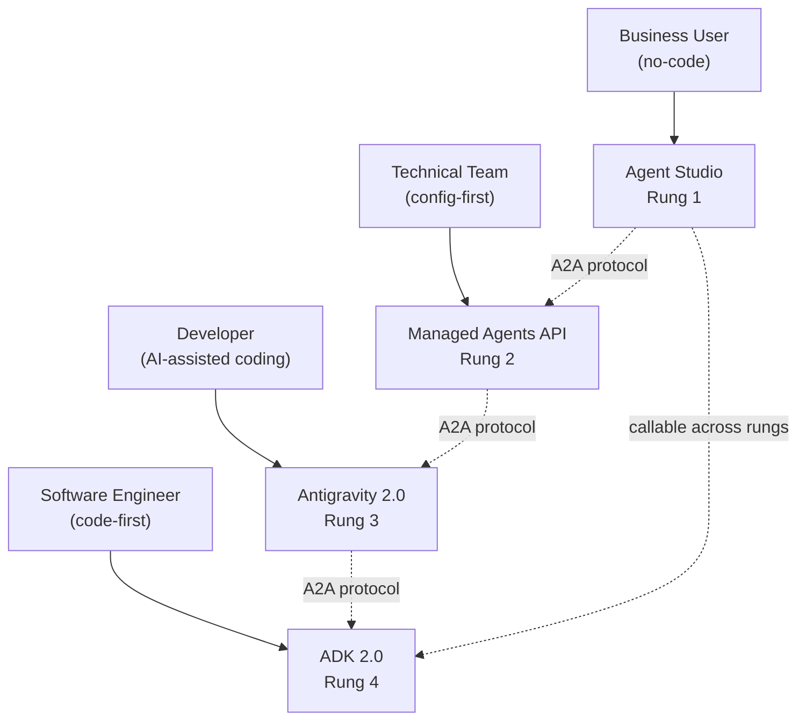
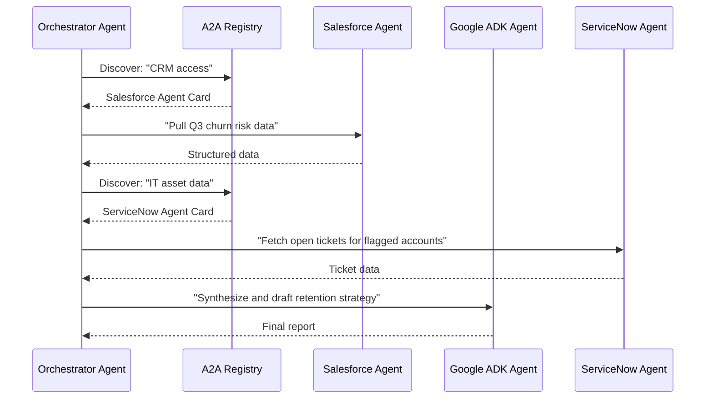

## The 500-Line Problem

Before Google I/O 2026, building an AI agent that could actually *do something* — run code, browse files, call APIs, remember context across sessions — required assembling a small mountain of infrastructure. You needed a language model integration, a tool-calling schema, a sandbox to run code safely, retry logic for flaky tool calls, state persistence between turns, credential handling that didn't leak secrets to the model, and a deployment pipeline to host all of it.

Ambitious teams built it from scratch and spent weeks hardening it for production. Smaller teams picked one of several opinionated frameworks and accepted the tradeoffs that came with it. Neither path felt right. Neither was something you'd want to stake a product on without significant engineering investment.

On May 19, 2026, Google announced it was taking over most of that work.

---

## What Google Announced

At its I/O developer conference in Mountain View, Google described the shift as the beginning of the "agentic Gemini era." The headline announcement was **Managed Agents** in the Gemini API — a hosted agent runtime that you configure with a few markdown files and invoke with a single API call. It landed alongside three other tightly related launches:

- **Antigravity 2.0**: Google's AI coding agent, upgraded with a new multi-agent architecture and a standalone desktop app.
- **ADK 2.0**: The Agent Development Kit, reaching general availability with support for complex agent meshes and dynamic workflows.
- **A2A protocol upgrade**: An open standard for agents on *different* platforms to discover and collaborate with each other.

Together they form what Google is calling a four-rung developer stack for building agentic software — from business users who want no code to software engineers who want full control.

---

## What Is a Managed Agent?

An analogy helps. Imagine you need to hire a very capable contractor. In the traditional model, you have to build them a workspace: acquire equipment, configure accounts, install tools, write the onboarding manual, handle payroll. Only then do they start working on the actual job.

Managed Agents flips this. You write the job description. Google provides the fully equipped worker.

Technically, when you call the Managed Agents API, Google provisions:

- A **reasoning loop** powered by Gemini 3.5 Flash — the model Google simultaneously announced as its strongest agentic release yet
- An **isolated, ephemeral Linux sandbox** where the agent executes code and uses tools
- **Persistent state** that survives across sessions (up to 7 days of inactivity, then cleaned up)
- **Enterprise-grade security**: encrypted credentials, Data Loss Prevention policies, and strictly isolated per-task virtual machines where no data overlaps between sessions

You define the agent's behavior in two plain-text markdown files: `AGENTS.md` sets baseline instructions that get prepended to every prompt, and `SKILL.md` files declare specific capabilities the agent can invoke. To invoke the agent you use a second API, the **Interactions API**. Everything else — infrastructure provisioning, security policy enforcement, scaling — is Google's problem.

---

## A Stack for Every Developer

One of the more deliberate design choices at I/O 2026 was how explicitly Google built a tiered stack — four rungs that share the same underlying model and interoperability protocol but serve radically different users:

| Rung | Tool | Who It's For |
|------|------|--------------|
| 1 | **Agent Studio** | Business teams, visual no-code builder |
| 2 | **Managed Agents API** | Technical teams, config-first hosted service |
| 3 | **Antigravity 2.0** | Development teams, AI-assisted coding |
| 4 | **ADK 2.0** | Software engineers, code-first custom architectures |

The crucial property: an agent built on rung 1 can be called as a sub-agent from rung 4, and vice versa. This is possible because every rung speaks the same interoperability protocol — which we'll get to shortly.

---

## Antigravity 2.0: Beyond the Single Agent

**Antigravity 2.0** is Google's answer to the growing category of coding agents. It was previously available as an experimental tool; at I/O it shipped as a fully supported product with three deployment modes:

- **Desktop App**: A visual orchestration workspace where multiple agents run in parallel. You can have one agent refactoring a module, another generating tests, and a third writing database migration scripts — simultaneously, with progress tracked in one interface.
- **CLI**: The same underlying agent harness in your terminal. It shares authentication, context, and skill definitions with the desktop app, so switching between the two doesn't require reconfiguring anything.
- **SDK**: An embeddable version for teams that want the Antigravity harness inside their own infrastructure, rather than calling out to Google's cloud.

Internally, Antigravity uses a **multi-agent architecture**: a manager agent analyzes the task and decomposes it into subtasks, specialized sub-agents execute those subtasks in parallel, and a verification pass catches errors before the result surfaces to you. This pipeline is why it handles complex multi-file refactors that single-agent coding tools struggle to complete coherently.

Early enterprise results are notable: AirAsia Next reported that more than 50% of its production-ready code is now generated through Antigravity-based workflows. Deloitte described it as enabling "governed, autonomous software engineering at enterprise scale."

---

## A2A: The Protocol That Makes Agents Interoperate

The most underappreciated announcement at I/O 2026 may be the upgrade to the **Agent2Agent (A2A) protocol** — an open standard, recently contributed to the Linux Foundation, that defines how AI agents built on entirely different platforms can discover and work with each other.

Think of A2A as HTTP for agents. Just as any browser can talk to any web server because both speak HTTP, any A2A-compliant agent can hand off tasks to any other A2A agent — regardless of whether it was built with Google ADK, Anthropic's frameworks, LangChain, or a proprietary enterprise stack.

The protocol works through **Agent Cards**: structured declarations that an agent publishes to describe its capabilities. When an orchestrator agent needs to delegate a subtask, it queries the registry for a relevant Agent Card, negotiates a communication format (plain text, structured JSON, or streaming), and routes the work.

More than 150 organizations are already committed to A2A support, including Adobe, ServiceNow, Twilio, and S&P Global. The practical implication: an enterprise that builds on Google's infrastructure can, in principle, coordinate with agents running in entirely different vendor stacks — without either side needing to understand the other's internal implementation.

---

## The Model Underneath: Gemini 3.5 Flash

Every rung of the stack defaults to **Gemini 3.5 Flash**, released the same day. The benchmark scores that matter for agents — not the academic trivia tests but the ones that measure real-world task execution — are strong:

- **Terminal-Bench 2.1**: 76.2% (real terminal navigation)
- **MCP Atlas**: 83.6% (tool-use proficiency)
- **GDPval-AA**: 1656 Elo (agentic planning and execution)
- **CharXiv**: 84.2% (multimodal chart and document reasoning)

Google claims it runs at less than half the cost of comparable frontier models and four times faster than Gemini 3.1 Pro. For agents that make dozens of model calls per task, cost-per-call matters in a way it doesn't for single-question chatbots.

---

## The Consumer Layer: Gemini Spark

For users who don't want to build anything, **Gemini Spark** is the consumer-facing embodiment of the same stack — a 24/7 personal AI agent built into the Gemini app. It runs on dedicated virtual machines in Google Cloud so it keeps working after you close the tab, taking on delegated tasks in the background: preparing meeting briefs, monitoring for flagged conditions, running multi-step research, drafting communications for your review.

Explicit approval is required for high-risk actions like sending emails or authorizing payments, which is the right call for trust-building at this stage. Later this summer, Spark is planned to gain a browser mode that lets it act as an agentic layer directly inside Chrome.

Early access is rolling out to Google AI Ultra subscribers in the US.

---

## The Bigger Picture

The shift at I/O 2026 is not primarily about any single model or product announcement. It's about **where the infrastructure layer sits**.

When developers had to build agent runtimes from scratch, the barrier was high enough that only well-resourced engineering teams could ship production agents. Managed Agents, Antigravity 2.0, ADK 2.0, and A2A together substantially lower that barrier. A small team with a config file and an API key can now field a production agent that runs continuously, uses tools securely, interoperates with agents across vendor boundaries, and scales without dedicated infrastructure engineers.

Whether Google's four-rung stack wins the developer mindshare battle against Anthropic's Claude Code and OpenAI's Agents SDK depends on two things: how broadly A2A gets adopted as an actual standard (not just a Google-controlled protocol), and how the runtime cost and cloud lock-in tradeoffs land for teams weighing self-hosted alternatives.

But the direction is clear. As of May 19, 2026, agentic AI is no longer a research preview. It's infrastructure — and the fight is now about who gets to own that layer.

---

## Sources

- [I/O '26 news for agent developers on Google Cloud — Google Cloud Blog](https://cloud.google.com/blog/topics/developers-practitioners/io26-news-for-agent-developers-on-google-cloud)
- [Innovations from Google I/O 26 on Google Cloud — Google Cloud Blog](https://cloud.google.com/blog/products/ai-machine-learning/innovations-from-google-io-26-on-google-cloud)
- [Introducing Managed Agents in the Gemini API — Google Blog](https://blog.google/innovation-and-ai/technology/developers-tools/managed-agents-gemini-api/)
- [I/O 2026: Welcome to the agentic Gemini era — Google Blog (Sundar Pichai)](https://blog.google/innovation-and-ai/sundar-pichai-io-2026/)
- [Agent2Agent protocol is getting an upgrade — Google Cloud Blog](https://cloud.google.com/blog/products/ai-machine-learning/agent2agent-protocol-is-getting-an-upgrade)
- [A2A: Agent2Agent open protocol repository — GitHub / a2aproject](https://github.com/a2aproject/A2A)
