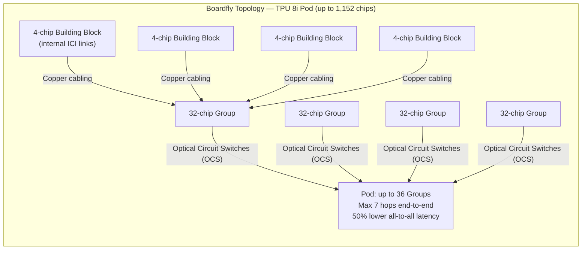
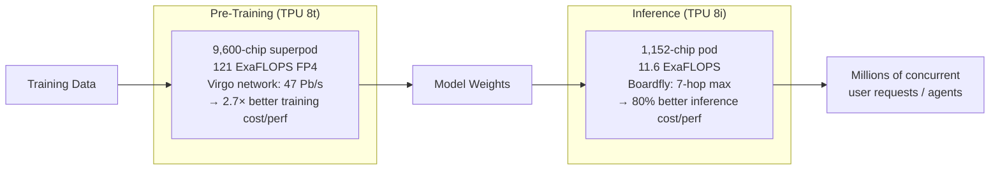

## One Problem, Two Very Different Jobs

For most of Google's TPU history, the same chip design had to do two fundamentally different things. Training — the process of running billions of gradient updates across trillion-parameter models — is a marathon: sustained throughput matters above almost everything else. Inference — serving a model's responses to millions of simultaneous users — is a sprint: latency, concurrency, and cost-per-token drive the design.

Squeezing optimal performance from both workloads into one silicon die is an inherent compromise. At Google Cloud Next on April 22, 2026, Google stopped making that compromise.

The eighth-generation TPU family is two chips: **TPU 8t** (codename "Sunfish"), built for training, and **TPU 8i** (codename "Zebrafish"), built for inference. It is the first time in the 10-year history of TPUs that Google has shipped separate chips for separate stages of the AI lifecycle.

---

## Ten Years of TPUs: A Quick History

Google's Tensor Processing Unit program started in secrecy around 2013, motivated by a troubling projection: if everyone started using voice search for just three minutes a day, the company would need to double its data center count. Purpose-built silicon was the only viable answer.

The v1 TPU debuted internally in 2015 (and was publicly revealed in 2017), focused entirely on inference. It delivered 15–30× better throughput per watt than GPUs at the time on neural network tasks. When it became clear that training was the real bottleneck in model production, v2 shifted to supporting both, introducing bfloat16 — a 16-bit floating-point format Google invented specifically for neural network training.

Subsequent generations iterated on compute density, memory bandwidth, and interconnect topology. v4 added optical circuit switches. The seventh-generation Ironwood, positioned as "the first Google TPU for the age of inference," delivered 4.6 petaFLOPS per chip and 42.5 exaFLOPS across a 9,216-chip superpod. Fast — but still a single architecture trying to serve two masters.

---

## TPU 8t (Sunfish): Built for the Training Marathon

The TPU 8t, co-designed with Broadcom, is optimized for large-scale pre-training of frontier models. Its headline numbers are striking:

| Specification | TPU 8t (Sunfish) |
|---|---|
| Peak compute | 12.6 FP4 PFLOPS per chip |
| HBM capacity | 216 GB HBM3e |
| HBM bandwidth | 6,528 GB/s |
| Superpod size | 9,600 chips |
| Superpod compute | **121 FP4 ExaFLOPS** |
| Training price-performance vs. Ironwood | **~2.7×** |

A single 8t superpod holds 2 petabytes of shared HBM and delivers nearly three times the ExaFLOPS of the previous-generation Ironwood pod.

### SparseCore and Embedding Workloads

Training large models involves massive embedding lookups — irregular memory access patterns that general-purpose compute handles poorly. The 8t retains a dedicated **SparseCore** accelerator to handle these operations, preventing idle compute from waiting on memory to arrive.

### Native FP4 Precision

Both new chips support **4-bit floating point (FP4)** natively. This doubles throughput in the Matrix Multiplication Unit (MXU) compared to FP8, while reducing memory bandwidth requirements — letting larger model layers fit in local on-chip buffers and reducing expensive round-trips to HBM during each training step.

### The Virgo Network

Connecting 134,000 TPU 8t chips requires its own data center fabric. Google built **Virgo**: a flat, two-layer non-blocking topology with high-radix switches and **47 petabits per second** of bisection bandwidth — 4× the per-accelerator bandwidth of the previous generation. Google targets 97% goodput (the share of time actually doing productive work) through real-time telemetry and automatic rerouting around failed interconnects. At full scale, Virgo can link over one million 8t chips into a single logical training cluster.

---

## TPU 8i (Zebrafish): Built for the Inference Sprint

The TPU 8i, co-designed with MediaTek, is optimized for low-latency serving — particularly of the large Mixture-of-Experts models that dominate today's frontier AI systems.

| Specification | TPU 8i (Zebrafish) |
|---|---|
| Peak compute | 10.1 FP4 PFLOPS per chip |
| HBM capacity | **288 GB HBM3e** |
| HBM bandwidth | **8,601 GB/s** |
| On-chip SRAM | **384 MB** (3× previous gen) |
| Pod size | 1,152 chips |
| Pod compute | 11.6 ExaFLOPS |
| Inference price-performance vs. Ironwood | **~80%** improvement |

The 8i trades raw FLOP count for more HBM, more memory bandwidth, and significantly more on-chip SRAM. That tradeoff is intentional. Inference is often **memory-bandwidth bound**, not compute bound. The KV cache — the memory structure that grows with each new token during long-context generation — needs fast, nearby storage. With 384 MB of on-chip SRAM, a model's active working set can live entirely on silicon, eliminating slow round-trips to HBM during decoding.

### Collectives Acceleration Engine (CAE)

Modern MoE models route tokens across expert networks distributed across many chips, requiring frequent all-reduce and all-to-all communication. The 8i introduces a dedicated **Collectives Acceleration Engine (CAE)** chiplet for these operations, delivering **5× lower latency** on collective communication than general-purpose compute cores. The practical result: the gap between when a token arrives and when the model finishes routing it shrinks dramatically, cutting tail latency for concurrent agent workflows.

### Boardfly: A New Topology for Low-Latency Inference

The 8t uses a 3D torus network — excellent for training's predictable, large all-reduce patterns. The 8i uses a completely different topology called **Boardfly**, inspired by the 2008 Dragonfly architecture from Kim and Dally.

The 3D torus has a high network diameter: in a 1,024-chip configuration, a message can traverse up to 16 hops. For inference, tail latency matters — you need every token to come back fast, every time. Boardfly cuts maximum network diameter to **7 hops**: a 56% reduction.

Boardfly's three-tier hierarchy: four-chip building blocks are linked into 32-chip groups via copper, and up to 36 groups are connected into a pod via optical circuit switches. The 50% improvement in all-to-all communication latency over Ironwood's inference clusters is what enables Google's goal of running millions of concurrent AI agents simultaneously.

---

## Two Chips, Two Silicon Partners

The organizational split mirrors the architectural one. Google brought **MediaTek** in as a second silicon design partner alongside Broadcom, which has handled TPU chip design since 2015. Broadcom designed the 8t; MediaTek designed the 8i.

Both chips are fabricated on TSMC's N3 process with HBM3e memory stacks. Both replace traditional x86 host CPUs with Google's own **Arm Axion** processor — and the new generation moves to one Axion host for every two TPUs, giving the processor more headroom to keep accelerators continuously fed.

The decision to bring in MediaTek is noteworthy beyond just the supply chain. It signals that Google is betting on a sustained, long-term bifurcation. You don't sign a second chip partner for a one-generation experiment.

---

## The Bigger Picture

The 8t/8i split signals something broader than hardware optimization. It reflects a maturation in how the industry thinks about the AI stack: training and inference are not the same problem, and forcing them onto the same silicon was always a temporary compromise born of necessity.

For Google Cloud customers, it means access to purpose-built hardware at each stage of model development — potentially at meaningfully lower cost. For Google internally, it means Gemini and its successors can be trained and served on chips tuned exactly to the characteristics of each phase.

For Nvidia, it represents a more formidable competitive challenge than custom silicon has posed before. Google's claim that the 8t delivers 2.7× better training price-performance than Ironwood — and that Ironwood already competed with Blackwell — puts the eighth generation in territory that cloud customers evaluating GPU alternatives will examine carefully. Google was careful to note it isn't replacing Nvidia on its cloud platform; Vera Rubin GPUs will still be available. But the era in which one-chip-fits-all was the only serious option appears to be ending.

Neither chip is yet generally available to cloud customers; both are targeted for later in 2026. When they do arrive, they'll change the cost calculus for anyone training or serving large models at scale.

---

## Sources

- [Our eighth generation TPUs: two chips for the agentic era — Google Blog](https://blog.google/innovation-and-ai/infrastructure-and-cloud/google-cloud/eighth-generation-tpu-agentic-era/)
- [TPU 8t and TPU 8i technical deep dive — Google Cloud Blog](https://cloud.google.com/blog/products/compute/tpu-8t-and-tpu-8i-technical-deep-dive)
- [Inside Google's TPU V8 strategy — Tom's Hardware](https://www.tomshardware.com/tech-industry/semiconductors/google-splits-its-tpu-into-two-chips-for-the-first-time-with-training-and-inference-variants)
- [Google Cloud launches two new AI chips to compete with Nvidia — TechCrunch](https://techcrunch.com/2026/04/22/google-cloud-next-new-tpu-ai-chips-compete-with-nvidia/)
- [Google Cloud 8th-Generation TPU Family Splits Training and Inference — NAND Research](https://nand-research.com/google-cloud-8th-generation-tpu-family-splits-training-and-inference/)
- [Google Announces TPU 8t Sunfish and TPU 8i Zebrafish — StorageReview](https://www.storagereview.com/news/google-announces-tpu-8t-sunfish-and-tpu-8i-zebrafish)
- [Google dual tracks TPU 8 to conquer training and inference — The Register](https://www.theregister.com/2026/04/22/google_tpu8_dual_track_training_inference/)
- [Google unveils eighth-generation TPUs — Data Center Dynamics](https://www.datacenterdynamics.com/en/news/google-unveils-eighth-generation-tpus-two-dedicated-training-and-inference-chips/)
- [Google Splits TPUv8 Strategy Into Two Chips — WccfTech](https://wccftech.com/google-splits-tpuv8-strategy-two-chips-broadcom-training-mediatek-inference-duties/)
- [With TPU 8, Google Makes GenAI Systems Much Better, Not Just Bigger — Next Platform](https://www.nextplatform.com/compute/2026/04/24/with-tpu-8-google-makes-genai-systems-much-better-not-just-bigger/5218834)
