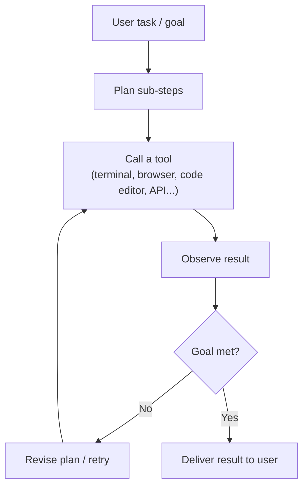
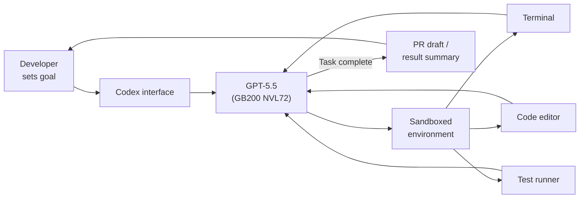
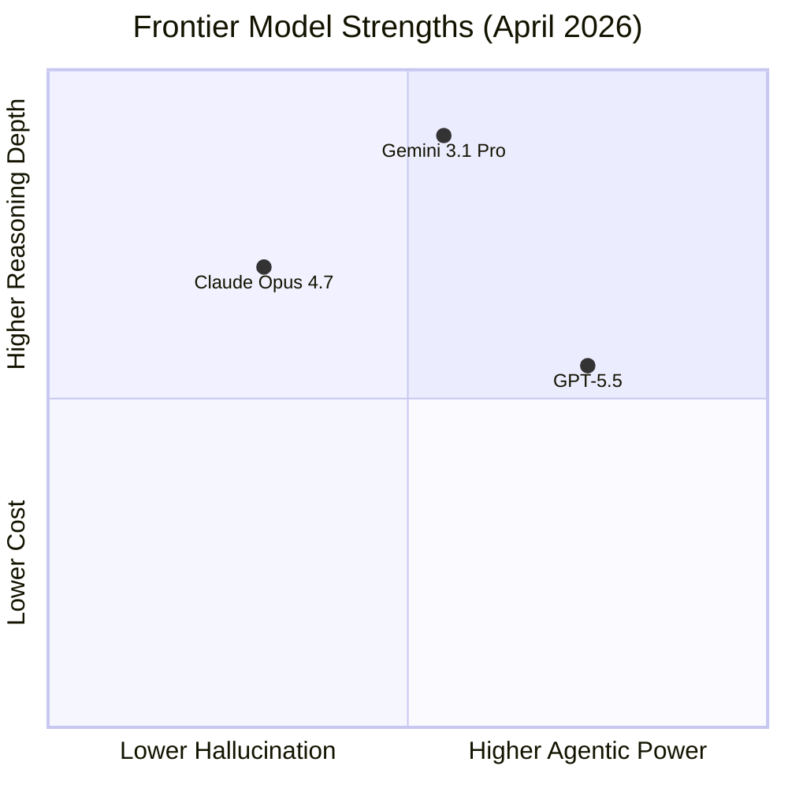

## From Answering to Acting

For most of AI's recent history, the implicit contract between a user and a model was a single exchange: you type something, the model replies. Even with long chat histories, the model was fundamentally a *responder*.

GPT-5.5, released April 23, 2026, is built around a different contract. You hand it a messy, multi-part task — fix this bug, then run the tests, then write the release notes, then open the PR — and it plans, uses tools, checks its work, recovers from errors, and keeps going. The model is not waiting for you to guide it step by step. It is working.

That sounds like a marketing claim. But the engineering behind GPT-5.5 makes it a structural shift, not just a capability increment, and the benchmarks reflect it in ways that are hard to explain any other way.

---

## What "Fully Retrained" Actually Means

Most model point-releases iterate on an existing base: the foundation weights stay constant and the fine-tuning layer changes. GPT-5.5 is described by OpenAI as their **first fully retrained base model since GPT-4.5** — meaning the pre-training run itself was restarted, with a new training objective shaped around agentic workloads from the beginning rather than patched on afterward.

Think of it this way. A model trained primarily on text prediction learns to continue a document well. That same model can be fine-tuned to use tools and execute plans, but the internal representations were never optimized for that kind of reasoning. A model trained with agentic data woven into pre-training learns a different kind of "world model" — one where actions have consequences, where context spans multiple tool calls, and where recoving from a wrong step is a skill to learn, not an afterthought.

GPT-5.5 also ships in two tiers:

| Variant | Use case | API pricing |
|---|---|---|
| GPT-5.5 | Standard — Plus, Pro, Business, Enterprise | $5 / M input · $30 / M output |
| GPT-5.5 Pro | Parallel test-time compute, deeper reasoning | $30 / M input · $180 / M output |

Both support a **1 million token context window** in the API (400K in the Codex interface).

---

## The Agentic Loop

To understand GPT-5.5's design, it helps to think about what an agentic model actually has to do differently.

A chat model takes a prompt, generates a response, and stops. An agentic model is expected to run an internal loop: observe the environment, decide what to do next, call a tool, observe the result, revise its plan if needed, call another tool, and continue — all without human guidance at each step. That loop can last seconds or hours.

Every node in that loop stresses different model capabilities: planning requires long-horizon reasoning; tool use requires parsing structured formats reliably; observation requires integrating new information into a large existing context; revision requires detecting errors without being told there was one. GPT-5.5's training was oriented around each of these transitions, not just the final output quality.

---

## The Benchmarks, in Plain Language

The numbers OpenAI published with GPT-5.5 are worth spending a moment on because they are not all measuring the same thing.

| Benchmark | GPT-5.4 | GPT-5.5 | What it tests |
|---|---|---|---|
| **Terminal-Bench 2.0** | — | **82.7%** | Complex CLI workflows: plan → iterate → coordinate tools |
| **OSWorld-Verified** | 75.0% | **78.7%** | Operate a real computer autonomously (mouse, keyboard, apps) |
| **Expert-SWE** | 68.5% | **73.1%** | Long-horizon coding tasks; median human completion time ~20 hrs |
| **SWE-Bench Pro** | — | **58.6%** | Real-world GitHub issue resolution, single-pass |
| **GDPval** | — | **84.9%** | Knowledge-work accuracy across 44 professional occupations |
| **MRCR v2 (512K–1M tokens)** | 36.6% | **74.0%** | Retrieve and reason over million-token contexts |

The MRCR result deserves special attention. A 37-point jump at long-context retrieval is not a benchmark tweak — it means the model can actually *use* its 1M-token window in a meaningful way. Earlier models with nominally large context windows often degraded sharply past 100K tokens; GPT-5.5's MRCR score suggests the long-context architecture is functioning, not just nominal.

GDPval is also worth flagging. It tests agent performance across 44 different occupations — from paralegal research to financial analysis to software architecture — making it one of the more realistic proxies for "work people actually pay for."

---

## Codex: GPT-5.5 in Its Natural Habitat

The most visible deployment of GPT-5.5 is **Codex**, OpenAI's agentic coding interface. Codex takes a goal — "add pagination to this Django view," "refactor this function to be async," "investigate why tests are failing" — and runs GPT-5.5 in a sandboxed environment with access to a terminal, editor, and test runner.

Codex is powered by GPT-5.5 running on NVIDIA **GB200 NVL72 rack-scale systems**. The GB200 platform delivers roughly 35x lower cost per million tokens and 50x higher throughput per megawatt compared to previous-generation hardware, which is what makes sustained agentic workloads — where a single task might generate tens of thousands of tokens — economically viable at scale.

The practical result: debugging cycles that previously stretched across days are compressed into hours. For engineers running overnight experiments, GPT-5.5 in Codex can execute, observe, adjust, and summarize findings before the next morning.

One efficiency detail worth noting: GPT-5.5 is significantly more token-efficient than GPT-5.4 in agentic contexts. Across OpenAI's eval suite, GPT-5.5 reaches better outcomes with fewer total tokens generated. For high-volume Codex users, the higher per-token price is partly offset by fewer tokens needed per task — OpenAI estimated a net cost increase of only ~20% for typical Codex workflows despite GPT-5.5's higher per-token rate.

---

## GPT-5.5 Instant: The Everyday Version

Two weeks after GPT-5.5 landed, OpenAI released a lighter sibling: **GPT-5.5 Instant** (May 5, 2026), which immediately became the default model for all ChatGPT users, replacing GPT-5.3 Instant.

Where GPT-5.5 is tuned for complex autonomous workflows, GPT-5.5 Instant is optimized for everyday conversational use: faster responses, lower latency, and — this is the headline feature — dramatically fewer hallucinations.

GPT-5.5 Instant produced **52.5% fewer hallucinated claims** than GPT-5.3 Instant on high-stakes prompts in medicine, law, and finance. On factual error rate in challenging user conversations, the reduction was **37.3%**. For consumer AI that is increasingly being used as a first-stop reference, that kind of accuracy improvement is more impactful than a benchmark point in math.

The other significant addition in GPT-5.5 Instant is **Memory Sources** — a feature that lets the model use its search tool to refer back to past conversations, files, and Gmail when generating an answer. Rather than treating every session as isolated context, ChatGPT can now surface which prior conversation or uploaded document informed its reply. The result is a model that behaves less like a search engine and more like a persistent assistant that actually knows your situation.

---

## How GPT-5.5 Fits the 2026 Frontier

GPT-5.5 does not win every category in today's frontier. Looking at the current state of the top three proprietary models:

**Claude Opus 4.7** leads on production code quality (SWE-Bench Pro at 64.3% vs GPT-5.5's 58.6%) and has a much lower hallucination rate — about 36% on a long-form factuality benchmark versus GPT-5.5's 86%. For code review and factual writing where accuracy is the product, Opus 4.7 is the sharper tool.

**Gemini 3.1 Pro** dominates pure reasoning (94.3% on GPQA Diamond) and costs roughly half as much per output token. Its 1M-token context is competitive with GPT-5.5, and for high-volume batch workloads involving multimodal data, it wins on economics.

**GPT-5.5** leads where the agentic loop matters: autonomous computer use, complex multi-tool orchestration, long-horizon coding, and any task that spans many hours and thousands of tokens of internal context. For building software agents that need to plan and recover without human hand-holding, GPT-5.5's training foundation gives it a structural advantage the others currently lack.

---

## What This Means If You Build Things

A few practical takeaways for developers watching this space:

**API context is real now.** The MRCR jump from 36.6% to 74.0% at 512K–1M tokens is the strongest evidence yet that long-context APIs are reliable enough to use in production for document-heavy workflows. The caveats that applied to earlier 128K models do not apply equally here.

**Token efficiency changes cost math.** If you are running GPT-5.5 in agentic loops, benchmark your actual token consumption before assuming the price hike is a cost increase. For many users it is not.

**The model distinction is no longer GPT vs other.** The correct framing is now task-specific: agentic orchestration → GPT-5.5; code review and factual accuracy → Claude Opus 4.7; high-volume reasoning → Gemini 3.1 Pro. The era of one model for everything is over.

**GPT-5.5 Instant is the baseline.** If you are building a general-purpose assistant on top of ChatGPT or the API's Instant tier, the 52.5% hallucination reduction is the most impactful quality-of-life improvement in months. Production apps that relied on post-processing or prompted self-correction to handle factual errors may find they need less of that scaffolding now.

OpenAI's bet with GPT-5.5 is explicit: the next meaningful step in AI is not smarter responses to individual questions, but AI systems that can reliably work through complex problems start to finish. The benchmarks suggest they are further down that road than the point-release numbering implies.

---

## Sources

- [Introducing GPT-5.5 — OpenAI](https://openai.com/index/introducing-gpt-5-5/)
- [GPT-5.5 Instant: smarter, clearer, and more personalized — OpenAI](https://openai.com/index/gpt-5-5-instant/)
- [GPT-5.5 System Card — OpenAI](https://openai.com/index/gpt-5-5-system-card/)
- [OpenAI Codex — OpenAI](https://openai.com/codex/)
- [OpenAI's New GPT-5.5 Powers Codex on NVIDIA Infrastructure — NVIDIA Blog](https://blogs.nvidia.com/blog/openai-codex-gpt-5-5-ai-agents/)
- [OpenAI Releases GPT-5.5, a Fully Retrained Agentic Model — MarkTechPost](https://www.marktechpost.com/2026/04/23/openai-releases-gpt-5-5-a-fully-retrained-agentic-model-that-scores-82-7-on-terminal-bench-2-0-and-84-9-on-gdpval/)
- [GPT-5.5 Benchmarks, Pricing & Context Window — LLM Stats](https://llm-stats.com/models/gpt-5.5)
- [OpenAI Upgrades ChatGPT Default Model to GPT-5.5 Instant — MWM](https://mwm.ai/articles/openai-upgrades-chatgpt-default-model-to-gpt-5-5-instant-in-may-2026)
- [GPT-5.5 Benchmarks Revealed — Kingy AI](https://kingy.ai/ai/gpt-5-5-benchmarks-revealed-the-9-numbers-that-prove-chatgpt-5-5-just-changed-the-ai-race/)
- [Claude Opus 4.7 vs GPT-5.5: Which Frontier Model Is Best? — DataCamp](https://www.datacamp.com/blog/gpt-5-5-vs-claude-opus-4-7)
