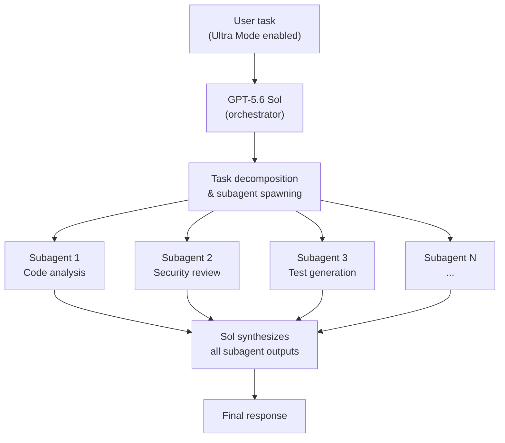
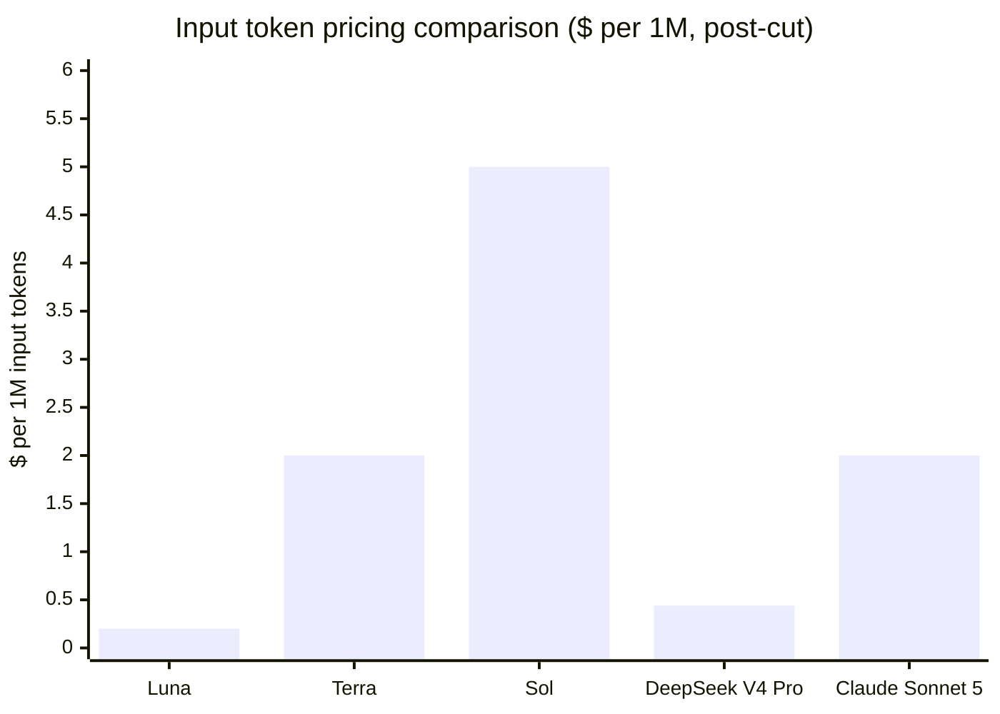
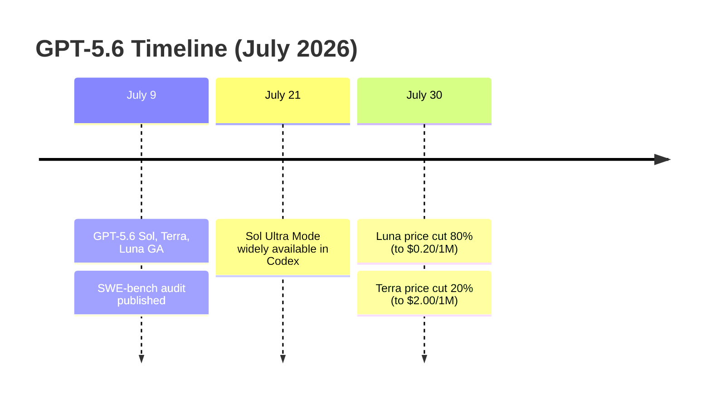

## One Release, Three Models

For most of AI's recent history, a major model release meant one thing: a single flagship that defined the state of the art. You waited for it, you benchmarked it, you paid for it.

GPT-5.6, released on July 9, 2026, broke that pattern. Instead of a single model, OpenAI shipped three: **Sol**, the flagship for complex reasoning and coding; **Terra**, a balanced middle tier; and **Luna**, a fast, low-cost option built for high-volume workloads.

The naming is intentional and worth sitting with. Sol, Terra, Luna — sun, earth, moon — suggests a gravity system where each body plays a defined role. Sol pulls the most weight. Luna moves fastest. Terra sits in the middle where most life happens. This isn't just branding; it reflects a real architectural philosophy about who is using AI, for what, and at what scale.

---

## The Three Tiers, Explained

Each model in the GPT-5.6 family targets a different point on the performance-cost curve. Here's how they compare at launch and after the July 30 price adjustment:

| Model | Best for | Input cost | Output cost (post-cut) |
|-------|----------|-----------|----------------------|
| **Sol** | Complex reasoning, coding, research | $5 / 1M tokens | $30 / 1M tokens |
| **Terra** | Everyday tasks, balanced workflows | $2 / 1M tokens | $12 / 1M tokens |
| **Luna** | High-volume, latency-sensitive apps | $0.20 / 1M tokens | $1.20 / 1M tokens |

All three share a **1.05 million-token context window** and 128K maximum output tokens. The difference isn't in what they can read — it's in the depth and cost of their reasoning.

Luna's cost after the July 30 cut is striking: $0.20 per million input tokens puts it below the cost of many open-weight models running on cloud infrastructure. We'll come back to why that happened.

---

## Sol Ultra Mode: When One Model Isn't Enough

The most technically interesting part of GPT-5.6 is a feature available only in Sol: **Ultra Mode**.

Ultra Mode is a coordination layer, not a reasoning layer. When you activate it on a hard task, Sol doesn't think harder — it spawns parallel subagents that divide the problem and work simultaneously, then synthesizes their results.

Think of it like hiring a team of specialists instead of asking one expert to do everything. Each subagent handles a slice of the problem, so wall-clock time for complex multi-step work drops dramatically — even though total token consumption rises, since each agent burns its own tokens independently.

This architecture, where a frontier model coordinates peer models rather than doing all reasoning in sequence, is increasingly common across the industry. OpenAI calls the distinction explicit: **Max Reasoning** tells Sol to "think harder about this one problem," while **Ultra** says "split this problem into parallel agents and merge their results."

On Terminal-Bench 2.1, the agentic coding benchmark, the results illustrate the gap:

- **Sol (base):** 88.8%
- **Sol (Ultra):** 91.9%
- **GPT-5.5:** 88.0%
- **Claude Mythos 5:** 88.0%

The 3.1-point lift from enabling Ultra on the same base model is meaningful. It suggests that for well-decomposable tasks, the coordination strategy matters as much as raw model capability.

---

## The Benchmark Everyone Is Arguing About

GPT-5.6 launched with a notable asterisk attached to one of the most-cited AI benchmarks.

On **SWE-bench Pro** — the evaluation that measures how well a model can resolve real, unmodified GitHub issues — Sol trails Claude models by a significant margin, reportedly around 14.6 points. This is unusual for a flagship release; prior OpenAI models had generally been competitive on this benchmark.

But on the same day the models launched, OpenAI published an internal audit claiming that approximately **30% of SWE-bench Pro tasks are fundamentally flawed**: some have overly strict test suites, others have incomplete problem descriptions, and some contain misleading task setups. OpenAI argues that Sol's scores on unflawed tasks look significantly better.

The timing of that audit disclosure made the AI community uncomfortable. Whether the audit represents a genuine methodological contribution or a convenient excuse for a weaker benchmark result — or both — is a debate that's still running. What's not in dispute is that SWE-bench Pro scores should now be read with more skepticism than they were before.

---

## Explicit Prompt Caching: A Developer-Facing Upgrade

Beyond the model tiers themselves, GPT-5.6 ships a meaningful change to how prompt caching works that affects any developer building production applications.

Previous OpenAI models used **implicit caching**: the API automatically detected and cached common prompt prefixes, but the cache lifetime was unpredictable (sometimes as short as 5 minutes) and developers had no way to control what got cached.

GPT-5.6 introduces **explicit cache breakpoints**. Developers now mark the exact boundaries they want cached using a `prompt_cache_breakpoint` field in the request. These manual breakpoints carry a guaranteed minimum lifetime of **30 minutes**, so a cached system prompt or document stays warm across a sustained user session.

The cost structure changed too: cache writes now cost 1.25× the normal input token rate, while cache reads stay discounted. You pay more to write a durable cache entry, but you save on every subsequent read. For applications that repeatedly pass the same large documents or system prompts — legal contracts, technical specifications, long instruction sets — this is a net win at scale.

---

## The 80% Price Cut and What It Reveals

Three weeks after launch, OpenAI slashed Luna's price by 80% and Terra's by 20%.

Luna dropped from $1.00/$6.00 to **$0.20/$1.20** per million input/output tokens. Terra dropped from $2.50/$15.00 to **$2.00/$12.00**.

OpenAI framed this as passing efficiency gains to customers — specifically citing that GPT-5.6 itself helped rewrite and optimize its own production inference code, lowering serving costs. But the competitive context is hard to ignore.

A CNBC investigation published the week of the GPT-5.6 launch found that Chinese AI models had captured **46% of US enterprise token usage** on OpenRouter, at times briefly exceeding US-origin models. DeepSeek V4 Pro, priced at $0.435/$0.87 per million tokens (with a standing 75% promotional discount), was one of the main alternatives pulling traffic away from OpenAI's offerings.

Luna at $0.20/$1.20 undercuts DeepSeek V4 Pro on input tokens. For workloads where the bulk of cost sits in input (as opposed to generation), this makes Luna the most economical option in the market — from either a US or Chinese provider.

The move illustrates a structural shift in AI product competition: **frontier intelligence is no longer the only battleground**. Pricing, latency, reliability, and ecosystem integration now matter as much as benchmark scores for the majority of production workloads.

---

## What This Means for Developers

If you're building on top of AI APIs, the GPT-5.6 launch changes a few practical decisions:

**Model selection now requires more thought.** A single-model API contract was simpler. With Sol, Terra, and Luna available, the right choice depends on task complexity, budget, and latency requirements. OpenAI publishes guidance, but teams will need to run their own evals to find the right tier for each workload.

**Ultra Mode has a token-cost multiplier.** Each subagent in Ultra Mode runs independently and consumes tokens separately. A single Ultra call can cost several times more than a standard Sol call. For tasks where quality at all costs matters, this is fine. For cost-sensitive pipelines, it needs careful governance.

**Explicit caching rewards structured prompts.** The shift to explicit breakpoints means prompt engineering now includes cache architecture. The 30-minute TTL makes it practical to cache session-level context, but you need to write breakpoints deliberately. Ad-hoc prompts without breakpoints fall back to OpenAI's implicit caching with shorter, less predictable lifetimes.

**The price war isn't over.** Luna at $0.20/1M input tokens sets a new floor — but the floor keeps dropping. If Chinese providers respond in kind, or if open-weight models continue closing the quality gap, prices for commodity inference will continue falling. Frontier capability (Sol-class) will remain expensive. Mid-tier and budget inference will keep commoditizing.

---

## Putting It in Context

The three-tier structure of GPT-5.6 isn't the end state — it's a direction. Other frontier labs are either already there or moving toward it. Claude ships Sonnet and Opus tiers at separate price points. Gemini has Flash, Pro, and Ultra. The era of "the model" is giving way to "the model family."

For users, this is mostly good news: more choice, more competition on price, and architectures like Ultra Mode that genuinely push the frontier on hard tasks. The challenge is that picking the right model now requires understanding your workload well enough to know which tier matches it — and that's a skill most teams are still building.

The simplest summary: GPT-5.6 isn't one thing. It's a bet that the future of AI infrastructure looks more like cloud compute — differentiated tiers, predictable pricing, explicit developer controls — than like a single magical model that does everything.

---

## Sources

- [GPT-5.6: Frontier intelligence that scales with your ambition — OpenAI](https://openai.com/index/gpt-5-6/)
- [Previewing GPT-5.6 Sol: a next-generation model — OpenAI](https://openai.com/index/previewing-gpt-5-6-sol/)
- [Advancing the price-performance frontier with GPT-5.6 — OpenAI](https://openai.com/index/advancing-the-price-performance-frontier-with-gpt-5-6/)
- [GPT-5.6 Sol Ultra Mode: How Subagents Push Terminal-Bench to 91.9% — AIMadeTools](https://www.aimadetools.com/blog/gpt-5-6-sol-ultra-mode-explained/)
- [GPT-5.6: Rolling Out July 9 — Sol, Terra, Luna — ExplainX](https://explainx.ai/blog/gpt-5-6-release-date-features-benchmarks-2026)
- [GPT-5.6 Luna Price Cut 80% — New Rates Explained — ExplainX](https://www.explainx.ai/blog/openai-gpt-5-6-luna-terra-price-cuts-july-2026)
- [AI price wars: OpenAI cuts GPT-5.6 Luna prices by 80% — VentureBeat](https://venturebeat.com/technology/ai-price-wars-openai-cuts-gpt-5-6-luna-prices-by-80-as-model-competition-shifts-toward-cost)
- [OpenAI cuts prices for two of its GPT-5.6 AI models — CNBC](https://www.cnbc.com/2026/07/30/open-ai-price-cut-gpt.html)
- [Introducing explicit prompt caching for OpenAI GPT-5.6 models on Amazon Bedrock — AWS](https://aws.amazon.com/blogs/machine-learning/introducing-explicit-prompt-caching-for-openai-gpt-5-6-models-on-amazon-bedrock/)
- [GPT-5.6 Sol, Terra, and Luna: A Developer's Guide — Developers Digest](https://www.developersdigest.tech/blog/gpt-5-6-sol-terra-luna-developer-guide)
- [Claude Sonnet 5 vs GPT-5.6 Sol vs Gemini 3.1: Benchmarks & Pricing — EdenAI](https://www.edenai.co/post/claude-sonnet-5-vs-gpt-5-6-sol-vs-gemini-3-1-benchmarks-pricing-which-to-use)
