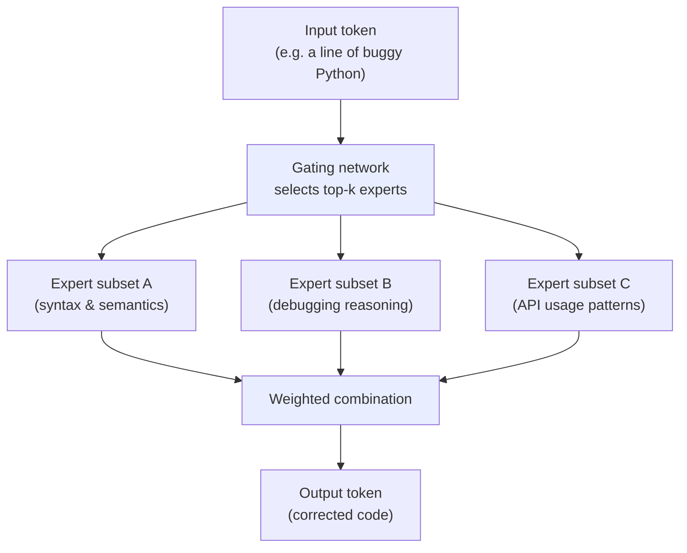
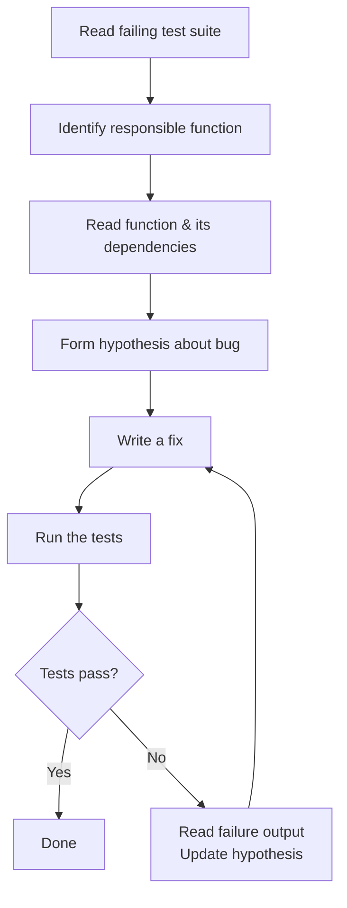

## The Problem With Training on Code

Most large language models learn to code the same way: scrape GitHub, tokenize the files, predict the next token. The model sees clean, committed code — the final product. What it never sees is the messy in-between: the failed first draft, the "hmm, that approach won't work," the incremental edits, the debugging trace, the moment a developer decides to scrap a whole function and start over.

That gap matters. A model trained on finished code knows what good code looks like. It doesn't know how to *get there from here*, given a half-broken function, an error message, and a vague intent.

Grok 4.5, released on July 8, 2026 by xAI, takes a different approach. It was trained jointly with Cursor — the AI-powered code editor used by millions of developers — on *actual developer interaction traces*: the real keystrokes, tool calls, and edit sequences that happen inside an IDE during a live coding session. The result is a model that doesn't just know what correct code looks like. It knows what it feels like to debug one.

---

## The xAI–Cursor Partnership

In April 2026, xAI and Cursor announced a partnership to co-develop a coding model. The idea was simple on paper but unprecedented in practice: take xAI's frontier compute and training infrastructure, combine it with Cursor's trove of real-world developer session data, and train a model on the result.

Cursor CEO Michael Truell's team contributed **trillions of tokens of developer session data**: real code edits, debugging traces, and user-agent interaction loops from the Cursor platform. When a developer using Cursor invokes the model, pauses, edits the suggestion, reruns the tests, and then accepts the revised output — all of that becomes a training signal. The model learns not just "what is correct code" but "what does a developer actually do when the model is wrong."

This is meaningfully different from reinforcement learning from human feedback (RLHF) applied to standalone completions. In RLHF, a human rates model outputs after the fact. In Cursor's contribution to Grok 4.5, the signal is implicit in the developer's actual behavior: Did they accept the suggestion? Did they edit it heavily? Did they immediately run a test that failed? Each of these is information the training loop can use.

The reinforcement learning phase covered hundreds of thousands of multi-step software engineering and technical tasks — spanning coding, science, engineering, math, and knowledge work — with automated and model-based grading to evaluate whether the model's multi-step reasoning actually led to working solutions.

---

## Under the Hood: V9 Architecture

Grok 4.5 runs on xAI's V9 architecture — a **1.5-trillion-parameter Mixture-of-Experts (MoE)** model. If "1.5 trillion parameters" sounds intimidating, the MoE design makes it practical.

A dense model activates *all* its parameters for every token it generates. A MoE model routes each token to a small subset of specialized "expert" subnetworks, selected by a learned gating function. The 1.5 trillion parameters describe the total capacity; at any given moment, only a fraction of those are active. This lets the model maintain frontier-class capability while running far more efficiently — and cheaply.

Grok 4.5 was trained across tens of thousands of NVIDIA GB300 GPUs on xAI's Colossus supercomputer — currently one of the largest AI training facilities in the world, with over 200,000 GPUs operational.

**Key specifications at a glance:**

| Attribute | Value |
|---|---|
| **Parameters** | 1.5 trillion (MoE) |
| **Context window** | 500,000 tokens (~375,000 words) |
| **Inference speed** | 80 tokens/second |
| **Input modalities** | Text + images |
| **Output modalities** | Text |
| **Native tools** | Function calling, structured JSON, web search, X search, code execution |
| **Reasoning control** | Configurable: low / medium / high (default: high) |
| **Input price** | $2.00 / million tokens |
| **Output price** | $6.00 / million tokens |
| **Cached input price** | $0.50 / million tokens |

---

## Benchmarks: The Price-Performance Argument

Grok 4.5 doesn't top every leaderboard. What it does is offer a compelling position in the competitive landscape — near-frontier quality at substantially lower cost.

On **SWE-bench Pro** — a curated benchmark of real, unmodified GitHub issues from production repositories — Grok 4.5 scores **64.7%**. That puts it below Claude Opus 4.8 (69.2%) and Fable 5 (80.4%), but ahead of Gemini 3.1 Pro and well above the Sonnet-tier models.

| Model | SWE-bench Pro | Avg. output tokens/task | Input price |
|---|---|---|---|
| Fable 5 | 80.4% | ~58,000 | Higher |
| Claude Opus 4.8 | 69.2% | 67,020 | $5/M |
| **Grok 4.5** | **64.7%** | **15,954** | **$2/M** |
| GPT-5.5 | ~61% | ~55,000 | $5/M |

The standout column is **output tokens per task**. To resolve a SWE-bench Pro task, Grok 4.5 uses an average of 15,954 output tokens. Claude Opus 4.8 uses 67,020 — about 4.2× as many. When the model solves the same problem with fewer tokens, it's faster, cheaper, and easier to run in production pipelines.

Because pricing is token-based, a coding pipeline using Grok 4.5 ends up costing roughly **80% less per resolved issue** — not because the model's per-token rate is dramatically lower, but because it gets to the answer using far fewer of them.

On Artificial Analysis's Intelligence Index — a composite benchmark covering reasoning, coding, and knowledge across 168 models — Grok 4.5 ranks **#4 globally**. Notably, it tops the leaderboard on **agentic tool use**: the ability to orchestrate multi-step tool calls to complete a task. That result is not coincidental. It directly reflects what the model was trained to do.

---

## What "Trained on Developer Sessions" Looks Like In Practice

To understand why the Cursor training data matters, consider what happens when an AI agent tackles a real software engineering task. It's not a single-shot function completion. The actual loop looks more like this:

Static code corpora contain the final committed result — the state of the code *after* a developer went through this loop manually. Grok 4.5's training data contains the loop itself, because that's what a developer does inside Cursor. Every time the agent makes a wrong guess, the developer corrects it. Every debugging trace, every failed suggestion followed by a better one, becomes part of the training signal.

This matters enormously for agentic coding, which is now how most AI-assisted engineering actually works. Tools like Cursor, Devin, and the Claude Code CLI run models in multi-step loops where the model must read output, form a new plan, and act — often dozens of times on a single task. A model trained on static repositories sees the world as a series of isolated completions. A model trained on developer interaction traces sees the world as a process.

---

## Availability and Ecosystem

Grok 4.5 shipped publicly on July 8, 2026, following a private beta at SpaceX and Tesla that began around June 28. It is available in three places:

- **Grok Build**: xAI's development console, accessible at `build.x.ai`
- **Cursor IDE**: Now the default AI assistant for all Cursor users — existing subscribers receive it without a plan change
- **SpaceXAI API**: Call it with the model identifier `grok-4.5`; the API is compatible with OpenAI-format clients, so existing integrations often require only a model ID swap

Reasoning effort is configurable at the API level via `"reasoning_effort": "low" | "medium" | "high"`. Teams running high-throughput autocomplete pipelines can dial down to `low`; autonomous agentic coding sessions should stay at `high`. The tradeoff is speed and cost versus the depth of multi-step planning.

---

## The Bigger Picture: A New Training Paradigm?

Grok 4.5 is the clearest example yet of a trend likely to define the next wave of specialized AI: **compute plus behavioral traces**.

Prior model generations competed primarily on raw pretraining scale — more data, bigger model, better benchmarks. The next axis is *behavioral* training data: not "what good output looks like" but "what the process of doing good work looks like, step by step, inside a real tool."

For coding, Cursor's IDE sessions are a direct window into that process. For other domains — legal document drafting, financial analysis, scientific research, medical diagnosis — equivalent behavioral data exists wherever skilled professionals do their work with software. Law firms track every edit. Financial analysts have audit trails. Radiology tools log every view and annotation. If xAI and Cursor's partnership demonstrates that developer sessions are a useful training signal at frontier scale, the next question becomes: what other domains have similarly rich behavioral traces sitting inside existing workflow tools? And what partnerships unlock that data?

The benchmark gaps between Grok 4.5 and frontier leaders like Fable 5 are real. But for engineering teams running coding agents at production scale, the combination of near-frontier performance, best-in-class agentic tool use, and 80% lower cost per task is likely to be decisive. The model that wins the agentic coding market won't necessarily be the one with the highest SWE-bench score — it'll be the one cheap enough to run on every pull request, all day, automatically.

Grok 4.5 is a clear bid for that position.

---

## Sources

- [Introducing Grok 4.5 — SpaceXAI](https://x.ai/news/grok-4-5)
- [Introducing Grok 4.5 — Cursor Blog](https://cursor.com/blog/grok-4-5)
- [SpaceXAI Releases Grok 4.5 — MarkTechPost](https://www.marktechpost.com/2026/07/08/spacexai-releases-grok-4-5/)
- [Grok 4.5 Testing Results — Snorkel AI](https://snorkel.ai/blog/grok-4-5-testing-results-how-spacexais-new-model-performs-on-real-professional-work/)
- [Grok 4.5 Is So Cheap That Benchmark Gaps May Not Matter — The Decoder](https://the-decoder.com/grok-4-5-is-so-cheap-compared-to-fable-5-and-gpt-5-5-that-benchmark-gaps-may-not-matter-much/)
- [Grok 4.5: Features, Benchmarks, Pricing — DataCamp](https://www.datacamp.com/blog/grok-4-5)
- [Grok 4.5 and the Compute-Plus-Traces Paradigm — FourWeekMBA](https://fourweekmba.com/ai-xai-grok-4-5-cursor-traces-agentic-frontier-model/)
- [Scoop: Musk's SpaceXAI releases Grok 4.5 — Axios](https://www.axios.com/2026/07/08/spacexai-grok-new-model)
- [xAI Releases Grok 4.5: Coding-Focused Model with 500K Context — DataNorth](https://datanorth.ai/news/xai-releases-grok-4-5-coding-focused-model)
- [Grok 4.5 Builder Evaluation — ChatForest](https://chatforest.com/builders-log/grok-45-launch-pricing-benchmarks-cursor-training-builder-evaluation-july-2026/)
