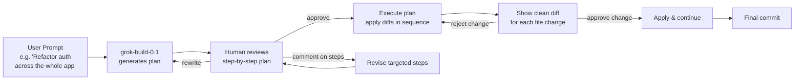
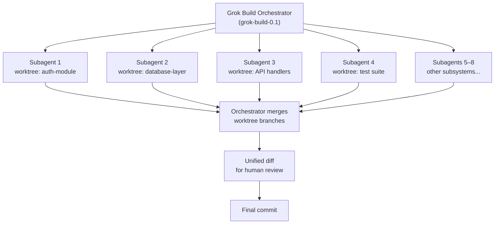

## The Terminal Agent Wars Have a Third Contender

The terminal coding agent market, which barely existed two years ago, has just added a third serious player.

On May 14, 2026, xAI — Elon Musk's AI company — launched **Grok Build** in early beta. It's a command-line tool that uses AI to plan, write, and execute code changes directly in your terminal, powered by a purpose-built model called **grok-build-0.1**. The launch puts xAI alongside Anthropic (Claude Code) and OpenAI (Codex CLI) in a category that has quietly become the default environment for professional AI-assisted development.

This isn't a chat assistant that suggests snippets. It's a system that reads your codebase, constructs a plan, spawns parallel subagents to execute different parts simultaneously, and shows you the diffs when the work is done.

---

## What Is a Terminal Coding Agent?

Before unpacking what Grok Build does specifically, it helps to understand the category.

A **terminal coding agent** lives in your shell — not a chat interface, not an IDE plugin — and acts as a programmer that can actually *act*: read files, write and edit code, run shell commands, manage dependencies, and interact with git. You describe a task in plain language; the agent reasons about your codebase and executes a sequence of changes, showing you diffs along the way.

The key difference from a chat-based coding assistant (like early GitHub Copilot or ChatGPT code mode) is **agency**: the model doesn't just suggest a snippet, it drives a multi-step process from the current state of your codebase to the desired end state.

By mid-2026, this category has evolved from a research curiosity into a core part of many professional developers' workflows. Anthropic's own engineering team recently revealed that Claude now authors more than 80% of the code merged into Anthropic's production codebase — a figure that would have seemed implausible eighteen months ago.

---

## Grok Build at a Glance

Grok Build is built on **grok-build-0.1**, a model xAI trained specifically for agentic coding rather than general conversation. It's not a general-purpose model that was adapted for coding — it's purpose-built for multi-step, tool-using, planning-heavy work.

**Key specs:**

| Property | Value |
|----------|-------|
| Model | grok-build-0.1 |
| Context window | 256K tokens |
| Reasoning | Always active (not optional) |
| Inputs | Text, images |
| Max parallel subagents | 8 |
| API pricing | $1.00 / $2.00 per 1M tokens (in/out) |
| Cached input | $0.20 per 1M tokens |

The "always-on reasoning" detail is worth noting. Most models let you toggle reasoning mode on or off to trade speed for deliberateness. grok-build-0.1 doesn't give you that choice — every response goes through a structured analysis step first. The bet is that for coding tasks, the deliberateness is always worth it.

Installation is a one-liner:

```bash
curl -fsSL https://x.ai/cli/install.sh | bash
```

Access requires a SuperGrok or X Premium Plus subscription. The SuperGrok Heavy tier runs $99/month for the first six months, then shifts to approximately $299/month.

---

## Plan Mode: Think Before You Act

The most visible feature of Grok Build is **Plan Mode**.

When you give it a complex task, it doesn't immediately start editing files. Instead, it generates a structured execution plan — a sequence of steps describing what it intends to do, which files it will touch, and why. Before any file is changed, you can:

- **Approve** the plan as-is and let execution begin
- **Comment** on individual steps to refine or redirect them
- **Rewrite** the plan entirely and re-run the planning phase

Only after approval does the agent begin executing. Every change appears as a clean diff before it is applied, giving you a second checkpoint.



This addresses a real failure mode with coding agents: when a model starts editing files autonomously, it can go in an unexpected direction early and compound its mistakes across a large change set. Plan Mode surfaces the agent's intent *before* it acts, letting you steer the overall approach without micromanaging individual keystrokes.

---

## Parallel Subagents: The Standout Architecture

For larger tasks — a feature migration touching 30 files, or a codebase-wide refactor — Grok Build can delegate work to **up to 8 parallel subagents**.

Here's how it works: the main Grok Build instance (the orchestrator) splits the task into independent subtasks and spawns specialized agents to work on them simultaneously. Each subagent operates in its own **git worktree** — an isolated branch of the repository — so multiple agents can be editing different parts of the codebase at the same time without conflicting.



The practical effect matters for scope-wide changes. A sequential coding agent touching 30 files means 30 individual edit-verify cycles. In Grok Build, those files can be spread across 8 agents working in parallel — total wall-clock time drops to roughly the duration of the longest individual chunk.

This architecture reflects how real software is actually structured: different subsystems often don't depend on each other, so parallel work is safe when each agent works in its own isolated branch.

---

## ACP: Built for Agent Interoperability

Grok Build natively supports **ACP** — the Agent Client Protocol — an open standard for agent-to-agent communication.

Most coding agents are designed to be the sole actor in a workflow: you give it a task, it does the work. ACP opens a different model. Rather than routing inter-agent messages through a user chat as a middleman, ACP lets one agent talk directly to another using a shared protocol.

In practice, this means Grok Build can be a *component* in a larger orchestration system. You could have a planning agent that decomposes a complex feature request and hands sub-tasks to Grok Build instances, or combine Grok Build with a specialized code-review agent that runs after it finishes. xAI baked ACP support directly into the binary — no wrappers needed.

The tool also works out of the box with `AGENTS.md`, plugins, hooks, skills, and MCP servers — the same extension ecosystem used by Claude Code — which reduces context-switching for developers who run multiple agents across their stack.

For automation, headless mode (`-p` flag) lets Grok Build run inside CI/CD pipelines and scripts without an interactive session:

```bash
# Run a non-interactive task inside a CI pipeline
grok build -p "Add OpenAPI docstrings to all public routes in src/api/"
```

---

## Where It Stands Against the Competition

By mid-May 2026, three terminal coding agents from the major labs compete in the same shell:

| Tool | Maker | Underlying Model | Context | SWE-bench Verified |
|------|-------|-----------------|---------|-------------------|
| Codex CLI | OpenAI | GPT-5.5 | Large | 88.7% |
| Claude Code | Anthropic | Claude Opus 4.7 | 200K | 87.6% |
| **Grok Build** | **xAI** | **grok-build-0.1** | **256K** | **70.8%** |

On **SWE-bench Verified** — the industry-standard benchmark where models must find and fix real GitHub issues — Grok Build currently trails by about 17 percentage points. That's a meaningful gap for correctness on isolated bug-fix tasks.

The interaction styles also differ. Reviews describe Grok Build as more **fire-and-forget**: give it a task, let it run hard, review the final diffs. Claude Code is more deliberate — it shows its plan at each step, inviting you to stay in the loop throughout. Neither is strictly better; the right choice depends on how much autonomy you want to hand over.

Where Grok Build distinguishes itself is the **parallel subagent model** and **ACP support** — features oriented toward large-scope tasks and agent orchestration rather than precise point-fix accuracy. These aren't directly measured by SWE-bench, which tests single-issue patches.

---

## Why This Matters

Grok Build's launch is significant for a few reasons beyond the tool itself.

First, it confirms that all three major AI labs have converged on the terminal as the right interface for serious AI-assisted development. You don't manage AI-generated code through a chat box; you give it a task, let it operate on your actual repository, and review the output like you'd review a pull request.

Second, the parallel subagent design is an early prototype of what AI-native development could look like at scale: not one AI helping one developer, but a small orchestrator managing a pool of agents working in parallel on independent parts of a codebase — with the human reviewing the unified diff at the end. That's closer to how software teams already work (multiple engineers, different features, periodic integration) than the traditional "one developer, one editor" model.

Third, the ACP bet signals that xAI sees the future of agentic tooling as an **interoperable ecosystem** rather than a closed product. Agents that can talk to each other are qualitatively more powerful than isolated tools that only talk to humans.

---

## Getting Started

Grok Build is in early beta as of this writing, available to SuperGrok and X Premium Plus subscribers:

```bash
# Install the CLI
curl -fsSL https://x.ai/cli/install.sh | bash

# Authenticate with your xAI account
grok auth login

# Start a task in plan mode (recommended for complex changes)
grok build --plan "Migrate SQLAlchemy 1.x calls to the 2.x async API"

# Run headless in CI
grok build -p "Add type hints to every function in src/"
```

Features and pricing are subject to change before general availability. The most current documentation lives at `x.ai/cli`.

---

## Sources

- [Introducing Grok Build — xAI](https://x.ai/news/grok-build-cli)
- [Grok Build Beta — xAI official product page](https://x.ai/cli)
- [xAI: Grok Build Launches Early Beta Coding Agent CLI — Pulse 2.0](https://pulse2.com/xai-grok-build-launches-early-beta-coding-agent-cli/)
- [xAI Launches Grok Build Beta: Agentic Coding CLI Explained — Basenor](https://www.basenor.com/blogs/news/xai-launches-grok-build-beta-agentic-coding-cli-explained)
- [Grok Build 0.1 API, Specs & Pricing — Puter Developer](https://developer.puter.com/ai/x-ai/grok-build-0.1/)
- [xAI Opens Grok Build 0.1 to Developers via API — DevOps.com](https://devops.com/xai-opens-grok-build-0-1-to-developers-via-api/)
- [Grok Build CLI: xAI's Answer to Claude Code — Beginners in AI](https://beginnersinai.org/grok-build-cli/)
- [Grok Build vs Claude Code vs Codex CLI — Codersera](https://codersera.com/blog/grok-build-vs-claude-code-vs-codex-cli-2026/)
- [Grok Build 0.1 Benchmarks — BenchLM.ai](https://benchlm.ai/models/grok-build-0-1)
- [xAI Grok Build Beta: Agent Client Protocol Explained — AI Tools Recap](https://aitoolsrecap.com/Blog/xai-grok-build-beta-agent-client-protocol-2026)
- [Post-Google I/O Coding Agent Landscape — Codex Knowledge Base](https://codex.danielvaughan.com/2026/05/20/post-google-io-coding-agent-landscape-codex-antigravity-jules-claude-grok/)
